# Ropemother exercises

These exercises introduce message-based software design with `ropemother`. They assume basic Python reading and small edits. They do not assume prior experience with message brokers, distributed systems, service-oriented architecture, event sourcing, image processing, graph processing, or eduRange internals.

## Contents

These exercises build on one another. Work through them in this order:

1. [Image Reconstruction — Guided Introduction](#image-reconstruction--guided-introduction)
2. [Basic Messaging](#basic-messaging)
3. [TTY Processing](#tty-processing)
4. [Graph Reachability](#graph-reachability)
5. [Image Reconstruction — Full Self-Paced Path](#image-reconstruction--full-self-paced-path)
6. [Messaging Architecture — Vocabulary from the Exercises](#messaging-architecture--vocabulary-from-the-exercises)
7. [Ropemother API — Application-Facing Map](#ropemother-api--application-facing-map)

Run commands from the repository root with Python 3.13 or newer. If `ropemother` is not already installed in the Python environment used for the exercises, install it with:

```sh
python -m pip install ropemother
```

[README.md](README.md) contains fuller setup, editor, shell/platform, and troubleshooting guidance for independent use. It is supplementary: the exercise instructions still introduce the working arrangement and concepts needed at the point where they are used.

> **Authoring notes**
>
> - Inline notes are for human curriculum review.
> - Use them when nearby context helps a reviewer judge prerequisites, learning objectives, evidence, rhetorical opportunities, participant difficulties, or unresolved support.
> - Keep them terse and itemized where possible.
> - Keep them focused on instructional design rather than drafting history.

# Image Reconstruction — Guided Introduction

> **Authoring notes**
>
> - Audience floor: basic Python assignment, function calls, keyword arguments, and simple loops. Do not assume shell job control, environment variables, message buses, request/reply, history, service architecture, or image reconstruction.
> - Protect the four-angle run, explicit completion, report request, eight-angle run, later finite client, and dashboard restart/edit. These are the minimum architectural consequences the live route is meant to expose.
> - Treat this as a live task sheet. Participants will repeatedly look away at terminals, Python, and an editor; headings and nearby expected output should make it easy to recover their place.

This is the opening exercise in the sequence and a guided route through the image application. Keep these instructions visible beside the terminals while working through the steps.

The exercise uses two terminal windows or tabs:

- Keep the **application terminal** for the long-running image application, report services, and the finite `./image` commands used later.
- Keep the **workspace terminal** for interactive Python.

The two names describe what each terminal is being used for; they are not special shell modes.

## 1. Start the image application

In the application terminal, start the application host in the background:

```sh
python -m ropemother_exercises.image &
```

The trailing `&` leaves the application running and returns the shell prompt so the other application services can start in the same terminal.

Wait for output resembling:

```text
Image application host is ready. Make sure to run the independent services separately.
export ROPEMOTHER_CONNECTION_DESCRIPTOR='ropemother+unix:///...'
```

Copy and run the complete `export ROPEMOTHER_CONNECTION_DESCRIPTOR=...` command printed by the application. It tells independently started clients and services how to find this running application.

Start the reconstruction-report and dashboard-report services:

```sh
python -m ropemother_exercises.image.service.report &
python -m ropemother_exercises.image.service.dashboard &
```

Wait for both readiness messages before continuing:

```text
Reconstruction report service is ready.
Dashboard report service is ready.
```

Leave these processes running.

Switch to the workspace terminal and run the same complete `export ROPEMOTHER_CONNECTION_DESCRIPTOR=...` command there. The export applies only to the shell in which it was run, so each shell that starts an application client needs it.

If a later client says that the bus contact is missing, rerun the complete export command in that client's shell. If the application or either report service did not print the readiness text above, stop here and get that process running before moving on.

> **Authoring note**
>
> - Supplementary presenter material: `python -m ropemother_exercises.image.examples.reconstruction`.
> - Good placement: while the room is getting terminals situated.
> - Keep it supplementary; do not make it a required participant detour.

## 2. Open the interactive image workspace

In the workspace terminal, start the prepared workspace:

```sh
python -i -m ropemother_exercises.image.workspace
```

The workspace connects to the application, attaches prepared 0° and 90° angular sensor sources, and makes one measurement with each. It prints an orthogonal reconstruction followed by text explaining that the displayed image is an intermediate view.

Leave this interpreter open. The Python prompt should return after the reconstruction is printed; the current run is still open and the next measurements will add evidence to it.

The variables used in the next steps are already prepared, including `target`, `frame`, `samples_per_sensor`, `bus`, `run_receiver`, `report_client`, and the 0° and 90° sensor sources.

> **Authoring note**
>
> - Supplementary presenter material: `sensor_0.show_bins(frame)` when sensor geometry needs a visual explanation.
> - It can be demonstrated here without becoming part of the required route.
> - Possible follow-up material: perspective-bin comparisons and fuller geometry discussion.

## 3. Add a 45° sensor source

At the Python prompt, create a 45° sensor and attach it to the running bus:

```python
sensor_45 = AngularSensor(
    sensor_name="sensor-45",
    angle_degrees=45.0,
    bin_count=frame.width,
    sample_count=samples_per_sensor,
)
sensor_45_source = sensor_45.attach(bus)
```

`AngularSensor` describes the sensor. The attached source is the application participant that can publish measurements from it.

Make one measurement and receive the reconstruction produced from the enlarged evidence set:

```python
>>> sensor_45_source.measure(
...     target=target,
...     observation_id="45-degrees",
...     seed=13,
... )
>>> message = run_receiver.receive()
>>> message.msg_type
'image-reconstructed'
>>> reconstruction = message.payload
>>> print(render_intensity_image(reconstruction.intensity_image, frame))
```

The literal `'image-reconstructed'` line above is the expected result of asking Python to display `message.msg_type`. After it appears, another reconstruction should print. If the receive call does not return or a traceback appears instead, stop at this step rather than entering the next sensor block.

Nothing in the fusion service was edited when this new source joined the run.

## 4. Add the other diagonal

Repeat the same pattern for 135°:

```python
sensor_135 = AngularSensor(
    sensor_name="sensor-135",
    angle_degrees=135.0,
    bin_count=frame.width,
    sample_count=samples_per_sensor,
)
sensor_135_source = sensor_135.attach(bus)

sensor_135_source.measure(
    target=target,
    observation_id="135-degrees",
    seed=14,
)
message = run_receiver.receive()
reconstruction = message.payload
print(render_intensity_image(reconstruction.intensity_image, frame))
```

Another reconstruction should print. The open run now has measurements at 0°, 45°, 90°, and 135°.

## 5. Complete the four-angle run

The reconstruction processor has been publishing intermediate results as measurements arrive. Now state that no more sensor input belongs to this run and receive its completion:

```python
>>> close_run_input(bus)
>>> message = run_receiver.receive()
>>> message.msg_type
'reconstruction-completed'
>>> completion = message.payload
```

Do not start another run until the literal `'reconstruction-completed'` result appears. The completion identifies the reconstruction that belongs to the finished run; it is different from the intermediate reconstruction messages received while evidence was still arriving.

## 6. Ask the report service about the completed run

The workspace already has a client connected to the reconstruction-report service. Request a report and print it:

```python
>>> reply = report_client.call(completion)
>>> reply.msg_type
'reconstruction-report'
>>> print(reply.payload.rendering)
```

Here `call()` is a request/reply operation: this action asks a service for one corresponding answer. The report service can build that answer from the completed work recorded by the running application rather than from the Python variables in this interpreter.

The report text should print before continuing.

## 7. Generate the four missing half-angle sensors

The next run will use eight angular sources. Four already exist; the four new angles fall halfway between them.

Ask the prepared ruler helper for that new layer:

```python
>>> half_angles = ruler_angle_group(3)
>>> half_angles
(22.5, 67.5, 112.5, 157.5)
```

Generate sensors for those angles and attach them with an ordinary loop:

```python
half_angle_sensors = angular_sensors_for_angles(
    sensor_name_prefix="half-angle",
    angles_degrees=half_angles,
    bin_count=frame.width,
    sample_count=samples_per_sensor,
)

half_angle_sources = []
for sensor in half_angle_sensors:
    half_angle_sources.append(sensor.attach(bus))
```

The point of the helper is not a new kind of source. It generates several ordinary sensor definitions and the same attachment step is applied to each of them.

## 8. Reuse the existing sources in an eight-angle run

Start with the four sources already attached during the manual run, then add the four generated sources:

```python
eight_angle_sources = [
    sensor_0_source,
    sensor_45_source,
    sensor_90_source,
    sensor_135_source,
]
eight_angle_sources.extend(half_angle_sources)
```

Publish one measurement from each source:

```python
sensor_number = 1

for sensor_source in eight_angle_sources:
    sensor_source.measure(
        target=target,
        observation_id=f"eight-angle-{sensor_number}",
        seed=20 + sensor_number,
    )
    sensor_number += 1
```

The fusion service emits intermediate reconstructions after these measurements. Leave them undisplayed for this run, close the input, and receive until the completion boundary arrives:

```python
close_run_input(bus)

message = run_receiver.receive()
while message.msg_type != RECONSTRUCTION_COMPLETED_MSG_TYPE:
    message = run_receiver.receive()

completion = message.payload
report = report_client.call(completion).payload
print(report.rendering)
```

The printed report is the result to compare with the earlier four-angle run. Completion, not the position of a reconstruction in the receive sequence, tells the client which result belongs to the finished run.

The application history now contains a manually assembled four-source run and an eight-source run that reused those four participants and added four generated participants.

> **Authoring note**
>
> - Optional live insertion point: one coached reconstruction variation between the eight-angle run and the terminal-client transition.
> - Omit it cleanly when pace is tight; it is not part of the common participant route.
> - Candidate supplements: perspective sensors, `show_bins()`, the prepared measurement-budget example, and—once the public workflow exists—participant-to-participant target sharing.

## 9. Inspect the completed work from another client

Leave the Python interpreter open in the workspace terminal and switch to the application terminal. The next commands are separate finite-lived clients; they do not read the variables in the open interpreter.

Request the report for the first run:

```sh
./image report trial-1
```

List the completed reconstruction reports:

```sh
./image reports
```

Request the dashboard:

```sh
./image dashboard
```

These commands should show work that was completed earlier even though they are running as different clients. The exercise history lasts for the lifetime of the running image application. Restarting a report service or leaving the interactive workspace does not remove it; stopping the image application does.

> **Authoring note**
>
> - Stronger lifetime variant: exit the workspace before the finite-client commands so the later client visibly outlives the exploratory Python process.
> - Default live route: leave the workspace open so participants can return to the attached sensors during exploration.

## 10. Stop, change, and restart only the dashboard

Stop the dashboard service from the application terminal:

```text
$ ./image stop dashboard
dashboard service stopped.
```

Leave the application host, fusion service, reconstruction-report service, and completed history running.

Open:

```text
ropemother_exercises/image/dashboard.py
```

For the first edit, find the final line of `render_dashboard()`:

```python
return render_dashboard_index(*entries)
```

Change it to:

```python
return render_dashboard_index(*reversed(entries))
```

Save the file. Restart the dashboard service:

```sh
python -m ropemother_exercises.image.service.dashboard &
```

Wait for:

```text
Dashboard report service is ready.
```

Then request the dashboard again:

```sh
./image dashboard
```

The same completed runs should still be present, now listed in the opposite order. No sensor measurements or reconstructions were repeated to make this change.

## 11. Open exploration

The required route is complete. Choose one bounded extension:

- Return to the still-open workspace and complete one more reconstruction with a changed sensor arrangement, `sample_count`, `bin_count`, or sensor family.
- Make another small change in `ropemother_exercises/image/dashboard.py`, then stop and restart only the dashboard service again.
- Change the presentation of one reconstruction in `ropemother_exercises/image/report.py`, restart only the reconstruction-report service, and request an earlier run again.

For dashboard work, the same lifecycle remains:

```sh
./image stop dashboard
# edit ropemother_exercises/image/dashboard.py
python -m ropemother_exercises.image.service.dashboard &
./image dashboard
```

For reconstruction-report work:

```sh
./image stop report
# edit ropemother_exercises/image/report.py
python -m ropemother_exercises.image.service.report &
./image report trial-1
```

A fresh workspace can be opened if the earlier interpreter was exited, but remember that starting it immediately begins a new run with the prepared 0° and 90° measurements.

> **Authoring note**
>
> - Open time may branch into reconstruction, dashboard, or report work.
> - For participants who need more structure, offer one concrete next action rather than only a menu.
> - Presenter supplements can include the prepared reconstruction and measurement-budget examples.
> - `_targets/image/dashboard.py` is a reference after an attempt, not the required endpoint.

## 12. Review what changed

Before cleanup, compare the changes made during the exercise with the parts of the application that did not need to change:

- New sensor sources joined without editing the fusion processor.
- Existing sources were reused in another run.
- Additional sources and their wiring were generated from data rather than handwritten one by one.
- Intermediate reconstructions were separated from explicit run completion.
- A report service answered a request about completed work recorded by the application.
- A different client inspected that work without relying on the workspace's Python variables.
- One downstream presentation policy changed without repeating the measurements.

Then consider: **which of those changes would have required editing a shared processing path in a more tightly coupled program?**

> **Authoring note**
>
> - Introduce architectural vocabulary after the consequences have been experienced.
> - Useful terms: producer, processor, message boundary, fan-out, request/reply, history, stable contract, substitution, localized change.
> - Domain analogies can remain presenter material; no participant-facing terminology table is needed here.

## 13. Stop the local image application

Return to the application terminal, which contains the background application jobs.

Inspect them if needed:

```sh
jobs
```

After the entire image session is finished, stop the remaining jobs in that terminal:

```sh
kill -INT $(jobs -p)
```

`jobs -p` supplies the process IDs of the background jobs started in this terminal, and `kill -INT` asks those processes to stop as if they had been interrupted with Ctrl-C.


# Basic Messaging

> **Authoring note**
>
> - Role in sequence: first systematic treatment of the public messaging mechanisms after the introductory image exercise.
> - Establishes: publish/subscribe, independent process lifetimes, fan-out, the freestanding broker, and shared history as a request/reply-shaped service.
> - Later sections should reuse these mechanics for new architectural purposes rather than reteach them in full.

## What a message bus changes

With direct calls, one part of a program names the code it wants to invoke. A message boundary can instead name a fact or request while leaving delivery to the messaging system. A producer can publish a fact under a shared message contract; another participant can react to that fact without the producer holding a reference to that participant. A processor can also publish a new fact for later participants to use.

A familiar application can have this shape without requiring its participants to call one another directly:

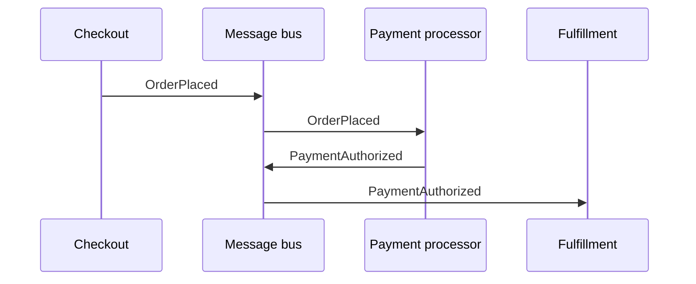

Read the sequence downward. The diagram is not meant to describe a complete ordering system. It shows the architectural role of the messages: checkout establishes one fact, the payment processor reacts to that fact and establishes another, and fulfillment can depend on the later fact without checkout coordinating either participant directly.

Message buses can also carry the same logical relationships across execution boundaries when an appropriate transport is available. Producers and consumers may be in different processes, runtimes, or systems rather than sharing one address space. The boundary-crossing capability belongs to message-bus architecture in general; the available transport determines which boundaries a particular bus can cross.

Ropemother currently makes local process separation concrete through a freestanding broker and IPC:

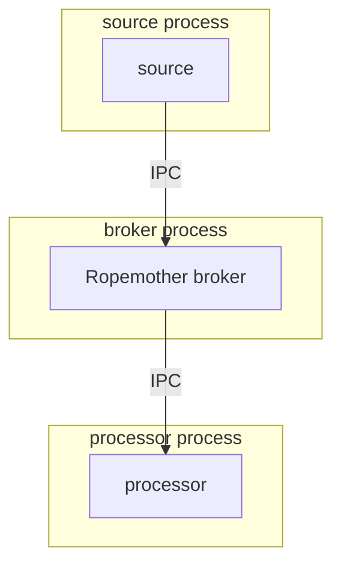

The exercises do not present broader cross-system transport as a turnkey Ropemother feature. A bus with a suitable transport can extend the same messaging relationship farther; the examples here demonstrate the local-process case.

## Inspect the prepared message contracts

Open:

```text
ropemother_exercises/basic/events.py
```

The prepared module names the two message families used in this exercise:

```text
Text submitted by the source

    topic:     demo.basic.text
    producer:  text-source
    type:      text-submitted

Word count derived by the processor

    topic:     demo.basic.word-count
    producer:  word-counter
    type:      words-counted
```

A topic groups related messages. The producer identifies the participant that published a message. The message type identifies the particular kind of event carried on that topic.

These names form the small message contract shared by otherwise independent participants.

## Publish and receive one message

Start an interactive Python interpreter from the repository root:

```sh
python
```

Keep this interpreter open for the two direct-bus checks below. When the instructions ask for a new source file, edit it in another terminal or editor. If only one terminal is available, exit the interpreter, create the file, and start `python` again before the block that says to return to the interpreter.

Import a direct bus and the prepared text-event names:

```python
from ropemother import CaptureMode, DirectMessageBus
from ropemother_exercises.basic.events import (
    SOURCE_MSG_PRODUCER,
    TEXT_MSG_TOPIC,
    TEXT_SUBMITTED_MSG_TYPE,
)
```

Create an in-process bus, subscribe, and register an emitter using the same message contract:

```python
bus = DirectMessageBus(
    capture_mode=CaptureMode.TRANSPORT_ONLY,
)
receiver = bus.subscribe(
    msg_topic=TEXT_MSG_TOPIC,
    msg_producer=SOURCE_MSG_PRODUCER,
    msg_type=TEXT_SUBMITTED_MSG_TYPE,
)
emitter = bus.register_emitter(
    msg_topic=TEXT_MSG_TOPIC,
    msg_producer=SOURCE_MSG_PRODUCER,
    msg_type=TEXT_SUBMITTED_MSG_TYPE,
)
```

`TRANSPORT_ONLY` keeps this first example focused on live delivery. The subscription describes which messages the receiver wants; `msg_producer=SOURCE_MSG_PRODUCER` filters for messages from `text-source` rather than assigning that identity to the receiver.

Publish one value and inspect the readable message that arrives:

```python
>>> emitter.emit("foo bar baz")
>>> message = receiver.receive()
>>> message.msg_topic
'demo.basic.text'
>>> message.msg_producer
'text-source'
>>> message.msg_type
'text-submitted'
>>> message.payload
'foo bar baz'
```

The objects used in this first exchange form the first small Ropemother API surface in the exercise. This diagram is about the concrete calls above, not general messaging vocabulary:

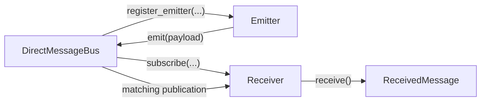

`DirectMessageBus` is the concrete in-process Ropemother object used for this first exchange. `Emitter`, `Receiver`, and `ReceivedMessage` are Ropemother API objects. The architectural idea underneath those names is simpler: a producer publishes under a message contract and matching subscribers receive the publication. Later participant classes accept `MessageEndpointFactory` rather than `DirectMessageBus` specifically so the same endpoint-facing code can also use a client connected to the freestanding broker.

The payload is the submitted value. Topic, producer, and type describe the message carrying it. The emitter did not call the receiver; both participants were configured against the same contract and the bus delivered the matching publication.

## Put publishing behind a source

Code that submits text should not need to repeat the topic, producer, and message type on every call.

Create:

```text
ropemother_exercises/basic/source.py
```

with:

```python
"""Text source for the basic message-bus exercise."""

from ropemother.broker import Emitter
from ropemother.client import MessageEndpointFactory

from ropemother_exercises.basic.events import (
    SOURCE_MSG_PRODUCER,
    TEXT_MSG_TOPIC,
    TEXT_SUBMITTED_MSG_TYPE,
)

class TextSource:
    """Publish text submitted to the basic exercise system."""

    _emitter: Emitter

    def __init__(self, bus: MessageEndpointFactory) -> None:
        self._emitter = bus.register_emitter(
            msg_topic=TEXT_MSG_TOPIC,
            msg_producer=SOURCE_MSG_PRODUCER,
            msg_type=TEXT_SUBMITTED_MSG_TYPE,
        )

    def emit_text(self, text: str) -> None:
        self._emitter.emit(text)

```

Return to the interpreter and use the source with a fresh direct bus:

```python
>>> from ropemother_exercises.basic.source import TextSource
>>> bus = DirectMessageBus(capture_mode=CaptureMode.TRANSPORT_ONLY)
>>> receiver = bus.subscribe(
...     msg_topic=TEXT_MSG_TOPIC,
...     msg_producer=SOURCE_MSG_PRODUCER,
...     msg_type=TEXT_SUBMITTED_MSG_TYPE,
... )
>>> source = TextSource(bus)
>>> source.emit_text("qux quux corge grault")
>>> receiver.receive().payload
'qux quux corge grault'
```

The source now owns the details required to publish its event. It still has no reference to the receiver and does not know what will consume the message.

## Add a word-count processor

The next participant consumes submitted text, derives a word count, and publishes the result as another message.

Create:

```text
ropemother_exercises/basic/processors.py
```

with:

```python
"""Processors for the basic message-bus exercise."""

from ropemother.broker import Emitter, Receiver
from ropemother.client import MessageEndpointFactory

from ropemother_exercises.basic.events import (
    SOURCE_MSG_PRODUCER,
    TEXT_MSG_TOPIC,
    TEXT_SUBMITTED_MSG_TYPE,
    WORD_COUNT_MSG_TOPIC,
    WORD_COUNTER_MSG_PRODUCER,
    WORDS_COUNTED_MSG_TYPE,
)

class WordCountProcessor:
    """Count words in submitted text and publish the result."""

    _receiver: Receiver
    _emitter: Emitter

    def __init__(self, bus: MessageEndpointFactory) -> None:
        self._receiver = bus.subscribe(
            msg_topic=TEXT_MSG_TOPIC,
            msg_producer=SOURCE_MSG_PRODUCER,
            msg_type=TEXT_SUBMITTED_MSG_TYPE,
        )
        self._emitter = bus.register_emitter(
            msg_topic=WORD_COUNT_MSG_TOPIC,
            msg_producer=WORD_COUNTER_MSG_PRODUCER,
            msg_type=WORDS_COUNTED_MSG_TYPE,
        )

    def run(self) -> None:
        while True:
            message = self._receiver.receive()
            word_count = count_words(message.payload)
            self._emitter.emit(word_count)

def count_words(text: str) -> int:
    return len(text.split())

```

The core processor behavior is visible in the loop: receive a message, derive a result, emit another message, and wait for the next message. There is no call to `TextSource`; the processor knows only the message contract to which it subscribes.

Exit the interpreter:

```python
exit()
```

The processor itself will be exercised as an independently running participant rather than called once from the same control flow as the source.

## Create the freestanding processor runner

Create:

```text
ropemother_exercises/basic/run_processor.py
```

with:

```python
"""Run the word-count processor through a freestanding message bus."""

from ropemother import connect_message_bus

from ropemother_exercises.basic.processors import WordCountProcessor

def run_word_counter() -> None:
    bus = connect_message_bus()

    try:
        processor = WordCountProcessor(bus)
        print("Word-count processor is ready.")
        processor.run()
    except KeyboardInterrupt:
        pass
    finally:
        bus.close()

if __name__ == "__main__":
    run_word_counter()

```

`connect_message_bus()` connects to the broker identified by the `ROPEMOTHER_CONNECTION_DESCRIPTOR` environment variable. `WordCountProcessor` itself does not change when the bus moves out of process.

## Create an independent display

Create:

```text
ropemother_exercises/basic/run_display.py
```

with:

```python
"""Display submitted text events and their derived word counts."""

from ropemother import connect_message_bus

from ropemother_exercises.basic.events import (
    SOURCE_MSG_PRODUCER,
    TEXT_MSG_TOPIC,
    TEXT_SUBMITTED_MSG_TYPE,
    WORD_COUNT_MSG_TOPIC,
    WORD_COUNTER_MSG_PRODUCER,
    WORDS_COUNTED_MSG_TYPE,
)

def display_word_counts() -> None:
    bus = connect_message_bus()

    try:
        text_receiver = bus.subscribe(
            msg_topic=TEXT_MSG_TOPIC,
            msg_producer=SOURCE_MSG_PRODUCER,
            msg_type=TEXT_SUBMITTED_MSG_TYPE,
        )
        word_count_receiver = bus.subscribe(
            msg_topic=WORD_COUNT_MSG_TOPIC,
            msg_producer=WORD_COUNTER_MSG_PRODUCER,
            msg_type=WORDS_COUNTED_MSG_TYPE,
        )

        print("Live display is ready.")

        while True:
            submitted_message = text_receiver.receive()
            counted_message = word_count_receiver.receive()

            print(f"submitted text: {submitted_message.payload}")
            print(f"word count: {counted_message.payload}")
            print()
    except KeyboardInterrupt:
        pass
    finally:
        bus.close()

if __name__ == "__main__":
    display_word_counts()

```

The display subscribes to both the original source event and the derived word-count event. The text publication therefore fans out independently to the processor and the display.

## Create a one-shot source runner

Create:

```text
ropemother_exercises/basic/run_source.py
```

with:

```python
"""Publish one text event through a freestanding message bus."""

from ropemother import connect_message_bus

from ropemother_exercises.basic.source import TextSource

def publish_text() -> None:
    bus = connect_message_bus()
    source = TextSource(bus)

    text = input("Text to count: ")
    source.emit_text(text)

    bus.close()

if __name__ == "__main__":
    publish_text()

```

The source publishes one event and exits. The processor and display can remain running while the source is invoked repeatedly.

## Run the participants independently

Use separate terminals for the **Broker**, **Word counter**, **Live display**, and **Source/history** roles while first examining the topology.

The Broker, Word counter, and Live display are persistent participants. Start each one once and leave it waiting. The Source/history terminal is reused for finite source commands and later history queries. Publishing another source event should wake the already-running processor and display through their subscriptions; it should not require another processor or display launch.

In the broker terminal, start a history-enabled broker with an isolated temporary runtime:

```sh
python -m ropemother.service --history --temporary
```

Wait for the broker readiness output. It prints a line resembling:

```text
environment: ROPEMOTHER_CONNECTION_DESCRIPTOR=ropemother+unix:///...
```

Export that descriptor in each terminal that will run a client:

```sh
export ROPEMOTHER_CONNECTION_DESCRIPTOR='ropemother+unix:///...'
```

Start the processor first:

```sh
python -m ropemother_exercises.basic.run_processor
```

Start the display in another terminal:

```sh
python -m ropemother_exercises.basic.run_display
```

Both processes now wait independently for matching messages. The processor prints `Word-count processor is ready.` and the display prints `Live display is ready.` before waiting for their first messages. If the shell prompt returns or a traceback appears, that participant is no longer available.

Start these receivers before publishing; a live subscription does not automatically replay earlier broadcasts.

Run the one-shot source:

```text
$ python -m ropemother_exercises.basic.run_source
Text to count: foo bar baz
```

The display should print:

```text
submitted text: foo bar baz
word count: 3
```

Run the source again without restarting either long-lived participant:

```text
$ python -m ropemother_exercises.basic.run_source
Text to count: qux quux corge grault
```

The display should add:

```text
submitted text: qux quux corge grault
word count: 4
```

The source, processor, and display are separate programs sharing messages through the broker. The source holds no references to either consumer, and adding the display did not require changing `TextSource` or the word-count processor.

This is the local process-boundary version of the earlier architectural picture. `connect_message_bus()` gives each program an endpoint-facing client while the broker lives in another process. The application relationships remain message relationships even though the participants no longer share the direct in-process bus used at the start of the exercise.

## Query work after a live subscriber has gone away

Stop the display with Ctrl-C. Leave the broker and word-count processor running.

Publish another source event while no display is subscribed:

```text
$ python -m ropemother_exercises.basic.run_source
Text to count: garply waldo fred plugh xyzzy
```

The processor still receives the text broadcast and publishes the corresponding count even though there is no live display to show either event.

Create:

```text
ropemother_exercises/basic/inspect_history.py
```

with:

```python
"""Inspect source and derived events in freestanding broker history."""

from ropemother import connect_message_bus
from ropemother.service import preconfigured_history_client

from ropemother_exercises.basic.events import (
    TEXT_MSG_TOPIC,
    WORD_COUNT_MSG_TOPIC,
)

def display_history_entry(entry) -> None:
    print(
        entry.msg_topic,
        entry.msg_producer,
        entry.msg_type,
        entry.payload,
        sep=" | ",
    )

def inspect_basic_history() -> None:
    bus = connect_message_bus()
    history = preconfigured_history_client(bus)

    text_entries = history.select_all(msg_topic=TEXT_MSG_TOPIC)
    count_entries = history.select_all(msg_topic=WORD_COUNT_MSG_TOPIC)

    print("Submitted text history")
    for entry in text_entries:
        display_history_entry(entry)

    print("Word count history")
    for entry in count_entries:
        display_history_entry(entry)

    bus.close()

if __name__ == "__main__":
    inspect_basic_history()

```

Run the history query from a terminal connected to the same broker:

```sh
python -m ropemother_exercises.basic.inspect_history
```

Expected output:

```text
Submitted text history
demo.basic.text | text-source | text-submitted | foo bar baz
demo.basic.text | text-source | text-submitted | qux quux corge grault
demo.basic.text | text-source | text-submitted | garply waldo fred plugh xyzzy
Word count history
demo.basic.word-count | word-counter | words-counted | 3
demo.basic.word-count | word-counter | words-counted | 4
demo.basic.word-count | word-counter | words-counted | 5
```

The third source event and its derived result are present even though the live display was gone when they were published. The history client did not need to be subscribed at that time; it asks the broker's prepared history service for recorded evidence after the fact. This is the first service-shaped interaction in the extended sequence: unlike a broadcast subscription, one query is sent in order to receive the corresponding result. `preconfigured_history_client()` selects the built-in profile to expedite this example; it is not presented as the one canonical way to construct every history client. TTY deliberately opens the corresponding host and service composition before later examples use convenience wrappers again.

## Compare the live view with the event history

Restart the display:

```sh
python -m ropemother_exercises.basic.run_display
```

Nothing from the first three publications should immediately appear. The restarted display has new live subscriptions and is waiting for future broadcasts.

Publish one more event:

```text
$ python -m ropemother_exercises.basic.run_source
Text to count: thud foo bar
```

The live display sees only the new publication and its derived result:

```text
submitted text: thud foo bar
word count: 3
```

Run the same history query again:

```sh
python -m ropemother_exercises.basic.inspect_history
```

The event-store view now contains the whole sequence:

```text
Submitted text history
demo.basic.text | text-source | text-submitted | foo bar baz
demo.basic.text | text-source | text-submitted | qux quux corge grault
demo.basic.text | text-source | text-submitted | garply waldo fred plugh xyzzy
demo.basic.text | text-source | text-submitted | thud foo bar
Word count history
demo.basic.word-count | word-counter | words-counted | 3
demo.basic.word-count | word-counter | words-counted | 4
demo.basic.word-count | word-counter | words-counted | 5
demo.basic.word-count | word-counter | words-counted | 3
```

The restarted live display saw one text event and one derived count; history shows all four of each. Messaging and the event store are complementary views of the same event-based application: subscriptions let participants react as events happen, while history turns recorded events into evidence that can be queried later. Neither view replaces the other, and the source does not need to know which view a later participant will use.

## Review the basic path

At this point:

- A readable message has been published and received through the direct in-process bus.
- Topic, producer, type, and payload have been inspected through the ordinary received-message envelope.
- Publishing has been moved behind a `TextSource` without coupling it to a receiver.
- `WordCountProcessor` runs as a blocking receive → derive → emit loop.
- The same source abstraction works when communication moves from an in-process bus to a freestanding broker.
- The source event fans out to more than one independent receiver.
- Long-running processor and display processes continue across multiple short-lived source executions.
- A history query retrieves source and derived evidence after a live subscriber has stopped.
- Restarting a subscriber does not replay earlier events, while the event store still exposes the accumulated history.

The deployment topology changed during the exercise, but the text-source message contract did not.

## Stop the basic application

Stop the display and processor with Ctrl-C, then stop the broker with Ctrl-C in its terminal.

Because this walkthrough started the broker with `--temporary`, its temporary runtime and captured history are discarded when the broker stops.

# TTY Processing

> **Authoring note**
>
> - Shift in emphasis: messaging mechanics to event design.
> - Distinctions: source observations versus derived determinations; stable correlation coordinates; private processor state versus shared history; peer interpretations of common evidence.
> - Keep source observations unchanged while timing, cadence grouping, command reconstruction, regex analysis, reconciliation, and decoding are added downstream.

## Inspect the prepared source model

Open:

```text
ropemother_exercises/tty/events.py
```

The prepared TTY source publishes four kinds of observations:

| Source event            | Evidence represented                             | Shared coordinates                                  |
| ----------------------- | ------------------------------------------------ | --------------------------------------------------- |
| `TTYReadObserved`       | Raw bytes observed on the input/read stream      | `session_id`, `observation_index`, `observed_at_ns` |
| `CanonicalLineObserved` | Canonical line reported by the line discipline   | source coordinates plus `line_index`                |
| `TTYWriteObserved`      | Raw bytes observed on the output/write stream    | `session_id`, `observation_index`, `observed_at_ns` |
| `TTYSessionEnded`       | Boundary stating that the recorded session ended | `session_id`, `observation_index`, `observed_at_ns` |

These are source observations. They do not contain reconstructed commands, typing intervals, regex results, corrections, or other later interpretations.

**Look under the hood at local history**

> **Authoring note**
>
> - Deliberate exception to the otherwise turnkey history presentation.
> - Intended reveal: a capture-backed readable history view exposed through a request/reply service.
> - Do not expose: symbol IDs, raw capture records, or other bus internals.
> - Keep this activity only if it clarifies what later history convenience helpers are wrapping.

Basic used a prepared broker history profile so the first history query could focus on selecting and interpreting recorded messages. This exercise deliberately assembles the public pieces behind that convenience before returning to application processors.

| Object                   | Responsibility in this local composition                                      |
| ------------------------ | ----------------------------------------------------------------------------- |
| `InMemoryCaptureSink`    | Records the bus traffic that capture-enabled participants publish             |
| `InMemoryCaptureHistory` | Decodes and selects readable messages from that captured evidence             |
| `BrokerHistoryExtension` | Exposes the history view as a request/reply service inside the hosted broker  |
| `LocalMessageBusHost`    | Runs the local broker with capture, formats, and the history extension        |
| `host.client()`          | Returns the ordinary endpoint factory used by the source and later processors |

The relationships are the lesson; memorizing this constructor sequence is not. A later helper or factory may wrap the same setup to make another example shorter. That wrapper is an example convenience, not a declaration that ordinary `ropemother` history use has one canonical construction path.

Create the first version of:

```text
ropemother_exercises/tty/run_local.py
```

```python
"""Run the TTY exercise with a local hosted message bus."""

from ropemother import InMemoryCaptureSink
from ropemother.broker import Receiver
from ropemother.capture import InMemoryCaptureHistory
from ropemother.service import BrokerHistoryExtension, LocalMessageBusHost

from ropemother_exercises.tty.application.source import scripted_tty_source
from ropemother_exercises.tty.events import (
    LINE_MSG_TOPIC,
    READ_MSG_TOPIC,
    SESSION_MSG_TOPIC,
    SOURCE_MSG_PRODUCER,
    WRITE_MSG_TOPIC,
)
from ropemother_exercises.tty.formats import TTY_PORTABLE_FORMATS

def run_local_tty_processing() -> None:
    capture_sink = InMemoryCaptureSink()
    history = InMemoryCaptureHistory(
        capture_sink, extra_formats=TTY_PORTABLE_FORMATS
    )
    host = LocalMessageBusHost(
        BrokerHistoryExtension(history),
        capture_sink=capture_sink,
        extra_formats=TTY_PORTABLE_FORMATS,
    )
    host.start()
    bus = host.client()

    source = scripted_tty_source(bus)
    source_results = bus.subscribe(
        msg_topic=(
            READ_MSG_TOPIC,
            LINE_MSG_TOPIC,
            WRITE_MSG_TOPIC,
            SESSION_MSG_TOPIC,
        ),
        msg_producer=SOURCE_MSG_PRODUCER,
    )

    try:
        source.emit_all()
        _display_source_sample(source_results)
    finally:
        host.close()

def _display_source_sample(receiver: Receiver) -> None:
    selected_indices = (0, 8, 9, 13, 14, 17)

    for message in receiver.receive_available():
        payload = message.payload

        if payload.observation_index in selected_indices:
            print(payload)

if __name__ == "__main__":
    run_local_tty_processing()

```

Run the local composition:

```sh
python -m ropemother_exercises.tty.run_local
```

The selected observations should be:

```text
TTYReadObserved(session_id='session-1', observation_index=0, observed_at_ns=0, data=b'ec')
CanonicalLineObserved(session_id='session-1', observation_index=8, observed_at_ns=1060000000, line_index=0, data=b'echo hello\n')
TTYWriteObserved(session_id='session-1', observation_index=9, observed_at_ns=1200000000, data=b'hel')
TTYReadObserved(session_id='session-1', observation_index=13, observed_at_ns=1820000000, data=b'\xc3')
TTYReadObserved(session_id='session-1', observation_index=14, observed_at_ns=1930000000, data=b'\xa9')
TTYSessionEnded(session_id='session-1', observation_index=17, observed_at_ns=2300000000)
```

The two one-byte reads at observations 13 and 14 are intentionally worth remembering: together they encode `é`, but neither source observation contains a complete UTF-8 code point by itself.

**Event records, identities, and portable data**

`TTYReadObserved` is an immutable value describing one observation. `session_id` associates that value with a longer-lived session, while `observation_index` and `observed_at_ns` locate the observation within the recorded evidence. A downstream processor can correlate observations without receiving or mutating a shared `Session` object.

The Python dataclasses in `events.py` are also not the only representation of these messages. The prepared `formats.py` maps the runtime values to portable projections suitable for capture and transport. For example, source `bytes` become Base64 fields in the JSON projection. The guided TTY path uses those formats without implementing them; a later format-focused activity can examine that boundary directly.

This separation leaves two design questions visible throughout the exercise: what fact deserves its own event, and what context must that event preserve so an unanticipated later processor can interpret it independently?

## Derive timing from raw input observations

The first participant-authored TTY processor derives the interval between raw input observations while keeping independent state for each session.

Create:

```text
ropemother_exercises/tty/timing.py
```

```python
"""Input timing processor for the TTY exercise."""

from ropemother.broker import Emitter, Receiver
from ropemother.client import MessageEndpointFactory

from ropemother_exercises.exceptions import BusExerciseBaseException
from ropemother_exercises.tty.events import (
    READ_MSG_TOPIC,
    SESSION_MSG_TOPIC,
    SOURCE_MSG_PRODUCER,
    TIMING_COMPLETED_MSG_TYPE,
    TIMING_DERIVED_MSG_TYPE,
    TIMING_MSG_PRODUCER,
    TIMING_MSG_TOPIC,
    InputTiming,
    InputTimingCompleted,
    TTYReadObserved,
    TTYSessionEnded,
)
from ropemother_exercises.tty.formats import (
    INPUT_TIMING_COMPLETED_FORMAT,
    INPUT_TIMING_FORMAT,
)

class InvalidTimingProcessorPayloadError(
    TypeError, BusExerciseBaseException
):
    """Raised when timing processing receives an unsupported payload."""
    pass

class InputTimingProcessor:
    """Derive elapsed time between raw input observations."""
    _receiver: Receiver
    _timing_emitter: Emitter
    _completion_emitter: Emitter
    _last_read_at_ns_by_session: dict[str, int]

    def __init__(self, bus: MessageEndpointFactory) -> None:
        subscription_topics = (READ_MSG_TOPIC, SESSION_MSG_TOPIC)
        self._receiver = bus.subscribe(
            msg_topic=subscription_topics,
            msg_producer=SOURCE_MSG_PRODUCER,
        )
        self._timing_emitter = bus.register_emitter(
            msg_topic=TIMING_MSG_TOPIC,
            msg_producer=TIMING_MSG_PRODUCER,
            msg_type=TIMING_DERIVED_MSG_TYPE,
            payload_format=INPUT_TIMING_FORMAT,
        )
        self._completion_emitter = bus.register_emitter(
            msg_topic=TIMING_MSG_TOPIC,
            msg_producer=TIMING_MSG_PRODUCER,
            msg_type=TIMING_COMPLETED_MSG_TYPE,
            payload_format=INPUT_TIMING_COMPLETED_FORMAT,
        )
        self._last_read_at_ns_by_session = {}

    def process_one(self) -> None:
        message = self._receiver.receive()
        self._process(message.payload)

    def process_available(self) -> int:
        messages = self._receiver.receive_available()

        for message in messages:
            self._process(message.payload)

        return len(messages)

    def _process(self, observation: object) -> None:
        if isinstance(observation, TTYReadObserved):
            self._observe_read(observation)
        elif isinstance(observation, TTYSessionEnded):
            self._observe_session_end(observation)
        else:
            payload_type = type(observation).__name__
            raise InvalidTimingProcessorPayloadError(
                f"expected raw input or session end, got {payload_type}"
            )

    def _observe_read(self, observation: TTYReadObserved) -> None:
        session_id = observation.session_id
        observed_at_ns = observation.observed_at_ns
        previous_observed_at_ns = self._last_read_at_ns_by_session.get(
            session_id
        )

        delta_ns = None
        if previous_observed_at_ns is not None:
            delta_ns = observed_at_ns - previous_observed_at_ns

        timing = InputTiming(
            session_id=session_id,
            observation_index=observation.observation_index,
            observed_at_ns=observed_at_ns,
            previous_observed_at_ns=previous_observed_at_ns,
            delta_ns=delta_ns,
        )
        self._timing_emitter.emit(timing)
        self._last_read_at_ns_by_session[session_id] = observed_at_ns

    def _observe_session_end(self, observation: TTYSessionEnded) -> None:
        completion = InputTimingCompleted(
            session_id=observation.session_id,
            boundary_observation_index=observation.observation_index,
            completed_at_ns=observation.observed_at_ns,
        )
        self._completion_emitter.emit(completion)
        self._last_read_at_ns_by_session.pop(observation.session_id, None)

```

The important parts of this longer file follow the processor's message path. The constructor subscribes to raw reads and session end and prepares two derived-event emitters. `_observe_read()` combines the current event with one piece of session-local state; `_observe_session_end()` emits the explicit timing boundary and removes that state. The surrounding `process_one()` and `process_available()` methods differ only in how much queued work they hand to the same `_process()` path.

The processor keeps only the previous raw-read time required for its next calculation. The resulting `InputTiming` still carries the source observation index and time so later processors can relate the derived fact back to source evidence.

`InputTimingCompleted` is a different kind of derived event: it declares that the source session has ended and that no later `InputTiming` event for that session should arrive. The next cadence processor can therefore finalize session-scoped work from the timing stream itself instead of also subscribing to the source's `TTYSessionEnded` event or depending on the length of this particular fixture.

The source observer in the first `run_local.py` was only for the initial inspection. Remove `source_results`, `_display_source_sample()`, and the source-topic imports before continuing.

Add these imports to `run_local.py`:

```python
from ropemother_exercises.tty.events import TIMING_MSG_TOPIC
from ropemother_exercises.tty.timing import InputTimingProcessor
```

After constructing `source`, construct the processor and a result receiver:

```python
timing_processor = InputTimingProcessor(bus)
timing_results = bus.subscribe(msg_topic=TIMING_MSG_TOPIC)
```

Replace the body of the `try` block with:

```python
source.emit_all()

while True:
    round_work_count = 0
    round_work_count += timing_processor.process_available()

    if round_work_count == 0:
        break

_display_available_payloads(timing_results)
```

Replace `_display_source_sample()` with the general result helper:

```python
def _display_available_payloads(receiver: Receiver) -> None:
    for message in receiver.receive_available():
        print(message.payload)
```

Run the composition again:

```sh
python -m ropemother_exercises.tty.run_local
```

The timing stream begins with no previous timestamp, contains the visible changes in interval, and ends with an explicit completion event. Distinctive lines include:

```text
InputTiming(session_id='session-1', observation_index=0, observed_at_ns=0, previous_observed_at_ns=None, delta_ns=None)
InputTiming(session_id='session-1', observation_index=4, observed_at_ns=650000000, previous_observed_at_ns=300000000, delta_ns=350000000)
InputTiming(session_id='session-1', observation_index=11, observed_at_ns=1600000000, previous_observed_at_ns=1040000000, delta_ns=560000000)
InputTimingCompleted(session_id='session-1', boundary_observation_index=17, completed_at_ns=2300000000)
```

**Why the local runner drains until quiet**

Basic showed long-running processors reacting independently. The TTY fixture instead supplies a finite recorded source and runs several local processors cooperatively. Each `process_available()` call consumes whatever is already waiting for that processor. A complete round that performs no work means this finite local topology has become quiet.

That condition is intentionally narrow. An empty local queue does not prove that a general distributed or externally driven application is finished: later messages may still arrive, messages may be in flight, and some feedback systems never become quiet. The later graph exercise will revisit local quiescence in a topology where scheduling order itself is part of the experiment.

## Group timing intervals into cadence spans

Timing made elapsed intervals available as a derived stream. Add a prepared processor that consumes that stream and groups contiguous intervals under one simple numeric rule. This is the first step toward possible cadence analyses, not a classification of behavior.

> **Authoring note**
>
> - Cadence grouping is part of the required TTY path.
> - Keep this activity at the level of deriving and grouping timing values.
> - Classifying cadence regimes, comparing grouping policies, or attaching behavioral meaning to the spans belongs in optional later work.

Copy the prepared implementation into the exercise package:

```sh
cp _targets/tty/cadence.py ropemother_exercises/tty/cadence.py
```

Open the copied file and locate four parts before adding it to the composition:

- `InputCadenceProcessor` subscribes to the timing stream rather than the original TTY source.
- `publish_configuration()` records the prepared relative-deviation rule as an event.
- `intervals_fit_cadence()` keeps a candidate span together only when its minimum and maximum intervals remain within the configured distance of the candidate mean.
- `InputTimingCompleted` tells the processor to emit any pending final span and release its session-local state.

The prepared setting is `Fraction(20, 100)`, or 20 percent. The grouping rule is intentionally transparent: it preserves a simple description of timing structure without assigning a behavioral label to that structure.

Update the timing-related imports in `run_local.py`:

```python
from ropemother_exercises.tty.cadence import (
    PREPARED_MAXIMUM_RELATIVE_DEVIATION,
    InputCadenceProcessor,
)
from ropemother_exercises.tty.events import (
    CADENCE_MSG_TOPIC,
    TIMING_MSG_TOPIC,
)
from ropemother_exercises.tty.timing import InputTimingProcessor
```

Construct the cadence processor and its result receiver immediately after the timing processor:

```python
cadence_processor = InputCadenceProcessor(
    bus, PREPARED_MAXIMUM_RELATIVE_DEVIATION
)
cadence_results = bus.subscribe(msg_topic=CADENCE_MSG_TOPIC)
```

Publish the grouping rule before emitting the prepared source:

```python
cadence_processor.publish_configuration()
source.emit_all()
```

Give cadence processing an opportunity to consume newly derived timing events immediately after timing processing in each round:

```python
round_work_count += timing_processor.process_available()
round_work_count += cadence_processor.process_available()
```

Display cadence after the timing stream:

```python
_display_available_payloads(timing_results)
_display_available_payloads(cadence_results)
```

Run the composition again:

```sh
python -m ropemother_exercises.tty.run_local
```

The cadence output begins with its configuration and then reports grouped timing spans. Distinctive lines include:

```text
InputCadenceConfigured(maximum_relative_deviation=Fraction(1, 5))
InputCadenceSpan(session_id='session-1', span_index=0, first_observation_index=0, last_observation_index=3, started_at_ns=0, ended_at_ns=300000000, interval_count=3, mean_interval_ns=Fraction(100000000, 1), minimum_interval_ns=100000000, maximum_interval_ns=100000000)
InputCadenceSpan(session_id='session-1', span_index=1, first_observation_index=3, last_observation_index=4, started_at_ns=300000000, ended_at_ns=650000000, interval_count=1, mean_interval_ns=Fraction(350000000, 1), minimum_interval_ns=350000000, maximum_interval_ns=350000000)
InputCadenceSpan(session_id='session-1', span_index=4, first_observation_index=11, last_observation_index=15, started_at_ns=1600000000, ended_at_ns=2040000000, interval_count=4, mean_interval_ns=Fraction(110000000, 1), minimum_interval_ns=110000000, maximum_interval_ns=110000000)
```

The first span groups three consecutive 100 ms intervals. The following 350 ms interval does not fit that group and begins another span. The processor makes the same kind of numeric decision as later timing intervals arrive, and `InputTimingCompleted` closes the final pending span.

This creates the first two-processor derivation chain in the TTY exercise: `TTYReadObserved -> InputTimingProcessor -> InputTiming -> InputCadenceProcessor -> InputCadenceSpan`. Cadence therefore demonstrates that a derived event stream can become reusable evidence for another processor. Richer work can later classify or compare cadence regimes, correlate spans with other event boundaries, or substitute a different grouping policy without changing the source or timing processor.

## Add prepared command reconstruction

Cadence shows that a derived timing stream can support another processor. A higher-level command asks a different question: it combines several source streams around a different notion of boundary.

Open:

```text
ropemother_exercises/tty/application/reconstruction.py
```

Focus first on the constructor and the `ReconstructedCommand` event in `events.py`. The prepared reconstructor subscribes to raw reads, canonical lines, writes, and session-end events and emits `ReconstructedCommand`.

The internal state machine is prepared support here. Its responsibility is still visible at the message boundary:

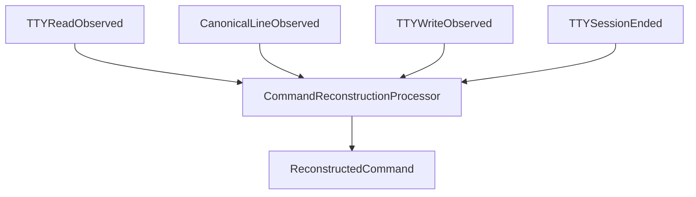

Add these imports to `run_local.py`:

```python
from ropemother_exercises.tty.application.reconstruction import (
    CommandReconstructionProcessor,
)
from ropemother_exercises.tty.events import (
    CADENCE_MSG_TOPIC,
    COMMAND_MSG_TOPIC,
    TIMING_MSG_TOPIC,
)
```

Construct the reconstructor and its result receiver after the cadence processor:

```python
reconstruction_processor = CommandReconstructionProcessor(bus)
command_results = bus.subscribe(msg_topic=COMMAND_MSG_TOPIC)
```

Give the reconstructor an opportunity to work in every processing round:

```python
round_work_count += reconstruction_processor.process_available()
```

Display its results after cadence:

```python
_display_available_payloads(command_results)
```

Run the composition:

```sh
python -m ropemother_exercises.tty.run_local
```

After the timing and cadence output, the two reconstructed commands should be:

```text
ReconstructedCommand(session_id='session-1', command_index=0, input_text='echo hello\n', output_text='hello\n', started_at_ns=0, ended_at_ns=2060000000, input_start_index=0, line_observation_index=8, boundary_observation_index=16)
ReconstructedCommand(session_id='session-1', command_index=1, input_text='cd /tmp/é\n', output_text='', started_at_ns=1600000000, ended_at_ns=2300000000, input_start_index=11, line_observation_index=16, boundary_observation_index=17)
```

The first canonical line is observed at source index 8, but the first command is not complete at index 8. Later write observations belong to its output, and the next canonical-line observation at index 16 establishes the boundary that closes the first command. The session-end event closes the second command.

The source therefore does not need to decide that a `ReconstructedCommand` exists. Reconstruction is a derived interpretation over lower-level evidence, and it can be introduced without changing the source, timing processor, or cadence processor.

## Implement regex analysis downstream of reconstructed commands

The next processor consumes the command events rather than the original TTY source. This makes the reconstructed command a stable boundary for analyses that care about command-level input or output rather than terminal mechanics.

Create:

```text
ropemother_exercises/tty/regex_analysis.py
```

```python
"""Regex analysis processor for reconstructed TTY commands."""

import re

from ropemother.broker import Emitter, Receiver
from ropemother.client import MessageEndpointFactory

from ropemother_exercises.exceptions import BusExerciseBaseException
from ropemother_exercises.tty.events import (
    COMMAND_MSG_TOPIC,
    COMMAND_RECONSTRUCTED_MSG_TYPE,
    RECONSTRUCTOR_MSG_PRODUCER,
    REGEX_ANALYZED_MSG_TYPE,
    REGEX_CONFIGURED_MSG_TYPE,
    REGEX_MSG_PRODUCER,
    REGEX_MSG_TOPIC,
    ReconstructedCommand,
    RegexAnalysis,
    RegexPattern,
    RegexPatternsConfigured,
)
from ropemother_exercises.tty.formats import (
    REGEX_ANALYSIS_FORMAT,
    REGEX_PATTERNS_CONFIGURED_FORMAT,
)

PREPARED_PATTERNS = (
    RegexPattern(
        field="input_text",
        pattern=r"^echo\b",
        description="Command invokes echo",
    ),
    RegexPattern(
        field="output_text",
        pattern=r"\bhello\b",
        description="Output contains hello",
    ),
    RegexPattern(
        field="input_text",
        pattern=r"^cd\b",
        description="Command changes directory",
    ),
)

class InvalidRegexPatternFieldError(
    ValueError, BusExerciseBaseException
):
    """Raised when a regex pattern names an unsupported command field."""
    pass

class RegexAnalysisProcessor:
    """Evaluate configured regex patterns over reconstructed commands."""
    _receiver: Receiver
    _configuration_emitter: Emitter
    _analysis_emitter: Emitter
    _patterns: tuple[RegexPattern, ...]

    def __init__(
        self, bus: MessageEndpointFactory, patterns: tuple[RegexPattern, ...]
    ) -> None:
        self._receiver = bus.subscribe(
            msg_topic=COMMAND_MSG_TOPIC,
            msg_producer=RECONSTRUCTOR_MSG_PRODUCER,
            msg_type=COMMAND_RECONSTRUCTED_MSG_TYPE,
        )
        self._configuration_emitter = bus.register_emitter(
            msg_topic=REGEX_MSG_TOPIC,
            msg_producer=REGEX_MSG_PRODUCER,
            msg_type=REGEX_CONFIGURED_MSG_TYPE,
            payload_format=REGEX_PATTERNS_CONFIGURED_FORMAT,
        )
        self._analysis_emitter = bus.register_emitter(
            msg_topic=REGEX_MSG_TOPIC,
            msg_producer=REGEX_MSG_PRODUCER,
            msg_type=REGEX_ANALYZED_MSG_TYPE,
            payload_format=REGEX_ANALYSIS_FORMAT,
        )
        self._patterns = patterns

    def publish_configuration(self) -> None:
        configuration = RegexPatternsConfigured(patterns=self._patterns)
        self._configuration_emitter.emit(configuration)

    def process_one(self) -> None:
        message = self._receiver.receive()
        self._process(message.payload)

    def process_available(self) -> int:
        messages = self._receiver.receive_available()

        for message in messages:
            self._process(message.payload)

        return len(messages)

    def _process(self, command: ReconstructedCommand) -> None:
        analysis = analyze_command(command, self._patterns)
        self._analysis_emitter.emit(analysis)

def analyze_command(
    command: ReconstructedCommand, patterns: tuple[RegexPattern, ...]
) -> RegexAnalysis:
    matched_pattern_indices = []

    for index, pattern in enumerate(patterns):
        text = _command_text(command, pattern.field)
        match = re.search(pattern.pattern, text)

        if match is not None:
            matched_pattern_indices.append(index)

    analysis = RegexAnalysis(
        session_id=command.session_id,
        command_index=command.command_index,
        matched_pattern_indices=tuple(matched_pattern_indices),
    )
    return analysis

def _command_text(command: ReconstructedCommand, field: str) -> str:
    if field == "input_text":
        text = command.input_text
    elif field == "output_text":
        text = command.output_text
    else:
        raise InvalidRegexPatternFieldError(
            f"unsupported regex pattern field: {field!r}"
        )

    return text

```

The longer file has three message-boundary responsibilities worth tracing before wiring it into the composition. The constructor receives reconstructed commands and prepares separate emitters for configuration and results:

```python
self._receiver = bus.subscribe(
    msg_topic=COMMAND_MSG_TOPIC,
    msg_producer=RECONSTRUCTOR_MSG_PRODUCER,
    msg_type=COMMAND_RECONSTRUCTED_MSG_TYPE,
)

self._configuration_emitter = bus.register_emitter(...)
self._analysis_emitter = bus.register_emitter(...)
```

`publish_configuration()` records the policy being applied, while `_process()` keeps the messaging boundary separate from the ordinary analysis function:

```python
def _process(self, command: ReconstructedCommand) -> None:
    analysis = analyze_command(command, self._patterns)
    self._analysis_emitter.emit(analysis)
```

The regex loop itself remains ordinary application logic inside `analyze_command()`. Message handling determines where that logic receives its input and where its result becomes available to other participants.

The processor emits one `RegexAnalysis` per reconstructed command. The analysis refers back to the command with `session_id` and `command_index`; it does not need to embed another copy of the whole command event.

`RegexPatternsConfigured` makes the interpretation policy visible as data as well. History can therefore contain both the analysis results and the pattern configuration under which those results were produced.

Add these imports to `run_local.py`:

```python
from ropemother_exercises.tty.events import (
    COMMAND_MSG_TOPIC,
    REGEX_MSG_TOPIC,
    TIMING_MSG_TOPIC,
)
from ropemother_exercises.tty.regex_analysis import (
    PREPARED_PATTERNS,
    RegexAnalysisProcessor,
)
```

Immediately after the existing `reconstruction_processor` and `command_results` assignments, construct the regex processor and its result receiver:

```python
regex_processor = RegexAnalysisProcessor(bus, PREPARED_PATTERNS)
regex_results = bus.subscribe(msg_topic=REGEX_MSG_TOPIC)
```

Publish the configuration before the scripted source:

```python
regex_processor.publish_configuration()
source.emit_all()
```

Add regex processing after command reconstruction in the quiescence loop:

```python
round_work_count += regex_processor.process_available()
```

Display the regex stream after the command results:

```python
_display_available_payloads(regex_results)
```

Run the composition. The regex output should be:

```text
RegexPatternsConfigured(patterns=(RegexPattern(field='input_text', pattern='^echo\\b', description='Command invokes echo'), RegexPattern(field='output_text', pattern='\\bhello\\b', description='Output contains hello'), RegexPattern(field='input_text', pattern='^cd\\b', description='Command changes directory')))
RegexAnalysis(session_id='session-1', command_index=0, matched_pattern_indices=(0, 1))
RegexAnalysis(session_id='session-1', command_index=1, matched_pattern_indices=(2,))
```

Regex analysis is downstream of command reconstruction, not part of it. Replacing the regex policy, adding another command-level analysis, or removing regex analysis entirely does not require the reconstructor to learn about those interpretations.

**Event design at the command boundary**

The same underlying activity now has several representations with different responsibilities:

| Record                  | Represents                                        | Correlates through                              |
| ----------------------- | ------------------------------------------------- | ----------------------------------------------- |
| `TTYReadObserved`       | One raw input observation                         | `session_id`, source observation coordinates    |
| `CanonicalLineObserved` | One canonical line observation                    | `session_id`, `line_index`, source coordinates  |
| `ReconstructedCommand`  | One derived command spanning several observations | `session_id`, `command_index`, boundary indices |
| `RegexAnalysis`         | One interpretation of one reconstructed command   | `session_id`, `command_index`                   |

A useful event contract preserves enough identity and provenance for independent consumers without turning every event into a snapshot of the entire application. The source records what was observed; reconstruction records a higher-level determination; regex analysis records one interpretation of that determination.

## Add history-backed input reconciliation

The raw input and canonical line are related evidence, but they are not identical. The first command in the fixture contains a raw correction sequence: the reads contain `echo help`, a delete byte, then `lo`, while the canonical line is simply `echo hello`.

Reconciliation should not become a prerequisite for command reconstruction. Instead, add another processor that receives each canonical line, queries the shared event history for the corresponding raw reads, and emits a peer analysis of the difference.

Open the supplied starter:

```text
ropemother_exercises/tty/reconciliation.py
```

The starter already contains the imports, processor shell, and difference helpers. It is part of the exercise files; do not recreate it from a listing in these instructions. Locate the marker inside `InputReconciliationProcessor` where the two history-selection methods belong.

Keep both new `def` lines aligned with `process_one()`, `process_available()`, and `_process()`. They are methods of `InputReconciliationProcessor`, not module-level helpers like `reconcile_input()` below the class. The normal TTY composition calls `process_available()` in its finite processing loop; do not call `process_one()` manually to schedule reconciliation.

Add these two methods inside `InputReconciliationProcessor` where marked:

```python
    def _reads_for(
        self, line: CanonicalLineObserved
    ) -> tuple[TTYReadObserved, ...]:
        previous_line_index = self._previous_line_observation_index(line)
        reads = []

        entries = self._history.select_all(
            msg_topic=READ_MSG_TOPIC,
            msg_type=READ_OBSERVED_MSG_TYPE,
            msg_producer=SOURCE_MSG_PRODUCER,
        )

        for entry in entries:
            read = entry.payload

            if read.session_id != line.session_id:
                continue
            if read.observation_index <= previous_line_index:
                continue
            if read.observation_index >= line.observation_index:
                continue

            reads.append(read)

        reads.sort(key=lambda read: read.observation_index)
        return tuple(reads)

    def _previous_line_observation_index(
        self, line: CanonicalLineObserved
    ) -> int:
        previous_index = -1

        entries = self._history.select_all(
            msg_topic=LINE_MSG_TOPIC,
            msg_type=LINE_OBSERVED_MSG_TYPE,
            msg_producer=SOURCE_MSG_PRODUCER,
        )

        for entry in entries:
            previous_line = entry.payload

            if (
                previous_line.session_id == line.session_id
                and previous_line.observation_index < line.observation_index
            ):
                previous_index = max(
                    previous_index, previous_line.observation_index
                )

        return previous_index
```

The selection applies several independent constraints:

| Selection rule                                    | Purpose                                                        | Visible in this fixture?                                   |
| ------------------------------------------------- | -------------------------------------------------------------- | ---------------------------------------------------------- |
| `read.session_id == line.session_id`              | Keeps evidence from different TTY sessions separate            | No; the normal fixture contains only one session           |
| `read.observation_index > previous_line_index`    | Prevents the next line from reusing the preceding line's reads | Yes; otherwise the second result also contains indices 0–7 |
| `read.observation_index < line.observation_index` | Excludes reads that occurred after the current canonical line  | Yes; otherwise the first result includes later input       |
| Sort by `observation_index`                       | Restores deterministic source order                            | The expected tuples demonstrate the required order         |

The fixture's single session means that removing the `session_id` checks would not change the output below. Those checks matter when the shared history also contains observations from another session; they keep each line correlated with its own source evidence without adding another session to this normal exercise.

Before wiring the processor into `run_local.py`, trace the part of the longer file that defines its architectural boundary. The constructor combines one live subscription, one prepared history client, and one derived-event emitter:

```python
self._receiver = bus.subscribe(
    msg_topic=LINE_MSG_TOPIC,
    msg_producer=SOURCE_MSG_PRODUCER,
    msg_type=LINE_OBSERVED_MSG_TYPE,
)
self._history = preconfigured_history_client(bus)
self._emitter = bus.register_emitter(...)
```

`preconfigured_history_client()` binds the built-in broker-history service's prepared topics, producers, message types, and formats so this example can focus on selecting evidence. It is an example convenience, not the canonical history API for every `ropemother` application. The general endpoint-factory surface remains `create_history_client(...)` when an application defines or selects another history service profile.

The processing path then makes the two evidence sources explicit:

```python
reads = self._reads_for(line)
reconciliation = reconcile_input(line, reads)
self._emitter.emit(reconciliation)
```

The supplied `reconcile_input()` and `difflib` helpers answer how the byte sequences differ. The selection methods added above answer which earlier source observations belong to the current line.

The processor's live subscription supplies the event that says a canonical line is now available. History supplies the earlier raw observations needed to interpret that line. The processor does not need to have been a second live subscriber to every read merely to retain another private copy of the same evidence.

Add these imports to `run_local.py`:

```python
from ropemother_exercises.tty.events import (
    COMMAND_MSG_TOPIC,
    RECONCILIATION_MSG_TOPIC,
    REGEX_MSG_TOPIC,
    TIMING_MSG_TOPIC,
)
from ropemother_exercises.tty.reconciliation import InputReconciliationProcessor
```

Immediately after the existing regex processor and result receiver assignments, construct the reconciliation processor and its result receiver:

```python
reconciliation_processor = InputReconciliationProcessor(bus)
reconciliation_results = bus.subscribe(msg_topic=RECONCILIATION_MSG_TOPIC)
```

Add reconciliation to the processing round after command reconstruction and before regex analysis:

```python
round_work_count += reconciliation_processor.process_available()
```

Display its results before regex output:

```python
_display_available_payloads(reconciliation_results)
```

Run the composition. The reconciliation output should be:

```text
InputReconciliation(session_id='session-1', line_index=0, read_observation_indices=(0, 1, 2, 3, 4, 5, 6, 7), line_observation_index=8, raw_difference_positions=((3, 0), (4, 0)), canonical_difference_offsets=())
InputReconciliation(session_id='session-1', line_index=1, read_observation_indices=(11, 12, 13, 14, 15), line_observation_index=16, raw_difference_positions=(), canonical_difference_offsets=())
```

Before continuing, compare `read_observation_indices` exactly. The first tuple must be `(0, 1, 2, 3, 4, 5, 6, 7)`, and the second must be `(11, 12, 13, 14, 15)`. If the first tuple also contains indices 11–15, check the upper bound against the current line. If the second tuple also contains indices 0–7, check the lower bound against the previous line. If execution reports that `_reads_for` is missing, confirm that both new definitions remain inside `InputReconciliationProcessor`.

The first result identifies two positions that exist only in the raw input: observation 3 contains the extra `p`, and observation 4 contains the delete byte that removes it. The canonical line needs no corresponding replacement bytes. The second raw input already agrees with its canonical line.

**Live messages and recorded history are complementary views**

Reconciliation uses both forms of access in the same processor:

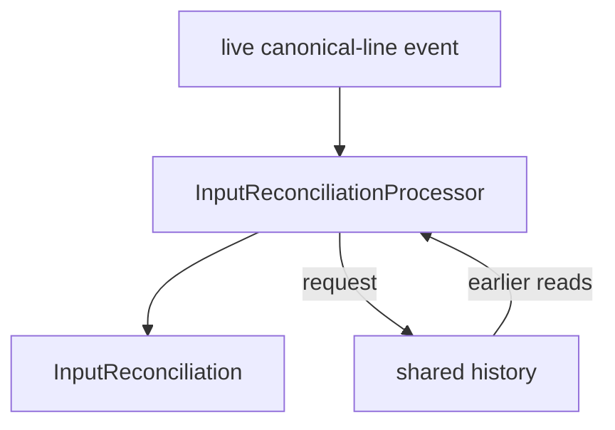

The live subscription answers what has just happened. The event store answers what related evidence has already happened. Neither replaces the other: messaging supplies current flow, while history makes earlier facts available to processors that did not need to cache every source event privately.

This also preserves auditability. The raw observations, canonical line, command reconstruction, and reconciliation remain distinct facts. A correction is not applied by silently rewriting the original read events.

## Decode characters that span raw input observations

The two one-byte reads remembered from the source inspection contain `b'\xc3'` and `b'\xa9'`. Together they encode `é`, but a processor that decodes each `TTYReadObserved` independently cannot recognize that character. Nothing in the source contract promises that a raw-read observation ends on a character boundary. This is a representation-boundary problem rather than a correction to the source: the source accurately recorded the bytes it observed.

The decoder is supplied because incremental text decoding is not the message-architecture lesson. Copy the prepared implementation into the exercise package:

```sh
cp _targets/tty/code_points.py ropemother_exercises/tty/code_points.py
```

Open the copied file and locate three parts before wiring it into the composition:

- `RawInputCodePointProcessor` subscribes to raw-read and session-end events without changing the source.
- The incremental decoder keeps incomplete byte sequences as processor-local working state.
- `RawInputCodePoint` records the first and last source observation and byte offsets that contributed to the decoded code point.

Add these imports to `run_local.py`:

```python
from ropemother_exercises.tty.code_points import RawInputCodePointProcessor
from ropemother_exercises.tty.events import (
    CADENCE_MSG_TOPIC,
    CODE_POINT_MSG_TOPIC,
    COMMAND_MSG_TOPIC,
    RECONCILIATION_MSG_TOPIC,
    REGEX_MSG_TOPIC,
    TIMING_MSG_TOPIC,
    RawInputCodePoint,
)
```

Add the code-point branch beside the other source-level interpretations: construct `code_point_processor` immediately after `cadence_processor`, and add `code_point_results` immediately after `cadence_results`:

```python
code_point_processor = RawInputCodePointProcessor(bus)
code_point_results = bus.subscribe(msg_topic=CODE_POINT_MSG_TOPIC)
```

Inside the `try` block, publish its decoding policy alongside the regex configuration and before `source.emit_all()`:

```python
code_point_processor.publish_configuration()
```

In the quiescence loop, keep cadence immediately after timing and add the code-point processor after cadence:

```python
round_work_count += timing_processor.process_available()
round_work_count += cadence_processor.process_available()
round_work_count += code_point_processor.process_available()
```

Display the decoding configuration and only code points that cross a source-message boundary. Add:

```python
def _display_code_point_results(receiver: Receiver) -> None:
    for message in receiver.receive_available():
        payload = message.payload

        if not isinstance(payload, RawInputCodePoint):
            print(payload)
        elif payload.first_observation_index != payload.last_observation_index:
            print(payload)
```

In the result-display block, call it immediately after the cadence output:

```python
_display_available_payloads(timing_results)
_display_available_payloads(cadence_results)
_display_code_point_results(code_point_results)
```

Run the composition. The code-point branch should contribute exactly these visible lines:

```text
RawInputDecodingConfigured(encoding='utf-8', error_policy='strict')
RawInputCodePoint(session_id='session-1', code_point_index=21, code_point='é', first_observation_index=13, first_byte_offset=0, last_observation_index=14, last_byte_offset=0, completed_at_ns=1930000000)
```

The original source events remain byte observations. Timing, cadence grouping, command reconstruction, reconciliation, and regex analysis remain unchanged. A newly recognized representation problem was handled by another processor behind the existing source boundary.

## Review the TTY network

The completed TTY path now has several interpretations of the same evidence:

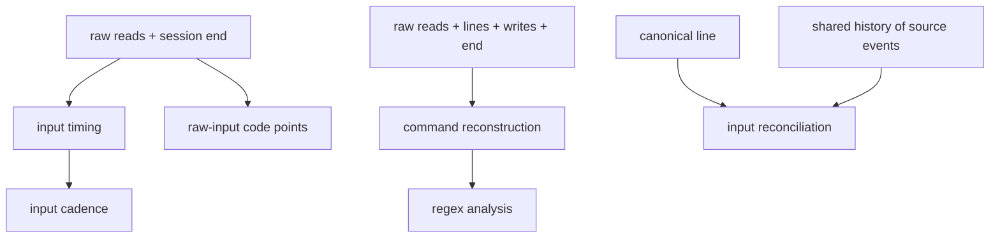

The processors also illustrate several different state strategies:

| Processor                        | Live input                                  | Local working state                   | Shared history | Derived output                         |
| -------------------------------- | ------------------------------------------- | ------------------------------------- | -------------- | -------------------------------------- |
| `InputTimingProcessor`           | raw reads, session end                      | previous read time per session        | no             | timing events, timing completion       |
| `InputCadenceProcessor`          | timing events, timing completion             | pending cadence span per session      | no             | cadence configuration and spans        |
| `CommandReconstructionProcessor` | reads, canonical lines, writes, session end | pending command per session           | no             | reconstructed commands                 |
| `RegexAnalysisProcessor`         | reconstructed commands                      | configured pattern policy             | no             | regex configuration and analyses       |
| `InputReconciliationProcessor`   | canonical lines                             | current operation only                | yes            | input reconciliations                  |
| `RawInputCodePointProcessor`     | raw reads, session end                      | incremental decoder state per session | no             | decoding configuration and code points |

No single state strategy is intrinsically correct for every processor. Timing only needs the previous timestamp. Cadence keeps a pending span while compatible timing intervals arrive. Reconstruction naturally accumulates a pending command. Reconciliation benefits from shared recorded evidence because the same reads may be useful to other present or future interpretations as well.

As a final independence check, temporarily remove the code-point branch from `run_local.py`: comment out its construction, configuration publication, `process_available()` line, and display call. Run the composition again.

Timing, cadence grouping, command reconstruction, reconciliation, and regex analysis should produce the same results as before. Restore the code-point branch afterward.

The source was not rewritten to support timing, cadence grouping, command analysis, reconciliation, or UTF-8 decoding. The processors also do not form one mandatory linear pipeline: some consume source observations in parallel, some consume another processor's derived events, and one combines a live event with shared history.

# Graph Reachability

> **Authoring note**
>
> - Introduces: feedback, duplicate suppression, convergence, and quiescence.
> - Fixed-order and randomized runners are pedagogical scheduling models, not claims about general distributed termination.
> - Intended evidence: different schedules may produce different intermediate histories while converging to the same final reachability facts.

## Run the direct-path baseline

Run the prepared graph activity before changing any code:

```sh
python -m ropemother_exercises.graph.reachability
```

Expected output:

```text
Declared arcs
A -> B
B -> C
C -> D

Fixed-order reachability
A -> B; hop count 1
B -> C; hop count 1
C -> D; hop count 1
```

The source graph is a directed chain:

```text
A -> B -> C -> D
```

The three declared arcs are source facts. The existing `DirectPathsProcessor` turns each arc into a one-hop `PathFound` fact, so the baseline can establish `A -> B`, `B -> C`, and `C -> D` but not `A -> C`, `B -> D`, or `A -> D`.

Open:

```text
ropemother_exercises/graph/events.py
```

The source and derived records preserve both run and graph identity:

```python
@dataclasses.dataclass(frozen=True, kw_only=True)
class ArcDeclared:
    run_id: str
    graph_id: str
    source: str
    target: str

@dataclasses.dataclass(frozen=True, kw_only=True)
class PathFound:
    run_id: str
    graph_id: str
    source: str
    target: str
    hop_count: int
```

A path is not a command to perform more work. It is a new fact: within a particular run and graph, one node is known to reach another.

## Inspect the prepared fact boundary

Open:

```text
ropemother_exercises/graph/processors.py
```

The existing direct-path processor contains the first graph rule:

```python
candidate = direct_path_from_arc(message.payload)
self._emit_if_new(candidate)
```

Before emitting, it asks `GraphFacts` whether that reachability fact is already recorded:

```python
def _emit_if_new(self, path: PathFound) -> int:
    if self._facts.path_is_known(path):
        emitted_count = 0
    else:
        self._emitter.emit(path)
        emitted_count = 1

    return emitted_count
```

Open:

```text
ropemother_exercises/graph/facts.py
```

`GraphFacts` is a prepared query layer over ordinary message history. For example, `path_is_known()` compares the candidate with path events already recorded for the same run and graph:

```python
def path_is_known(self, path: PathFound) -> bool:
    known = False

    for existing in self.paths_for_run(path.run_id, path.graph_id):
        if existing.path_key() == path.path_key():
            known = True
            break

    return known
```

The processor does not maintain a second private set of every path it has emitted. Shared recorded facts answer whether a candidate is new.

This distinction becomes important once a processor starts feeding derived path facts back into further path derivation: a finite set of possible reachability facts needs to be emitted at most once.

## Implement path extension

The next rule combines a known path with a compatible declared arc:

```text
path(A, B) + arc(B, C) -> path(A, C)
```

The same rule must work regardless of which fact becomes available first:

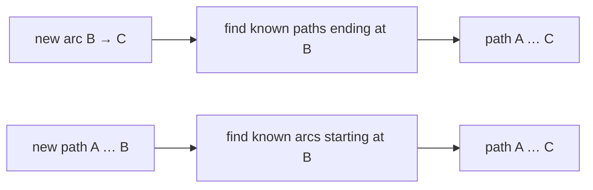

Start with the pure relation between one compatible path and arc. In `ropemother_exercises/graph/processors.py`, add this function after `direct_path_from_arc()`:

```python
def extend_path_over_arc(path: PathFound, arc: ArcDeclared) -> PathFound:
    if path.run_id != arc.run_id:
        raise ValueError("path and arc must belong to the same run")
    if path.graph_id != arc.graph_id:
        raise ValueError("path and arc must belong to the same graph")
    if path.target != arc.source:
        raise ValueError("path target must match arc source")

    extended = PathFound(
        run_id=path.run_id,
        graph_id=path.graph_id,
        source=path.source,
        target=arc.target,
        hop_count=path.hop_count + 1,
    )
    return extended
```

Start a Python interpreter from the repository root and check the rule directly before placing it inside a message processor:

```sh
python
```

```pycon
>>> from ropemother_exercises.graph.events import ArcDeclared, PathFound
>>> from ropemother_exercises.graph.processors import extend_path_over_arc
>>> path_ab = PathFound(
...     run_id="rule-check",
...     graph_id="g",
...     source="A",
...     target="B",
...     hop_count=1,
... )
>>> arc_bc = ArcDeclared(run_id="rule-check", graph_id="g", source="B", target="C")
>>> extend_path_over_arc(path_ab, arc_bc)
PathFound(run_id='rule-check', graph_id='g', source='A', target='C', hop_count=2)
```

Exit the interpreter after the check:

```python
exit()
```

The pure function expresses the reachability rule itself: matching run and graph identity, adjacency at `B`, and one additional hop. The processor can now concentrate on finding compatible facts and deciding whether a candidate is new.

Add `EXTEND_MSG_PRODUCER` to the import from `events.py`:

```python
from ropemother_exercises.graph.events import (
    ARC_DECLARED_MSG_TYPE,
    ARC_MSG_TOPIC,
    DIRECT_MSG_PRODUCER,
    EXTEND_MSG_PRODUCER,
    PATH_FOUND_MSG_TYPE,
    PATH_MSG_TOPIC,
    SOURCE_MSG_PRODUCER,
    ArcDeclared,
    PathFound,
)
```

Insert `ExtendPathsProcessor` after `DirectPathsProcessor` and before the pure helper functions:

```python
class ExtendPathsProcessor:
    """Extend known paths across known arcs."""
    _arc_receiver: Receiver
    _path_receiver: Receiver
    _emitter: Emitter
    _facts: GraphFacts

    def __init__(self, bus: MessageEndpointFactory, facts: GraphFacts) -> None:
        self._arc_receiver = bus.subscribe(
            msg_topic=ARC_MSG_TOPIC,
            msg_producer=SOURCE_MSG_PRODUCER,
            msg_type=ARC_DECLARED_MSG_TYPE,
        )
        self._path_receiver = bus.subscribe(
            msg_topic=PATH_MSG_TOPIC, msg_type=PATH_FOUND_MSG_TYPE
        )
        self._emitter = bus.register_emitter(
            msg_topic=PATH_MSG_TOPIC,
            msg_producer=EXTEND_MSG_PRODUCER,
            msg_type=PATH_FOUND_MSG_TYPE,
            payload_format=PATH_FOUND_FORMAT,
        )
        self._facts = facts

    def process_arc_if_available(self) -> int:
        message = self._arc_receiver.receive_nowait()

        if message is None:
            work_count = 0
        else:
            self._extend_known_paths_over_arc(message.payload)
            work_count = 1

        return work_count

    def process_path_if_available(self) -> int:
        message = self._path_receiver.receive_nowait()

        if message is None:
            work_count = 0
        else:
            self._extend_path_over_known_arcs(message.payload)
            work_count = 1

        return work_count

    def _extend_known_paths_over_arc(self, arc: ArcDeclared) -> int:
        emitted_count = 0
        known_paths = self._facts.paths_ending_at(
            run_id=arc.run_id,
            graph_id=arc.graph_id,
            target=arc.source,
        )

        for path in known_paths:
            candidate = extend_path_over_arc(path, arc)
            emitted_count += self._emit_if_new(candidate)

        return emitted_count

    def _extend_path_over_known_arcs(self, path: PathFound) -> int:
        emitted_count = 0
        known_arcs = self._facts.arcs_starting_at(
            run_id=path.run_id,
            graph_id=path.graph_id,
            source=path.target,
        )

        for arc in known_arcs:
            candidate = extend_path_over_arc(path, arc)
            emitted_count += self._emit_if_new(candidate)

        return emitted_count

    def _emit_if_new(self, path: PathFound) -> int:
        if self._facts.path_is_known(path):
            emitted_count = 0
        else:
            self._emitter.emit(path)
            emitted_count = 1

        return emitted_count
```

The two receivers make the feedback topology explicit. New source arcs can extend paths learned earlier, while every `PathFound` event can extend over arcs learned earlier. The path subscription does not filter by producer, so it receives paths produced by both the direct processor and the extension processor itself.

## Add extension to the fixed-order runner

Open:

```text
ropemother_exercises/graph/runner.py
```

The existing runner already represents each scheduling opportunity as a named callable and repeats rounds until a complete round consumes no work:

```python
@dataclasses.dataclass(frozen=True, kw_only=True)
class GraphProcessorStep:
    step_name: str
    process: collections.abc.Callable[[], int]
```

Each processor method used as a step calls `receive_nowait()` once. A step therefore consumes zero or one queued event. A round is quiet only when every step finds no message to consume.

Change the processor import to include the new class:

```python
from ropemother_exercises.graph.processors import (
    DirectPathsProcessor,
    ExtendPathsProcessor,
)
```

Add the extension processor to `GraphRuntime` immediately after `direct_processor`:

```python
@dataclasses.dataclass(frozen=True, kw_only=True)
class GraphRuntime:
    bus: DirectMessageBus
    history: MessageHistory
    graph_facts: GraphFacts
    source: GraphSource
    direct_processor: DirectPathsProcessor
    extend_processor: ExtendPathsProcessor
```

In `create_graph_runtime()`, construct the extension processor immediately after the direct processor:

```python
source = GraphSource(bus)
direct_processor = DirectPathsProcessor(bus, graph_facts)
extend_processor = ExtendPathsProcessor(bus, graph_facts)
```

Include it when constructing `GraphRuntime`:

```python
runtime = GraphRuntime(
    bus=bus,
    history=history,
    graph_facts=graph_facts,
    source=source,
    direct_processor=direct_processor,
    extend_processor=extend_processor,
)
```

Replace `graph_processor_steps()` with three one-message scheduling opportunities:

```python
def graph_processor_steps(
    runtime: GraphRuntime,
) -> tuple[GraphProcessorStep, ...]:
    direct_step = GraphProcessorStep(
        step_name="direct path processor",
        process=runtime.direct_processor.process_arc_if_available,
    )
    arc_extension_step = GraphProcessorStep(
        step_name="extend paths from arcs",
        process=runtime.extend_processor.process_arc_if_available,
    )
    path_extension_step = GraphProcessorStep(
        step_name="extend paths from paths",
        process=runtime.extend_processor.process_path_if_available,
    )
    return (direct_step, arc_extension_step, path_extension_step)
```

The final comparison will show not only the completed reachability set, but also when new path facts become available. Keep the existing scheduling trace and add the paths first recorded during each round to `GraphRunResult`:

```python
@dataclasses.dataclass(frozen=True, kw_only=True)
class GraphRunResult:
    run_id: str
    graph: Graph
    paths: tuple[PathFound, ...]
    trace: tuple[TraceEntry, ...]
    new_paths_by_round: tuple[tuple[PathFound, ...], ...]
```

Replace `run_fixed_order()` with:

```python
def run_fixed_order(
    graph: Graph, *, run_id: str, max_rounds: int = 20
) -> GraphRunResult:
    runtime = create_graph_runtime()
    runtime.source.emit_graph(run_id=run_id, graph=graph)

    trace, new_paths_by_round = run_fixed_order_until_quiet(
        runtime,
        run_id=run_id,
        graph_id=graph.graph_id,
        max_rounds=max_rounds,
    )
    paths = runtime.graph_facts.paths_for_run(run_id, graph.graph_id)

    result = GraphRunResult(
        run_id=run_id,
        graph=graph,
        paths=paths,
        trace=trace,
        new_paths_by_round=new_paths_by_round,
    )
    return result
```

Replace `run_fixed_order_until_quiet()` with:

```python
def run_fixed_order_until_quiet(
    runtime: GraphRuntime, *, run_id: str, graph_id: str, max_rounds: int
) -> tuple[tuple[TraceEntry, ...], tuple[tuple[PathFound, ...], ...]]:
    trace = []
    new_paths_by_round = []
    known_path_count = 0

    for round_index in range(max_rounds):
        round_work_count = run_fixed_order_round(
            runtime, round_index=round_index, trace=trace
        )
        paths = runtime.graph_facts.paths_for_run(run_id, graph_id)
        new_paths_by_round.append(paths[known_path_count:])
        known_path_count = len(paths)

        if round_work_count == 0:
            return (tuple(trace), tuple(new_paths_by_round))

    raise GraphRunError("graph processor steps did not become quiet")
```

`known_path_count` marks how much of the history-backed path result was already present after the previous round. The slice therefore records only facts that first appeared during the current round. The final quiet round is retained as an empty path batch.

Run the activity again:

```sh
python -m ropemother_exercises.graph.reachability
```

Expected output still presents the completed fixed-order result as all six reachable pairs:

```text
Declared arcs
A -> B
B -> C
C -> D

Fixed-order reachability
A -> B; hop count 1
A -> C; hop count 2
A -> D; hop count 3
B -> C; hop count 1
B -> D; hop count 2
C -> D; hop count 1
```

The extension processor emits `A -> C` and `B -> D`, then receives derived path facts on the same path topic and can extend `A -> C` over `C -> D` to emit `A -> D`.

The feedback stops because `GraphFacts.path_is_known()` prevents an already recorded source-target reachability fact from being emitted again. Once every possible fact for this finite graph has been recorded and every queued event has been consumed, a complete scheduling round performs no work.

**Quiescence is a property of this execution model**

The runner's `round_work_count == 0` test is useful because the graph source is finite, all communication is local, every scheduling step checks an in-memory queue immediately, and duplicate suppression makes this feedback topology terminate.

It is not a general distributed termination detector. In another system, an empty local queue might only mean that a message has not arrived yet or is still in flight. The graph exercise makes the stopping assumption visible rather than generalizing it beyond the model being run.

## Randomize processor scheduling

The fixed runner always offers work to the three processor steps in the same order. Next, observe what changes when the step order is shuffled at the beginning of each round while the source graph and the set of processor steps remain unchanged.

At the top of `ropemother_exercises/graph/runner.py`, add:

```python
import random
```

Add `run_random_order()` immediately after `run_fixed_order()`:

```python
def run_random_order(
    graph: Graph, *, run_id: str, seed: int, max_rounds: int = 20
) -> GraphRunResult:
    runtime = create_graph_runtime()
    runtime.source.emit_graph(run_id=run_id, graph=graph)

    trace, new_paths_by_round = run_random_order_until_quiet(
        runtime,
        run_id=run_id,
        graph_id=graph.graph_id,
        seed=seed,
        max_rounds=max_rounds,
    )
    paths = runtime.graph_facts.paths_for_run(run_id, graph.graph_id)

    result = GraphRunResult(
        run_id=run_id,
        graph=graph,
        paths=paths,
        trace=trace,
        new_paths_by_round=new_paths_by_round,
    )
    return result
```

Add the randomized quiescence loop before `graph_processor_steps()`:

```python
def run_random_order_until_quiet(
    runtime: GraphRuntime,
    *,
    run_id: str,
    graph_id: str,
    seed: int,
    max_rounds: int,
) -> tuple[tuple[TraceEntry, ...], tuple[tuple[PathFound, ...], ...]]:
    rng = random.Random(seed)
    trace = []
    new_paths_by_round = []
    known_path_count = 0

    for round_index in range(max_rounds):
        round_work_count = run_random_order_round(
            runtime, rng=rng, round_index=round_index, trace=trace
        )
        paths = runtime.graph_facts.paths_for_run(run_id, graph_id)
        new_paths_by_round.append(paths[known_path_count:])
        known_path_count = len(paths)

        if round_work_count == 0:
            result = (tuple(trace), tuple(new_paths_by_round))
            return result

    raise GraphRunError("graph processor steps did not become quiet")


def run_random_order_round(
    runtime: GraphRuntime,
    *,
    rng: random.Random,
    round_index: int,
    trace: list[TraceEntry],
) -> int:
    steps = list(graph_processor_steps(runtime))
    rng.shuffle(steps)
    return run_processor_steps(steps, round_index=round_index, trace=trace)
```

Nothing about the source changes. `GraphSource.emit_graph()` still publishes the three declared arcs in the same order. Only the order in which waiting processors are given one opportunity to consume work changes.

## Compare two schedules

Open:

```text
ropemother_exercises/graph/reachability.py
```

Replace the runner import with:

```python
from ropemother_exercises.graph.runner import (
    GraphRunResult,
    run_fixed_order,
    run_random_order,
)
```

Add these display helpers after `path_facts()`:

```python
def format_path_cell(
    paths: tuple[PathFound, ...], *, direct: bool
) -> str:
    if direct:
        selected_paths = tuple(path for path in paths if path.hop_count == 1)
        separator = "→"
    else:
        selected_paths = tuple(path for path in paths if path.hop_count > 1)
        separator = "…"

    if not selected_paths:
        cell = " - "
    elif len(selected_paths) == 1:
        path = selected_paths[0]
        cell = f"{path.source}{separator}{path.target}"
    else:
        cell = f"x{len(selected_paths)}"

    return f"{cell:^3}"


def round_activity_counts(result: GraphRunResult) -> tuple[int, ...]:
    counts = [0] * len(result.new_paths_by_round)

    for entry in result.trace:
        counts[entry.round_index] += entry.work_count

    return tuple(counts)


def display_path_rounds(label: str, result: GraphRunResult) -> None:
    round_labels = "  ".join(
        f"{round_index:^3}"
        for round_index in range(1, len(result.new_paths_by_round) + 1)
    )
    direct_cells = "  ".join(
        format_path_cell(paths, direct=True)
        for paths in result.new_paths_by_round
    )
    extended_cells = "  ".join(
        format_path_cell(paths, direct=False)
        for paths in result.new_paths_by_round
    )
    activity_cells = "  ".join(
        f"{count:^3}" for count in round_activity_counts(result)
    )

    label_width = 13

    print(label)
    print(f"{'':{label_width}}Round")
    print(f"{'':{label_width}}{round_labels}")
    print(f"{'Direct':{label_width}}{direct_cells}")
    print(f"{'Extended':{label_width}}{extended_cells}")
    print(f"{'Activity':{label_width}}{activity_cells}")
```

The display uses one compact cell per round. A direct fact such as `A→B` is a one-hop reachability fact derived from a declared arc. An extended fact such as `A…C` was produced through the feedback rule. `xN` means that more than one extended fact was emitted during that round, while `-` means no new fact of that row's kind was emitted. `Activity` counts queued events consumed during the round; a final activity count of `0` is the quiet round.

`run_reachability()` now performs several independent runs. Rename the source-only run identifier to make that role explicit:

```python
source_run_id = "source-facts"
source.emit_graph(run_id=source_run_id, graph=graph)
declared_arcs = graph_facts.arcs_for_run(source_run_id, graph.graph_id)
```

Keep the existing declared-arc and fixed-order output. Immediately after the loop that prints `fixed_path_facts`, add two randomized runs and compare them with the fixed result:

```python
seed_one_result = run_random_order(graph, run_id="random-seed-1", seed=1)
seed_five_result = run_random_order(graph, run_id="random-seed-5", seed=5)

print()
display_path_rounds("Seed 1", seed_one_result)
print()
display_path_rounds("Seed 5", seed_five_result)

seed_one_path_facts = path_facts(seed_one_result.paths)
seed_five_path_facts = path_facts(seed_five_result.paths)
same_reachability = (
    seed_one_path_facts == fixed_path_facts
    and seed_five_path_facts == fixed_path_facts
)

print(f"\nSame reachability: {same_reachability}")
```

Run the completed activity:

```sh
python -m ropemother_exercises.graph.reachability
```

Expected output:

```text
Declared arcs
A -> B
B -> C
C -> D

Fixed-order reachability
A -> B; hop count 1
A -> C; hop count 2
A -> D; hop count 3
B -> C; hop count 1
B -> D; hop count 2
C -> D; hop count 1

Seed 1
             Round
              1    2    3    4    5    6    7    8
Direct       A→B  B→C  C→D   -    -    -    -    -
Extended      -   A…C  x2    -    -    -    -    -
Activity      2    3    3    1    1    1    1    0

Seed 5
             Round
              1    2    3    4    5    6    7
Direct       A→B  B→C  C→D   -    -    -    -
Extended     A…C  A…D  B…D   -    -    -    -
Activity      3    3    3    1    1    1    0

Same reachability: True
```

The same direct facts appear in both executions, but extended reachability becomes available in different rounds. Under seed 1 no extended fact is emitted in round 1, then `A…C` appears in round 2 and two longer facts appear together in round 3. Under seed 5, `A…C` is already established in round 1 and the remaining longer facts appear one at a time.

After the final new fact appears, activity continues while already queued events are consumed. Duplicate suppression prevents those events from adding the same reachability facts again. The final `0` shows the first round in which no processor consumed an event, so the local execution is quiet.

Both schedules nevertheless recover the same six `PathFound` facts. The execution history records how each run arrived there; the final reachability projection records what was established after the computation converged.

## Review the graph network

The completed network has one source and two processors:

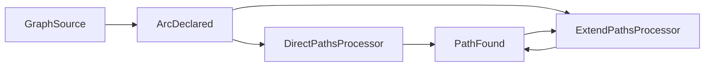

Both processors use the same history-backed `GraphFacts` view before emitting a path candidate.

| Participant            | Live input                    | Shared history use                       | Derived output  |
| ---------------------- | ----------------------------- | ---------------------------------------- | --------------- |
| `GraphSource`          | prepared `Graph` value        | none                                     | run + arc facts |
| `DirectPathsProcessor` | declared arcs                 | reject already-known reachability facts  | one-hop paths   |
| `ExtendPathsProcessor` | declared arcs and found paths | join with known facts; reject duplicates | longer paths    |

Several architectural consequences are now visible:

- Events can represent accumulated facts rather than only transient notifications.
- A processor can subscribe to a topic to which it also contributes, allowing derived facts to feed later derivation.
- Shared history can act as the common partial result instead of requiring every processor to maintain a complete private graph index.
- Duplicate suppression can turn a feedback network over a finite fact space into a terminating computation.
- Processor scheduling can change the intermediate event trace without changing the converged result.

The graph exercise is still deliberately controlled. The runner simulates alternate scheduling orders in one local process; it does not claim to reproduce every race, delay, or failure mode of concurrent distributed execution. The useful result is the separation between source facts, derived facts, scheduling policy, and the converged projection over recorded evidence.

# Image Reconstruction — Full Self-Paced Path

> **Authoring note**
>
> - Deliberate return to the application that opened the sequence.
> - Reuse rather than reintroduce: messaging, history, event-design, and bounded-work concepts from Basic, TTY, and Graph.
> - New work: processor implementation, controlled experimental variables, reusable Instrument identity, target sharing once available, and substitution of multiple history-backed views.

## See what the reconstruction problem represents

Run the prepared known-target explanation before starting the long-lived application:

```sh
python -m ropemother_exercises.image.examples.reconstruction
```

The display follows one angular measurement from a one-dimensional projection to a back-projected image, combines 0° and 90° evidence into an orthogonal reconstruction, then shows how 45° and 135° evidence further constrains the image.

The simulated angular sensor does not observe every image cell directly. It divides the image into parallel projection bins, samples the target, and reports accumulated evidence for those bins. Back-projection spreads each one-dimensional bin result over the image cells that could have contributed to it. Fusion combines several such partial views.

The important stages are visible directly in the prepared example. Open:

```text
ropemother_exercises/image/examples/reconstruction.py
```

Read `run_reconstruction_explanation()` from top to bottom. It performs four ordinary steps:

1. `measure_angular_projection(...)` produces native one-dimensional evidence for 0°, 90°, 45°, and 135° views.
2. `image_observation_from_angular_projection(...)` converts each angular projection into a back-projected `ImageObservation` over the two-dimensional frame.
3. `geometric_covered_intensity(...)` combines compatible `ImageObservation` values into a reconstruction.
4. The `render_*` helpers arrange the known target, projections, back-projections, and reconstructions for explanation.

The example calls these functions directly because its job is to explain the reconstruction model, not the application architecture. The live application wraps the same kind of prepared transformation behind message boundaries:

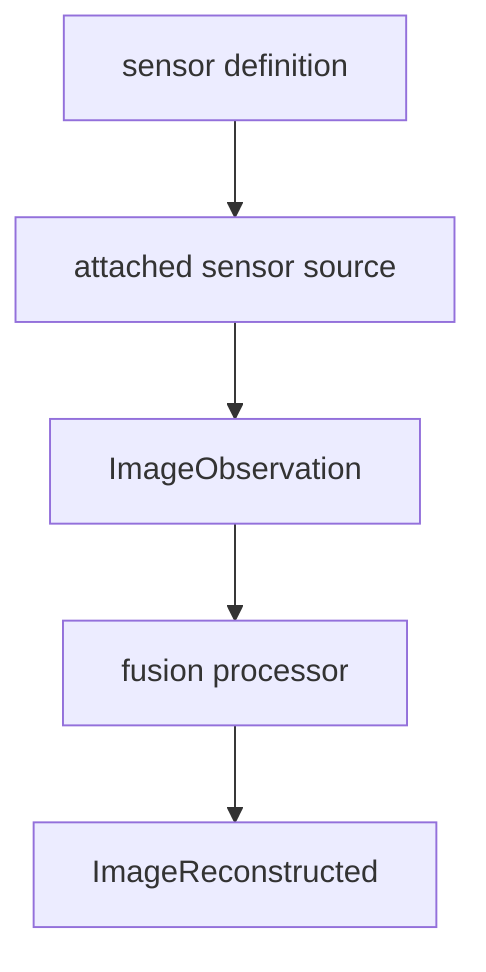

This separation is important. The sensing mathematics and fusion mathematics can remain prepared while the application is reorganized around independently running participants.

## Connect the reconstruction to an ordinary processor

Open:

```text
ropemother_exercises/image/service/fusion.py
```

Read the message-facing core of `ImageFusionProcessor`; the surrounding service entry point is prepared application hosting.

The constructor establishes two ordinary relationships already encountered in earlier exercises:

- subscribe to `ImageObservation` and run-closure messages;
- publish reconstructed images and reconstruction-completion messages.

`process_one()` receives one payload and dispatches it according to the event type. `_process_observation()` groups observations by run, calls the configured fusion method, and publishes the resulting `ImageObservation`. `_complete_run()` removes the processor's temporary per-run state and publishes a `ReconstructionCompletion` identifying the last reconstruction emitted for that run.

The selected fusion method is supplied as a constructor argument rather than embedded in the processor:

```python
processor = ImageFusionProcessor(
    bus,
    processor_name="geometric-fusion",
    fusion_method=geometric_covered_intensity,
)
```

That is the same architectural split practiced earlier: messaging and lifecycle behavior belong to the processor, while the domain calculation can be supplied independently.

At the bottom of the file, `run_fusion_processor()` turns the processor into a long-running service by repeatedly calling:

```python
while True:
    processor.process_one()
```

The image application is therefore not using a special execution model. Its fusion service is another independently running receive → derive → emit processor.

## Start a fresh image application

The examples below assume a fresh image application so the first completed run is `trial-1` and the first discovered reusable sensor arrangement is `instrument-1`. If another image session is still running, finish or stop that session before continuing.

Use one terminal for the long-running application processes.

Start the image application host in the background:

```sh
python -m ropemother_exercises.image &
```

Wait for the host to print its readiness message and a complete export command resembling:

```text
Image application host is ready. Make sure to run the independent services separately.
export ROPEMOTHER_CONNECTION_DESCRIPTOR=ropemother+unix:///...
```

The descriptor is the connection address for this running broker. It tells a client which transport and endpoint to use; it does not copy the broker or its history into the new process. The `connect_message_bus()` function from `ropemother` reads `ROPEMOTHER_CONNECTION_DESCRIPTOR`, so separate programs that receive the same descriptor can join the same running message bus without being started by one another.

Copy and run the printed `export ROPEMOTHER_CONNECTION_DESCRIPTOR=...` command in the same shell.

Start the two independently restartable presentation services:

```sh
python -m ropemother_exercises.image.service.report &
python -m ropemother_exercises.image.service.dashboard &
```

Wait for:

```text
Reconstruction report service is ready.
Dashboard report service is ready.
```

Leave these processes running.

Open or switch to another terminal for interactive work and run the same exported descriptor command there. The application host, fusion processor, identity service, trial service, and presentation services now have lifetimes independent of the interactive clients used below.

The application host starts the broker, identity service, trial service, and geometric fusion service as a convenient baseline topology. That convenience does not make the host the owner of their application logic; the service boundaries remain real. The report and dashboard services are kept outside the host specifically so they can be stopped, edited, and restarted independently later.

## Enter the interactive workspace and inspect sensor geometry

Start the prepared workspace:

```sh
python -i -m ropemother_exercises.image.workspace
```

The workspace has already attached 0° and 90° angular sensor sources and published one measurement through each. The displayed image is an intermediate reconstruction rather than a completed run.

Inspect the projection bins of the two prepared sensor definitions:

```pycon
>>> sensor_0.show_bins(frame)
...
>>> sensor_90.show_bins(frame)
...
```

The two displays divide the same frame with different strip orientations. `bin_count` controls how many regions partition the projection. `sample_count` controls how much measurement evidence is gathered for those bins.

`AngularSensor` is a reusable configuration value. Calling `attach(bus)` creates a bus-bound source from that definition. Attachment supplies the messaging relationship; measurement later supplies target-derived evidence.

## Complete the four-angle run manually

Create the 45° sensor and attach it:

```python
sensor_45 = AngularSensor(
    sensor_name="sensor-45",
    angle_degrees=45.0,
    bin_count=frame.width,
    sample_count=samples_per_sensor,
)
sensor_45_source = sensor_45.attach(bus)
```

Publish one measurement and display the resulting intermediate reconstruction:

```python
sensor_45_source.measure(
    target=target,
    observation_id="45-degrees",
    seed=13,
)

message = run_receiver.receive()
reconstruction = message.payload
print(render_intensity_image(reconstruction.intensity_image, frame))
```

Add the complementary 135° source through the same boundary:

```python
sensor_135 = AngularSensor(
    sensor_name="sensor-135",
    angle_degrees=135.0,
    bin_count=frame.width,
    sample_count=samples_per_sensor,
)
sensor_135_source = sensor_135.attach(bus)

sensor_135_source.measure(
    target=target,
    observation_id="135-degrees",
    seed=14,
)

message = run_receiver.receive()
reconstruction = message.payload
print(render_intensity_image(reconstruction.intensity_image, frame))
```

The fusion processor has incorporated evidence from four independently attached sources without being changed or restarted.

Close the current run and receive its explicit boundary event:

```pycon
>>> close_run_input(bus)
>>> message = run_receiver.receive()
>>> message.msg_type
'reconstruction-completed'
```

Keep the completion and request a current report:

```python
completion = message.payload
report = report_client.call(completion).payload
print(report.rendering)
```

Each measurement was already correlated with the current run when it crossed the bus boundary. Closing input adds the fact that no more sensor contributions belong to that run. The completion identifies the final reconstruction already emitted for that bounded attempt.

## Generate the next angular refinement from data

The first angular arrangement used the ruler groups at depths 0 through 2. Depth 3 contributes the four positions halfway between the existing views:

| Depth | New ruler fractions  | New angles                     |
| ----- | -------------------- | ------------------------------ |
| 0     | `0`                  | `0°`                           |
| 1     | `1/2`                | `90°`                          |
| 2     | `1/4, 3/4`           | `45°, 135°`                    |
| 3     | `1/8, 3/8, 5/8, 7/8` | `22.5°, 67.5°, 112.5°, 157.5°` |

Inspect the general interpolation values and their angular interpretation together:

```pycon
>>> ruler_fraction_group(3)
(Fraction(1, 8), Fraction(3, 8), Fraction(5, 8), Fraction(7, 8))
>>> half_angles = ruler_angle_group(3)
>>> half_angles
(22.5, 67.5, 112.5, 157.5)
```

The fractions are reusable interpolation positions between 0 and 1. `ruler_angle_group()` applies that construction to the 180° periodicity of angular projections.

Generate the four new sensor definitions:

```python
half_angle_sensors = angular_sensors_for_angles(
    sensor_name_prefix="half-angle",
    angles_degrees=half_angles,
    bin_count=frame.width,
    sample_count=samples_per_sensor,
)
```

Attach them with the same operation used for the manually authored sensors:

```python
half_angle_sources = []

for sensor in half_angle_sensors:
    half_angle_sources.append(sensor.attach(bus))
```

Combine the four existing sources with the four generated additions:

```python
eight_angle_sources = (
    sensor_0_source,
    sensor_45_source,
    sensor_90_source,
    sensor_135_source,
    *half_angle_sources,
)
```

The helper changed how repeated participant definitions were constructed; it did not create a different kind of source or replace the four sources already attached. Another ruler refinement would require eight new sensors, making the scaling value of procedural construction visible without requiring that sixteen-sensor run here.

Publish one measurement from each source:

```python
sensor_number = 1

for sensor_source in eight_angle_sources:
    sensor_source.measure(
        target=target,
        observation_id=f"eight-angle-{sensor_number}",
        seed=20 + sensor_number,
    )
    sensor_number += 1
```

Close the run and consume reconstruction activity until its completion boundary arrives:

```python
close_run_input(bus)
message = run_receiver.receive()

while message.msg_type != RECONSTRUCTION_COMPLETED_MSG_TYPE:
    message = run_receiver.receive()

completion = message.payload
report = report_client.call(completion).payload
print(report.rendering)
```

The reconstruction stream still contained one intermediate result per new measurement. The completion message, rather than a hard-coded position in that stream, identifies the bounded result that later consumers should treat as the finished reconstruction.

## Add a different sensor family

Return to the interactive Python workspace.

Create two perspective sensor definitions at 0° and 90° bearings and assign them directly to separate names:

```python
perspective_0, perspective_90 = perspective_sensors_for_bearings(
    sensor_name_prefix="perspective",
    bearings_degrees=(0.0, 90.0),
    viewpoint_distance=1.5,
    coordinate_scale=IMAGE_RADIUS_UNIT_LENGTH,
    field_of_view_degrees=90.0,
    bin_count=frame.width,
    sample_count=samples_per_sensor,
)
```

Inspect their geometry before attaching or measuring:

```python
perspective_0.show_bins(frame)
perspective_90.show_bins(frame)
```

Unlike the parallel strips of an angular projection, perspective bins spread through a field of view from a viewpoint. `show_bins()` is configuration feedback only: it does not allocate a run, measure the concealed target, or publish evidence.

Attach both sensors:

```python
perspective_0_source = perspective_0.attach(bus)
perspective_90_source = perspective_90.attach(bus)
```

First create a completed orthogonal angular run for comparison:

```python
sensor_0_source.measure(
    target=target,
    observation_id="orthogonal-0",
    seed=41,
)
sensor_90_source.measure(
    target=target,
    observation_id="orthogonal-90",
    seed=42,
)

close_run_input(bus)
message = run_receiver.receive()

while message.msg_type != RECONSTRUCTION_COMPLETED_MSG_TYPE:
    message = run_receiver.receive()

orthogonal_completion = message.payload
```

Now make a two-source perspective run at the corresponding bearings:

```python
perspective_0_source.measure(
    target=target,
    observation_id="perspective-0",
    seed=61,
)
perspective_90_source.measure(
    target=target,
    observation_id="perspective-90",
    seed=62,
)

close_run_input(bus)
message = run_receiver.receive()

while message.msg_type != RECONSTRUCTION_COMPLETED_MSG_TYPE:
    message = run_receiver.receive()

perspective_completion = message.payload
```

Request both reports through the same report client:

```python
orthogonal_report = report_client.call(orthogonal_completion).payload
perspective_report = report_client.call(perspective_completion).payload

print(orthogonal_report.rendering)
print(perspective_report.rendering)
```

The sensing geometry changed, but the fusion processor still received the same downstream `ImageObservation` family. Heterogeneous producers can participate behind a stable observation boundary when the downstream processor depends on the evidence contract rather than a concrete sensor class.

The reusable sensor definitions also share a small type structure:

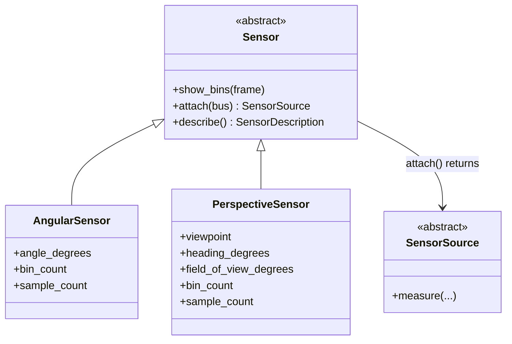

This is an image-domain type diagram rather than a messaging-architecture diagram. The hollow triangle marks Python type specialization: both concrete sensor definitions are kinds of `Sensor`, and their visible members explain the geometry each definition carries. `attach()` crosses from a reusable definition to a bus-bound `SensorSource` that can perform measurements.

The two perspective sources remain available for later mixed configurations; attaching them did not consume them or bind them to this one run.

## Separate measurement depth from sensor geometry

`sample_count` and `bin_count` change different parts of the measurement problem. First use a prepared comparison to make the distinction visible, then reproduce one controlled change through the running application.

Run the prepared sample-depth comparison:

```sh
python -m ropemother_exercises.image.examples.sample_depths
```

The example holds a four-angle topology and bin resolution fixed while comparing 256, 512, and 1024 samples per sensor against the same target. The visible change therefore isolates measurement depth rather than changing the participant topology at the same time.

Return to the interactive workspace and construct the same four angular views with a lower sample count:

```python
lower_sample_sensors = angular_sensors_for_angles(
    sensor_name_prefix="lower-sample",
    angles_degrees=(0.0, 90.0, 45.0, 135.0),
    bin_count=frame.width,
    sample_count=256,
)

lower_sample_sources = []

for sensor in lower_sample_sensors:
    lower_sample_sources.append(sensor.attach(bus))
```

Publish one measurement from each source, close the run, and receive its completion:

```python
sensor_number = 1

for sensor_source in lower_sample_sources:
    sensor_source.measure(
        target=target,
        observation_id=f"lower-sample-{sensor_number}",
        seed=10 + sensor_number,
    )
    sensor_number += 1

close_run_input(bus)
message = run_receiver.receive()

while message.msg_type != RECONSTRUCTION_COMPLETED_MSG_TYPE:
    message = run_receiver.receive()

lower_sample_completion = message.payload
print(report_client.call(lower_sample_completion).payload.rendering)
```

The sensor placement, bin resolution, and angle-specific random seeds match the earlier four-angle configuration, while the measurement depth changed. This is a controlled comparison because the intended variable is visible at the construction site.

Now change geometry without publishing another measurement. Create a coarse 0° sensor definition and inspect its bins:

```python
coarse_sensor = AngularSensor(
    sensor_name="coarse-0",
    angle_degrees=0.0,
    bin_count=8,
    sample_count=samples_per_sensor,
)
coarse_sensor.show_bins(frame)
```

Compare that geometry with the prepared 0° sensor:

```python
sensor_0.show_bins(frame)
```

Reducing `bin_count` changes the spatial partition of the projection. Changing `sample_count` changes how much evidence is gathered for an existing partition. Angular coverage is a third choice: adding or moving sensors changes which views contribute evidence. Keeping those variables separate makes later experiments easier to interpret.

## Leave the exploratory Python client

Exit the interactive workspace after the controlled measurement run:

```python
exit()
```

The image application, completed runs, and discovered configurations remain in the longer-lived broker session. The remaining normal-path work deliberately uses other clients and independently restartable services.

Exiting here also prevents the workspace's reconstruction receiver from accumulating messages produced by later terminal-driven runs. Start a fresh workspace during open exploration if more interactive sensing is useful.

## Recover reusable Instrument identity

Use the interaction terminal for the finite-lived image client.

List the reusable sensor arrangements discovered from the completed evidence so far:

```sh
./image instruments
```

For a fresh session, the first two entries should still resemble:

```text
instrument-1: sensor-0, sensor-90, sensor-45, sensor-135
instrument-2: sensor-0, sensor-45, sensor-90, sensor-135, half-angle-1, half-angle-2, half-angle-3, half-angle-4
```

A run is one reconstruction attempt. An Instrument is the reusable sensor-contribution configuration associated with a completed run. The identity service derives that configuration from recorded contribution evidence when the run closes; the exploratory path did not require a separate registration step.

The relationship is useful to keep separate from the lifetime of any one run:

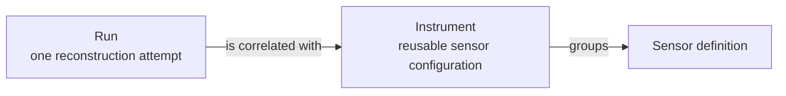

These boxes name application concepts rather than pretending that all three are classes with relevant members to inspect. An Instrument groups sensor definitions into a reusable configuration. A completed Run can be correlated with that configuration, and later runs can reuse the same Instrument identity without depending on the Python objects that originally assembled it.

Inspect the first Instrument in detail:

```sh
./image instrument instrument-1
```

Expected structure:

```text
instrument-1
  sensor-0 (Angular)
    angle_degrees: 0.0
    bin_count: 32
    sample_count: 512
  sensor-90 (Angular)
    ...
  sensor-45 (Angular)
    ...
  sensor-135 (Angular)
    ...
```

Execute that reusable configuration again from the terminal client:

```sh
./image run instrument-1
```

The trial service creates a fresh run and performs the same Instrument against the current session target. The original interactive Python sources are not being called by the terminal. A new reconstruction, report, and dashboard row should appear for the new run.

This separates the identity of an experimental configuration from the lifetime of the client that first assembled it.

## Revisit completed work through later views

The application now contains several completed reconstruction runs produced by different sensor arrangements and clients.

From an interaction terminal, request all current reconstruction reports:

```sh
./image reports
```

Then request the collection dashboard:

```sh
./image dashboard
```

The report service answers one detailed request about one completed reconstruction. The dashboard answers a different question about the collection of completed runs. Both construct current views from shared history.

These terminal commands use prepared request/reply clients. Unlike a pub/sub broadcast, each request is sent in order to receive a corresponding reply from one service. The caller does not need to subscribe to every report the service might produce, and the service does not need to know which clients will ask later.

The report service did not have to own the sensing process or cache the reconstruction when it was created. A report request supplies a `ReconstructionCompletion`; the service uses that identity to recover the corresponding reconstruction evidence and renders it with the report implementation that is running now.

The history in this exercise lasts for the lifetime of the image application host. Exiting a workspace or restarting a report service does not remove it. Stopping the host ends the temporary session history.

## Change the dashboard in two stages

The baseline dashboard is already useful: it lists run, reconstruction, sensor count, and measurement count. The first edit should demonstrate how little application state has to move when one presentation service changes; the second should make the view more useful for a growing experiment collection.

In the long-running-process terminal, stop only the dashboard service:

```sh
./image stop dashboard
```

Open:

```text
ropemother_exercises/image/dashboard.py
```

### First change: add a collection heading

In `render_dashboard()`, replace:

```python
return render_dashboard_index(*entries)
```

with:

```python
index = render_dashboard_index(*entries)
return f"Completed reconstructions\n\n{index}"
```

Restart only the dashboard service:

```sh
python -m ropemother_exercises.image.service.dashboard &
```

Wait for its readiness message, then request the dashboard again:

```sh
./image dashboard
```

The rows and recorded evidence are unchanged. Only the currently running dashboard interpretation changed.

### Second change: add an intrinsic reconstruction property

Stop the dashboard again:

```sh
./image stop dashboard
```

Add the contrast helper import after the existing `HistoryClient` import:

```python
from ropemother_exercises.image.application.ranking import (
    reconstruction_contrast,
)
```

Keep the first-stage `render_dashboard()` ordering unchanged. Add this helper immediately after `render_dashboard()`:

```python
def contrast_for(entry: DashboardEntry) -> float:
    return reconstruction_contrast(entry.reconstruction)
```

Replace `render_dashboard_index()` with:

```python
def render_dashboard_index(*entries: DashboardEntry) -> str:
    headings = (
        "run",
        "reconstruction",
        "sensors",
        "measurements",
        "contrast",
    )
    rows = []

    for entry in entries:
        row = (
            render_run_id(entry.run_id),
            entry.reconstruction_id,
            str(entry.sensor_count),
            str(entry.measurement_count),
            f"{contrast_for(entry):.3f}",
        )
        rows.append(row)

    return render_text_table(headings, rows)
```

Restart the dashboard service and request the view again:

```sh
python -m ropemother_exercises.image.service.dashboard &
./image dashboard
```

The same rows now include another descriptive property without changing their original order. Sensing, fusion, run identity, and reconstruction history are unchanged.

Contrast is not a hidden-target accuracy score. It is one property of the reconstructed image. `reconstruction_smoothness()` offers another question that can be asked of the same evidence; sensor count and measurement count are already available without another image heuristic. Ordering by one of those properties is an additional policy choice, not a consequence of adding the property itself.

### Walk through the richer completed dashboard

Open:

```text
_targets/image/dashboard.py
```

The completed example takes the same ordinary `DashboardEntry` values and extends the view along several independent axes:

- `ranked_entries` adds an ordering policy without changing `dashboard_entries()` or history correlation;
- `top_entry` selects one reconstruction from that ordered collection;
- the summary reports collection size and one computed property;
- `render_dashboard_index()` adds rank and contrast columns;
- `render_reconstructions(top_entry.reconstruction)` reuses the full-size rendering helper to feature one result below the index;
- `render_dashboard_title()` changes only presentation.

The target is intentionally a coherent example rather than a required endpoint. Compare it with the current edited dashboard and either leave the simpler version in place or copy one additional idea that answers a useful question about the accumulated runs.

For example, to adopt the target's contrast ordering while keeping the simpler heading, add this line before building `index`:

```python
entries = sorted(entries, key=contrast_for, reverse=True)
```

Then the existing `render_dashboard_index(*entries)` call presents the same rows under the new ordering policy. Restart only the dashboard service and request it again to see the new current view.

## Substitute the reconstruction-report interpretation

The dashboard is a collection-level view. The reconstruction-report service is a separate request/reply participant that answers a detailed question about one completed reconstruction.

Request a current report for the first run before changing the implementation:

```sh
./image report trial-1
```

Stop only the reconstruction-report service:

```sh
./image stop report
```

The broker, sensing sources, fusion service, trial service, identity service, history, and dashboard can remain running.

Open:

```text
ropemother_exercises/image/report.py
```

`reconstruction_report()` uses the supplied completion to find the exact reconstruction in history, then delegates presentation to the small `render_reconstruction_report()` function. The request/reply service plumbing lives separately in `service/report.py`, so the presentation policy can change without rewriting the service boundary.

Add one prepared intrinsic metric to the imports:

```python
from ropemother_exercises.image.application.ranking import (
    reconstruction_smoothness,
)
```

Replace `render_reconstruction_report()` with:

```python
def render_reconstruction_report(reconstruction: ImageObservation) -> str:
    image = render_reconstructions(reconstruction)
    smoothness = reconstruction_smoothness(reconstruction)
    return f"{image}\n\nsmoothness: {smoothness:.3f}"
```

Restart only the reconstruction-report service:

```sh
python -m ropemother_exercises.image.service.report &
```

Wait for:

```text
Reconstruction report service is ready.
```

Request the same earlier run again:

```sh
./image report trial-1
```

The run and reconstruction evidence did not change. The same request/reply contract now produces a more descriptive current report because a different report implementation is running. The dashboard's contrast column and the report's smoothness value also demonstrate that peer views can ask different questions of the same reconstruction evidence.

Request the dashboard again:

```sh
./image dashboard
```

The dashboard did not need to restart when the reconstruction-report implementation changed. These are peer downstream interpretations over shared evidence, not stages in one presentation pipeline.

This is the clearest drop-in substitution exercise in the image path: sensor sources, fusion, history, the terminal client, and the report request/reply contract remain stable while one independently running interpretation changes.

## Open exploration

This is a good point to scroll among the image instructions and prepared examples. The common operations have already been exercised; additional work can now begin from a concrete question rather than from another fixed sequence.

### Reconstruction recipes

The following recipes provide specific starting points. They are examples, not a checklist.

**Refine from eight angular views to sixteen.** Generate only the next eight interleaved angles, attach those new sources, then combine them with the existing eight-angle sources:

```python
next_angles = ruler_angle_group(4)
next_sensors = angular_sensors_for_angles(
    sensor_name_prefix="next-angle",
    angles_degrees=next_angles,
    bin_count=frame.width,
    sample_count=samples_per_sensor,
)
next_sources = []

for sensor in next_sensors:
    next_sources.append(sensor.attach(bus))

sixteen_angle_sources = (*eight_angle_sources, *next_sources)
```

Use the established measure → close → receive completion workflow to run the resulting arrangement.

**Build a regular perspective ring.** Generate four bearings around a full circle and create perspective sensors aimed inward:

```python
perspective_bearings = evenly_spaced_angles(
    4,
    span_degrees=360.0,
)
ring_sensors = perspective_sensors_for_bearings(
    sensor_name_prefix="ring",
    bearings_degrees=perspective_bearings,
    viewpoint_distance=1.5,
    coordinate_scale=IMAGE_RADIUS_UNIT_LENGTH,
    field_of_view_degrees=90.0,
    bin_count=frame.width,
    sample_count=samples_per_sensor,
)
```

Inspect one or more definitions with `show_bins(frame)` before attaching the group. Viewpoint distance, bearing, and field of view affect different aspects of the geometry.

**Mix sensor families.** Reuse existing sources rather than recreating them. For example, combine the four-angle angular configuration with the two perspective sources already attached:

```python
mixed_sources = (
    sensor_0_source,
    sensor_45_source,
    sensor_90_source,
    sensor_135_source,
    perspective_0_source,
    perspective_90_source,
)
```

**Continue the controlled measurement-depth experiment.** Repeat the earlier four-angle comparison at `sample_count=1024`, or hold the eight-angle topology steady and compare two sample depths there. Keep the angles and `bin_count` unchanged so the comparison still isolates measurement depth.

**Hold angle placement steady and change bin resolution.** Recreate the same angle set with `bin_count=8`, `16`, or another value that fits the frame. Use `show_bins()` before measuring so the changed partition is visible directly.

**Reuse only part of an existing arrangement.** A new run can use any subset of the already attached sources. This is a useful way to ask which views are contributing distinctive evidence without constructing more sensor objects.

The most useful prepared helpers for these experiments are:

| Helper                                  | Useful when                                                  |
| --------------------------------------- | ------------------------------------------------------------ |
| `ruler_fraction_group(depth)`           | exact interpolation positions in `(0, 1)` are useful         |
| `ruler_angle_group(depth)`              | adding one interleaved angular-refinement layer              |
| `evenly_spaced_angles(count, ...)`      | generating a regular set of bearings over a chosen span      |
| `angular_sensors_for_angles(...)`       | constructing many ordinary angular sensor definitions        |
| `perspective_sensors_for_bearings(...)` | constructing an inward-facing perspective arrangement        |
| `sensor.show_bins(frame)`               | checking sensor geometry before any measurement is published |

For each reconstruction attempt, use the same bounded pattern: measure through the selected attached sources, close the run, receive its completion, and request a report when an immediate detailed view is useful.

### Reusable configurations

Use the terminal catalog to inspect configurations accumulated from completed evidence:

```sh
./image instruments
```

Inspect any configuration:

```sh
./image instrument instrument-2
```

Run it again as a fresh reconstruction attempt:

```sh
./image run instrument-2
```

This is useful when the question concerns repeatability, a different target, or downstream interpretation rather than hand-authoring another sensor arrangement.

### Reporting and dashboard work

The edited report and dashboard are intentionally independent. Continue by asking what information each view should expose rather than treating one as a more advanced version of the other.

Possible dashboard questions include:

- order by `reconstruction_smoothness()` instead of contrast;
- group or filter by sensor count or measurement count;
- add a collection summary such as completed-run count or total measurements;
- feature more than one reconstruction for visual comparison;
- return to neutral ordering but preserve useful descriptive columns.

Possible reconstruction-report questions include:

- keep the image large but change the explanatory text around it;
- include only one intrinsic metric rather than both prepared metrics;
- include a short coverage summary derived from the reconstruction rather than a ranking;
- compare two report implementations by stopping, editing, restarting, and requesting the same completed run again.

The key constraint is architectural rather than cosmetic: report and dashboard code should remain interpretations of ordinary reconstruction/history evidence rather than reaching backward into concealed target truth or sensor internals.

### Prepared comparisons and explanations

Three prepared examples answer different questions and are worth keeping distinct:

| Example                       | Question answered                                                        |
| ----------------------------- | ------------------------------------------------------------------------ |
| `examples.reconstruction`     | How do projection, back-projection, and fusion produce the image?        |
| `examples.sample_depths`      | What changes when sample depth changes while topology stays fixed?       |
| `examples.measurement_budget` | How can depth and angular coverage be compared under controlled budgets? |

The reconstruction and sample-depth examples are explanatory references to read or run alongside this section. `measurement_budget` can be run to inspect the controlled budget comparison; reading its implementation is not required.

### Target work

> **Authoring note**
>
> - Placeholder until target identity, selection, and sharing have a participant-facing public surface.
> - Target sharing belongs in the normal full path.
> - Once available, target sharing should also become a short paired variation in the guided introduction.
> - Target authoring can remain advanced.

## Review the full image network

The completed path has several independent roles connected by stable message boundaries:

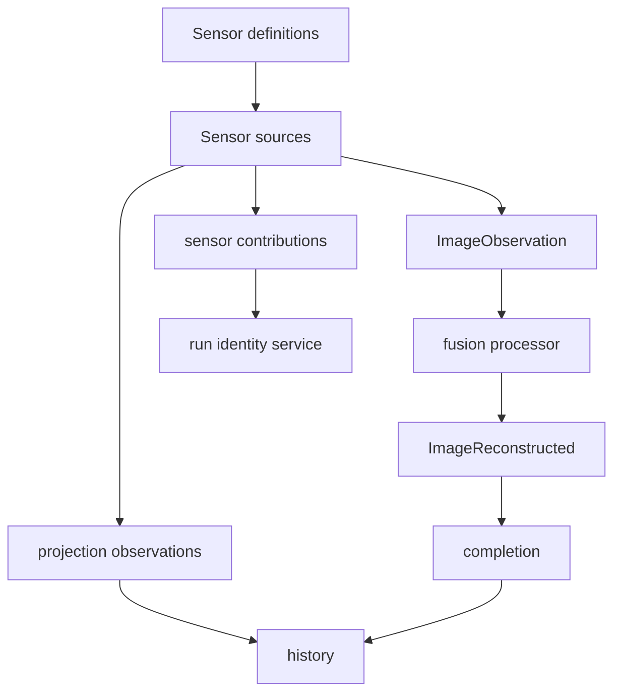

Completed work can then be interpreted through independent request/reply services:

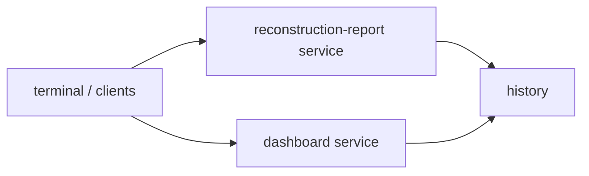

| Participant / boundary           | Primary input                           | Result or responsibility                                    |
| -------------------------------- | --------------------------------------- | ----------------------------------------------------------- |
| Sensor source                    | sensor definition + target              | projection, image observation, and contribution messages    |
| Fusion processor                 | `ImageObservation` + run closure        | intermediate reconstructed images and completion boundaries |
| Identity service                 | sensor contributions + run closure      | reusable Instrument identity and run correlation            |
| Reconstruction-report service    | completion request + shared history     | current detailed view of one completed reconstruction       |
| Dashboard service                | dashboard request + shared history      | current collection-level interpretation                     |
| Terminal / interactive workspace | public bus and request/reply interfaces | finite-lived control, exploration, and display              |

Several architectural consequences are now visible:

- The direct reconstruction example and the bus application use the same domain transformations in different compositions; messaging is not required merely to calculate an image.
- The fusion participant wraps prepared mathematics in an ordinary receive → derive → emit lifecycle, preserving the processor model established earlier.
- Sensor geometry and sensor family can change without requiring corresponding fusion changes when the downstream observation contract remains stable.
- A sensor definition can outlive any one run, while an attached source can contribute to several runs.
- Procedural construction scales participant topology without inventing a separate execution model for generated participants.
- Completion gives later consumers an explicit bounded result rather than asking them to infer which intermediate message happened to be last.
- Shared contribution history can retrospectively identify a reusable Instrument after an exploratory run closes.
- Another client can execute that Instrument without depending on the Python objects that originally assembled it.
- Sample depth, sensor count, bin resolution, sensor family, and target can be treated as separate experimental choices rather than being buried in one monolithic processing path.
- Controlled changes to measurement depth, bin geometry, and sensor coverage demonstrate how a stable architecture supports comparisons without hiding several experimental variables inside one processing path.
- Reports and dashboards are peer, replaceable current views over preserved evidence rather than owners of the sensing process or stages of one presentation pipeline.
- The same earlier reconstruction can produce a different current report after only the report service is changed and restarted.
- The same accumulated collection can produce a different dashboard after only the dashboard service is changed and restarted.
- Fusion, reconstruction-report, and dashboard participants demonstrate processor plurality through distinct message-facing responsibilities; the tutorial does not require an alternate reconstruction algorithm to make that architecture visible.

The image exercise therefore closes the extended sequence by combining several ideas from the earlier work: independent participants from Basic, event and representation boundaries from TTY, bounded derived computation from Graph, procedurally generated topologies, reusable experimental identities, and later history-backed interpretations over evidence that was produced for a different immediate purpose.

## Stop the image application when finished

In the long-running-process terminal, stop the independent presentation services if they are still running:

```sh
./image stop dashboard
./image stop report
```

Inspect the remaining background jobs if needed:

```sh
jobs
```

Stop the image application host:

```sh
kill -INT $(jobs -p)
```

The host's temporary runtime directory and session history are discarded when the application session ends.

# Messaging Architecture — Vocabulary from the Exercises

The exercises above used Ropemother to make messaging behavior concrete. This section has a different purpose: it names the **general messaging relationships** that appeared across Basic, TTY, Graph, and Image. The vocabulary here should still make sense if the same application were built with another message bus. Ropemother-specific classes and modules are summarized separately in the next section.

## Name the recurring relationships

| Exercise evidence                                         | Messaging vocabulary                         | Architectural point                                               |
| --------------------------------------------------------- | -------------------------------------------- | ----------------------------------------------------------------- |
| One Basic text event reached the counter and the display. | publish/subscribe, broadcast, fan-out        | One publication can reach multiple matching live subscribers.     |
| Processors published facts derived from earlier messages. | processor, derived event                     | A consumer can establish a new fact for later participants.       |
| Several TTY processors interpreted overlapping evidence.  | peer processors, correlation                 | Shared evidence can support independent derived facts.            |
| Graph path facts could lead to more graph path facts.     | feedback, convergence, duplicate suppression | Useful message networks can contain cycles and still terminate.   |
| Different sensor families produced `ImageObservation`.    | stable contract, heterogeneous producers     | Downstream code can depend on evidence rather than producer type. |
| Later services interpreted already recorded evidence.     | request/reply, history, later views          | Retained evidence can support participants introduced later.      |

An **event** in these exercises records something that has happened or been determined: text was submitted, a path is known, a sensor observed evidence, or a reconstruction completed. A **processor** consumes messages, performs ordinary computation, and may publish another event. A **message contract** is the stable boundary that lets those participants agree on what can be exchanged without holding direct references to one another.

In these exercises, Ropemother spells out that agreement through topic, producer, and message-type selectors plus a portable payload representation. Other messaging systems may express the contract differently. The broader architectural idea is simply that independently evolving participants agree on a message boundary rather than on one another's internal implementation.

## Do not turn every function call into a message

Messaging is useful at boundaries between participants that benefit from independent evolution, observation, substitution, lifetime, or deployment. It is not a replacement for ordinary program structure inside those participants.

The image exercises make this distinction especially visible. Projection, back-projection, fusion mathematics, rendering, and other domain operations remain ordinary function and object interactions where direct calls are clear. Messaging connects the independently useful roles around those calculations: sources publish observations, processors publish determinations, services answer requests, and later clients inspect retained evidence.

This gives a practical design question for future projects:

> Which parts need to change, run, restart, be replaced, or be observed independently enough that a message boundary earns its cost?

A useful boundary localizes those changes. A boundary added only because messaging is available can instead make a small program harder to follow.

## Distinguish message shape from deployment shape

A message boundary is first a **logical communication boundary**. It says that participants cooperate through messages rather than by directly invoking one another. The deployment can realize that relationship in several ways.

Basic used the same endpoint-facing participant code first with a direct in-process bus and later with a freestanding broker. In the second arrangement, the participants and broker lived in separate local processes and the messages crossed an IPC boundary. The logical relationship stayed recognizable even though the deployment changed.

Message-bus architectures can extend the same idea across runtimes, hosts, or systems when suitable transports and operating policies exist. The exercises demonstrate Ropemother's current local direct and local IPC cases; they do not imply that current Ropemother provides turnkey remote cross-system transport.

This distinction is useful when reading architecture diagrams. A diagram of publishers, processors, events, and services can describe who depends on which messages. A deployment diagram answers a different question: which processes, runtimes, hosts, or transports realize those relationships.

## Recognize broadcast and request/reply as different interactions

Most source and derived events in the exercises used **publish/subscribe**. A publisher establishes a fact without naming the individual consumers that may react to it. Zero, one, or many matching subscribers may receive the publication while they are live.

History and the image reporting services introduced **request/reply**. A client sends a request because it needs a corresponding result from a service. The interaction still uses message boundaries, but its shape is not broadcast fan-out: the reply belongs to the request that caused it.

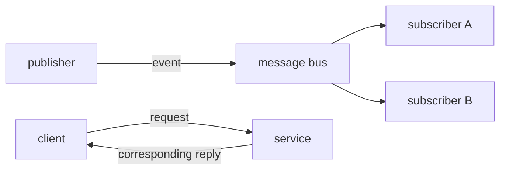

These are architectural interaction patterns. The next section names the Ropemother API objects that realize them in this tutorial.

## Treat history as preserved evidence, not delayed subscription

A live subscriber reacts to matching publications that arrive while that subscription exists. Restarting the Basic display did not make earlier broadcasts arrive again. The history service answered a different question by reading evidence that had already been captured.

That difference matters architecturally. Preserved history can support a processor or service that did not exist when the original event occurred, can let a restarted participant reconstruct useful state, and can support a new interpretation of old evidence. The dashboard and reconstruction-report changes in Image relied on exactly this property: the sensing work did not have to be repeated merely because a current view changed.

History therefore changes the **time relationship** between participants. It does not make every live subscription durable, and a history query is not the same operation as receiving the next publication.

## Read the exercise sequence as increasingly rich network shapes

The examples were chosen to expose different consequences rather than to repeat the same publish/subscribe demonstration:

- **Basic** establishes the core boundary, fan-out, process separation, and the difference between live delivery and retained history.
- **TTY** shows several peer interpretations of common evidence and the importance of choosing useful source and derived-event boundaries.
- **Graph** shows feedback, incremental derivation, nondeterministic processing order, and convergence to a bounded result.
- **Image** combines heterogeneous producers, procedurally generated participants, explicit completion, reusable identities, shared history, and replaceable request/reply interpretations.

Those shapes are more important than any one toy problem. They are reusable ways to reason about software in which new analyses, views, processors, or services are expected to appear over time.

# Ropemother API — Application-Facing Map

The preceding section was about messaging architecture in general. This section is specifically about **the current Ropemother API used or encountered by these exercises**. Its purpose is navigation: connect the concrete class and module names to the operations already practiced without turning implementation machinery into participant-facing vocabulary.

## Start from the endpoint-facing abstraction

The central application-facing abstraction is `MessageEndpointFactory`. Participant code that needs messaging can ask this surface for endpoints and request/reply helpers without requiring a particular deployment.

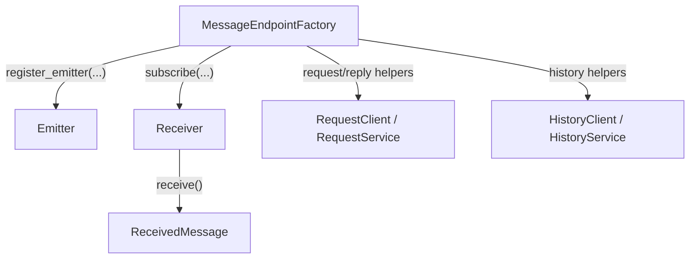

The Basic exercise deliberately introduced only the smallest part first: `register_emitter()`, `subscribe()`, `Emitter.emit()`, `Receiver.receive()`, and `ReceivedMessage`. Request/reply and history became relevant only after the exercises had a reason to need a corresponding response or retained evidence.

`MessageEndpointFactory` is therefore a Ropemother API abstraction, not the definition of a message bus as an architectural idea.

## Use the same participant surface in different local deployments

The exercises obtain that endpoint-facing capability in two important ways:

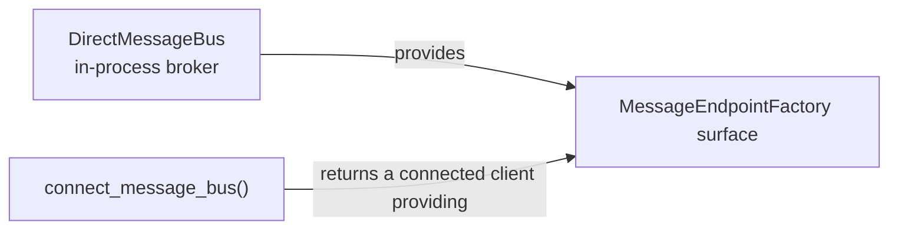

`DirectMessageBus` is convenient when the broker and application participants share one Python process. `connect_message_bus()` connects an application process to the freestanding local broker and returns a client that provides the same endpoint-facing abstraction.

This is why participant classes such as `TextSource` and `WordCountProcessor` accept `MessageEndpointFactory`: their ordinary publish/subscribe behavior does not need to know whether the underlying messages are delivered by the direct in-process broker or through the local broker transport.

That is an API design fact about Ropemother. The architectural lesson from the earlier section is the more general one: a stable communication boundary can let deployment change without forcing every participant to change with it.

## Map the public modules used by the tutorial

These are the major public areas that appear in or support the tutorial. This is a navigation map, not a new import-style rule:

| Public surface       | Role in the tutorial                                                       |
| -------------------- | -------------------------------------------------------------------------- |
| `ropemother`         | Common entry points: direct bus, capture mode, and connection helpers.     |
| `ropemother.client`  | Endpoint-factory and request/reply abstractions.                           |
| `ropemother.broker`  | Publish/subscribe endpoint interfaces and direct-broker types.             |
| `ropemother.service` | Freestanding-broker connection, hosting, and prepared service composition. |
| `ropemother.capture` | History and capture-facing models and services.                            |
| `ropemother.message` | Readable received-message values and message-selection helpers.            |
| `ropemother.format`  | Portable payload-format definitions and registries.                        |

Not every application needs to import from every module. The early Basic path intentionally stays on the small endpoint-facing surface. TTY opens more of the service and history composition because that exercise has a reason to inspect those boundaries. The prepared Image application then hides much of that repeated setup behind application-specific helpers so the exercise can concentrate on plurality, experimental configuration, and replaceable interpretations rather than reteaching broker wiring.

## Map the operations you practiced to Ropemother names

| Operation                                | Ropemother surface                                 | First reason it mattered       |
| ---------------------------------------- | -------------------------------------------------- | ------------------------------ |
| Publish under a message contract         | `register_emitter()` → `Emitter.emit()`            | Basic source publication       |
| Receive matching live publications       | `subscribe()` → `Receiver.receive()`               | Basic receive and processors   |
| Inspect the readable envelope            | `ReceivedMessage`                                  | Basic message inspection       |
| Abstract over local deployment           | `MessageEndpointFactory`                           | Reusable participant classes   |
| Use the direct in-process broker         | `DirectMessageBus`                                 | First Basic exchange           |
| Connect to the freestanding local broker | `connect_message_bus()`                            | Independent Basic processes    |
| Query retained messages                  | `preconfigured_history_client()` → `HistoryClient` | Basic history query            |
| Host or compose broker-side services     | `ropemother.service` helpers and extensions        | TTY service composition        |
| Define portable payload representation   | `PortableFormat` and related format support        | Prepared application contracts |

The table is not intended to be a complete API reference. It names the parts that help explain code participants have already seen.

## Keep implementation machinery out of the ordinary participant path

Ropemother contains lower-level machinery for compact IDs, registrations, transport frames, broker sessions, capture records, and other implementation or extension concerns. Those concepts may matter when developing Ropemother itself or adding a new transport, but they are not prerequisites for ordinary application messaging and are deliberately absent from the participant path.

Portable formats are a different case. Defining or selecting a portable payload representation can be a legitimate application-level extension when an application introduces a new message contract. The exercises provide most formats in advance so participants can concentrate on architectural consequences rather than serialization mechanics, but the format surface remains part of the public model rather than hidden broker bookkeeping.

Ropemother also exposes additional request/reply conveniences, including procedure-oriented helpers. These exercises do not use them, so this overview does not introduce their API merely for completeness. A tutorial map should make the practiced surface easier to navigate, not become an inventory of every exported class.

The useful separation is therefore:

- use **messaging vocabulary** to reason about application relationships that should generalize beyond Ropemother;
- use **Ropemother API names** when reading, writing, or navigating concrete tutorial code;
- descend into **Ropemother implementation and extension machinery** only when the task is actually to extend the bus itself.
