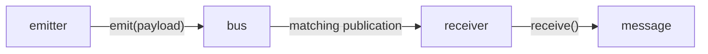
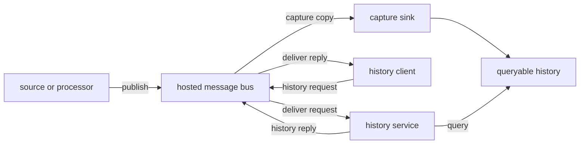
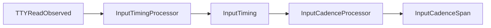
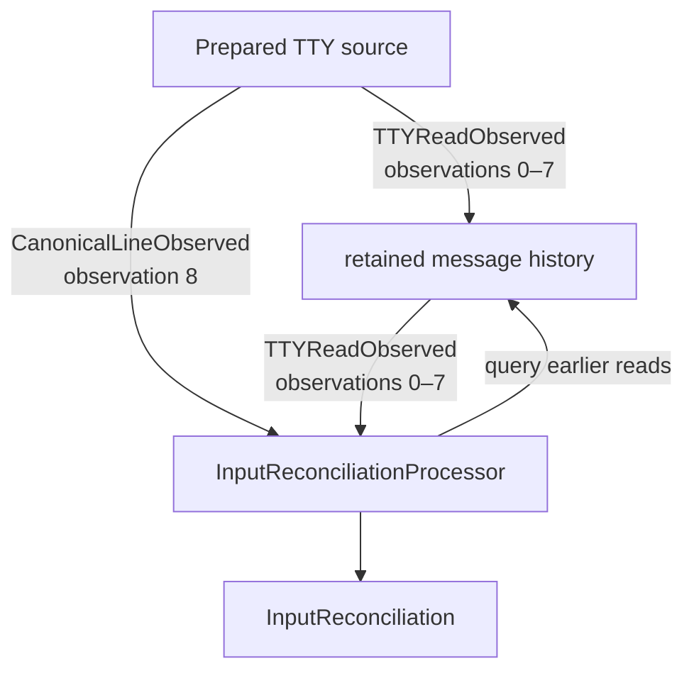
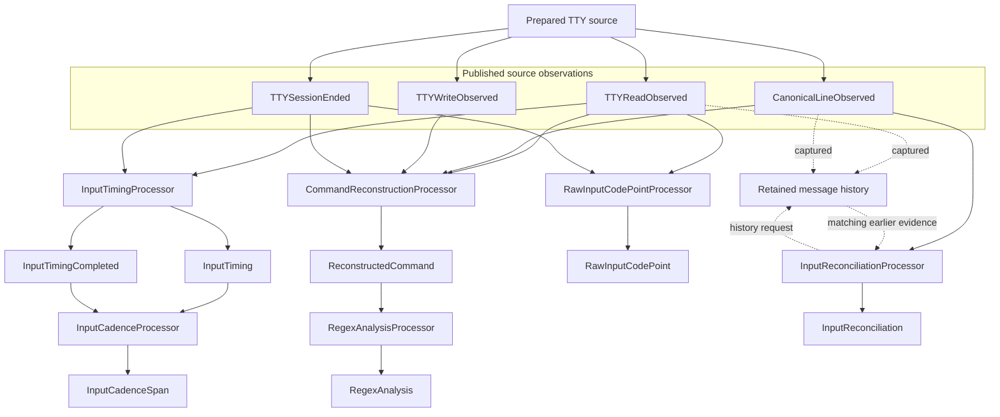
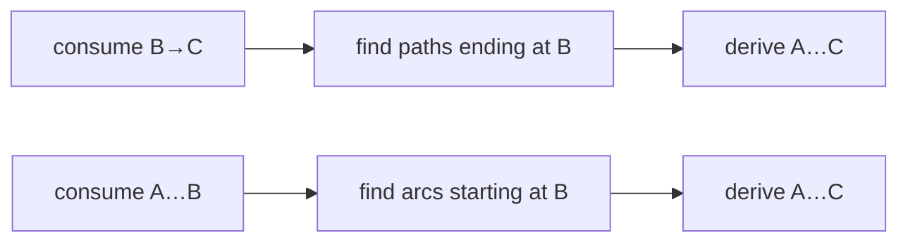
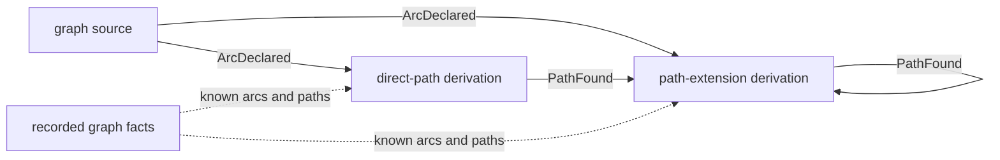

# Ropemother exercises

## Before you begin

These are hands-on exercises with the `ropemother` Python package. You will begin by operating a prepared image-reconstruction application, then work with smaller examples in which you send, receive, and process messages yourself.

### Prerequisites

You should be comfortable with:

- running a Python script or module from a terminal;
- reading ordinary Python assignment, function and method calls, keyword arguments, simple loops, and attribute access;
- opening an existing Python file in an editor, making a small change, saving it, and running the program again; and
- switching between terminal windows or tabs.

### Contents

- I. [Introduction: Image Reconstruction](#i-introduction-image-reconstruction)
- II. [Basic Messaging](#ii-basic-messaging)
- III. [TTY Processing](#iii-tty-processing)
- IV. [Graph Reachability](#iv-graph-reachability)
- V. [Image Reconstruction](#v-image-reconstruction)
- VI. [Messaging Architecture](#vi-messaging-architecture)

### Repository and Python

Open a terminal in the top-level `ropemother-exercises` directory. You should see files and directories like these:

```text
ropemother-exercises/
├── EXERCISES.md
├── README.md
├── image
├── pyproject.toml
└── ropemother_exercises/
```

Unless an exercise says otherwise, run its commands from this directory.

The exercises require Python 3.13 or newer. Check the version used by your `python` command:

```sh
python --version
```

If `ropemother` is not already installed, install it with:

```sh
pip install ropemother
```

The `ropemother_exercises` package runs directly from this repository and does not need to be installed. The shell commands in these exercises use a POSIX-style shell such as `bash` or `zsh`.

[README.md](README.md) contains fuller repository setup and project information. The instructions here contain the setup needed to begin the introductory activity.

### What you will do

The opening activity uses a prepared image-reconstruction application. It simulates partial observations of a hidden black-and-white image and combines them into an estimate you can inspect. You will run the application, add new sensor measurements, and see how the reconstruction changes.

The following section moves to a much smaller text-processing program. There you will send and receive simple messages yourself and connect small pieces of processing through `ropemother`.

The TTY processing exercises use one recorded terminal interaction to derive several different kinds of information. The graph reachability exercises use messages to explore work that can create more work and still finish reliably. Later, you return to image reconstruction and work with different sensor arrangements and reporting behavior. The final section compares the examples and names the software-design relationships they share.

## I. Introduction: Image Reconstruction

The concealed target in this exercise is a small black-and-white bitmap. A simulated sensor samples the target from one viewing direction, but a measurement from one direction does not reveal the bitmap completely. Measurements from several directions provide different pieces of evidence about which parts of the image are filled.

> A **reconstruction** is the application's current estimate of the concealed image, formed from the sensor measurements collected so far.

This is a small example of a broader kind of problem: producing a useful result from partial or imperfect evidence. The application also separates sensor input, reconstruction, and reporting, so later changes can show which parts of the program must change together and which can remain unchanged.

Open two terminal windows or tabs.

- Use the **application terminal** for the host and reporting services that remain running, and for the short `./image` commands used later.
- Use the **workspace terminal** for the interactive Python session used to make sensor measurements.

### 1. Start the image application

The image application makes three related roles visible at startup. The **host** is the long-running program that starts the application's message-bus broker and its core reconstruction services. The **broker** accepts published messages and delivers them to matching subscribers. A **service** is a long-running application participant that performs one job while communicating through that broker.

> A **message bus** is a shared communication path through which parts of an application exchange messages without requiring senders to call their recipients directly.

The reconstruction-report and dashboard services are deliberately started separately from the host. Either reporting service can therefore be stopped and restarted while the host, broker, and reconstruction services remain in place.

In the application terminal, start the host in the background. The host prints its readiness message and a complete export command:

```console
$ python -m ropemother_exercises.image.application.host &
Image application host is ready. Make sure to run the independent services separately.
export ROPEMOTHER_CONNECTION_DESCRIPTOR='ropemother+unix:///...'
```

The trailing `&` leaves the host process running in the background and returns the shell prompt. The module path names that role directly: `application.host` starts the application host. Wait for the host's readiness message, `Image application host is ready. Make sure to run the independent services separately.`

The following line contains a **connection descriptor**, the address-like value another process uses to connect to this running application. Run the complete `export ROPEMOTHER_CONNECTION_DESCRIPTOR=...` command printed by the host so programs started from this shell can use that connection.

Start the two reporting services. Each `service.*` module starts one independently running application service:

```sh
python -m ropemother_exercises.image.service.report &
python -m ropemother_exercises.image.service.dashboard &
```

Wait until both services have printed `Reconstruction report service is ready.` and `Dashboard report service is ready.` The two services run independently, so those messages may appear in either order.

Leave these processes running and switch to the workspace terminal.

Run the same complete `export ROPEMOTHER_CONNECTION_DESCRIPTOR=...` command in the workspace terminal. Each terminal has its own shell, so the descriptor must also be available there before starting a program that connects to the application.

### 2. Open the interactive image workspace

The interactive workspace provides the sensing side of the running application: it prepares two sensor sources, starts a reconstruction run, and leaves the Python prompt connected so additional measurements can be made.

In the workspace terminal, start the prepared workspace:

```sh
python -i -m ropemother_exercises.image.workspace
```

The `-i` option runs the workspace setup and then leaves the Python interpreter open at a `>>>` prompt. The setup prepares sensors at 0° and 90°, orthogonal (or perpendicular) directions, and makes one measurement with each. The image printed before the prompt is the reconstruction from those two sensor views.

> A **run** is one reconstruction attempt built from a group of sensor measurements.

The prepared run remains open when the `>>>` prompt appears, so further measurements join the same reconstruction attempt.

The workspace is connected to the same message bus as the services started above. Its `bus` object represents that connection and is used when new sensor sources join the running application. The next section examines those messaging relationships directly.

Leave the interpreter open. At any point, `show_workspace()` lists the prepared objects and helpers available at the prompt:

```pycon
>>> show_workspace()
```

### 3. Add a 45° sensor

The workspace already has `bus`, the connection this interpreter uses to join the running application's message bus. Passing that connection to `sensor.attach(bus)` connects a sensor to the same application.

`AngularSensor` describes a sensor's direction and measurement settings. Calling `attach(bus)` combines that sensor definition with the bus connection and returns a **sensor source** through which measurements can be made and sent to the application.

Each measurement produces sensor data called an **observation**. The sensor source sends that observation to the application.

The prepared 0° and 90° sensors use `frame.width` for `edge_bin_count` and `samples_per_sensor` for `sample_count`. Use those same values for the 45° sensor so that the viewing direction changes while the edge resolution and number of samples remain the same. The supplied `seed` makes the simulated sampling repeatable.

At the `>>>` prompt, create and attach a 45° sensor:

```python
sensor_45 = AngularSensor(
    sensor_name="sensor-45",
    angle_degrees=45.0,
    edge_bin_count=frame.width,
    sample_count=samples_per_sensor,
)
sensor_45_source = sensor_45.attach(bus)
```

Make one measurement:

```pycon
>>> sensor_45_source.measure(
...     target=target,
...     observation_id="45-degrees",
...     seed=13,
... )
```

The sensor source measures the concealed target using the 45° sensor settings and sends the resulting observation through the message bus. The reconstruction processor is already receiving sensor observations there, so the new evidence contributes to the open reconstruction run.

The prepared `run_receiver` waits for reconstruction results from the `geometric-fusion` processor. Receive the next result and inspect the three labels attached to its message:

```pycon
>>> message = run_receiver.receive()
>>> message.msg_topic
'image.reconstruction'
>>> message.msg_producer
'geometric-fusion'
>>> message.msg_type
'image-reconstructed'
```

For this message, the **topic** `image.reconstruction` groups it with reconstruction traffic, the **producer** `geometric-fusion` identifies the processor that sent it, and the **message type** `image-reconstructed` identifies it as an updated reconstruction. Those are the values `run_receiver` uses to wait for this reconstruction traffic rather than unrelated application messages.

The reconstruction result is carried as the message's **payload**:

```pycon
>>> reconstruction = message.payload
>>> print(render_intensity_image(reconstruction.intensity_image, frame))
```

At this point, the useful distinction is concrete: the topic, producer, and message type identify the reconstruction message that arrived, while the payload contains the reconstruction itself.

Adding the 45° measurement changed the sensing side of the running application: another sensor definition and source were added, and another observation entered the run. The reconstruction processor was neither edited nor restarted. It was already receiving this kind of observation through the message bus, so accepting evidence from the new sensor did not require a corresponding change to the reconstruction code.

### 4. Add the other diagonal

Apply the same sensor settings at 135°:

```python
sensor_135 = AngularSensor(
    sensor_name="sensor-135",
    angle_degrees=135.0,
    edge_bin_count=frame.width,
    sample_count=samples_per_sensor,
)
sensor_135_source = sensor_135.attach(bus)

sensor_135_source.measure(
    target=target,
    observation_id="135-degrees",
    seed=14,
)
message = run_receiver.receive()
reconstruction = message.payload
print(render_intensity_image(reconstruction.intensity_image, frame))
```

The open run now contains observations from 0°, 45°, 90°, and 135°. The 135° source participates in the same way as the 45° source: it sends another sensor observation through the message bus, and the unchanged reconstruction processor incorporates that observation into another reconstruction.

### 5. Complete the four-angle run

The application has produced an updated reconstruction after each measurement, but the most recent result *so far* is not automatically the final one. A pause in arriving messages does not prove that no more measurements will be sent.

Tell the application explicitly that no more sensor input belongs to this run, then wait for the corresponding completion message:

```pycon
>>> close_run_input(bus)
>>> message = run_receiver.receive()
>>> message.msg_type
'reconstruction-completed'
>>> completion = message.payload
```

`close_run_input(bus)` establishes the end of the run's input. The `'reconstruction-completed'` message then identifies the reconstruction that belongs to that finished run. This explicit end matters whenever later work needs to distinguish “nothing else has arrived yet” from “nothing else belongs to this activity.” Later exercises return to that distinction in other problem domains.

### 6. Ask the report service about the completed run

The workspace already has `report_client`, a prepared object for making requests to the reconstruction-report service. Request a report for the completed run:

```pycon
>>> reply = report_client.call(completion)
>>> reply.msg_type
'reconstruction-report'
>>> four_angle_report = reply.payload
>>> print(four_angle_report.rendering)
```

Here `call()` sends the completed-run information to the reporting service and waits for the corresponding answer. The reply payload is the completed reconstruction report.

The report includes the completed run and a rendering of its reconstruction. For example, it can begin with `Run: trial-1` and `Reconstruction: reconstruction-...`, followed by the reconstructed image.

`trial-1` is the application's identifier for this particular run. The exact reconstruction identifier and rendered pixels vary with the prepared target.

### 7. Prepare four additional sensor angles

The first completed run used four viewing directions: 0°, 45°, 90°, and 135°. The second run will keep those directions and add the four directions between them, giving eight evenly spaced views. The comparison uses the same sensor measurement settings while gathering observations from a broader set of directions. Repeating the same construction and attachment pattern for four more sensors also makes a practical question visible: how much of that routine messaging setup has to be written out individually?

The image exercise provides `ruler_angle_group()` for calculating these regularly spaced viewing directions. The groups used so far follow this pattern:

|  `N` | `ruler_fraction_group(N)` | `ruler_angle_group(N)`       |
| ---: | ------------------------- | ---------------------------- |
|  `0` | `(0,)`                    | `(0.0,)`                     |
|  `1` | `(1/2,)`                  | `(90.0,)`                    |
|  `2` | `(1/4, 3/4)`              | `(45.0, 135.0)`              |
|  `3` | `(1/8, 3/8, 5/8, 7/8)`    | `(22.5, 67.5, 112.5, 157.5)` |

Groups 0 through 2 together supply the four viewing directions used in the first run. Group 3 supplies the four directions between those existing views: 22.5°, 67.5°, 112.5°, and 157.5°. Combining groups 0 through 3 gives eight evenly spaced viewing directions.

The fraction column shows how the angle values are derived: `ruler_angle_group(N)` multiplies the fractions from `ruler_fraction_group(N)` by 180°.

Use the eighths group for the four additional sensors:

```python
eighths_angle_group = ruler_angle_group(3)
```

The 45° and 135° sensors were constructed individually even though they shared the same measurement settings. The four additional sensors have the same repeated shape, so `angular_sensors_for_angles()` can construct the group from the angles and shared settings.

```python
additional_sensors = angular_sensors_for_angles(
    sensor_name_prefix="additional-angle",
    angles_degrees=eighths_angle_group,
    edge_bin_count=frame.width,
    sample_count=samples_per_sensor,
)

additional_sources = []
for sensor in additional_sensors:
    additional_sources.append(sensor.attach(bus))
```

`angular_sensors_for_angles()` is image-application support code rather than part of the `ropemother` messaging API. It packages the repeated construction of ordinary `AngularSensor` objects. The loop then applies the same `sensor.attach(bus)` operation used for the earlier sensors to each member of the new group.

Message-based applications commonly provide this kind of support for repeated participant setup. Helpers and ordinary application code can construct and connect groups of participants without changing the messaging relationships those participants use.

### 8. Reuse the existing sources in an eight-angle run

The four sensor sources used in the first run are still attached to the bus, and the previous step attached four more. The second run can use all eight sources together without replacing or reconfiguring the original four. Collect the existing and additional sources into one tuple:

```python
eight_angle_sources = (
    sensor_0_source,
    sensor_45_source,
    sensor_90_source,
    sensor_135_source,
    *additional_sources,
)
```

Every object in `eight_angle_sources` provides the same `measure()` operation. Instead of writing eight separate measurement calls, use an ordinary Python loop to trigger each source in turn:

```python
sensor_number = 1

for sensor_source in eight_angle_sources:
    sensor_source.measure(
        target=target,
        observation_id=f"eight-angle-{sensor_number}",
        seed=20 + sensor_number,
    )
    sensor_number += 1
```

The loop is ordinary application code; each `measure()` call still causes that sensor source to send its observation through the messaging connection it already has. Once all eight observations have been sent, close the run input just as in the four-angle run.

The reconstruction processor may already have published intermediate reconstruction updates for some of those measurements. Receive messages until the explicit completion message arrives, then request the report for that completed run.

```python
close_run_input(bus)

message = run_receiver.receive()
while message.msg_type != "reconstruction-completed":
    message = run_receiver.receive()

completion = message.payload
eight_angle_report = report_client.call(completion).payload
```

The receive loop accounts for any reconstruction updates that arrive before completion. When it reaches `'reconstruction-completed'`, `message.payload` identifies the finished run, and `report_client.call(completion)` requests its completed reconstruction report.

**Compare the completed reconstructions**

Display both completed reports together:

```python
print("Four-angle run")
print(four_angle_report.rendering)
print()
print("Eight-angle run")
print(eight_angle_report.rendering)
```

The first report used four viewing directions; the second used eight. The edge resolution and number of samples per sensor stayed the same, so the main experimental change is the additional viewing directions. Compare corresponding parts of the two renderings and look for places where the added views change the reconstructed shape or intensity.

The second run reused the four sensor sources that were already attached and added four more alongside them. The reconstruction processor continued receiving the same kind of sensor-observation messages, so adding sources did not require a corresponding change to the reconstruction processor. The helper and loops reduced repeated setup and triggering; they did not change how those sources communicate with reconstruction.

### 9. Inspect the completed work from another client

Leave the Python interpreter open in the workspace terminal. No further command is needed there for this comparison; switch to the application terminal.

Earlier, `report_client` was a prepared client object inside the workspace interpreter. The repository also provides `./image`, a standalone command-line client for the same running image application. Each invocation starts a new Python program, connects to the application, performs one requested operation, prints the result, and exits. That new process does not share the variables or Python objects in the workspace interpreter.

The workspace created both completed reconstruction runs. Now ask the running application for that completed work from a process that did not create either run. Run the combined report command:

```console
$ ./image report
```

The command prints the individual completed reconstruction reports followed by a dashboard that summarizes the collection. Both completed runs from the workspace are available even though this `./image` process started after the runs had finished.

This is a small example of independently started clients interacting with the same running services through messaging rather than through shared Python objects. The workspace and `./image` do not share local program state; they can still reach the same application and work with the same completed activity.

The combined `report` command is composed of reports on individual reconstructions and a dashboard that helps navigate and summarize the collection. The same pieces can also be requested separately:

```console
$ ./image report trial-1
$ ./image reports
$ ./image dashboard
```

`report trial-1` asks for the report for one completed run, `reports` asks for the individual reconstruction reports, and `dashboard` asks for the summary of the collection. Each command again starts a fresh client process, prints its result, and exits.

The completed work remains available to these later clients because the running application retained the relevant message activity.

> **History** is a retained record of earlier messages that connected parts of an application can query later.

The image host provides the history service for this application. The reporting services can use retained messages about the completed runs and reconstructions when a new client asks for a report. The results are therefore not stored in the local variables of the workspace that made the measurements, and viewing them again does not require repeating those measurements.

For this exercise, that history lasts for the lifetime of the image application host. It is kept in memory rather than saved as persistent run data on the filesystem, so stopping the host clears it. That lifetime is a choice made by this exercise application's setup, not a general property of `ropemother`, message history, or message-based design.

### 10. Change and restart the dashboard

Suppose someone using the report wants the completed runs listed in the opposite order. That changes how the existing results are presented, not how the sensor measurements are made or how the reconstructions are computed. The next step changes only the dashboard and tests whether the rest of the application and its completed work can remain in place.

Open `ropemother_exercises/image/dashboard.py`. At lines 47–55, `render_dashboard()` asks `dashboard_entries()` for the completed reconstruction entries and passes them to `render_dashboard_index()`:

```python
def render_dashboard(history: HistoryClient) -> str:
    entries = dashboard_entries(
        history, reconstruction_producer="geometric-fusion"
    )

    if not entries:
        return "No reconstructions are available."

    return render_dashboard_index(*entries)
```

The final line passes the entries in their current order. Change only that call so `render_dashboard_index()` receives `reversed(entries)` instead.

After the edit, lines 47–55 should read:

```python
def render_dashboard(history: HistoryClient) -> str:
    entries = dashboard_entries(
        history, reconstruction_producer="geometric-fusion"
    )

    if not entries:
        return "No reconstructions are available."

    return render_dashboard_index(*reversed(entries))
```

Save the file. The dashboard service that is already running does not automatically reload Python source after the file changes; it is still executing the code it loaded when it started. Restart that service so the edited function becomes part of the running application.

In the application terminal, stop only the dashboard service:

```console
$ ./image stop dashboard
dashboard service stopped.
```

The image host and reconstruction-report service remain running. The history service is provided by the host, so stopping the dashboard does not remove the messages that describe the earlier completed runs.

Start the dashboard service again and wait for its readiness line:

```console
$ python -m ropemother_exercises.image.service.dashboard &
Dashboard report service is ready.
```

Request the dashboard again:

```sh
./image dashboard
```

The dashboard now lists the same completed runs in the opposite order. No new sensor measurement or reconstruction was needed. The restarted dashboard queried the retained application history and applied the new ordering rule to work that had already been completed; preserving that work did not depend on the previous dashboard process remaining alive.

### 11. Open Exploration

The required route is complete. The running application can now be used for further reconstruction or reporting experiments. These are useful starting points:

- In the still-open workspace, reuse the attached sensor sources for another reconstruction, or construct another `AngularSensor` while varying `angle_degrees`, `edge_bin_count`, or `sample_count` to explore viewing direction, projection resolution, or measurement depth.
- Make another change in `ropemother_exercises/image/dashboard.py`, then stop and restart only the dashboard service and request the dashboard again.
- Change the presentation of one reconstruction in `ropemother_exercises/image/report.py`, restart only the reconstruction-report service, and request an earlier run again.

For dashboard work, the same lifecycle remains:

```sh
./image stop dashboard
# edit ropemother_exercises/image/dashboard.py
python -m ropemother_exercises.image.service.dashboard &
./image dashboard
```

For reconstruction-report work:

```sh
./image stop report
# edit ropemother_exercises/image/report.py
python -m ropemother_exercises.image.service.report &
./image report trial-1
```

If the earlier interpreter was closed, re-enter the running application without starting another prepared 0°/90° run:

```sh
python -i -m ropemother_exercises.image.workspace -j
```

`-j`, or `--join-only`, reconnects the workspace and recreates its prepared sensor definitions and sources without measuring them. If the earlier workspace is still open, continue using it instead.

### 12. Review What the Exercise Showed

Before stopping the application, look back at what you observed:

- Adding 45° and 135° sensor sources did not require editing or restarting the reconstruction processor.
- The same attached sensor sources could be reused in another reconstruction run.
- Finishing a run required an explicit action rather than guessing that the most recent intermediate result was final.
- A separately started client could retrieve work that had been completed earlier.
- Restarting the dashboard did not erase the completed measurements or require the reconstruction to be repeated.
- Changing the dashboard changed the current report without changing the sensing or reconstruction work that had already happened.

**Vocabulary review**

- **Reconstruction:** an image estimate built from sensor measurements.
- **Run:** one reconstruction attempt.
- **Message bus:** the shared path for application messages.
- **History:** earlier messages retained for later queries.

During a run, sensor sources sent observations through the message bus and the reconstruction processor used that growing evidence to produce reconstructions. Closing the run explicitly distinguished an intermediate reconstruction from the result belonging to a finished attempt.

The later client and dashboard work used the same application without depending on the Python workspace that originally made the measurements. History kept the earlier messages available, so a new client could request completed work and a restarted dashboard could present that work differently. First the sensing setup changed while the reconstruction processor stayed in place; later, the presentation changed while the completed sensing and reconstruction work stayed in place.

The sensor helper illustrates another practical point about working with message-based applications. A message boundary does not mean that every participant must be constructed and connected by hand each time it is used. Once repeated setup has a clear shape, ordinary application helpers can construct and attach bus participants while the rest of the code works with operations such as adding another group of sensors. Mature message-based applications commonly provide this kind of support so that routine messaging setup does not dominate the application code.

The next section rebuilds these relationships in a much smaller program and gives the messaging operations more precise names.

### 13. Stop the local image application

Return to the application terminal, which contains the background application jobs.

Inspect them if needed:

```sh
jobs
```

After the entire image session is finished, stop the remaining jobs in that terminal:

```sh
kill -INT $(jobs -p)
```

`jobs -p` supplies the process IDs of the background jobs started in this terminal, and `kill -INT` asks those processes to stop as if they had been interrupted with Ctrl-C. Closing the terminal would normally also end its remaining background jobs, often after a warning from the terminal application; the explicit command is useful when you want to stop the application while keeping the terminal open.

## II. Basic Messaging

The introductory image activity used a working message-based application in which sensing, reconstruction, and reporting could change somewhat independently. This section narrows the view to a much smaller word-count program so the communication itself can be inspected: what one part publishes, what another part asks to receive, what the bus delivers, and which parts must know about one another in order to cooperate.

The example focuses on specific roles and concepts used in message-based applications: publication and subscription, retained history, and request/reply communication. It begins with one small live exchange and then uses the same ideas in separately started programs.

The recurring design question is **when should one part call another directly, and when is it useful for them to communicate through a message boundary?**

### 1. Direct Calls and Message Boundaries

Programming is often introduced through direct calls. In a call such as `count_words(text)`, the caller names the specific function, supplies the text, and receives the result when the function returns. This is a straightforward relationship when the caller already knows which local operation should perform the work.

A message boundary is useful for a different relationship: one part has information to announce, while one or more other parts may need to react without the publisher naming and calling each of them. A **publisher** sends a message. A **subscriber** asks for messages matching a description. A **broker** accepts publications and delivers matching messages to subscribers.

> **Publish.** Send a message without naming a particular receiver.
>
> **Subscribe.** Ask to receive messages matching a particular description.
>
> **Broker.** The part of a message bus that accepts publications and delivers matching messages to subscribers.

The word-count example uses three broader participant roles. A **source** introduces application facts by publishing them. A **processor** consumes information, derives another result, and may publish that result. A **sink** consumes messages to produce an effect outside the messaging relationship, such as displaying or writing a result. **Participant** is the general term for an application part taking part in one of these relationships; one participant can play more than one role.

A message bus does not remove the need for agreement between parts of the application. The publisher and subscriber still need to agree on how the relevant messages are described and what their payloads mean. What changes is the need to know a particular counterpart: the publisher does not need a reference to each subscriber, and a subscriber does not need to know how the publisher is implemented.

That separation can help when several independent consumers need the same information, when one participant may be replaced while preserving the shared message agreement, or when participants need to run as separately started programs. Retained history can also make earlier publications available to a client that starts later. These are reasons to choose a message boundary in particular relationships, not reasons to replace ordinary calls everywhere.

Direct calls remain useful inside message-based participants. In this word-count program, submitted text will cross a message boundary, while the actual word-count calculation remains an ordinary local function call. The exercise uses both relationships so each can do the simpler job.

In this section, a source will publish submitted text, a word-count processor will derive and publish a count, and a display will consume the count as a sink. The source does not need to call the processor or display directly, and the processor does not need to know which display eventually uses its result.

A messaging relationship describes what information participants exchange, not necessarily where they run. The first exchange in this section uses `DirectMessageBus` within one Python process. Later, separately started programs use a freestanding broker and local **IPC** (inter-process communication); IPC is the transport across that process boundary. Where the participants run is a **deployment** choice, while the messaging relationship describes their communication.

### 2. Publish and receive one message

Before adding application classes, walk through one message exchange with `ropemother` directly. The exchange shows both sides of publish/subscribe: what a subscription asks to receive, what an emitter publishes, and what a receiver returns after delivery.

Open `ropemother_exercises/basic/events.py`. Lines 16–18 define the submitted-text message description:

```python
TEXT_MSG_TOPIC: typing.Final[str] = "demo.basic.text"
SOURCE_MSG_PRODUCER: typing.Final[str] = "text-source"
TEXT_SUBMITTED_MSG_TYPE: typing.Final[str] = "text-submitted"
```

In this exercise, the **topic** groups related message activity, the **producer** identifies the publishing participant, and the **message type** identifies the kind of publication. Publishers and subscribers use these same values when they describe submitted-text messages.

Start an interactive Python interpreter from the repository root. Keep it open through this exchange and the `TextSource` check that follows:

```console
$ python
```

At the `>>>` prompt, import the direct bus and the submitted-text constants:

```python
from ropemother import CaptureMode, DirectMessageBus
from ropemother_exercises.basic.events import (
    SOURCE_MSG_PRODUCER,
    TEXT_MSG_TOPIC,
    TEXT_SUBMITTED_MSG_TYPE,
)
```

Create an in-process bus, a receiver subscribed to submitted-text messages, and an emitter configured to publish the same kind of message:

```python
bus = DirectMessageBus(
    capture_mode=CaptureMode.TRANSPORT_ONLY,
)
receiver = bus.subscribe(
    msg_topic=TEXT_MSG_TOPIC,
    msg_producer=SOURCE_MSG_PRODUCER,
    msg_type=TEXT_SUBMITTED_MSG_TYPE,
)
emitter = bus.register_emitter(
    msg_topic=TEXT_MSG_TOPIC,
    msg_producer=SOURCE_MSG_PRODUCER,
    msg_type=TEXT_SUBMITTED_MSG_TYPE,
)
```

`DirectMessageBus` delivers messages among endpoints in this Python process. This temporary exchange only needs live delivery, so `CaptureMode.TRANSPORT_ONLY` leaves publication and delivery active without retaining the messages for later history queries. `ropemother` calls that recording of published messages **capture**.

The call to `subscribe()` describes the publications the receiver wants: messages on `demo.basic.text`, published by `text-source`, with message type `text-submitted`. The producer argument describes the publisher whose messages should match the subscription; it does not name the receiver. `register_emitter()` configures the publishing side with the same three values.

Publish one string, receive the matching publication, and inspect the resulting message:

```pycon
>>> emitter.emit("foo bar baz")
>>> message = receiver.receive()
>>> message.msg_topic
'demo.basic.text'
>>> message.msg_producer
'text-source'
>>> message.msg_type
'text-submitted'
>>> message.payload
'foo bar baz'
```

`emitter.emit(...)` publishes the payload without naming `receiver`. The bus delivers that publication because its description matches the subscription. `receiver.receive()` returns a `ReceivedMessage`: `msg_topic`, `msg_producer`, and `msg_type` describe the publication, while `payload` contains the application value that was sent.

The emitter and receiver therefore agree on more than the Python string. They agree on how a submitted-text publication is described and what its payload means.

> **Message contract.** A message contract is the agreement participants rely on when exchanging a particular kind of message. Here the submitted-text contract uses topic `demo.basic.text`, producer `text-source`, message type `text-submitted`, and a text payload.

This is a **publish/subscribe** relationship: the emitter publishes without naming a particular receiver, the receiver has subscribed to the description it wants, and the bus delivers the matching publication. Later in this section, request/reply introduces a different relationship for asking a service for an answer.

The calls and delivery can be summarized as:



`Emitter` and `Receiver` are **message endpoints**: the objects application code uses to send and receive through the bus. The emitter publishes under its configured producer and message description; the receiver represents a subscription to matching publications. The diagram summarizes the exchange just performed rather than introducing a separate processing model.

The `bus` object created both endpoint types: `register_emitter()` created the emitter and `subscribe()` created the receiver. `ropemother` calls the capability that provides those endpoint-creation operations `MessageEndpointFactory`.

The participant classes introduced next accept `MessageEndpointFactory` rather than requiring `DirectMessageBus` specifically. A direct bus provides that capability here, and a client connected to the freestanding broker provides it later. The participant can therefore create the same endpoints in either arrangement without changing its messaging code.

The emitter did not call the receiver. Both sides described the same message contract, and the bus delivered the matching publication.

### 3. Create a submitted-text source

At the prompt, the temporary experiment published text by calling `emitter.emit(...)` directly. In the application, `TextSource` will own that publication responsibility. It creates the submitted-text emitter once and offers `emit_text(text)` as the source operation; code using the source does not need to repeat the topic, producer, and message-type setup each time it submits text. The message contract remains the same.

The interpreter now contains `bus`, `receiver`, and `emitter` from the manual exchange above. Keep that interpreter open. Create `ropemother_exercises/basic/source.py` with the following implementation, then return to the interpreter to continue the same experiment.

```python
#!/usr/bin/env python3
# ropemother_exercises/basic/source.py

"""Text source for the basic message-bus exercise."""

from ropemother.broker import Emitter
from ropemother.client import MessageEndpointFactory

from ropemother_exercises.basic.events import (
    SOURCE_MSG_PRODUCER,
    TEXT_MSG_TOPIC,
    TEXT_SUBMITTED_MSG_TYPE,
)

__author__ = "Joe Granville"
__email__ = "874605+jwgranville@users.noreply.github.com"
__date__ = "2026-07-18T19:00:50+00:00"
__license__ = "MIT"
__version__ = "0.1.0.dev1"
__status__ = "Prototype"


class TextSource:
    """Publish text submitted to the basic exercise system."""
    _emitter: Emitter

    def __init__(self, bus: MessageEndpointFactory) -> None:
        self._emitter = bus.register_emitter(
            msg_topic=TEXT_MSG_TOPIC,
            msg_producer=SOURCE_MSG_PRODUCER,
            msg_type=TEXT_SUBMITTED_MSG_TYPE,
        )

    def emit_text(self, text: str) -> None:
        self._emitter.emit(text)
```

`TextSource.__init__()` uses the supplied endpoint factory to register an emitter with the same submitted-text constants used in the manual check, then keeps that emitter in `_emitter`. `emit_text()` publishes the supplied string through that configured endpoint. The source contains no receiver reference and does not need to know which participants may subscribe to its publication.

Return to the interpreter and reuse the existing `bus` and `receiver`. Keeping them in place changes only the publishing side of the experiment: the receiver was already subscribed to the submitted-text contract before the new `TextSource` was created.

Import `TextSource`, create one with the existing bus, and submit another value:

```pycon
>>> from ropemother_exercises.basic.source import TextSource
>>> source = TextSource(bus)
>>> source.emit_text("qux quux corge grault")
>>> message = receiver.receive()
>>> message.msg_type
'text-submitted'
>>> message.payload
'qux quux corge grault'
```

`source = TextSource(bus)` registers a new emitter for the same submitted-text contract. `source.emit_text(...)` publishes `qux quux corge grault` through that emitter. The receiver that already existed before `TextSource` was created matches the publication and returns it from `receive()`. The observed `msg_type` and payload confirm that the new source published the same kind of message as the manual emitter did.

The important change is on the publishing side only. The first message came from the emitter used directly at the prompt; the second came from `TextSource`. The existing receiver needed no change because it depends on the submitted-text message agreement rather than on either publisher object. Code that has a `TextSource` can call `emit_text()` directly to ask that source to submit text, while the source publishes the resulting message without naming the consumers that will receive it.

### 4. Add a word-count processor

`TextSource` introduced a participant that publishes one message contract. The next participant uses both directions of the message API: `WordCountProcessor` subscribes to submitted-text messages and publishes a different word-count message after processing each one. The word-count calculation itself is an ordinary Python function; the message-bus work to notice here is receiving one contract and publishing another.

Create `ropemother_exercises/basic/processors.py` with:

```python
#!/usr/bin/env python3
# ropemother_exercises/basic/processors.py

"""Processors for the basic message-bus exercise."""

from ropemother.broker import Emitter, Receiver
from ropemother.client import MessageEndpointFactory

from ropemother_exercises.basic.events import (
    SOURCE_MSG_PRODUCER,
    TEXT_MSG_TOPIC,
    TEXT_SUBMITTED_MSG_TYPE,
    WORD_COUNT_MSG_TOPIC,
    WORD_COUNTER_MSG_PRODUCER,
    WORDS_COUNTED_MSG_TYPE,
)

__author__ = "Joe Granville"
__email__ = "874605+jwgranville@users.noreply.github.com"
__date__ = "2026-08-28T15:23:43+00:00"
__license__ = "MIT"
__version__ = "0.1.0.dev1"
__status__ = "Prototype"


class WordCountProcessor:
    """Count words in submitted text and publish the result."""
    _receiver: Receiver
    _emitter: Emitter

    def __init__(self, bus: MessageEndpointFactory) -> None:
        self._receiver = bus.subscribe(
            msg_topic=TEXT_MSG_TOPIC,
            msg_producer=SOURCE_MSG_PRODUCER,
            msg_type=TEXT_SUBMITTED_MSG_TYPE,
        )
        self._emitter = bus.register_emitter(
            msg_topic=WORD_COUNT_MSG_TOPIC,
            msg_producer=WORD_COUNTER_MSG_PRODUCER,
            msg_type=WORDS_COUNTED_MSG_TYPE,
        )

    def run(self) -> None:
        while True:
            message = self._receiver.receive()
            word_count = count_words(message.payload)
            self._emitter.emit(word_count)


def count_words(text: str) -> int:
    return len(text.split())
```

`WordCountProcessor.__init__()` creates two endpoints with different jobs. `_receiver` subscribes with `TEXT_MSG_TOPIC`, `SOURCE_MSG_PRODUCER`, and `TEXT_SUBMITTED_MSG_TYPE`, so it matches the same submitted-text contract that `TextSource` publishes. `_emitter` is registered with `WORD_COUNT_MSG_TOPIC`, `WORD_COUNTER_MSG_PRODUCER`, and `WORDS_COUNTED_MSG_TYPE`, which define a separate contract for the derived word-count result.

In `run()`, `_receiver.receive()` waits until a matching submitted-text message is delivered and returns that `ReceivedMessage`. The processor passes its text payload to the ordinary `count_words()` function. The resulting integer is then passed to `_emitter.emit()`, which publishes a word-count message. Receiving and publishing are message-bus operations; the calculation between them is local Python code.

`TextSource` and `WordCountProcessor` do not import or call one another. Their relationship is the submitted-text contract: `TextSource` publishes it, and `WordCountProcessor` subscribes to it. The processor therefore depends on that message agreement rather than on a particular `TextSource` object. Its word-count output is likewise available to any subscriber that matches the word-count contract.

At this point `WordCountProcessor` is defined in `processors.py`, but no processor instance is running. The interpreter still contains the temporary `DirectMessageBus`, receiver, emitter, and `TextSource` from the earlier checks. Exit the interpreter:

```pycon
>>> exit()
```

Exiting closes that temporary in-process bus and its endpoints. It does not stop a word-count processor, because none has been started yet. The next file will be the startup program that creates `WordCountProcessor` with a connection to the freestanding broker.

### 5. Create the freestanding processor runner

Create `ropemother_exercises/basic/run_processor.py` with:

```python
#!/usr/bin/env python3
# ropemother_exercises/basic/run_processor.py

"""Run the word-count processor through a freestanding message bus."""

from ropemother import connect_message_bus

from ropemother_exercises.basic.processors import WordCountProcessor

__author__ = "Joe Granville"
__email__ = "874605+jwgranville@users.noreply.github.com"
__date__ = "2026-08-28T15:57:26+00:00"
__license__ = "MIT"
__version__ = "0.1.0.dev1"
__status__ = "Prototype"


def run_word_counter() -> None:
    bus = connect_message_bus()

    try:
        processor = WordCountProcessor(bus)
        print("Word-count processor is ready.")
        processor.run()
    except KeyboardInterrupt:
        pass
    finally:
        bus.close()


if __name__ == "__main__":
    run_word_counter()
```

`run_word_counter()` supplies the application setup around the processor. `connect_message_bus()` connects to the broker identified by `ROPEMOTHER_CONNECTION_DESCRIPTOR`; the later run instructions will start that broker and provide its descriptor. Passing the resulting bus to `WordCountProcessor` gives the constructor the same endpoint-creation operations it used with `DirectMessageBus`.

After construction, the readiness message tells you that the processor has created its endpoints. `processor.run()` then remains in the receive/process/publish loop shown above until the program is interrupted. The `finally` block closes the bus connection when the runner stops.

The participant code and the startup code have different responsibilities. `WordCountProcessor` defines which message contracts it receives and publishes and what it does between them. `run_processor.py` decides how this program obtains a bus connection and keeps that participant running. Moving from the temporary in-interpreter bus to the freestanding broker changes this startup arrangement without requiring a different `WordCountProcessor`.

### 6. Create an independent display

The word-count processor is already one consumer of submitted-text messages. Add a display as a second consumer of those same messages. The display will also subscribe to the word-count messages produced by the processor, allowing it to show the original text beside the derived result.

Create `ropemother_exercises/basic/run_display.py`.

This file is longer than the source and processor runners, but its messaging structure has only two important parts to follow. Near the beginning of `display_word_counts()`, it creates one receiver for submitted text and another for word counts. The loop later receives from those two endpoints and prints their payloads. The display does not ask the source or processor to send anything specifically to it.

```python
#!/usr/bin/env python3
# ropemother_exercises/basic/run_display.py

"""Display submitted text events and their derived word counts."""

from ropemother import connect_message_bus

from ropemother_exercises.basic.events import (
    SOURCE_MSG_PRODUCER,
    TEXT_MSG_TOPIC,
    TEXT_SUBMITTED_MSG_TYPE,
    WORD_COUNT_MSG_TOPIC,
    WORD_COUNTER_MSG_PRODUCER,
    WORDS_COUNTED_MSG_TYPE,
)

__author__ = "Joe Granville"
__email__ = "874605+jwgranville@users.noreply.github.com"
__date__ = "2026-08-28T15:59:42+00:00"
__license__ = "MIT"
__version__ = "0.1.0.dev1"
__status__ = "Prototype"


def display_word_counts() -> None:
    bus = connect_message_bus()

    try:
        text_receiver = bus.subscribe(
            msg_topic=TEXT_MSG_TOPIC,
            msg_producer=SOURCE_MSG_PRODUCER,
            msg_type=TEXT_SUBMITTED_MSG_TYPE,
        )
        word_count_receiver = bus.subscribe(
            msg_topic=WORD_COUNT_MSG_TOPIC,
            msg_producer=WORD_COUNTER_MSG_PRODUCER,
            msg_type=WORDS_COUNTED_MSG_TYPE,
        )

        print("Live display is ready.")

        while True:
            submitted_message = text_receiver.receive()
            counted_message = word_count_receiver.receive()

            print(f"submitted text: {submitted_message.payload}")
            print(f"word count: {counted_message.payload}")
            print()
    except KeyboardInterrupt:
        pass
    finally:
        bus.close()


if __name__ == "__main__":
    display_word_counts()
```

### 7. Create the source runner

Create `ropemother_exercises/basic/run_source.py` with:

```python
#!/usr/bin/env python3
# ropemother_exercises/basic/run_source.py

"""Publish one text event through a freestanding message bus."""

from ropemother import connect_message_bus

from ropemother_exercises.basic.source import TextSource

__author__ = "Joe Granville"
__email__ = "874605+jwgranville@users.noreply.github.com"
__date__ = "2026-08-28T15:39:34+00:00"
__license__ = "MIT"
__version__ = "0.1.0.dev1"
__status__ = "Prototype"


def publish_text() -> None:
    bus = connect_message_bus()
    source = TextSource(bus)

    text = input("Text to count: ")
    source.emit_text(text)

    bus.close()


if __name__ == "__main__":
    publish_text()
```

The source publishes one event and exits. The processor and display can remain running while the source is invoked repeatedly.

### 8. Run the participants independently

Open four terminal windows or tabs and keep them open for this part of the exercise.

- Use one for the freestanding message broker: we will call this the **broker terminal**.
- Use another for the word-count processor: call it the **word-count terminal**.
- Use a third for the display: call this one the **live-display terminal**.
- Finally reserve a fourth for commands that publish one source event or query earlier messages and then return to the shell prompt: this can be the **source/history terminal**.

The broker, processor, and display commands will keep running and waiting for messages until you stop them. Each source or history command starts a short program that performs one task and exits; afterward, the source/history terminal is ready for the next command.

In the broker terminal, start `ropemother`'s freestanding local broker. It prints its connection information and then keeps running:

```console
$ python -m ropemother.service --history --temporary
Message bus broker is running
broker URI: ropemother+unix:///...
environment: ROPEMOTHER_CONNECTION_DESCRIPTOR=ropemother+unix:///...
Press Ctrl-C to stop
```

The freestanding service is provided as a prototyping tool and reference implementation of a broker that separately started programs can share. In this exercise, the processor, display, and source commands all connect to this one running broker.

The `--history` option also retains published messages so you can query them later in this section. `--temporary` keeps that exercise data disposable when the broker stops.

Copy the `ROPEMOTHER_CONNECTION_DESCRIPTOR` value printed by the broker and export it in each terminal that will run a client. The value below is abbreviated; use the exact value from your own broker output:

```console
$ export ROPEMOTHER_CONNECTION_DESCRIPTOR='ropemother+unix:///...'
```

Each terminal has its own shell environment, so run the export once in the word-count, live-display, and source/history terminals. The descriptor tells `connect_message_bus()` where this running broker can be reached.

In the word-count terminal, start the processor. It prints its readiness message and then keeps waiting for submitted text:

```console
$ python -m ropemother_exercises.basic.run_processor
Word-count processor is ready.
```

In the live-display terminal, start the display. It prints its readiness message and then waits for submitted-text and word-count publications:

```console
$ python -m ropemother_exercises.basic.run_display
Live display is ready.
```

Leave both receiving programs running before the next step. When the source publishes the first sample, the processor and display will already be connected to the broker.

In the source/history terminal, run the source module. The program prompts with `Text to count:`; enter the sample text shown here:

```console
$ python -m ropemother_exercises.basic.run_source
Text to count: foo bar baz
```

The source publishes the submitted text and exits. The live-display terminal then prints:

```console
submitted text: foo bar baz
word count: 3
```

Those two lines come from two related publications. `TextSource` publishes `foo bar baz` once. Both `WordCountProcessor` and the display have subscriptions matching that submitted-text message, so the broker delivers the same publication to both. The processor counts the words and publishes a separate word-count message carrying `3`, which the display receives through its word-count subscription.

This one-to-many delivery is called **fan-out**: one publication can be delivered independently to several matching subscriptions. `TextSource` does not call those consumers or publish a separate copy for each one. Adding the display as another submitted-text subscriber did not require changing the source.

The source, processor, and display share the submitted-text message contract: the topic, producer, message type, and payload meaning used for that publication. That agreement lets the processor and display use the same submitted text for different purposes without `TextSource` needing to know why each subscriber wants it.

Run the source again without restarting the processor or display. Enter the second sample when `Text to count:` prompts for input:

```console
$ python -m ropemother_exercises.basic.run_source
Text to count: qux quux corge grault
```

The live-display terminal adds:

```console
submitted text: qux quux corge grault
word count: 4
```

The broker, word-count processor, and display remain running after the source command exits. Each invocation of `run_source` starts another short-lived Python program, connects to the same broker, publishes one submitted-text message, and exits. These separately started programs are running independently rather than sharing one Python interpreter.

Earlier, the temporary `DirectMessageBus`, emitter, receiver, and `TextSource` all existed inside one Python interpreter. Here, separately started programs connect to a freestanding broker.

What changed is where the messaging participants run. The submitted-text and word-count message contracts did not change: `TextSource` still publishes submitted text, `WordCountProcessor` still subscribes to submitted text and publishes counts, and the display subscribes to those same contracts. The same messaging relationships therefore work in the earlier in-process check and in this separately running arrangement.

### 9. Query messages published earlier

Stop the display with Ctrl-C. Leave the broker and word-count processor running.

In the source/history terminal, run the source program again and enter the sample text when `Text to count:` prompts for input:

```console
$ python -m ropemother_exercises.basic.run_source
Text to count: garply waldo fred plugh xyzzy
```

The display process has stopped, so the submitted-text and word-count subscriptions it created are no longer connected and no display output appears. `WordCountProcessor` is still running with its own submitted-text subscription, so it receives the new text and publishes the derived count `5`. The broker was started with `--history`, so both of those publications are also retained even though the display is absent.

**History** is retained message activity that can be queried after its original publication. A service that retains and provides this kind of event history is often called an **event store**. Here the broker's history is temporary because it was started with `--temporary`; the term describes the service's role, not a requirement that this exercise persist its data. The next program will query the messages the broker has retained rather than waiting for a new publication.

Create `ropemother_exercises/basic/inspect_history.py` with:

```python
#!/usr/bin/env python3
# ropemother_exercises/basic/inspect_history.py

"""Inspect source and derived events in freestanding broker history."""

from ropemother import connect_message_bus
from ropemother.service import preconfigured_history_client

from ropemother_exercises.basic.events import (
    TEXT_MSG_TOPIC,
    WORD_COUNT_MSG_TOPIC,
)

__author__ = "Joe Granville"
__email__ = "874605+jwgranville@users.noreply.github.com"
__date__ = "2026-08-28T15:43:24+00:00"
__license__ = "MIT"
__version__ = "0.1.0.dev1"
__status__ = "Prototype"


def display_history_entry(entry) -> None:
    print(
        entry.msg_topic,
        entry.msg_producer,
        entry.msg_type,
        entry.payload,
        sep=" | ",
    )


def inspect_basic_history() -> None:
    bus = connect_message_bus()
    history = preconfigured_history_client(bus)

    text_entries = history.select_all(msg_topic=TEXT_MSG_TOPIC)
    count_entries = history.select_all(msg_topic=WORD_COUNT_MSG_TOPIC)

    print("Submitted text history")
    for entry in text_entries:
        display_history_entry(entry)

    print("Word count history")
    for entry in count_entries:
        display_history_entry(entry)

    bus.close()


if __name__ == "__main__":
    inspect_basic_history()
```

`connect_message_bus()` connects the inspection program to the same broker used by the source and processor. `preconfigured_history_client(bus)` creates a client for the history service available through that broker connection. This history client has a different role from the live receivers used earlier: it asks the history service for retained entries instead of subscribing to future submitted-text or word-count publications.

The two `select_all()` calls make separate requests. `text_entries` asks for retained messages on `TEXT_MSG_TOPIC`, where `TextSource` publishes submitted text. `count_entries` asks for retained messages on `WORD_COUNT_MSG_TOPIC`, where `WordCountProcessor` publishes derived counts. Each returned history entry includes the message topic, producer, type, and payload that `display_history_entry()` prints. The program is therefore inspecting both the source publications and the derived publications retained from the same activity.

Run the history query in the source/history terminal using `python -m ropemother_exercises.basic.inspect_history`. The `inspect_history` module prints the submitted-text and word-count events returned by the history service:

```console
$ python -m ropemother_exercises.basic.inspect_history
Submitted text history
demo.basic.text | text-source | text-submitted | foo bar baz
demo.basic.text | text-source | text-submitted | qux quux corge grault
demo.basic.text | text-source | text-submitted | garply waldo fred plugh xyzzy
Word count history
demo.basic.word-count | word-counter | words-counted | 3
demo.basic.word-count | word-counter | words-counted | 4
demo.basic.word-count | word-counter | words-counted | 5
```

The third submitted-text entry and the third word-count entry were both published after the display was stopped. Their presence shows two independent relationships. Stopping the display did not stop `WordCountProcessor`: its own subscription still received the text and it still published the count. The history service also retained both publications, so `inspect_history.py` could recover them even though that inspection program did not exist when they were published.

A live subscription and a history query therefore have different relationships to publication time. A live subscriber receives matching publications while its subscription is connected. History retains earlier publications so a client that starts later can request them.

**History** describes the retained evidence that can be queried. **Request/reply** describes how this history client asks the service for a selection of that evidence. In a request/reply relationship, a client sends a request to a service and receives the corresponding reply. Here, each `select_all()` call sends a history request for one topic and receives the matching retained entries in the reply.

The two communication relationships now appear side by side. `TextSource` publishes submitted text without naming one receiver, and matching live subscribers can receive that publication. `inspect_history.py` instead asks the particular history service for retained messages and waits for that service's reply. The history query does not replace publish/subscribe; it provides later access to activity that publish/subscribe already carried through the application.

### 10. Compare live delivery with retained history

Restart the display in the live-display terminal:

```console
$ python -m ropemother_exercises.basic.run_display
Live display is ready.
```

When `run_display` starts, it creates new submitted-text and word-count subscriptions. No new text or count has been published since those subscriptions were created, so after the readiness line the display simply waits. The three earlier text/count pairs are not replayed into these new live subscriptions.

In the source/history terminal, publish another value:

```console
$ python -m ropemother_exercises.basic.run_source
Text to count: thud foo bar
```

The live-display terminal prints:

```console
submitted text: thud foo bar
word count: 3
```

Those two lines come from activity published after the restarted display connected. `TextSource` publishes `thud foo bar`, both the display and `WordCountProcessor` receive that submitted-text publication, and the processor publishes the derived count `3`, which the display also receives.

In the source/history terminal, query history again:

```console
$ python -m ropemother_exercises.basic.inspect_history
Submitted text history
demo.basic.text | text-source | text-submitted | foo bar baz
demo.basic.text | text-source | text-submitted | qux quux corge grault
demo.basic.text | text-source | text-submitted | garply waldo fred plugh xyzzy
demo.basic.text | text-source | text-submitted | thud foo bar
Word count history
demo.basic.word-count | word-counter | words-counted | 3
demo.basic.word-count | word-counter | words-counted | 4
demo.basic.word-count | word-counter | words-counted | 5
demo.basic.word-count | word-counter | words-counted | 3
```

Compare the two observations. The restarted display showed only `thud foo bar` and its count because those messages were published after its new subscriptions existed. The history query returned all four submitted-text entries and all four word counts, including the first three pairs from before the display restarted.

This establishes two different relationships to publication time. A live subscription receives matching messages published while that subscription is connected; it does not automatically replay earlier messages. A history query asks for retained messages and can return publications from before the querying client was started.

That later access is useful beyond recovering something one display missed. A processor, report, test, or analysis that starts later can query already-published evidence instead of requiring the original source to produce the same activity again.

### 11. Review the Messaging Relationships

Before stopping the application, review how the same submitted-text activity appeared in each arrangement:

- A submitted-text message was first published and received through `DirectMessageBus` in one Python interpreter.
- `TextSource` then published the same kind of message without directly calling the code that received it.
- With the freestanding broker running, separately started source, processor, and display programs continued to communicate through the same submitted-text message contract.
- One submitted-text publication reached both the word-count processor and the live display through their separate subscriptions.
- A restarted live display received new publications while it was connected but did not receive publications from the time it was stopped.
- A history client started later requested retained submitted-text and word-count messages, including publications that occurred before that client existed.

**Vocabulary review**

- **Message contract:** the agreed description and payload expectations participants rely on when exchanging a message.
- **Publish/subscribe:** a messaging relationship in which publishers send messages without naming particular receivers and subscribers ask to receive matching publications.
- **Fan-out:** one publication being delivered to several matching subscriptions.
- **Broker:** the part of a message bus that accepts publications and delivers them to matching subscribers.
- **History:** retained messages that can be queried after their original publication; a service that retains and provides this history is often called an **event store**.
- **Request/reply:** a messaging relationship in which a client sends a request and receives the corresponding reply from a service.

The submitted-text message contract stayed the same while the running arrangement changed. In the interpreter, `TextSource` published through `DirectMessageBus`. With the freestanding broker, the source, word-count processor, and display ran as separate programs but still relied on the same topic, producer, message type, and payload meaning. Moving participants into separate processes changed where they ran; it did not require a new submitted-text contract.

Publish/subscribe also let the same publication support independent consumers. The word-count processor used submitted text as input to a calculation, while the display used the same publication for presentation. Because both had matching subscriptions, `TextSource` did not need to know about either use individually or publish a second copy for the display. That one-to-many delivery is fan-out.

Live subscriptions and history provide access to messages at different times. A live subscriber receives matching publications while it is connected. History retains earlier publications so they can be queried afterward. A later processor, report, test, or analysis can therefore use evidence that was already published without asking the original source to publish it again.

The history experiment also used request/reply for a different job. Submitted text and word counts were published for matching live subscribers, but `select_all()` asked one history service for retained entries and waited for that service's reply. Publish/subscribe distributed new activity without naming one receiver; request/reply let one client ask a particular service for an answer.

### 12. Stop the basic application

Stop the display and processor with Ctrl-C, then stop the broker with Ctrl-C in its terminal.

Because this walkthrough started the broker with `--temporary`, its temporary working state and captured history are discarded when the broker stops.

## III. TTY Processing

### 1. Observe a terminal interaction

From a user's point of view, a shell command can look like one action: type a line, press Enter, and see output. The terminal activity behind that action can be observed in smaller pieces. The exercise records raw input bytes, completed input lines, program output bytes, and the boundary where the recorded session ends.

A **byte stream** is a sequence of bytes observed in order over time rather than one already-complete value. The exercise observes input and program output on separate byte streams.

In canonical input mode, the terminal does not immediately deliver each typed byte to the program. Its **line discipline**—the input-handling layer between typed input and the program—collects input for a line, applies editing such as erase or backspace, and delivers the edited line after a line-ending input such as Enter completes it. The bytes observed while the line is being entered and the completed line are therefore related evidence, but they are not necessarily identical.

The command a person recognizes does not arrive from the terminal as one already-complete source record. Reconstructing that command requires relating observations that describe different parts of the same interaction.

> **TTY.** A conventional name for a terminal **T**ele**TY**pewriter interface or terminal device. The exercise uses TTY as shorthand for the terminal activity being observed.
>
> **Canonical line.** The completed edited line delivered after the line discipline finishes processing input in canonical mode. It can differ from the literal sequence of raw input bytes because editing can change which bytes remain in the delivered line.

Open `ropemother_exercises/tty/events.py`.

The source represents the terminal interaction with four kinds of observations:

| Source event            | Evidence represented                             | Fields used to relate records                       |
| ----------------------- | ------------------------------------------------ | --------------------------------------------------- |
| `TTYReadObserved`       | Raw bytes observed on the input/read stream      | `session_id`, `observation_index`, `observed_at_ns` |
| `CanonicalLineObserved` | Completed line reported by the line discipline   | the same fields plus `line_index`                   |
| `TTYWriteObserved`      | Raw bytes observed on the output/write stream    | `session_id`, `observation_index`, `observed_at_ns` |
| `TTYSessionEnded`       | Boundary stating that the recorded session ended | `session_id`, `observation_index`, `observed_at_ns` |

These four message types are **source observations**: records of terminal activity that the source publishes without first turning them into timing, reconstructed commands, or decoded characters. They are evidence that other processors can select and relate, not stages that every message must pass through in the order shown.

The same source evidence can support several interpretations. Timing uses raw-read observations to derive intervals. Command reconstruction relates raw reads, canonical lines, and writes from one interaction. Reconciliation can begin with a canonical line and recover earlier raw reads, while character decoding can interpret bytes from the raw-read stream. Each processor subscribes to the evidence its own job requires and can publish a separate derived event.

This uses the same publish/subscribe relationship introduced in basic messaging: the source publishes observations to the bus rather than calling a processor directly, and processors subscribe to the message contracts they need. Here there are several kinds of source evidence, so different processors can subscribe to different subsets or share the same publication when their interpretations overlap.

To keep that source evidence repeatable while the processors are introduced one at a time, the exercise uses a **fixture**. A fixture is prepared input that can be reused under known conditions; it is a general testing and exercise technique, not a TTY or message-bus concept. Here the fixture contains one short recorded terminal interaction represented by the four source-event types above.

`scripted_tty_source(bus)` replays that fixture by publishing its observations to the bus in their recorded order. The fixture is the prepared evidence; the source is the participant that publishes it. Replaying the same fixture keeps the source observations fixed while later sections add new processors and compare the derived results they publish.

Some later processors need to combine a newly received observation with related observations that were published earlier. Input reconciliation will make this concrete: when a `CanonicalLineObserved` is ready to process, the raw-read observations that led to that line have already passed through the bus. A live subscription can receive the new canonical-line publication, but it cannot recover those earlier reads by itself. The local TTY application therefore retains published messages so a processor can query earlier evidence when it needs it.

The basic messaging section demonstrated this time relationship with the submitted-text example. The display used live subscriptions to the submitted-text and word-count topics, so while it was connected it received matching publications as they occurred. The exercise then stopped the display and published another submitted-text message. The word-count processor was still connected, so it received that source message and published the corresponding count, but the stopped display received neither publication. `inspect_history.py` was started afterward; its history client queried the retained submitted-text and word-count topics and recovered both the submitted text and its count. That experiment established the distinction needed here: a live subscriber receives matching publications while it is connected, whereas history lets a participant that starts later request messages retained from earlier publications. In this local application, the runner starts a host that provides both ordinary messaging and that history capability.

As each message is published, the host sends a copy of the activity to an `InMemoryCaptureSink`. `InMemoryCaptureHistory` presents the captured records as queryable message history. `BrokerHistoryExtension` exposes that history as a request/reply service on the bus. `LocalMessageBusHost` runs the message bus, directs capture to the sink, and runs the history extension in the same local application.

`TTY_PORTABLE_FORMATS` contains the prepared portable formats for the TTY source and derived event types. The host and history view receive those formats so captured TTY payloads can be encoded for retention and interpreted as the corresponding event objects when history returns them. The activity uses those formats as supplied rather than implementing new formats here.

The code below shows one way to set up this history support for the local TTY exercise: create the capture sink, create queryable history over that sink, attach the history service to the local host, start the host, and obtain a bus client.

Create `ropemother_exercises/tty/run_local.py` with:

```python
"""Run the TTY exercise with a local hosted message bus."""

from ropemother import InMemoryCaptureSink
from ropemother.broker import Receiver
from ropemother.capture import InMemoryCaptureHistory
from ropemother.service import BrokerHistoryExtension, LocalMessageBusHost

from ropemother_exercises.tty.application.source import scripted_tty_source
from ropemother_exercises.tty.events import (
    LINE_MSG_TOPIC,
    READ_MSG_TOPIC,
    SESSION_MSG_TOPIC,
    SOURCE_MSG_PRODUCER,
    WRITE_MSG_TOPIC,
)
from ropemother_exercises.tty.formats import TTY_PORTABLE_FORMATS

def run_local_tty_processing() -> None:
    capture_sink = InMemoryCaptureSink()
    history = InMemoryCaptureHistory(
        capture_sink, extra_formats=TTY_PORTABLE_FORMATS
    )
    host = LocalMessageBusHost(
        BrokerHistoryExtension(history),
        capture_sink=capture_sink,
        extra_formats=TTY_PORTABLE_FORMATS,
    )
    host.start()
    bus = host.client()

    source = scripted_tty_source(bus)
    source_results = bus.subscribe(
        msg_topic=(
            READ_MSG_TOPIC,
            LINE_MSG_TOPIC,
            WRITE_MSG_TOPIC,
            SESSION_MSG_TOPIC,
        ),
        msg_producer=SOURCE_MSG_PRODUCER,
    )

    try:
        source.emit_all()
        _display_source_sample(source_results)
    finally:
        host.close()

def _display_source_sample(receiver: Receiver) -> None:
    selected_indices = (0, 8, 9, 17)

    for message in receiver.receive_available():
        payload = message.payload

        if payload.observation_index in selected_indices:
            print(payload)

if __name__ == "__main__":
    run_local_tty_processing()

```

The history setup is the first part of `run_local_tty_processing()` because capture must be active before the source publishes observations that a later processor may need. In the file just created, lines 19–29 build that setup:

```python
    capture_sink = InMemoryCaptureSink()
    history = InMemoryCaptureHistory(
        capture_sink, extra_formats=TTY_PORTABLE_FORMATS
    )
    host = LocalMessageBusHost(
        BrokerHistoryExtension(history),
        capture_sink=capture_sink,
        extra_formats=TTY_PORTABLE_FORMATS,
    )
    host.start()
    bus = host.client()
```

`capture_sink` is the in-memory destination for copies of published activity. `history` is built over that same sink, so the records accumulated there become queryable messages. Supplying `TTY_PORTABLE_FORMATS` gives the history view the prepared formats it needs to interpret captured TTY payloads again.

`BrokerHistoryExtension(history)` turns that queryable history into a request/reply service. `LocalMessageBusHost` receives both the extension and the same `capture_sink`, so one local host carries ordinary message traffic, copies published activity into the sink, and can answer history requests from the retained records. `host.start()` starts those services, and `host.client()` returns the message-bus client used by the source and processors.

The two paths meet at the retained history:



At this point the retained-history service exists before any TTY observation is published; the history-specific client will be created later when a processor needs it. `preconfigured_history_client(bus)` will use the existing bus connection to create that client. Its query travels through the bus to `BrokerHistoryExtension`, which selects from `history` and returns the retained entries in its reply. The important time relationship is now concrete: capture happens when a message is published, while a history client can be created later and query that retained evidence.

In the completed `run_local.py` above, `_display_source_sample()` runs after `source.emit_all()` has published the complete prepared recording. The helper uses `receive_available()` because the messages it wants to display are already waiting on its receiver. Unlike `receive()`, `receive_available()` does not wait for a future message when the receiver is empty; it returns the messages available now and then returns control to the caller.

Run the local TTY application. The helper deliberately prints four observations from the full recording so that each source-event role has one concrete example:

```console
$ python -m ropemother_exercises.tty.run_local
TTYReadObserved(session_id='session-1', observation_index=0, observed_at_ns=0, data=b'ec')
CanonicalLineObserved(session_id='session-1', observation_index=8, observed_at_ns=1060000000, line_index=0, data=b'echo hello\n')
TTYWriteObserved(session_id='session-1', observation_index=9, observed_at_ns=1200000000, data=b'hel')
TTYSessionEnded(session_id='session-1', observation_index=17, observed_at_ns=2300000000)
```

Observation `0` is a raw input observation. Its `data=b'ec'` value contains the two bytes seen on the TTY input stream. The source preserves those bytes rather than deciding how they should be interpreted as text; character decoding will later be a separate interpretation of the same raw-read evidence.

Observation `8` is a canonical-line observation. By this point the line discipline has collected and edited the input and delivered the completed line `b'echo hello\n'`. Observation `9` is output observed on the separate write stream. Observation `17` marks the end of the recorded session.

The fixture contains the observations between those four indices as well. `_display_source_sample()` filters the complete replay down to one example of each role; it does not change what the source published.

Three fields help later processors relate this evidence. `session_id` identifies observations from the same terminal session, `observation_index` gives their order within that session, and `observed_at_ns` records when each observation occurred. Different processors can use different parts of that shared evidence: timing needs the observation times, while command reconstruction and reconciliation also use the session and ordering information to relate records.

The history setup above must be able to retain these richer TTY payloads and interpret them again when a history query returns them. `TTY_PORTABLE_FORMATS` is prepared exercise support that supplies the portable representations for those event types to the hosted bus and history view. The activity uses those prepared formats; it does not require implementing new payload formats.

### 2. Derive timing from raw input observations

The first derived interpretation uses only the raw-read observations. For each raw read after the first in a session, timing subtracts the previous raw-read timestamp from the current `observed_at_ns` value. The first raw read has no previous read, so its derived interval is `None`.

The first five raw-read observations are source observations `0` through `4`. Their timestamps make the calculation visible before we add the processor:

| Observation |      Read time | Previous read time | Derived interval |
| ----------: | -------------: | -----------------: | ---------------: |
|         `0` |         `0 ns` |               none |           `None` |
|         `1` | `100000000 ns` |             `0 ns` |   `100000000 ns` |
|         `2` | `200000000 ns` |     `100000000 ns` |   `100000000 ns` |
|         `3` | `300000000 ns` |     `200000000 ns` |   `100000000 ns` |
|         `4` | `650000000 ns` |     `300000000 ns` |   `350000000 ns` |

*(`None` is used for the first read because there is no preceding read to compare with.)*

The processor can make each calculation by remembering only the most recent raw-read timestamp for each session. That remembered value is private working information; after the calculation, the processor publishes an `InputTiming` event so the derived interval becomes shared evidence available to other participants.

Create `ropemother_exercises/tty/timing.py`.

This file is longer than the processors built earlier, but its message path has four relationships to follow. The constructor subscribes to raw reads and session-end events and prepares separate emitters for timing results and timing completion. `_observe_read()` combines the current raw read with the preceding timestamp remembered for that session, then publishes the resulting `InputTiming`. `_observe_session_end()` publishes an `InputTimingCompleted` boundary and releases the timestamp remembered for that session. `process_one()` and `process_available()` only deliver received payloads into those processing paths.

```python
"""Input timing processor for the TTY exercise."""

from ropemother.broker import Emitter, Receiver
from ropemother.client import MessageEndpointFactory

from ropemother_exercises.exceptions import BusExerciseBaseException
from ropemother_exercises.tty.events import (
    READ_MSG_TOPIC,
    SESSION_MSG_TOPIC,
    SOURCE_MSG_PRODUCER,
    TIMING_COMPLETED_MSG_TYPE,
    TIMING_DERIVED_MSG_TYPE,
    TIMING_MSG_PRODUCER,
    TIMING_MSG_TOPIC,
    InputTiming,
    InputTimingCompleted,
    TTYReadObserved,
    TTYSessionEnded,
)
from ropemother_exercises.tty.formats import (
    INPUT_TIMING_COMPLETED_FORMAT,
    INPUT_TIMING_FORMAT,
)


class InvalidTimingProcessorPayloadError(
    TypeError, BusExerciseBaseException
):
    """Raised when timing processing receives an unsupported payload."""

    pass


class InputTimingProcessor:
    """Derive elapsed time between raw input observations."""

    _receiver: Receiver
    _timing_emitter: Emitter
    _completion_emitter: Emitter
    _last_read_at_ns_by_session: dict[str, int]

    def __init__(self, bus: MessageEndpointFactory) -> None:
        subscription_topics = (READ_MSG_TOPIC, SESSION_MSG_TOPIC)
        self._receiver = bus.subscribe(
            msg_topic=subscription_topics,
            msg_producer=SOURCE_MSG_PRODUCER,
        )
        self._timing_emitter = bus.register_emitter(
            msg_topic=TIMING_MSG_TOPIC,
            msg_producer=TIMING_MSG_PRODUCER,
            msg_type=TIMING_DERIVED_MSG_TYPE,
            payload_format=INPUT_TIMING_FORMAT,
        )
        self._completion_emitter = bus.register_emitter(
            msg_topic=TIMING_MSG_TOPIC,
            msg_producer=TIMING_MSG_PRODUCER,
            msg_type=TIMING_COMPLETED_MSG_TYPE,
            payload_format=INPUT_TIMING_COMPLETED_FORMAT,
        )
        self._last_read_at_ns_by_session = {}

    def process_one(self) -> None:
        message = self._receiver.receive()
        self._process(message.payload)

    def process_available(self) -> int:
        messages = self._receiver.receive_available()

        for message in messages:
            self._process(message.payload)

        return len(messages)

    def _process(self, observation: object) -> None:
        if isinstance(observation, TTYReadObserved):
            self._observe_read(observation)
        elif isinstance(observation, TTYSessionEnded):
            self._observe_session_end(observation)
        else:
            payload_type = type(observation).__name__
            raise InvalidTimingProcessorPayloadError(
                f"expected raw input or session end, got {payload_type}"
            )

    def _observe_read(self, observation: TTYReadObserved) -> None:
        session_id = observation.session_id
        observed_at_ns = observation.observed_at_ns
        previous_observed_at_ns = self._last_read_at_ns_by_session.get(
            session_id
        )

        delta_ns = None
        if previous_observed_at_ns is not None:
            delta_ns = observed_at_ns - previous_observed_at_ns

        timing = InputTiming(
            session_id=session_id,
            observation_index=observation.observation_index,
            observed_at_ns=observed_at_ns,
            previous_observed_at_ns=previous_observed_at_ns,
            delta_ns=delta_ns,
        )
        self._timing_emitter.emit(timing)
        self._last_read_at_ns_by_session[session_id] = observed_at_ns

    def _observe_session_end(self, observation: TTYSessionEnded) -> None:
        completion = InputTimingCompleted(
            session_id=observation.session_id,
            boundary_observation_index=observation.observation_index,
            completed_at_ns=observation.observed_at_ns,
        )
        self._completion_emitter.emit(completion)
        self._last_read_at_ns_by_session.pop(observation.session_id, None)
```

In `ropemother_exercises/tty/timing.py`, lines 42–60 establish the processor's message boundaries: the receiver accepts the source's raw-read and session-end messages, while the two emitters publish derived timing events on the timing topic.

Lines 62–83 are the receiving and dispatch path: whether one message or all currently available messages are received, each payload reaches the same `_process()` method and is routed according to its event type.

**Processor-local state** is information a processor remembers between messages without publishing that information as shared evidence.

`InputTimingProcessor` uses `_last_read_at_ns_by_session` to remember the most recent raw-read time for each session. In lines 88–90, `_observe_read()` retrieves that previous time; after publishing the new result, line 104 replaces it with the current read time for the next calculation.

Lines 96–103 construct and publish an `InputTiming` event containing the source observation index, the current and previous times, and the derived interval. The remembered timestamp remains private to this processor, while the `InputTiming` event becomes shared evidence that another participant can receive or recover from history.

“Nothing is waiting right now” and “there will be no more timing events for this session” are different claims.

`TTYSessionEnded` is the source's explicit statement that the recorded session has ended. In lines 106–113, the timing processor translates that source boundary into `InputTimingCompleted`, publishes it on the timing stream, and removes the remembered timestamp for the finished session. The grouping processor in the next step can therefore receive timing events until it receives `InputTimingCompleted`, then finish its pending group and release its own session state without also subscribing to the original TTY source.

Return to `ropemother_exercises/tty/run_local.py`. The previous run used a receiver in the runner to inspect selected source observations directly. The next change keeps the same prepared source but adds `InputTimingProcessor` between those source observations and the results the runner displays. Update that composition in a few local steps rather than replacing the runner as a whole.

In the current `run_local.py`, lines 9–16 are the event and format imports used by the source-sample run:

```python
from ropemother_exercises.tty.events import (
    LINE_MSG_TOPIC,
    READ_MSG_TOPIC,
    SESSION_MSG_TOPIC,
    SOURCE_MSG_PRODUCER,
    WRITE_MSG_TOPIC,
)
from ropemother_exercises.tty.formats import TTY_PORTABLE_FORMATS
```

The direct source-sample receiver will be removed, so those four source-topic names and `SOURCE_MSG_PRODUCER` are no longer used by the runner. Replace only the `ropemother_exercises.tty.events` import at current lines 9–15 with the timing topic, then add `InputTimingProcessor` immediately after the format import at current line 16:

```python
from ropemother_exercises.tty.events import TIMING_MSG_TOPIC
from ropemother_exercises.tty.formats import TTY_PORTABLE_FORMATS
from ropemother_exercises.tty.timing import InputTimingProcessor
```

The import now names the processor being added and the topic on which its results will be observed.

Next, current lines 31–40 contain the source and the temporary receiver that was used to display selected source events:

```python
    source = scripted_tty_source(bus)
    source_results = bus.subscribe(
        msg_topic=(
            READ_MSG_TOPIC,
            LINE_MSG_TOPIC,
            WRITE_MSG_TOPIC,
            SESSION_MSG_TOPIC,
        ),
        msg_producer=SOURCE_MSG_PRODUCER,
    )
```

Keep `source = scripted_tty_source(bus)`. Remove the `source_results` subscription, because the runner will no longer print source observations directly. Immediately after the source, construct `InputTimingProcessor`; then subscribe a separate result receiver to `TIMING_MSG_TOPIC` so the runner can display what that processor publishes. The edited region should read:

```python
    source = scripted_tty_source(bus)
    timing_processor = InputTimingProcessor(bus)

    timing_results = bus.subscribe(msg_topic=TIMING_MSG_TOPIC)
```

These two bus-facing objects have different jobs. `timing_processor` owns the subscription that receives the source messages needed for timing analysis. `timing_results` is the runner's receiver for the `InputTiming` and `InputTimingCompleted` messages published by that analysis.

Current lines 42–46 then emit the source, display the old source sample, and close the host:

```python
    try:
        source.emit_all()
        _display_source_sample(source_results)
    finally:
        host.close()
```

Keep `source.emit_all()` and the existing `finally` block. Replace only `_display_source_sample(source_results)` with a loop that explicitly gives the timing processor opportunities to handle its waiting input. After that loop finishes, display the timing results:

```python
        while True:
            round_work_count = 0
            round_work_count += timing_processor.process_available()

            if round_work_count == 0:
                break

        _display_available_payloads(timing_results)
```

With that insertion, the complete `try`/`finally` region should read:

```python
    try:
        source.emit_all()

        while True:
            round_work_count = 0
            round_work_count += timing_processor.process_available()

            if round_work_count == 0:
                break

        _display_available_payloads(timing_results)
    finally:
        host.close()
```

The source publishes the prepared recording first. `process_available()` then handles the timing processor's currently waiting input; the loop repeats until a pass handles none. The result walkthrough below will use the actual first and second passes to explain why that stopping condition is valid in this run.

One helper remains from the source-sample run. Current lines 48–55 select only four source observations before printing them:

```python
def _display_source_sample(receiver: Receiver) -> None:
    selected_indices = (0, 8, 9, 17)

    for message in receiver.receive_available():
        payload = message.payload

        if payload.observation_index in selected_indices:
            print(payload)
```

Timing output does not need that source-index filter: every message waiting on `timing_results` is a timing result to display. Rename the helper to `_display_available_payloads()` and simplify its loop accordingly:

```python
def _display_available_payloads(receiver: Receiver) -> None:
    for message in receiver.receive_available():
        print(message.payload)
```

Before running, the complete edited `run_local.py` should now read:

```python
"""Run the TTY exercise with a local hosted message bus."""

from ropemother import InMemoryCaptureSink
from ropemother.broker import Receiver
from ropemother.capture import InMemoryCaptureHistory
from ropemother.service import BrokerHistoryExtension, LocalMessageBusHost

from ropemother_exercises.tty.application.source import scripted_tty_source
from ropemother_exercises.tty.events import TIMING_MSG_TOPIC
from ropemother_exercises.tty.formats import TTY_PORTABLE_FORMATS
from ropemother_exercises.tty.timing import InputTimingProcessor


def run_local_tty_processing() -> None:
    capture_sink = InMemoryCaptureSink()
    history = InMemoryCaptureHistory(
        capture_sink, extra_formats=TTY_PORTABLE_FORMATS
    )
    host = LocalMessageBusHost(
        BrokerHistoryExtension(history),
        capture_sink=capture_sink,
        extra_formats=TTY_PORTABLE_FORMATS,
    )
    host.start()
    bus = host.client()

    source = scripted_tty_source(bus)
    timing_processor = InputTimingProcessor(bus)

    timing_results = bus.subscribe(msg_topic=TIMING_MSG_TOPIC)

    try:
        source.emit_all()

        while True:
            round_work_count = 0
            round_work_count += timing_processor.process_available()

            if round_work_count == 0:
                break

        _display_available_payloads(timing_results)
    finally:
        host.close()


def _display_available_payloads(receiver: Receiver) -> None:
    for message in receiver.receive_available():
        print(message.payload)


if __name__ == "__main__":
    run_local_tty_processing()
```

Run the updated module. It prints one `InputTiming` result for each raw-read observation in the prepared recording, followed by one `InputTimingCompleted` result for the session boundary. Start with the first timing result:

```console
$ python -m ropemother_exercises.tty.run_local
InputTiming(session_id='session-1', observation_index=0, observed_at_ns=0, previous_observed_at_ns=None, delta_ns=None)
```

This result belongs to raw-read observation `0`, the first raw read in the session. There is no earlier raw-read timestamp to subtract from `observed_at_ns=0`, so `previous_observed_at_ns` and `delta_ns` are both `None`.

The next three timing results belong to raw-read observations `1`, `2`, and `3`. Those reads occur at `100000000 ns`, `200000000 ns`, and `300000000 ns`, so each contributes another `100000000 ns` interval. They repeat the calculation already shown in the timing table. The transcript below therefore skips those three timing-result lines and resumes at raw-read observation `4`, where the interval changes:

```console
InputTiming(session_id='session-1', observation_index=4, observed_at_ns=650000000, previous_observed_at_ns=300000000, delta_ns=350000000)
```

Here the processor compares the current raw-read time with the preceding raw-read time. `650000000 ns - 300000000 ns` gives the published `350000000 ns` interval.

The source recording continues beyond observation `4`. Raw-read observations `5`, `6`, and `7` produce more timing results. Canonical-line observation `8` and write observations `9` and `10` are also published, but they do not produce timing results because `InputTimingProcessor` is subscribed to raw reads and the session boundary, not to canonical-line or write observations. Raw-read observations `11` through `15` then produce timing results again; canonical-line observation `16` does not.

The final source observation, `17`, is `TTYSessionEnded`, so the final timing payload is:

```console
InputTimingCompleted(session_id='session-1', boundary_observation_index=17, completed_at_ns=2300000000)
```

`InputTimingCompleted` is not another interval. It translates the source session boundary into the timing stream, telling timing subscribers that this session will produce no later timing event.

That published completion event and the runner's stopping condition solve different problems. `InputTimingCompleted` is a message another processor can receive. The `round_work_count` loop is local scheduling logic used only to decide when the timing processor has no more waiting input in this run.

No further code change is required here. In the completed runner above, the source publication and timing-processing loop already read:

```python
        source.emit_all()

        while True:
            round_work_count = 0
            round_work_count += timing_processor.process_available()

            if round_work_count == 0:
                break
```

`source.emit_all()` publishes all 18 prepared source observations before the first call to `process_available()`. That includes the raw reads and session-end event that match the timing processor's subscription as well as the canonical-line and write events that do not. No new source observation will arrive later in this run.

On the first pass, `timing_processor.process_available()` receives and handles every matching source message already waiting on its receiver: 13 raw-read observations and the session-end observation. It returns `14`, the number of input messages it handled, and that value is added to `round_work_count`.

Each pass begins by resetting `round_work_count` to `0`. After the first pass handles those 14 messages, the nonzero count causes another pass. On the next pass no matching source message remains, so `process_available()` returns `0`; `round_work_count` stays `0`, and the `break` ends the loop.

A zero-work pass is a valid stopping condition here because the prepared source finished publishing before processing began. An empty timing-processor receiver therefore cannot be followed by another source message later in this run.

The word-count service in the basic messaging section had the opposite execution arrangement: its source and processor kept running independently, so another message could arrive after the receiver had once been empty. There, an empty receiver meant only that nothing was waiting at that moment. Here, the prepared source has already finished publishing, so a zero-work processing pass establishes that the run is finished.

### 3. Group timing intervals into cadence spans

Each `InputTiming` message describes the interval associated with one raw-read observation. A separate analysis can use a sequence of those intervals to identify stretches in which input arrives at a similar pace. `InputCadenceProcessor` subscribes to the `InputTiming` events published by the timing processor, groups neighboring intervals into cadence spans, and publishes each completed group as an `InputCadenceSpan`.

This is the first TTY relationship in which one processor consumes events derived by another processor. The TTY source continues to publish its observations, `InputTimingProcessor` derives timing events from the raw reads, and `InputCadenceProcessor` uses those timing events as its input.

The first four timing intervals are `100 ms`, `100 ms`, `100 ms`, and `350 ms`. For this run, the grouping rule calculates the mean of a candidate span and accepts the candidate only when its smallest and largest intervals both fall within the configured range around that mean.

| Candidate intervals     | Mean       | Allowed range | Decision         |
| ----------------------- | ---------- | ------------- | ---------------- |
| `100, 100, 100 ms`      | `100 ms`   | `80–120 ms`   | keep one span    |
| `100, 100, 100, 350 ms` | `162.5 ms` | `130–195 ms`  | begin a new span |

The three `100 ms` intervals satisfy the grouping rule. Adding the `350 ms` interval would produce a candidate whose minimum is below `130 ms` and whose maximum is above `195 ms`, so the processor publishes the three-interval span and begins the next span with `350 ms`.

Create `ropemother_exercises/tty/cadence.py`.

The cadence processor receives the `InputTiming` and `InputTimingCompleted` messages produced by the timing processor. It groups consecutive timing intervals, publishes each completed group as an `InputCadenceSpan`, and publishes the grouping configuration used for the run.

Add the following complete implementation, which can also be found at `_targets/tty/cadence.py`:

```python
#!/usr/bin/env python3
# _targets/tty/cadence.py

"""Input cadence processor for the TTY executable design target."""

import dataclasses
import fractions

from ropemother.broker import Emitter, Receiver
from ropemother.client import MessageEndpointFactory

from ropemother_exercises.exceptions import BusExerciseBaseException
from ropemother_exercises.tty.events import (
    CADENCE_CONFIGURED_MSG_TYPE,
    CADENCE_MSG_PRODUCER,
    CADENCE_MSG_TOPIC,
    CADENCE_SPAN_MSG_TYPE,
    TIMING_MSG_PRODUCER,
    TIMING_MSG_TOPIC,
    InputCadenceConfigured,
    InputCadenceSpan,
    InputTiming,
    InputTimingCompleted,
)
from ropemother_exercises.tty.formats import (
    INPUT_CADENCE_CONFIGURED_FORMAT,
    INPUT_CADENCE_SPAN_FORMAT,
)

__author__ = "Joe Granville"
__email__ = "874605+jwgranville@users.noreply.github.com"
__date__ = "2026-08-19T02:51:08+00:00"
__license__ = "MIT"
__version__ = "0.1.0.dev1"
__status__ = "Prototype"


PREPARED_MAXIMUM_RELATIVE_DEVIATION = fractions.Fraction(20, 100)


class InvalidCadenceConfigurationError(ValueError, BusExerciseBaseException):
    """Raised when cadence configuration cannot define a useful range."""
    pass


class InvalidCadenceProcessorPayloadError(TypeError, BusExerciseBaseException):
    """Raised when cadence processing receives an unsupported payload."""
    pass


@dataclasses.dataclass
class _PendingSpan:
    first_observation_index: int
    last_observation_index: int
    started_at_ns: int
    ended_at_ns: int
    interval_count: int
    interval_total_ns: int
    minimum_interval_ns: int
    maximum_interval_ns: int


@dataclasses.dataclass
class _SessionState:
    session_id: str
    previous_observation_index: int
    previous_observed_at_ns: int
    next_span_index: int = 0
    pending_span: _PendingSpan | None = None


class InputCadenceProcessor:
    """Group contiguous timing intervals with a compatible shared mean."""
    _receiver: Receiver
    _configuration_emitter: Emitter
    _span_emitter: Emitter
    _maximum_relative_deviation: fractions.Fraction
    _state_by_session: dict[str, _SessionState]

    def __init__(
        self,
        bus: MessageEndpointFactory,
        maximum_relative_deviation: fractions.Fraction,
    ) -> None:
        _validate_deviation(maximum_relative_deviation)

        self._receiver = bus.subscribe(
            msg_topic=TIMING_MSG_TOPIC, msg_producer=TIMING_MSG_PRODUCER
        )
        self._configuration_emitter = bus.register_emitter(
            msg_topic=CADENCE_MSG_TOPIC,
            msg_producer=CADENCE_MSG_PRODUCER,
            msg_type=CADENCE_CONFIGURED_MSG_TYPE,
            payload_format=INPUT_CADENCE_CONFIGURED_FORMAT,
        )
        self._span_emitter = bus.register_emitter(
            msg_topic=CADENCE_MSG_TOPIC,
            msg_producer=CADENCE_MSG_PRODUCER,
            msg_type=CADENCE_SPAN_MSG_TYPE,
            payload_format=INPUT_CADENCE_SPAN_FORMAT,
        )
        self._maximum_relative_deviation = maximum_relative_deviation
        self._state_by_session = {}

    def publish_configuration(self) -> None:
        configuration = InputCadenceConfigured(
            maximum_relative_deviation=self._maximum_relative_deviation
        )
        self._configuration_emitter.emit(configuration)

    def process_one(self) -> None:
        message = self._receiver.receive()
        self._process(message.payload)

    def process_available(self) -> int:
        messages = self._receiver.receive_available()
        for message in messages:
            self._process(message.payload)
        return len(messages)

    def _process(self, event: object) -> None:
        if isinstance(event, InputTiming):
            self._observe_timing(event)
        elif isinstance(event, InputTimingCompleted):
            self._observe_completion(event)
        else:
            payload_type = type(event).__name__
            raise InvalidCadenceProcessorPayloadError(
                f"expected input timing or completion, got {payload_type}"
            )

    def _observe_timing(self, timing: InputTiming) -> None:
        interval_ns = timing.delta_ns

        if interval_ns is None:
            state = _SessionState(
                session_id=timing.session_id,
                previous_observation_index=timing.observation_index,
                previous_observed_at_ns=timing.observed_at_ns,
            )
            self._state_by_session[timing.session_id] = state
        else:
            state = self._state_by_session[timing.session_id]
            self._record_interval(state, timing, interval_ns)

    def _record_interval(
        self,
        state: _SessionState,
        timing: InputTiming,
        interval_ns: int,
    ) -> None:
        self._add_interval(
            state,
            first_observation_index=state.previous_observation_index,
            last_observation_index=timing.observation_index,
            started_at_ns=state.previous_observed_at_ns,
            ended_at_ns=timing.observed_at_ns,
            interval_ns=interval_ns,
        )
        state.previous_observation_index = timing.observation_index
        state.previous_observed_at_ns = timing.observed_at_ns

    def _add_interval(
        self,
        state: _SessionState,
        *,
        first_observation_index: int,
        last_observation_index: int,
        started_at_ns: int,
        ended_at_ns: int,
        interval_ns: int,
    ) -> None:
        pending_span = state.pending_span

        if pending_span is None:
            state.pending_span = _new_span(
                first_observation_index=first_observation_index,
                last_observation_index=last_observation_index,
                started_at_ns=started_at_ns,
                ended_at_ns=ended_at_ns,
                interval_ns=interval_ns,
            )
        else:
            candidate_count = pending_span.interval_count + 1
            candidate_total_ns = pending_span.interval_total_ns + interval_ns
            candidate_minimum_ns = min(
                pending_span.minimum_interval_ns, interval_ns
            )
            candidate_maximum_ns = max(
                pending_span.maximum_interval_ns, interval_ns
            )
            fits = intervals_fit_cadence(
                interval_total_ns=candidate_total_ns,
                interval_count=candidate_count,
                minimum_interval_ns=candidate_minimum_ns,
                maximum_interval_ns=candidate_maximum_ns,
                maximum_relative_deviation=self._maximum_relative_deviation,
            )

            if fits:
                pending_span.last_observation_index = last_observation_index
                pending_span.ended_at_ns = ended_at_ns
                pending_span.interval_count = candidate_count
                pending_span.interval_total_ns = candidate_total_ns
                pending_span.minimum_interval_ns = candidate_minimum_ns
                pending_span.maximum_interval_ns = candidate_maximum_ns
            else:
                self._emit_span(state, pending_span)
                state.pending_span = _new_span(
                    first_observation_index=first_observation_index,
                    last_observation_index=last_observation_index,
                    started_at_ns=started_at_ns,
                    ended_at_ns=ended_at_ns,
                    interval_ns=interval_ns,
                )

    def _observe_completion(self, completion: InputTimingCompleted) -> None:
        state = self._state_by_session.get(completion.session_id)

        if state is not None and state.pending_span is not None:
            self._emit_span(state, state.pending_span)

        self._state_by_session.pop(completion.session_id, None)

    def _emit_span(
        self,
        state: _SessionState,
        pending_span: _PendingSpan,
    ) -> None:
        mean_interval_ns = fractions.Fraction(
            pending_span.interval_total_ns, pending_span.interval_count
        )
        span = InputCadenceSpan(
            session_id=state.session_id,
            span_index=state.next_span_index,
            first_observation_index=pending_span.first_observation_index,
            last_observation_index=pending_span.last_observation_index,
            started_at_ns=pending_span.started_at_ns,
            ended_at_ns=pending_span.ended_at_ns,
            interval_count=pending_span.interval_count,
            mean_interval_ns=mean_interval_ns,
            minimum_interval_ns=pending_span.minimum_interval_ns,
            maximum_interval_ns=pending_span.maximum_interval_ns,
        )
        self._span_emitter.emit(span)
        state.next_span_index += 1
        state.pending_span = None


def intervals_fit_cadence(
    *,
    interval_total_ns: int,
    interval_count: int,
    minimum_interval_ns: int,
    maximum_interval_ns: int,
    maximum_relative_deviation: fractions.Fraction,
) -> bool:
    mean_interval_ns = fractions.Fraction(interval_total_ns, interval_count)
    lower_bound_ns = mean_interval_ns * (1 - maximum_relative_deviation)
    upper_bound_ns = mean_interval_ns * (1 + maximum_relative_deviation)
    result = (
        lower_bound_ns <= minimum_interval_ns
        and maximum_interval_ns <= upper_bound_ns
    )
    return result


def _new_span(
    *,
    first_observation_index: int,
    last_observation_index: int,
    started_at_ns: int,
    ended_at_ns: int,
    interval_ns: int,
) -> _PendingSpan:
    span = _PendingSpan(
        first_observation_index=first_observation_index,
        last_observation_index=last_observation_index,
        started_at_ns=started_at_ns,
        ended_at_ns=ended_at_ns,
        interval_count=1,
        interval_total_ns=interval_ns,
        minimum_interval_ns=interval_ns,
        maximum_interval_ns=interval_ns,
    )
    return span


def _validate_deviation(deviation: fractions.Fraction) -> None:
    if deviation < 0 or deviation >= 1:
        raise InvalidCadenceConfigurationError(
            "maximum relative deviation must be at least zero and less than "
            "one"
        )
```

Start with the processor's connection to the bus. In `ropemother_exercises/tty/cadence.py`, lines 80–103 define `InputCadenceProcessor.__init__()`:

```python
    def __init__(
        self,
        bus: MessageEndpointFactory,
        maximum_relative_deviation: fractions.Fraction,
    ) -> None:
        _validate_deviation(maximum_relative_deviation)

        self._receiver = bus.subscribe(
            msg_topic=TIMING_MSG_TOPIC, msg_producer=TIMING_MSG_PRODUCER
        )
        self._configuration_emitter = bus.register_emitter(
            msg_topic=CADENCE_MSG_TOPIC,
            msg_producer=CADENCE_MSG_PRODUCER,
            msg_type=CADENCE_CONFIGURED_MSG_TYPE,
            payload_format=INPUT_CADENCE_CONFIGURED_FORMAT,
        )
        self._span_emitter = bus.register_emitter(
            msg_topic=CADENCE_MSG_TOPIC,
            msg_producer=CADENCE_MSG_PRODUCER,
            msg_type=CADENCE_SPAN_MSG_TYPE,
            payload_format=INPUT_CADENCE_SPAN_FORMAT,
        )
        self._maximum_relative_deviation = maximum_relative_deviation
        self._state_by_session = {}
```

`self._receiver` subscribes to `TIMING_MSG_TOPIC` from `TIMING_MSG_PRODUCER`. Both `InputTiming` and `InputTimingCompleted` are published on that stream, so this receiver supplies the two kinds of input the cadence processor handles.

The two emitters publish cadence results on `CADENCE_MSG_TOPIC`: `_configuration_emitter` publishes `InputCadenceConfigured`, and `_span_emitter` publishes `InputCadenceSpan`. The constructor also stores the grouping setting and creates `_state_by_session`, which will hold unfinished grouping work between received timing messages.

Lines 105–109 use the configuration emitter in `publish_configuration()`:

```python
    def publish_configuration(self) -> None:
        configuration = InputCadenceConfigured(
            maximum_relative_deviation=self._maximum_relative_deviation
        )
        self._configuration_emitter.emit(configuration)
```

The runner calls this once before it processes the prepared timing stream. `Fraction(1, 5)` is the prepared 20% maximum deviation, so `InputCadenceConfigured` records the same grouping rule used in the table above. The cadence output therefore includes a message stating the rule used to form the spans as well as the span messages themselves.

Grouping several timing intervals also requires information to persist between messages. In the same file, lines 51–69 define `_PendingSpan` and `_SessionState`:

```python
@dataclasses.dataclass
class _PendingSpan:
    first_observation_index: int
    last_observation_index: int
    started_at_ns: int
    ended_at_ns: int
    interval_count: int
    interval_total_ns: int
    minimum_interval_ns: int
    maximum_interval_ns: int


@dataclasses.dataclass
class _SessionState:
    session_id: str
    previous_observation_index: int
    previous_observed_at_ns: int
    next_span_index: int = 0
    pending_span: _PendingSpan | None = None
```

`_PendingSpan` holds the measurements accumulated for the group currently being assembled. `_SessionState` keeps that pending span with the preceding timing observation needed to place the next interval, and `next_span_index` supplies the index for the next span the processor publishes.

The timing and completion messages arriving through `self._receiver` reach `_process()` at lines 121–130:

```python
    def _process(self, event: object) -> None:
        if isinstance(event, InputTiming):
            self._observe_timing(event)
        elif isinstance(event, InputTimingCompleted):
            self._observe_completion(event)
        else:
            payload_type = type(event).__name__
            raise InvalidCadenceProcessorPayloadError(
                f"expected input timing or completion, got {payload_type}"
            )
```

An `InputTiming` carries a timing result for one source observation and goes to `_observe_timing()`. `InputTimingCompleted` carries the separate fact that the timing stream for a session has ended and goes to `_observe_completion()`. The interval path comes first; the completion path will matter after there is a pending span to finish.

Lines 132–144 show the first step of the `InputTiming` path:

```python
    def _observe_timing(self, timing: InputTiming) -> None:
        interval_ns = timing.delta_ns

        if interval_ns is None:
            state = _SessionState(
                session_id=timing.session_id,
                previous_observation_index=timing.observation_index,
                previous_observed_at_ns=timing.observed_at_ns,
            )
            self._state_by_session[timing.session_id] = state
        else:
            state = self._state_by_session[timing.session_id]
            self._record_interval(state, timing, interval_ns)
```

The first timing event has `delta_ns=None`, so there is not yet an interval to group. `_observe_timing()` creates the session state and stores that observation's index and time as the previous point for the next timing event. Each later `InputTiming` has an interval in `delta_ns`; the processor retrieves the same session state and passes the previous and current timing information to `_record_interval()`.

`_add_interval()` considers each new interval against the span already being assembled. Lines 173–198 first calculate what that span would look like if the new interval were included:

```python
        pending_span = state.pending_span

        if pending_span is None:
            state.pending_span = _new_span(
                first_observation_index=first_observation_index,
                last_observation_index=last_observation_index,
                started_at_ns=started_at_ns,
                ended_at_ns=ended_at_ns,
                interval_ns=interval_ns,
            )
        else:
            candidate_count = pending_span.interval_count + 1
            candidate_total_ns = pending_span.interval_total_ns + interval_ns
            candidate_minimum_ns = min(
                pending_span.minimum_interval_ns, interval_ns
            )
            candidate_maximum_ns = max(
                pending_span.maximum_interval_ns, interval_ns
            )
            fits = intervals_fit_cadence(
                interval_total_ns=candidate_total_ns,
                interval_count=candidate_count,
                minimum_interval_ns=candidate_minimum_ns,
                maximum_interval_ns=candidate_maximum_ns,
                maximum_relative_deviation=self._maximum_relative_deviation,
            )
```

If there is no pending span yet, the new interval starts one. Otherwise, `candidate_count`, `candidate_total_ns`, `candidate_minimum_ns`, and `candidate_maximum_ns` describe the span that would result from adding the new interval. After three `100 ms` intervals, considering `350 ms` produces a candidate count of `4`, a total of `650 ms`, a minimum of `100 ms`, and a maximum of `350 ms`.

Those summary values are enough to apply the grouping rule shown in the table above. `intervals_fit_cadence()`, defined at lines 250–265, calculates the candidate mean and tests whether its minimum and maximum both remain inside the configured range around that mean.

```python
def intervals_fit_cadence(
    *,
    interval_total_ns: int,
    interval_count: int,
    minimum_interval_ns: int,
    maximum_interval_ns: int,
    maximum_relative_deviation: fractions.Fraction,
) -> bool:
    mean_interval_ns = fractions.Fraction(interval_total_ns, interval_count)
    lower_bound_ns = mean_interval_ns * (1 - maximum_relative_deviation)
    upper_bound_ns = mean_interval_ns * (1 + maximum_relative_deviation)
    result = (
        lower_bound_ns <= minimum_interval_ns
        and maximum_interval_ns <= upper_bound_ns
    )
    return result
```

The first line computes the mean from the candidate total and count. The next two lines use `maximum_relative_deviation` to calculate the allowed lower and upper bounds. The final test requires the candidate minimum to be no lower than the lower bound and the candidate maximum to be no higher than the upper bound. Because every other interval lies between those two extremes, that one test covers the complete candidate without storing every interval separately.

For `650 ms / 4`, the mean is `162.5 ms`. The prepared 20% setting gives the `130–195 ms` range from the table. The candidate minimum, `100 ms`, is below that range, and the candidate maximum, `350 ms`, is above it, so `intervals_fit_cadence()` returns `False`. The 20% value is supplied through `maximum_relative_deviation`; it is the prepared configuration for this run rather than a fixed literal in the grouping function.

Back in `_add_interval()`, lines 200–215 use that `True` or `False` result to decide whether to keep the candidate or start a new span:

```python
            if fits:
                pending_span.last_observation_index = last_observation_index
                pending_span.ended_at_ns = ended_at_ns
                pending_span.interval_count = candidate_count
                pending_span.interval_total_ns = candidate_total_ns
                pending_span.minimum_interval_ns = candidate_minimum_ns
                pending_span.maximum_interval_ns = candidate_maximum_ns
            else:
                self._emit_span(state, pending_span)
                state.pending_span = _new_span(
                    first_observation_index=first_observation_index,
                    last_observation_index=last_observation_index,
                    started_at_ns=started_at_ns,
                    ended_at_ns=ended_at_ns,
                    interval_ns=interval_ns,
                )
```

When the candidate fits, those candidate values become the new pending span. When it does not fit—as with `350 ms` following the three `100 ms` intervals—the processor publishes the span it had already assembled and starts a new pending span with the interval that did not fit.

That failed-fit case has a later interval to tell the processor where the preceding span ends. The final pending span has no later interval to provide that signal. `InputTimingCompleted` supplies the missing boundary: it states that the timing stream for this session is finished, so no later interval can extend the pending span.

This is stronger information than simply finding no timing message waiting at one moment. In a long-running application, another timing event could arrive later; `InputTimingCompleted` explicitly says that this session will produce no more of them. `_observe_completion()`, at lines 217–223 of `ropemother_exercises/tty/cadence.py`, uses that boundary to publish any span still pending:

```python
    def _observe_completion(self, completion: InputTimingCompleted) -> None:
        state = self._state_by_session.get(completion.session_id)

        if state is not None and state.pending_span is not None:
            self._emit_span(state, state.pending_span)

        self._state_by_session.pop(completion.session_id, None)
```

After that publication, `self._state_by_session.pop(...)` removes only the cadence processor's private working state for the finished session. It does not retract or alter the `InputTiming` messages the processor consumed or the `InputCadenceSpan` messages it published.

Cadence processing can therefore finish a span in two ways. A new interval that fails the grouping test closes the preceding span and begins another; `InputTimingCompleted` closes the final pending span when no next interval will arrive. The prepared `Fraction(20, 100)` setting affects the fit test, while the completion event supplies the separate fact that the timing stream has ended.

Return to `ropemother_exercises/tty/run_local.py`. The timing checkpoint above is the current state. Cadence adds a processor downstream of timing and a second result receiver, so make those relationships visible as additions to the composition rather than replacing the runner as a whole.

At current lines 8–11, the TTY-specific imports are:

```python
from ropemother_exercises.tty.application.source import scripted_tty_source
from ropemother_exercises.tty.events import TIMING_MSG_TOPIC
from ropemother_exercises.tty.formats import TTY_PORTABLE_FORMATS
from ropemother_exercises.tty.timing import InputTimingProcessor
```

Current line 9 imports the timing-result topic. Change that one import to include `CADENCE_MSG_TOPIC` as well:

```python
from ropemother_exercises.tty.events import (
    CADENCE_MSG_TOPIC,
    TIMING_MSG_TOPIC,
)
```

Then, between current lines 10 and 11, add the cadence processor and the prepared maximum relative deviation used by its grouping rule:

```python
from ropemother_exercises.tty.cadence import (
    PREPARED_MAXIMUM_RELATIVE_DEVIATION,
    InputCadenceProcessor,
)
```

With those two additions, the TTY-specific import region should read:

```python
from ropemother_exercises.tty.application.source import scripted_tty_source
from ropemother_exercises.tty.events import (
    CADENCE_MSG_TOPIC,
    TIMING_MSG_TOPIC,
)
from ropemother_exercises.tty.formats import TTY_PORTABLE_FORMATS
from ropemother_exercises.tty.cadence import (
    PREPARED_MAXIMUM_RELATIVE_DEVIATION,
    InputCadenceProcessor,
)
from ropemother_exercises.tty.timing import InputTimingProcessor
```

Current lines 27–30 show the source, timing processor, and timing-result receiver already in the runner:

```python
    source = scripted_tty_source(bus)
    timing_processor = InputTimingProcessor(bus)

    timing_results = bus.subscribe(msg_topic=TIMING_MSG_TOPIC)
```

The cadence stage needs two additions to this region, and they have different jobs.

First, construct `InputCadenceProcessor` immediately after `timing_processor`. The new processor receives timing events through its own subscription and groups neighboring intervals according to `PREPARED_MAXIMUM_RELATIVE_DEVIATION`. The constructor therefore connects a new **consumer** to the timing stream; it does not use `timing_results`, which exists only so this runner can display timing output.

Second, add `cadence_results` immediately after `timing_results`. This new receiver observes the cadence messages that the processor publishes so the runner can display them later. It is an **observer of the processor's output**, not the source of the processor's input.

After those two additions, the processor-and-result region should read:

```python
    source = scripted_tty_source(bus)
    timing_processor = InputTimingProcessor(bus)
    cadence_processor = InputCadenceProcessor(
        bus, PREPARED_MAXIMUM_RELATIVE_DEVIATION
    )

    timing_results = bus.subscribe(msg_topic=TIMING_MSG_TOPIC)
    cadence_results = bus.subscribe(msg_topic=CADENCE_MSG_TOPIC)
```

The two new names make both sides of the cadence participant visible: `cadence_processor` consumes timing messages and publishes cadence messages, while `cadence_results` lets this particular runner observe those published results.

The remaining changes are inside the existing `try`/`finally` region. At current lines 32–44, that region still contains only timing processing:

```python
    try:
        source.emit_all()

        while True:
            round_work_count = 0
            round_work_count += timing_processor.process_available()

            if round_work_count == 0:
                break

        _display_available_payloads(timing_results)
    finally:
        host.close()
```

First, immediately after `try:`, call `cadence_processor.publish_configuration()` before the source emits its recording:

```python
    try:
        cadence_processor.publish_configuration()
        source.emit_all()
```

That call publishes `InputCadenceConfigured`, recording the grouping configuration used for this run alongside the cadence results it governs.

Next, add cadence processing immediately after timing processing inside the loop:

```python
            round_work_count += timing_processor.process_available()
            round_work_count += cadence_processor.process_available()
```

The order makes the dependency visible in this exercise. A timing pass can publish `InputTiming` messages, and the cadence pass that follows can consume those messages from its own subscription. Both return values contribute to `round_work_count`, so the runner repeats until a complete pass gives neither processor any work.

Finally, immediately after the existing timing display call, display the cadence receiver too:

```python
        _display_available_payloads(timing_results)
        _display_available_payloads(cadence_results)
```

The two calls preserve the derivation in the output: the timing stream is shown first, followed by the cadence stream derived from it.

With those three additions, the complete `try`/`finally` region should read:

```python
    try:
        cadence_processor.publish_configuration()
        source.emit_all()

        while True:
            round_work_count = 0
            round_work_count += timing_processor.process_available()
            round_work_count += cadence_processor.process_available()

            if round_work_count == 0:
                break

        _display_available_payloads(timing_results)
        _display_available_payloads(cadence_results)
    finally:
        host.close()
```

Calling `process_available()` directly is useful here because the exercise can show and control the scheduling order. It does not connect the processor objects to one another: cadence still receives timing results through the bus subscription created by `InputCadenceProcessor`.

In a long-running application, each processor could instead run its own receive loop, as `WordCountProcessor.run()` did in the basic messaging section. Timing and cadence could then run independently, with cadence processing each `InputTiming` message when it arrives. The subscription relationship would remain the same even though this runner's fixed call order disappeared.

After editing, `run_local.py` should now read:

```python
"""Run the TTY exercise with a local hosted message bus."""

from ropemother import InMemoryCaptureSink
from ropemother.broker import Receiver
from ropemother.capture import InMemoryCaptureHistory
from ropemother.service import BrokerHistoryExtension, LocalMessageBusHost

from ropemother_exercises.tty.application.source import scripted_tty_source
from ropemother_exercises.tty.events import (
    CADENCE_MSG_TOPIC,
    TIMING_MSG_TOPIC,
)
from ropemother_exercises.tty.formats import TTY_PORTABLE_FORMATS
from ropemother_exercises.tty.cadence import (
    PREPARED_MAXIMUM_RELATIVE_DEVIATION,
    InputCadenceProcessor,
)
from ropemother_exercises.tty.timing import InputTimingProcessor


def run_local_tty_processing() -> None:
    capture_sink = InMemoryCaptureSink()
    history = InMemoryCaptureHistory(
        capture_sink, extra_formats=TTY_PORTABLE_FORMATS
    )
    host = LocalMessageBusHost(
        BrokerHistoryExtension(history),
        capture_sink=capture_sink,
        extra_formats=TTY_PORTABLE_FORMATS,
    )
    host.start()
    bus = host.client()

    source = scripted_tty_source(bus)
    timing_processor = InputTimingProcessor(bus)
    cadence_processor = InputCadenceProcessor(
        bus, PREPARED_MAXIMUM_RELATIVE_DEVIATION
    )

    timing_results = bus.subscribe(msg_topic=TIMING_MSG_TOPIC)
    cadence_results = bus.subscribe(msg_topic=CADENCE_MSG_TOPIC)

    try:
        cadence_processor.publish_configuration()
        source.emit_all()

        while True:
            round_work_count = 0
            round_work_count += timing_processor.process_available()
            round_work_count += cadence_processor.process_available()

            if round_work_count == 0:
                break

        _display_available_payloads(timing_results)
        _display_available_payloads(cadence_results)
    finally:
        host.close()


def _display_available_payloads(receiver: Receiver) -> None:
    for message in receiver.receive_available():
        print(message.payload)


if __name__ == "__main__":
    run_local_tty_processing()
```

Run the TTY application again. The timing results appear first, followed by the cadence results:

```console
$ python -m ropemother_exercises.tty.run_local
...
InputCadenceConfigured(maximum_relative_deviation=Fraction(1, 5))
```

`Fraction(1, 5)` is the exact representation of the prepared 20% setting. The following cadence records describe spans formed under that rule.

The first span is:

```console
InputCadenceSpan(session_id='session-1', span_index=0, first_observation_index=0, last_observation_index=3, started_at_ns=0, ended_at_ns=300000000, interval_count=3, mean_interval_ns=Fraction(100000000, 1), minimum_interval_ns=100000000, maximum_interval_ns=100000000)
```

The fields that matter for the grouping are easier to read together:

| Field                     | Value                |
| ------------------------- | -------------------- |
| `first_observation_index` | `0`                  |
| `last_observation_index`  | `3`                  |
| `interval_count`          | `3`                  |
| `mean_interval_ns`        | `100000000` — 100 ms |
| `minimum_interval_ns`     | `100000000` — 100 ms |
| `maximum_interval_ns`     | `100000000` — 100 ms |

This is the group of three 100 ms intervals calculated above.

The next span is:

```console
InputCadenceSpan(session_id='session-1', span_index=1, first_observation_index=3, last_observation_index=4, started_at_ns=300000000, ended_at_ns=650000000, interval_count=1, mean_interval_ns=Fraction(350000000, 1), minimum_interval_ns=350000000, maximum_interval_ns=350000000)
```

Here, `first_observation_index=3` and `last_observation_index=4` identify the interval from observation `3` to observation `4`. Its mean, minimum, and maximum are all `350000000 ns`, or 350 ms. That interval did not fit the preceding 100 ms cadence, so it begins a new span.

The later cadence records follow the same grouping rule. When `InputTimingCompleted` arrives, the processor publishes the span that is still pending so the final group is not left unfinished.

The message relationships now extend through two processors:



The first processor receives `TTYReadObserved` messages and publishes `InputTiming`. `InputCadenceProcessor` has a subscription for those timing messages, so a timing result published by one processor becomes input to the next. Cadence processing then publishes its own `InputCadenceSpan` result.

> **A derived event** is an event published from information obtained by interpreting or calculating from other messages. Here, each `InputTiming` is derived from a `TTYReadObserved`, and each `InputCadenceSpan` is derived in turn from the `InputTiming` events grouped into that span.

The dependency between the two processors is therefore expressed through the timing-message contract. `InputCadenceProcessor` receives messages on the timing topic from the timing producer; it does not hold or call an `InputTimingProcessor` object. Adding cadence processing therefore required a new subscriber and its result messages, but no cadence branch in the TTY source and no cadence-specific method in the timing processor.

### 4. Reconstruct commands from several source observations

When someone enters a command in a terminal, several pieces of activity may occur before the interaction can be described as one command. Input arrives while the command is being typed, the terminal eventually delivers a completed line to the program, and the program may then write output. For the first interaction in the prepared recording, those pieces ultimately describe the submitted command `echo hello` and the output `hello`.

The TTY source reports those pieces as they are observed rather than waiting to assemble a command record itself. Raw-read events record incoming input, canonical-line events record completed lines after terminal input processing, write events record terminal output, and a session-end event records that no more activity will follow.

Command reconstruction combines the source observations that belong to the same interaction and publishes an additional command-level record. For the first command, that means relating the raw input that begins the interaction, the completed `echo hello` line, the `hello` output written afterward, and the later observation that establishes where the command ends. The table below provides the source observations from which those relationships will be built.

The prepared recording contains these 18 source observations:

| Observation |      Time | Source event            | Observed data                         |
| ----------: | --------: | ----------------------- | ------------------------------------- |
|         `0` |    `0 ms` | `TTYReadObserved`       | `b'ec'`                               |
|         `1` |  `100 ms` | `TTYReadObserved`       | `b'ho '`                              |
|         `2` |  `200 ms` | `TTYReadObserved`       | `b'hel'`                              |
|         `3` |  `300 ms` | `TTYReadObserved`       | `b'p'`                                |
|         `4` |  `650 ms` | `TTYReadObserved`       | `b'\x7f'` — the delete byte           |
|         `5` |  `780 ms` | `TTYReadObserved`       | `b'l'`                                |
|         `6` |  `910 ms` | `TTYReadObserved`       | `b'o'`                                |
|         `7` | `1040 ms` | `TTYReadObserved`       | `b'\n'`                               |
|         `8` | `1060 ms` | `CanonicalLineObserved` | `b'echo hello\n'`                     |
|         `9` | `1200 ms` | `TTYWriteObserved`      | `b'hel'`                              |
|        `10` | `1240 ms` | `TTYWriteObserved`      | `b'lo\n'`                             |
|        `11` | `1600 ms` | `TTYReadObserved`       | `b'cd '`                              |
|        `12` | `1710 ms` | `TTYReadObserved`       | `b'/tmp/'`                            |
|        `13` | `1820 ms` | `TTYReadObserved`       | `b'\xc3'`                             |
|        `14` | `1930 ms` | `TTYReadObserved`       | `b'\xa9'`                             |
|        `15` | `2040 ms` | `TTYReadObserved`       | `b'\n'`                               |
|        `16` | `2060 ms` | `CanonicalLineObserved` | `b'cd /tmp/\xc3\xa9\n'` (`cd /tmp/é`) |
|        `17` | `2300 ms` | `TTYSessionEnded`       | session boundary                      |

A `TTYReadObserved` or `TTYWriteObserved` event can contain more than one byte. Each event records a chunk observed by the TTY instrumentation, not necessarily one keypress or one character.

The first eight raw-read observations record the input as it arrives:

`echo help`, followed by the delete byte `\x7f`, then `lo` and a newline.

A terminal can process that incoming input before presenting a completed line to the program running inside it. This processing is performed by the terminal's line discipline. In the canonical input mode used by the prepared recording, the line discipline collects an editable line and interprets editing characters such as delete while that line is being entered.

Here, the delete byte removes the preceding `p`. The completed line is therefore `echo hello\n`, which the source records separately as `CanonicalLineObserved` observation `8`. The raw-read observations preserve the editing activity; the canonical-line observation records the line that remained after the terminal applied that editing.

The submitted line still does not contain the program's output. That appears afterward in write observations `9` and `10`, whose bytes combine to form `hello\n`. Raw input for the next line begins at observation `11`; its `é` is represented by two UTF-8 bytes split across observations `13` and `14`; and observation `16` reports the completed second line `cd /tmp/é\n`.

The first reconstructed command can therefore associate the canonical input from observation `8` with the output from observations `9` and `10`. Its input activity began at observation `0`. When the next canonical line arrives at observation `16`, the prepared reconstruction rule treats that event as the ending boundary of the first command and the submitted line of the second. The second command has no later canonical line, so the session-end event at observation `17` supplies its ending boundary.

The resulting command records are:

| Command | Submitted input | Output    | Input begins | Canonical line | Ending boundary |
| ------: | --------------- | --------- | -----------: | -------------: | --------------: |
|     `0` | `echo hello\n`  | `hello\n` |          `0` |            `8` |            `16` |
|     `1` | `cd /tmp/é\n`   | empty     |         `11` |           `16` |            `17` |

Command `0` brings together source messages that arrived separately. Raw-read observation `0` marks where its input begins, canonical-line observation `8` supplies the submitted line, write observations `9` and `10` supply its output, and canonical-line observation `16` supplies its ending boundary. No one source event contains the complete command; the command-level record comes from recognizing that these observations belong to the same interaction.

> **Correlation** associates messages that were received separately with the same larger activity. `CommandReconstructionProcessor` correlates the read, line, write, and boundary observations that belong to one command.

The request/reply exchange from the basic messaging section had a simpler form of the same relationship: a reply belongs with the request it answers. Command reconstruction has more messages to associate, but the question is similar: which separately received observations describe the same command?

The processor publishes the result of that correlation as a `ReconstructedCommand`. Open `ropemother_exercises/tty/events.py`. Lines 143–153 define the event record that represents one reconstructed command:

```python
@dataclasses.dataclass(frozen=True, kw_only=True)
class ReconstructedCommand:
    session_id: str
    command_index: int
    input_text: str
    output_text: str
    started_at_ns: int
    ended_at_ns: int
    input_start_index: int
    line_observation_index: int
    boundary_observation_index: int
```

Its fields preserve three kinds of information about the correlated command:

- `session_id` and `command_index` identify which command was reconstructed.
- `input_text`, `output_text`, `started_at_ns`, and `ended_at_ns` describe the reconstructed interaction.
- `input_start_index`, `line_observation_index`, and `boundary_observation_index` point back to the source observations used to establish the command's span.

For command `0`, the source-position fields are `0`, `8`, and `16`: input begins at observation `0`, observation `8` supplies `input_text='echo hello\n'`, and observation `16` closes the command. The write observations between them supply `output_text='hello\n'`.

The record above shows what `CommandReconstructionProcessor` eventually publishes. Building it requires the processor to receive several source observations over time. Open `ropemother_exercises/tty/application/reconstruction.py`; the next code shows the receiving side of that relationship, beginning with the subscription that determines which source messages can reach the processor.

In `ropemother_exercises/tty/application/reconstruction.py`, lines 68–82 define `CommandReconstructionProcessor.__init__()`:

```python
def __init__(self, bus: MessageEndpointFactory) -> None:
    subscription_topics = (
        READ_MSG_TOPIC, LINE_MSG_TOPIC, WRITE_MSG_TOPIC, SESSION_MSG_TOPIC
    )
    self._receiver = bus.subscribe(
        msg_topic=subscription_topics,
        msg_producer=SOURCE_MSG_PRODUCER,
    )
    self._emitter = bus.register_emitter(
        msg_topic=COMMAND_MSG_TOPIC,
        msg_producer=RECONSTRUCTOR_MSG_PRODUCER,
        msg_type=COMMAND_RECONSTRUCTED_MSG_TYPE,
        payload_format=RECONSTRUCTED_COMMAND_FORMAT,
    )
    self._state_by_session = {}
```

`subscription_topics` contains the four source topics whose observations can contribute to a reconstructed command. Raw-read messages identify input activity, canonical-line messages supply the submitted line, write messages supply terminal output, and the session topic supplies the final boundary when no later line arrives.

The tuple is passed to one call to `bus.subscribe()`, so `self._receiver` can receive matching messages from any of those four topics. The processor does not create a separate receiver for each kind of observation. All four are filtered to messages from `SOURCE_MSG_PRODUCER`, the prepared TTY source.

The emitter defines the processor's output relationship: completed commands are published on `COMMAND_MSG_TOPIC` as `ReconstructedCommand` messages. `_state_by_session` holds the unfinished reconstruction information needed while the source observations for a command are still arriving.

In the same file, lines 84–107 use the receiver created in `__init__()` to process the source observations that arrive through those subscriptions:

```python
def process_one(self) -> None:
    message = self._receiver.receive()
    self._process(message.payload)

def process_available(self) -> int:
    messages = self._receiver.receive_available()
    for message in messages:
        self._process(message.payload)
    return len(messages)

def _process(self, observation: object) -> None:
    if isinstance(observation, TTYReadObserved):
        self._observe_read(observation)
    elif isinstance(observation, CanonicalLineObserved):
        self._observe_line(observation)
    elif isinstance(observation, TTYWriteObserved):
        self._observe_write(observation)
    elif isinstance(observation, TTYSessionEnded):
        self._observe_session_end(observation)
    else:
        payload_type = type(observation).__name__
        raise InvalidReconstructionPayloadError(
            f"expected TTY source observation, got {payload_type}"
        )
```

`process_one()` receives one waiting message from `self._receiver`; `process_available()` receives all messages currently waiting there. Both pass each received payload to `_process()`.

The receiver only gets source messages that matched the four-topic subscription created in `__init__()`. `_process()` then chooses the handler for the payload type: `TTYReadObserved` goes to `_observe_read()`, `CanonicalLineObserved` goes to `_observe_line()`, `TTYWriteObserved` goes to `_observe_write()`, and `TTYSessionEnded` goes to `_observe_session_end()`. The subscription determines which messages can arrive; `_process()` determines how reconstruction responds to each one.

One received observation is not always enough to reconstruct a command. After observation `0`, the processor knows where input began but does not yet have the completed line. After observation `8`, it has the submitted line but must still allow later write observations to supply output. By observation `11`, input for the next command can begin while the first command is still waiting for an ending boundary. The processor therefore carries unfinished information from one received message to the next. In `ropemother_exercises/tty/application/reconstruction.py`, lines 49–59 define the two records used for that purpose:

```python
@dataclasses.dataclass
class _PendingCommand:
    input_start: TTYReadObserved
    line: CanonicalLineObserved
    output: bytearray = dataclasses.field(default_factory=bytearray)


@dataclasses.dataclass
class _SessionState:
    first_unassigned_read: TTYReadObserved | None = None
    pending_command: _PendingCommand | None = None
```

`_SessionState` stores that working information for one terminal session. `first_unassigned_read` remembers where a new sequence of raw input began while the processor waits for its canonical line. `pending_command` represents a line that has already been submitted but whose command is still waiting for later output or an ending boundary.

`_PendingCommand` keeps the information already known about that submitted command: its first raw-read observation, its canonical line, and any output bytes accumulated afterward. In the prepared recording, both kinds of unfinished work briefly exist at once: command `0` is still waiting to be closed when raw-read observation `11` begins the input that will become command `1`.

These records are working state inside `CommandReconstructionProcessor`, not messages published on the bus. They let the processor retain the information its correlation needs between source observations while those source observations remain unchanged. Once enough evidence has arrived, `_emit_pending()` publishes that accumulated interpretation as a separate `ReconstructedCommand` event.

The complete reconstruction path is in the same file at lines 109–175:

```python
def _observe_read(self, observation: TTYReadObserved) -> None:
    state = self._state_for(observation.session_id)
    if state.first_unassigned_read is None:
        state.first_unassigned_read = observation

def _observe_line(self, observation: CanonicalLineObserved) -> None:
    state = self._state_for(observation.session_id)

    if state.pending_command is not None:
        self._emit_pending(
            state.pending_command,
            boundary_observation_index=observation.observation_index,
            ended_at_ns=observation.observed_at_ns,
        )
        state.pending_command = None

    input_start = state.first_unassigned_read
    if input_start is None:
        raise MissingCommandInputError(
            "canonical line must follow at least one raw input observation"
        )

    state.pending_command = _PendingCommand(
        input_start=input_start, line=observation
    )
    state.first_unassigned_read = None

def _observe_write(self, observation: TTYWriteObserved) -> None:
    state = self._state_by_session.get(observation.session_id)
    if state is not None and state.pending_command is not None:
        state.pending_command.output.extend(observation.data)

def _observe_session_end(self, observation: TTYSessionEnded) -> None:
    state = self._state_by_session.pop(observation.session_id, None)
    if state is not None and state.pending_command is not None:
        self._emit_pending(
            state.pending_command,
            boundary_observation_index=observation.observation_index,
            ended_at_ns=observation.observed_at_ns,
        )

def _state_for(self, session_id: str) -> _SessionState:
    state = self._state_by_session.get(session_id)
    if state is None:
        state = _SessionState()
        self._state_by_session[session_id] = state
    return state

def _emit_pending(
    self,
    pending: _PendingCommand,
    *,
    boundary_observation_index: int,
    ended_at_ns: int,
) -> None:
    command = ReconstructedCommand(
        session_id=pending.line.session_id,
        command_index=pending.line.line_index,
        input_text=_decode_text(pending.line.data),
        output_text=_decode_text(pending.output),
        started_at_ns=pending.input_start.observed_at_ns,
        ended_at_ns=ended_at_ns,
        input_start_index=pending.input_start.observation_index,
        line_observation_index=pending.line.observation_index,
        boundary_observation_index=boundary_observation_index,
    )
    self._emitter.emit(command)
```

The first command in the recording shows how these methods work together. Observation `0` reaches `_observe_read()` first, so `first_unassigned_read` becomes observation `0`. Observations `1` through `7` are also raw reads, but they do not replace it: the processor is preserving the beginning of the still-unassigned input.

Observation `8` reaches `_observe_line()`. The canonical line tells the processor that the completed input `echo hello\n` was submitted, but the command is not complete yet. The terminal may write output after that submission, and those later write observations belong to the same command.

`_observe_line()` therefore creates a `_PendingCommand` instead of publishing a `ReconstructedCommand` immediately. It keeps raw-read observation `0` as the beginning of the input and canonical-line observation `8` as the submitted line while the processor waits for any following output. The new pending command starts with an empty `output` byte array because no write observation belonging to this command has arrived yet.

Write observation `9` then reaches `_observe_write()` and adds `b'hel'` to that pending output. Observation `10` adds `b'lo\n'`. Together, those write observations supply the `hello\n` output that will later appear in the reconstructed command.

Raw-read observation `11` begins the next input sequence. `_observe_read()` records it as the new `first_unassigned_read` while the first command remains pending. Observations `12`, `13`, `14`, and `15` do not replace that starting observation.

Canonical-line observation `16` then reaches `_observe_line()`. This time a command is already pending. The new canonical line provides the boundary needed to complete command `0`, so `_observe_line()` calls `_emit_pending()` before beginning command `1`.

`_emit_pending()` constructs the `ReconstructedCommand` from information accumulated across several observations:

| Constructor argument         | Value            | Source evidence                 |
| ---------------------------- | ---------------- | ------------------------------- |
| `command_index`              | `0`              | canonical-line observation `8`  |
| `input_text`                 | `'echo hello\n'` | canonical-line observation `8`  |
| `output_text`                | `'hello\n'`      | write observations `9` and `10` |
| `started_at_ns`              | `0`              | raw-read observation `0`        |
| `ended_at_ns`                | `2060000000`     | canonical-line observation `16` |
| `input_start_index`          | `0`              | raw-read observation `0`        |
| `line_observation_index`     | `8`              | canonical-line observation `8`  |
| `boundary_observation_index` | `16`             | canonical-line observation `16` |

The command record therefore preserves both the reconstructed text and the source positions that establish its span. Observation `0` marks where its input begins, observation `8` supplies the completed submitted line, observations `9` and `10` supply its output, and observation `16` closes the command.

After command `0` is published, `_observe_line()` uses the waiting `first_unassigned_read` at observation `11` together with canonical-line observation `16` to create the second `_PendingCommand`. The same canonical-line observation therefore closes command `0` and supplies the submitted line for command `1`.

Command `1` has no later canonical line to provide an ending boundary. If the recording simply stopped after observation `16`, the processor would still have a pending command but no observation telling it that no more output or another line will arrive.

Observation `17` is `TTYSessionEnded`. That event explicitly marks the end of the recorded session, so `_observe_session_end()` can close the remaining pending command using observation `17` as its ending boundary. It then removes the temporary state for the finished session. The session-end event therefore gives the processor the information it needs to publish the final command instead of leaving it unfinished.

The four observation handlers contribute different information to a command that is still being assembled. `_observe_read()` records where the next input begins. `_observe_line()` supplies the submitted line and, when another line arrives, closes the preceding command. `_observe_write()` adds output to the pending command. `_observe_session_end()` closes the final command when there is no later canonical line. `_emit_pending()` combines that accumulated information into a `ReconstructedCommand` and publishes it.

The original TTY observations remain published messages after that command is reconstructed. `ReconstructedCommand` is an additional derived event that records a command-level relationship among several of those observations. This is the correlation performed by `CommandReconstructionProcessor`: separate read, line, write, and boundary observations are associated with the same command.

Return to `ropemother_exercises/tty/run_local.py`. The cadence checkpoint above is the current state. Command reconstruction adds another processor that consumes source observations directly and publishes command-level results; it does not sit downstream of cadence. Add it alongside the existing timing and cadence processing without rewriting those relationships.

At current lines 8–18, the TTY-specific imports are:

```python
from ropemother_exercises.tty.application.source import scripted_tty_source
from ropemother_exercises.tty.events import (
    CADENCE_MSG_TOPIC,
    TIMING_MSG_TOPIC,
)
from ropemother_exercises.tty.formats import TTY_PORTABLE_FORMATS
from ropemother_exercises.tty.cadence import (
    PREPARED_MAXIMUM_RELATIVE_DEVIATION,
    InputCadenceProcessor,
)
from ropemother_exercises.tty.timing import InputTimingProcessor
```

Before the source import at current line 8, add the prepared command-reconstruction processor:

```python
from ropemother_exercises.tty.application.reconstruction import (
    CommandReconstructionProcessor,
)
```

The existing event import at current lines 9–12 names the two result topics already displayed by the runner. Add `COMMAND_MSG_TOPIC` between `CADENCE_MSG_TOPIC` and `TIMING_MSG_TOPIC`:

```python
from ropemother_exercises.tty.events import (
    CADENCE_MSG_TOPIC,
    COMMAND_MSG_TOPIC,
    TIMING_MSG_TOPIC,
)
```

With those additions, the TTY-specific import region should read:

```python
from ropemother_exercises.tty.application.reconstruction import (
    CommandReconstructionProcessor,
)
from ropemother_exercises.tty.application.source import scripted_tty_source
from ropemother_exercises.tty.events import (
    CADENCE_MSG_TOPIC,
    COMMAND_MSG_TOPIC,
    TIMING_MSG_TOPIC,
)
from ropemother_exercises.tty.formats import TTY_PORTABLE_FORMATS
from ropemother_exercises.tty.cadence import (
    PREPARED_MAXIMUM_RELATIVE_DEVIATION,
    InputCadenceProcessor,
)
from ropemother_exercises.tty.timing import InputTimingProcessor
```

Current lines 34–41 show the source, the timing and cadence processors, and their two result receivers:

```python
    source = scripted_tty_source(bus)
    timing_processor = InputTimingProcessor(bus)
    cadence_processor = InputCadenceProcessor(
        bus, PREPARED_MAXIMUM_RELATIVE_DEVIATION
    )

    timing_results = bus.subscribe(msg_topic=TIMING_MSG_TOPIC)
    cadence_results = bus.subscribe(msg_topic=CADENCE_MSG_TOPIC)
```

Command reconstruction adds another participant beside timing and cadence, but its input relationship is different from cadence's. `CommandReconstructionProcessor` subscribes directly to the raw-read, canonical-line, write, and session-boundary observations published by the source. It does not receive cadence results.

Add `reconstruction_processor = CommandReconstructionProcessor(bus)` immediately after the cadence processor. That new line creates the participant that will interpret several kinds of source observation as complete commands.

The runner also needs a way to observe what that participant publishes. Add `command_results = bus.subscribe(msg_topic=COMMAND_MSG_TOPIC)` after the existing cadence result receiver. This receiver is only for the runner's later display step; the reconstruction processor owns its own input subscriptions.

After those two additions, the processor-and-result region should read:

```python
    source = scripted_tty_source(bus)
    timing_processor = InputTimingProcessor(bus)
    cadence_processor = InputCadenceProcessor(
        bus, PREPARED_MAXIMUM_RELATIVE_DEVIATION
    )
    reconstruction_processor = CommandReconstructionProcessor(bus)

    timing_results = bus.subscribe(msg_topic=TIMING_MSG_TOPIC)
    cadence_results = bus.subscribe(msg_topic=CADENCE_MSG_TOPIC)
    command_results = bus.subscribe(msg_topic=COMMAND_MSG_TOPIC)
```

The arrangement now contains two different message relationships. Timing and command reconstruction both consume source evidence independently, while cadence consumes the timing events produced by `InputTimingProcessor`. `command_results` merely lets the runner observe the command events after reconstruction publishes them.

The existing `try`/`finally` region is current lines 43–58:

```python
    try:
        cadence_processor.publish_configuration()
        source.emit_all()

        while True:
            round_work_count = 0
            round_work_count += timing_processor.process_available()
            round_work_count += cadence_processor.process_available()

            if round_work_count == 0:
                break

        _display_available_payloads(timing_results)
        _display_available_payloads(cadence_results)
    finally:
        host.close()
```

Constructing `reconstruction_processor` gives it subscriptions, but this local runner still has to give the processor opportunities to consume the messages waiting on those subscriptions. Add one call inside the processing loop, immediately after cadence processing:

```python
            round_work_count += reconstruction_processor.process_available()
```

That line is new scheduling work, not a new message dependency. On each pass the runner now gives timing, cadence, and command reconstruction one opportunity to process available messages. Timing and command reconstruction can both receive copies of the same source observations through their own subscriptions; cadence instead receives the timing events published by `InputTimingProcessor`.

The runner also needs to show the command events collected by `command_results`. Add one display call after the existing cadence display:

```python
        _display_available_payloads(command_results)
```

This second new line does not run reconstruction. It drains the runner's observer receiver after processing has become quiet so the published `ReconstructedCommand` values can be inspected.

With both additions, the complete `try`/`finally` region should read:

```python
    try:
        cadence_processor.publish_configuration()
        source.emit_all()

        while True:
            round_work_count = 0
            round_work_count += timing_processor.process_available()
            round_work_count += cadence_processor.process_available()
            round_work_count += reconstruction_processor.process_available()

            if round_work_count == 0:
                break

        _display_available_payloads(timing_results)
        _display_available_payloads(cadence_results)
        _display_available_payloads(command_results)
    finally:
        host.close()
```

The resulting code separates three ideas that are easy to conflate: subscriptions determine **which messages a processor can receive**, the `process_available()` calls determine **when this local runner gives each processor time to work**, and the `_display_available_payloads()` calls determine **which published results this demonstration prints afterward**.

Before running, `run_local.py` should now read:

```python
"""Run the TTY exercise with a local hosted message bus."""

from ropemother import InMemoryCaptureSink
from ropemother.broker import Receiver
from ropemother.capture import InMemoryCaptureHistory
from ropemother.service import BrokerHistoryExtension, LocalMessageBusHost

from ropemother_exercises.tty.application.reconstruction import (
    CommandReconstructionProcessor,
)
from ropemother_exercises.tty.application.source import scripted_tty_source
from ropemother_exercises.tty.events import (
    CADENCE_MSG_TOPIC,
    COMMAND_MSG_TOPIC,
    TIMING_MSG_TOPIC,
)
from ropemother_exercises.tty.formats import TTY_PORTABLE_FORMATS
from ropemother_exercises.tty.cadence import (
    PREPARED_MAXIMUM_RELATIVE_DEVIATION,
    InputCadenceProcessor,
)
from ropemother_exercises.tty.timing import InputTimingProcessor


def run_local_tty_processing() -> None:
    capture_sink = InMemoryCaptureSink()
    history = InMemoryCaptureHistory(
        capture_sink, extra_formats=TTY_PORTABLE_FORMATS
    )
    host = LocalMessageBusHost(
        BrokerHistoryExtension(history),
        capture_sink=capture_sink,
        extra_formats=TTY_PORTABLE_FORMATS,
    )
    host.start()
    bus = host.client()

    source = scripted_tty_source(bus)
    timing_processor = InputTimingProcessor(bus)
    cadence_processor = InputCadenceProcessor(
        bus, PREPARED_MAXIMUM_RELATIVE_DEVIATION
    )
    reconstruction_processor = CommandReconstructionProcessor(bus)

    timing_results = bus.subscribe(msg_topic=TIMING_MSG_TOPIC)
    cadence_results = bus.subscribe(msg_topic=CADENCE_MSG_TOPIC)
    command_results = bus.subscribe(msg_topic=COMMAND_MSG_TOPIC)

    try:
        cadence_processor.publish_configuration()
        source.emit_all()

        while True:
            round_work_count = 0
            round_work_count += timing_processor.process_available()
            round_work_count += cadence_processor.process_available()
            round_work_count += reconstruction_processor.process_available()

            if round_work_count == 0:
                break

        _display_available_payloads(timing_results)
        _display_available_payloads(cadence_results)
        _display_available_payloads(command_results)
    finally:
        host.close()


def _display_available_payloads(receiver: Receiver) -> None:
    for message in receiver.receive_available():
        print(message.payload)


if __name__ == "__main__":
    run_local_tty_processing()
```

Run the TTY application. The timing and cadence results appear first; the reconstructed-command portion of the same output follows:

```console
$ python -m ropemother_exercises.tty.run_local
...
ReconstructedCommand(session_id='session-1', command_index=0, input_text='echo hello\n', output_text='hello\n', started_at_ns=0, ended_at_ns=2060000000, input_start_index=0, line_observation_index=8, boundary_observation_index=16)
ReconstructedCommand(session_id='session-1', command_index=1, input_text='cd /tmp/é\n', output_text='', started_at_ns=1600000000, ended_at_ns=2300000000, input_start_index=11, line_observation_index=16, boundary_observation_index=17)
```

The first command is assembled from the source observations examined above. `input_text='echo hello\n'` comes from canonical-line observation `8`, while `output_text='hello\n'` comes from the later write observations. `input_start_index=0`, `line_observation_index=8`, and `boundary_observation_index=16` preserve the three source locations used to describe where this reconstructed command begins, where its submitted line appears, and where its activity ends.

The second command begins with raw-read observation `11`, and its submitted line is observation `16`. No write observation follows that line in the prepared recording, so `output_text` is empty. The session-end observation at `17` supplies its ending boundary.

Compare this run with the preceding cadence run. The TTY source still publishes the same 18 read, line, write, and session observations, and the timing and cadence results are still produced. Adding `CommandReconstructionProcessor` adds two `ReconstructedCommand` messages; it does not replace the source observations or the earlier derived results.

Trace those relationships through the processors' subscriptions. `InputTimingProcessor` receives raw-read observations and the session boundary. It publishes `InputTiming` for the reads and `InputTimingCompleted` when the session ends. `InputCadenceProcessor` subscribes to those timing-topic messages. `CommandReconstructionProcessor` independently subscribes to the raw reads, canonical lines, writes, and session boundary and publishes `ReconstructedCommand` messages.

A raw-read publication can therefore reach both timing and command reconstruction because both processors have matching subscriptions. This is the **fan-out** relationship from the basic messaging section, now supporting two different interpretations of the same source evidence. At the same time, timing and cadence form a derived-event chain: one processor publishes `InputTiming`, and another processor uses those messages to derive cadence spans.

The order of the `process_available()` calls in `run_local.py` does not define those message relationships; the subscriptions do. Adding command reconstruction did not require a reconstruction branch in the TTY source or a change to timing or cadence processing. The application now contains both fan-out from source evidence and a chain in which one derived event becomes input to another processor.

`ReconstructedCommand` creates another command-level input that later processors can subscribe to without repeating the correlation of raw reads, canonical lines, and writes. The regex processor in the following section uses that relationship.

### 5. Implement regex analysis from reconstructed commands

The two reconstructed commands now give another processor a simpler starting point than the original TTY observations. Each `ReconstructedCommand` already contains the submitted `input_text` and the observed `output_text`. `RegexAnalysisProcessor` will receive those command messages, test the two text fields, and publish a separate `RegexAnalysis` describing which tests matched.

A regular expression, or regex, describes a pattern of characters to look for in text. The three expressions here use only two pieces of regex punctuation. `^` requires the match to begin at the start of the text. `\b` requires a word boundary, so `^echo\b` matches text beginning with the word `echo` but does not treat the beginning of `echoes` as the same command word. With `\b` on both sides, `\bhello\b` looks for `hello` as a complete word.

| Regex       | Applied to    | What it checks                             |
| ----------- | ------------- | ------------------------------------------ |
| `^echo\b`   | `input_text`  | input begins with the word `echo`          |
| `\bhello\b` | `output_text` | output contains `hello` as a complete word |
| `^cd\b`     | `input_text`  | input begins with the word `cd`            |

Apply those tests to the command values already produced. For command `0`, `input_text='echo hello\n'` begins with the word `echo`, and `output_text='hello\n'` contains the complete word `hello`. For command `1`, `input_text='cd /tmp/é\n'` begins with the word `cd`.

The important input to this processor is the `ReconstructedCommand` message itself. `CommandReconstructionProcessor` has already correlated the raw reads, canonical line, and writes and published the resulting command-level fields. `RegexAnalysisProcessor` therefore subscribes to those reconstructed commands rather than repeating that correlation. Its output is another message, `RegexAnalysis`, so the command record remains available unchanged to any other processor that needs it.

Create `ropemother_exercises/tty/regex_analysis.py`.

```python
"""Regex analysis processor for reconstructed TTY commands."""

import re

from ropemother.broker import Emitter, Receiver
from ropemother.client import MessageEndpointFactory

from ropemother_exercises.exceptions import BusExerciseBaseException
from ropemother_exercises.tty.events import (
    COMMAND_MSG_TOPIC,
    COMMAND_RECONSTRUCTED_MSG_TYPE,
    RECONSTRUCTOR_MSG_PRODUCER,
    REGEX_ANALYZED_MSG_TYPE,
    REGEX_CONFIGURED_MSG_TYPE,
    REGEX_MSG_PRODUCER,
    REGEX_MSG_TOPIC,
    ReconstructedCommand,
    RegexAnalysis,
    RegexPattern,
    RegexPatternsConfigured,
)
from ropemother_exercises.tty.formats import (
    REGEX_ANALYSIS_FORMAT,
    REGEX_PATTERNS_CONFIGURED_FORMAT,
)

PREPARED_PATTERNS = (
    RegexPattern(
        field="input_text",
        pattern=r"^echo\b",
        description="Command invokes echo",
    ),
    RegexPattern(
        field="output_text",
        pattern=r"\bhello\b",
        description="Output contains hello",
    ),
    RegexPattern(
        field="input_text",
        pattern=r"^cd\b",
        description="Command changes directory",
    ),
)

class InvalidRegexPatternFieldError(
    ValueError, BusExerciseBaseException
):
    """Raised when a regex pattern names an unsupported command field."""
    pass

class RegexAnalysisProcessor:
    """Evaluate configured regex patterns over reconstructed commands."""
    _receiver: Receiver
    _configuration_emitter: Emitter
    _analysis_emitter: Emitter
    _patterns: tuple[RegexPattern, ...]

    def __init__(
        self, bus: MessageEndpointFactory, patterns: tuple[RegexPattern, ...]
    ) -> None:
        self._receiver = bus.subscribe(
            msg_topic=COMMAND_MSG_TOPIC,
            msg_producer=RECONSTRUCTOR_MSG_PRODUCER,
            msg_type=COMMAND_RECONSTRUCTED_MSG_TYPE,
        )
        self._configuration_emitter = bus.register_emitter(
            msg_topic=REGEX_MSG_TOPIC,
            msg_producer=REGEX_MSG_PRODUCER,
            msg_type=REGEX_CONFIGURED_MSG_TYPE,
            payload_format=REGEX_PATTERNS_CONFIGURED_FORMAT,
        )
        self._analysis_emitter = bus.register_emitter(
            msg_topic=REGEX_MSG_TOPIC,
            msg_producer=REGEX_MSG_PRODUCER,
            msg_type=REGEX_ANALYZED_MSG_TYPE,
            payload_format=REGEX_ANALYSIS_FORMAT,
        )
        self._patterns = patterns

    def publish_configuration(self) -> None:
        configuration = RegexPatternsConfigured(patterns=self._patterns)
        self._configuration_emitter.emit(configuration)

    def process_one(self) -> None:
        message = self._receiver.receive()
        self._process(message.payload)

    def process_available(self) -> int:
        messages = self._receiver.receive_available()

        for message in messages:
            self._process(message.payload)

        return len(messages)

    def _process(self, command: ReconstructedCommand) -> None:
        analysis = analyze_command(command, self._patterns)
        self._analysis_emitter.emit(analysis)

def analyze_command(
    command: ReconstructedCommand, patterns: tuple[RegexPattern, ...]
) -> RegexAnalysis:
    matched_pattern_indices = []

    for index, pattern in enumerate(patterns):
        text = _command_text(command, pattern.field)
        match = re.search(pattern.pattern, text)

        if match is not None:
            matched_pattern_indices.append(index)

    analysis = RegexAnalysis(
        session_id=command.session_id,
        command_index=command.command_index,
        matched_pattern_indices=tuple(matched_pattern_indices),
    )
    return analysis

def _command_text(command: ReconstructedCommand, field: str) -> str:
    if field == "input_text":
        text = command.input_text
    elif field == "output_text":
        text = command.output_text
    else:
        raise InvalidRegexPatternFieldError(
            f"unsupported regex pattern field: {field!r}"
        )

    return text

```

The three patterns described above appear near the beginning of `ropemother_exercises/tty/regex_analysis.py`, lines 27–43, in `PREPARED_PATTERNS`:

```python
PREPARED_PATTERNS = (
    RegexPattern(
        field="input_text",
        pattern=r"^echo\b",
        description="Command invokes echo",
    ),
    RegexPattern(
        field="output_text",
        pattern=r"\bhello\b",
        description="Output contains hello",
    ),
    RegexPattern(
        field="input_text",
        pattern=r"^cd\b",
        description="Command changes directory",
    ),
)
```

Each `RegexPattern` records both the regex and the `ReconstructedCommand` field to which it applies. The description gives the match a readable meaning when the configuration is inspected later.

The matching itself is performed by `analyze_command()` at lines 100–117:

```python
def analyze_command(
    command: ReconstructedCommand, patterns: tuple[RegexPattern, ...]
) -> RegexAnalysis:
    matched_pattern_indices = []

    for index, pattern in enumerate(patterns):
        text = _command_text(command, pattern.field)
        match = re.search(pattern.pattern, text)

        if match is not None:
            matched_pattern_indices.append(index)

    analysis = RegexAnalysis(
        session_id=command.session_id,
        command_index=command.command_index,
        matched_pattern_indices=tuple(matched_pattern_indices),
    )
    return analysis
```

The loop examines the patterns in their tuple order. `_command_text()` selects either `command.input_text` or `command.output_text` according to `pattern.field`, and `re.search()` applies that pattern to the selected text. When a match is found, the pattern's position in `PREPARED_PATTERNS` is appended to `matched_pattern_indices`.

Those positions explain the numeric results used by `RegexAnalysis`. `^echo\b` is entry `0` and `\bhello\b` is entry `1`, so the first reconstructed command produces `(0, 1)`. `^cd\b` is entry `2`, so the second produces `(2,)`. The tuple stores references to the configured patterns rather than repeating each complete `RegexPattern` inside every analysis result.

`RegexAnalysis` also copies the command's `session_id` and `command_index`, so the analysis can be associated with the `ReconstructedCommand` it describes.

The processor method at lines 96–98 is correspondingly small:

```python
def _process(self, command: ReconstructedCommand) -> None:
    analysis = analyze_command(command, self._patterns)
    self._analysis_emitter.emit(analysis)
```

`_process()` passes each received command to the matching function and publishes the returned `RegexAnalysis`. The constructor's command subscription supplies those `ReconstructedCommand` values, while `_analysis_emitter` publishes the derived result.

`publish_configuration()`, at lines 80–82, publishes `RegexPatternsConfigured` containing the same `PREPARED_PATTERNS` tuple:

```python
def publish_configuration(self) -> None:
    configuration = RegexPatternsConfigured(patterns=self._patterns)
    self._configuration_emitter.emit(configuration)
```

The numeric indices in each `RegexAnalysis` can therefore be interpreted using the pattern configuration published for that run. If an analysis records `(0, 1)`, configuration identifies entries `0` and `1` as the `echo` input test and the `hello` output test.

Next, return to `ropemother_exercises/tty/run_local.py`. The command-reconstruction checkpoint above is the current state. Regex analysis adds a processor downstream of command reconstruction: it receives `ReconstructedCommand` messages and publishes a separate analysis of those commands. Add that relationship without changing the existing source, timing, cadence, or reconstruction paths.

At current lines 12–16, the event import names the three result topics already displayed by the runner:

```python
from ropemother_exercises.tty.events import (
    CADENCE_MSG_TOPIC,
    COMMAND_MSG_TOPIC,
    TIMING_MSG_TOPIC,
)
```

Add `REGEX_MSG_TOPIC` between `COMMAND_MSG_TOPIC` and `TIMING_MSG_TOPIC`:

```python
from ropemother_exercises.tty.events import (
    CADENCE_MSG_TOPIC,
    COMMAND_MSG_TOPIC,
    REGEX_MSG_TOPIC,
    TIMING_MSG_TOPIC,
)
```

Current line 22 imports `InputTimingProcessor`. Immediately before that line, add the prepared regex patterns and the processor that applies them:

```python
from ropemother_exercises.tty.regex_analysis import (
    PREPARED_PATTERNS,
    RegexAnalysisProcessor,
)
```

With those additions, the TTY-specific import region should read:

```python
from ropemother_exercises.tty.application.reconstruction import (
    CommandReconstructionProcessor,
)
from ropemother_exercises.tty.application.source import scripted_tty_source
from ropemother_exercises.tty.events import (
    CADENCE_MSG_TOPIC,
    COMMAND_MSG_TOPIC,
    REGEX_MSG_TOPIC,
    TIMING_MSG_TOPIC,
)
from ropemother_exercises.tty.formats import TTY_PORTABLE_FORMATS
from ropemother_exercises.tty.cadence import (
    PREPARED_MAXIMUM_RELATIVE_DEVIATION,
    InputCadenceProcessor,
)
from ropemother_exercises.tty.regex_analysis import (
    PREPARED_PATTERNS,
    RegexAnalysisProcessor,
)
from ropemother_exercises.tty.timing import InputTimingProcessor
```

Current lines 38–47 show the source, the three existing processors, and their result receivers:

```python
    source = scripted_tty_source(bus)
    timing_processor = InputTimingProcessor(bus)
    cadence_processor = InputCadenceProcessor(
        bus, PREPARED_MAXIMUM_RELATIVE_DEVIATION
    )
    reconstruction_processor = CommandReconstructionProcessor(bus)

    timing_results = bus.subscribe(msg_topic=TIMING_MSG_TOPIC)
    cadence_results = bus.subscribe(msg_topic=CADENCE_MSG_TOPIC)
    command_results = bus.subscribe(msg_topic=COMMAND_MSG_TOPIC)
```

Regex analysis extends the chain one step beyond command reconstruction. Unlike timing and command reconstruction, which interpret source observations, `RegexAnalysisProcessor` subscribes to the `ReconstructedCommand` events produced by another processor.

Add `regex_processor = RegexAnalysisProcessor(bus, PREPARED_PATTERNS)` immediately after `reconstruction_processor`. `PREPARED_PATTERNS` supplies the analysis policy, while the processor's own subscription supplies reconstructed commands as input.

Then add `regex_results = bus.subscribe(msg_topic=REGEX_MSG_TOPIC)` after `command_results`. As with the other `*_results` receivers, this is the runner's observation point for later display; it is not how `RegexAnalysisProcessor` receives commands.

After those two additions, the processor-and-result region should read:

```python
    source = scripted_tty_source(bus)
    timing_processor = InputTimingProcessor(bus)
    cadence_processor = InputCadenceProcessor(
        bus, PREPARED_MAXIMUM_RELATIVE_DEVIATION
    )
    reconstruction_processor = CommandReconstructionProcessor(bus)
    regex_processor = RegexAnalysisProcessor(bus, PREPARED_PATTERNS)

    timing_results = bus.subscribe(msg_topic=TIMING_MSG_TOPIC)
    cadence_results = bus.subscribe(msg_topic=CADENCE_MSG_TOPIC)
    command_results = bus.subscribe(msg_topic=COMMAND_MSG_TOPIC)
    regex_results = bus.subscribe(msg_topic=REGEX_MSG_TOPIC)
```

The new participant therefore has the same outward shape as the earlier processors—receive messages, derive something, publish messages—but it occupies a different place in the message graph: reconstructed commands are its input, and regex configuration/results are its output.

The existing `try`/`finally` region is current lines 49–66:

```python
    try:
        cadence_processor.publish_configuration()
        source.emit_all()

        while True:
            round_work_count = 0
            round_work_count += timing_processor.process_available()
            round_work_count += cadence_processor.process_available()
            round_work_count += reconstruction_processor.process_available()

            if round_work_count == 0:
                break

        _display_available_payloads(timing_results)
        _display_available_payloads(cadence_results)
        _display_available_payloads(command_results)
    finally:
        host.close()
```

Keep the existing cadence configuration and source emission. Immediately after `try:`, add `regex_processor.publish_configuration()`:

```python
    try:
        regex_processor.publish_configuration()
        cadence_processor.publish_configuration()
        source.emit_all()
```

This publishes `RegexPatternsConfigured` before regex analysis begins, so the regex output includes the pattern configuration used to interpret the later `matched_pattern_indices` values.

Inside the processing loop, add regex processing immediately after command reconstruction:

```python
            round_work_count += reconstruction_processor.process_available()
            round_work_count += regex_processor.process_available()
```

Because this exercise calls the processors directly, reconstruction runs first so it can publish any waiting `ReconstructedCommand` messages before regex analysis checks its subscription. `RegexAnalysisProcessor` receives those commands through that bus subscription; the call order controls when processing happens in this exercise, while the subscription carries the messages from reconstruction output to regex input.

Finally, immediately after the command-result display call, display the regex-result receiver:

```python
        _display_available_payloads(command_results)
        _display_available_payloads(regex_results)
```

The command results are displayed first, and the `RegexAnalysis` records that describe them follow.

With those three additions, the complete `try`/`finally` region should read:

```python
    try:
        regex_processor.publish_configuration()
        cadence_processor.publish_configuration()
        source.emit_all()

        while True:
            round_work_count = 0
            round_work_count += timing_processor.process_available()
            round_work_count += cadence_processor.process_available()
            round_work_count += reconstruction_processor.process_available()
            round_work_count += regex_processor.process_available()

            if round_work_count == 0:
                break

        _display_available_payloads(timing_results)
        _display_available_payloads(cadence_results)
        _display_available_payloads(command_results)
        _display_available_payloads(regex_results)
    finally:
        host.close()
```

Before running, `run_local.py` should now read:

```python
"""Run the TTY exercise with a local hosted message bus."""

from ropemother import InMemoryCaptureSink
from ropemother.broker import Receiver
from ropemother.capture import InMemoryCaptureHistory
from ropemother.service import BrokerHistoryExtension, LocalMessageBusHost

from ropemother_exercises.tty.application.reconstruction import (
    CommandReconstructionProcessor,
)
from ropemother_exercises.tty.application.source import scripted_tty_source
from ropemother_exercises.tty.events import (
    CADENCE_MSG_TOPIC,
    COMMAND_MSG_TOPIC,
    REGEX_MSG_TOPIC,
    TIMING_MSG_TOPIC,
)
from ropemother_exercises.tty.formats import TTY_PORTABLE_FORMATS
from ropemother_exercises.tty.cadence import (
    PREPARED_MAXIMUM_RELATIVE_DEVIATION,
    InputCadenceProcessor,
)
from ropemother_exercises.tty.regex_analysis import (
    PREPARED_PATTERNS,
    RegexAnalysisProcessor,
)
from ropemother_exercises.tty.timing import InputTimingProcessor


def run_local_tty_processing() -> None:
    capture_sink = InMemoryCaptureSink()
    history = InMemoryCaptureHistory(
        capture_sink, extra_formats=TTY_PORTABLE_FORMATS
    )
    host = LocalMessageBusHost(
        BrokerHistoryExtension(history),
        capture_sink=capture_sink,
        extra_formats=TTY_PORTABLE_FORMATS,
    )
    host.start()
    bus = host.client()

    source = scripted_tty_source(bus)
    timing_processor = InputTimingProcessor(bus)
    cadence_processor = InputCadenceProcessor(
        bus, PREPARED_MAXIMUM_RELATIVE_DEVIATION
    )
    reconstruction_processor = CommandReconstructionProcessor(bus)
    regex_processor = RegexAnalysisProcessor(bus, PREPARED_PATTERNS)

    timing_results = bus.subscribe(msg_topic=TIMING_MSG_TOPIC)
    cadence_results = bus.subscribe(msg_topic=CADENCE_MSG_TOPIC)
    command_results = bus.subscribe(msg_topic=COMMAND_MSG_TOPIC)
    regex_results = bus.subscribe(msg_topic=REGEX_MSG_TOPIC)

    try:
        regex_processor.publish_configuration()
        cadence_processor.publish_configuration()
        source.emit_all()

        while True:
            round_work_count = 0
            round_work_count += timing_processor.process_available()
            round_work_count += cadence_processor.process_available()
            round_work_count += reconstruction_processor.process_available()
            round_work_count += regex_processor.process_available()

            if round_work_count == 0:
                break

        _display_available_payloads(timing_results)
        _display_available_payloads(cadence_results)
        _display_available_payloads(command_results)
        _display_available_payloads(regex_results)
    finally:
        host.close()


def _display_available_payloads(receiver: Receiver) -> None:
    for message in receiver.receive_available():
        print(message.payload)


if __name__ == "__main__":
    run_local_tty_processing()
```

Run the TTY application:

```sh
python -m ropemother_exercises.tty.run_local
```

Near the end of the terminal output, the regex results begin with the pattern configuration:

```console
RegexPatternsConfigured(patterns=(RegexPattern(field='input_text', pattern='^echo\\b', description='Command invokes echo'), RegexPattern(field='output_text', pattern='\\bhello\\b', description='Output contains hello'), RegexPattern(field='input_text', pattern='^cd\\b', description='Command changes directory')))
```

The three patterns have positions `0`, `1`, and `2` in that published configuration:

| Index | Field         | Pattern     | Description               |
| ----: | ------------- | ----------- | ------------------------- |
|     0 | `input_text`  | `^echo\b`   | Command invokes echo      |
|     1 | `output_text` | `\bhello\b` | Output contains hello     |
|     2 | `input_text`  | `^cd\b`     | Command changes directory |

Read each `RegexAnalysis` together with the pattern configuration above. `command_index` identifies the reconstructed command being described, while `matched_pattern_indices` identifies the matching rows of the configured pattern tuple.

The two analyses printed after the configuration should be:

```console
RegexAnalysis(session_id='session-1', command_index=0, matched_pattern_indices=(0, 1))
RegexAnalysis(session_id='session-1', command_index=1, matched_pattern_indices=(2,))
```

Start with `command_index=0`. The first reconstructed command contains `input_text='echo hello\n'` and `output_text='hello\n'`. Configuration entries `0` and `1` test those fields for `^echo\b` and `\bhello\b`, and both tests match. The analysis therefore records `matched_pattern_indices=(0, 1)`.

For `command_index=1`, the reconstructed input is `cd /tmp/é\n`. Only configuration entry `2`, the `^cd\b` test, matches, so the result contains `matched_pattern_indices=(2,)`. The trailing comma is Python's notation for a one-item tuple: this result names one matching pattern, at index `2`.

Notice what the regex processor starts from. It does not recover `input_text` or `output_text` from the lower-level TTY observations; `CommandReconstructionProcessor` has already published those fields in `ReconstructedCommand`. `RegexAnalysisProcessor` receives that command-level message, applies a different interpretation to it, and publishes the `RegexAnalysis` result.

The lower-level observations remain available to processors that need terminal evidence, while the reconstructed commands are available to processors that need command-level information. Another command-level analysis can therefore subscribe to the same `ReconstructedCommand` messages without adding a new branch or direct call to `CommandReconstructionProcessor`.

### 6. Compare raw input with the canonical line

The prepared source records the first command at two points in terminal input handling. Raw-read observations `0` through `7` preserve the bytes seen on the input stream as they arrive. Canonical-line observation `8` records the completed line the terminal delivers after it has processed that input.

| Evidence                       | Recorded bytes         | What it records                         |
| ------------------------------ | ---------------------- | --------------------------------------- |
| Raw-read observations `0`–`7`  | `b'echo help\x7flo\n'` | Incoming bytes, including editing input |
| Canonical-line observation `8` | `b'echo hello\n'`      | The completed line after editing        |

These are not duplicate copies of the same value. As the source walkthrough showed earlier, the line discipline sits between incoming terminal input and the program reading it. In canonical input mode, it holds an editable line and interprets editing characters before delivering the completed line to the program.

Here, the raw-read bytes contain a `p` followed by the erase byte `\x7f`. The erase operation removes that `p` before the line is delivered. The raw reads therefore join to `b'echo help\x7flo\n'`, while the completed canonical line is `b'echo hello\n'`.

The TTY source publishes observations from both stages because they preserve different information about the same interaction. Command reconstruction uses the canonical line to represent the command that was actually submitted. Input reconciliation asks a different question: how does the lower-level input activity relate to that completed line? Comparing the two stages keeps activity such as the typed-and-erased `p` visible without changing either source observation.

For the first command, `InputReconciliation` records the raw positions of the `p` and erase byte as differences from the canonical line. It also records which source observations were compared, so this result refers to raw-read observations `0` through `7` and canonical-line observation `8`.

Producing that result when canonical-line observation `8` arrives requires one newly received message and several messages that were published earlier. The processor receives the new `CanonicalLineObserved` through its subscription, but raw-read observations `0` through `7` have already passed through the bus. They are not carried inside the canonical-line event, so `InputReconciliationProcessor` retrieves those earlier reads from retained history before it calls `reconcile_input()`.

`_reads_for()` identifies which earlier raw reads belong with the line currently being processed. For canonical-line observation `8`, there is no preceding canonical line, so the relevant reads are observations `0` through `7`. For canonical-line observation `16`, canonical-line observation `8` supplies the preceding boundary, so the relevant reads are observations `11` through `15`. The two history-selection methods below locate those boundaries and return the corresponding reads.

Open `ropemother_exercises/tty/reconciliation.py` and find the end of `InputReconciliationProcessor`. The class currently ends with `_process()`, followed by the top-level `reconcile_input()` function. `_process()` already calls `self._reads_for(line)`, but the two history-selection methods it needs are not yet defined:

```python
    def _process(self, line: CanonicalLineObserved) -> None:
        reads = self._reads_for(line)
        reconciliation = reconcile_input(line, reads)
        self._emitter.emit(reconciliation)


def reconcile_input(
    line: CanonicalLineObserved, reads: tuple[TTYReadObserved, ...]
) -> InputReconciliation:
```

Add two methods to `InputReconciliationProcessor` between `_process()` and `reconcile_input()`. `_reads_for()` retrieves the earlier raw-read observations associated with the newly received canonical line. `_previous_line_observation_index()` finds the preceding canonical-line boundary so `_reads_for()` does not include reads belonging to an earlier completed line.

After the addition, the end of `InputReconciliationProcessor` and the following function boundary should read:

```python
    def _process(self, line: CanonicalLineObserved) -> None:
        reads = self._reads_for(line)
        reconciliation = reconcile_input(line, reads)
        self._emitter.emit(reconciliation)

    def _reads_for(
        self, line: CanonicalLineObserved
    ) -> tuple[TTYReadObserved, ...]:
        previous_line_index = self._previous_line_observation_index(line)
        reads = []

        entries = self._history.select_all(
            msg_topic=READ_MSG_TOPIC,
            msg_type=READ_OBSERVED_MSG_TYPE,
            msg_producer=SOURCE_MSG_PRODUCER,
        )
        for entry in entries:
            read = entry.payload
            if read.session_id != line.session_id:
                continue
            if read.observation_index <= previous_line_index:
                continue
            if read.observation_index >= line.observation_index:
                continue
            reads.append(read)

        reads.sort(key=lambda read: read.observation_index)
        return tuple(reads)

    def _previous_line_observation_index(
        self, line: CanonicalLineObserved
    ) -> int:
        previous_index = -1

        entries = self._history.select_all(
            msg_topic=LINE_MSG_TOPIC,
            msg_type=LINE_OBSERVED_MSG_TYPE,
            msg_producer=SOURCE_MSG_PRODUCER,
        )
        for entry in entries:
            previous_line = entry.payload
            if (
                previous_line.session_id == line.session_id
                and previous_line.observation_index < line.observation_index
            ):
                previous_index = max(
                    previous_index, previous_line.observation_index
                )

        return previous_index


def reconcile_input(
    line: CanonicalLineObserved, reads: tuple[TTYReadObserved, ...]
) -> InputReconciliation:
```

`_reads_for()` begins by asking `_previous_line_observation_index()` for the lower boundary of the search. The current canonical line supplies the upper boundary through `line.observation_index`.

`self._history` is the processor's history client on the bus, so `select_all()` is a request/reply operation. It sends a history request through the bus to the running history service, which selects retained messages matching the raw-read contract—the raw-read topic and message type produced by the TTY source—and returns those entries in its reply. The capture and history objects assembled when the local host started remain on the service side of that exchange. At this point, `entries` may contain raw reads from different completed lines or terminal sessions; the history request has selected the kind of message, not yet the particular reads associated with this line.

The loop makes that second selection. A read from another `session_id` is skipped. A read at or before `previous_line_index` belongs outside the interval for the current line, and a read at or after the current line's observation index is also outside it. Only raw reads from the same session and strictly between those two boundaries are appended to `reads`.

The retained messages are finally sorted by `observation_index`. That restores source order before `reconcile_input()` joins their byte payloads into one raw-input sequence.

`_previous_line_observation_index()` determines the lower boundary supplied as `previous_line_index`. Its history query returns canonical-line observations from the TTY source. The loop considers only lines from the same session that occurred before the line currently being processed. `previous_index` starts at `-1`, and `max()` keeps the nearest earlier canonical-line observation as the lower boundary for `_reads_for()`.

For canonical-line observation `8`, there is no earlier matching line, so the helper returns `-1`. `_reads_for()` then selects raw reads whose observation indices are greater than `-1` and less than `8`: observations `0` through `7`.

For canonical-line observation `16`, observation `8` is the nearest earlier canonical line, so the helper returns `8`. `_reads_for()` then selects raw reads after `8` and before `16`: observations `11` through `15`. The two methods therefore use the canonical-line observations as boundaries around the raw reads associated with each completed line.

To follow canonical-line observation `8` through the processor, start with `InputReconciliationProcessor` itself. Lines 36–54 of `ropemother_exercises/tty/reconciliation.py` show the class and its constructor:

```python
class InputReconciliationProcessor:
    """Locate differences between raw reads and canonical lines."""
    _receiver: Receiver
    _history: HistoryClient
    _emitter: Emitter

    def __init__(self, bus: MessageEndpointFactory) -> None:
        self._receiver = bus.subscribe(
            msg_topic=LINE_MSG_TOPIC,
            msg_producer=SOURCE_MSG_PRODUCER,
            msg_type=LINE_OBSERVED_MSG_TYPE,
        )
        self._history = preconfigured_history_client(bus)
        self._emitter = bus.register_emitter(
            msg_topic=RECONCILIATION_MSG_TOPIC,
            msg_producer=RECONCILER_MSG_PRODUCER,
            msg_type=INPUT_RECONCILED_MSG_TYPE,
            payload_format=INPUT_RECONCILIATION_FORMAT,
        )
```

The receiver accepts canonical-line observations from the TTY source. The basic messaging section used `preconfigured_history_client()` to query retained messages; here the same helper provides `_history`, which the processor uses to recover earlier raw reads. The emitter is configured for the `InputReconciliation` results produced from those two forms of evidence.

`_process()` ties those relationships together when one canonical line is handled: it retrieves the earlier reads through `_reads_for(line)`, passes those reads and the newly received canonical line to `reconcile_input()`, and publishes the resulting `InputReconciliation`. For canonical-line observation `8`, the history lookup supplies raw-read observations `0` through `7`.

`reconcile_input()` is the top-level function immediately following `InputReconciliationProcessor` in the supplied file. Adding the two new methods moves it later in the working copy, but its contents remain unchanged:

```python
def reconcile_input(
    line: CanonicalLineObserved, reads: tuple[TTYReadObserved, ...]
) -> InputReconciliation:
    raw_input = b"".join(read.data for read in reads)
    raw_positions = _raw_positions(reads)
    raw_offsets, canonical_offsets = _difference_offsets(raw_input, line.data)
    raw_difference_positions = tuple(
        raw_positions[offset] for offset in raw_offsets
    )
    read_observation_indices = tuple(read.observation_index for read in reads)

    reconciliation = InputReconciliation(
        session_id=line.session_id,
        line_index=line.line_index,
        read_observation_indices=read_observation_indices,
        line_observation_index=line.observation_index,
        raw_difference_positions=raw_difference_positions,
        canonical_difference_offsets=canonical_offsets,
    )
    return reconciliation
```

The first line joins the selected read chunks into one byte sequence. For observations `0` through `7`, `raw_input` is `b'echo help\x7flo\n'`. Canonical-line observation `8` carries `b'echo hello\n'` in `line.data`. These are the two byte sequences passed to `_difference_offsets()`.

At this point, `reconcile_input()` has two complete byte sequences: the raw input assembled from the earlier read observations and the canonical line reported by the terminal. The next step is to identify the byte positions where those sequences differ.

Python's `difflib.SequenceMatcher` compares two sequences by identifying regions that match and regions that were inserted, deleted, or replaced. The supplied `_difference_offsets()` helper later in `ropemother_exercises/tty/reconciliation.py` uses that comparison to find the differing byte positions:

```python
def _difference_offsets(
    raw_input: bytes, canonical_input: bytes
) -> tuple[tuple[int, ...], tuple[int, ...]]:
    matcher = difflib.SequenceMatcher(
        a=raw_input, b=canonical_input, autojunk=False
    )
    raw_offsets = []
    canonical_offsets = []

    for tag, raw_start, raw_end, canonical_start, canonical_end in (
        matcher.get_opcodes()
    ):
        if tag != "equal":
            raw_offsets.extend(range(raw_start, raw_end))
            canonical_offsets.extend(range(canonical_start, canonical_end))

    return (tuple(raw_offsets), tuple(canonical_offsets))
```

`get_opcodes()` describes consecutive regions of the two byte sequences. For the first input, it divides the comparison into these three regions:

| Region | Raw input          | Canonical input   |
| ------ | ------------------ | ----------------- |
| equal  | `raw_input[0:8]`   | `line.data[0:8]`  |
| delete | `raw_input[8:10]`  | `line.data[8:8]`  |
| equal  | `raw_input[10:13]` | `line.data[8:11]` |

The loop ignores regions tagged `equal`. For every other region, it records the corresponding offsets from the raw and canonical sequences. In this comparison, the deleted region contributes raw offsets `8` and `9` and no canonical offsets.

The following code maps those raw offsets back to the source observations that supplied the bytes.

For the first line, the two differing raw bytes are the `p` and the erase byte:

```text
raw:       b'echo help\x7flo\n'
                         ^^
canonical: b'echo hello\n'
```

They are raw offsets `8` and `9`. The preceding `_raw_positions()` helper converts those offsets back to their source locations:

```python
def _raw_positions(
    reads: tuple[TTYReadObserved, ...]
) -> list[tuple[int, int]]:
    positions = []

    for read in reads:
        for offset in range(len(read.data)):
            positions.append((read.observation_index, offset))

    return positions
```

Raw offset `8` came from byte `0` of observation `3`, and raw offset `9` came from byte `0` of observation `4`. The resulting `raw_difference_positions` is therefore `((3, 0), (4, 0))`. Nothing has to be removed from the canonical line to make the two representations agree, so `canonical_difference_offsets` is empty.

The second canonical line gives a simpler comparison. `_reads_for()` selects observations `11` through `15`, whose bytes join to `b'cd /tmp/\xc3\xa9\n'`. That is exactly the data in canonical-line observation `16`, so neither side contains a differing position.

`_reads_for()` and `reconcile_input()` have separate jobs. `_reads_for()` determines which earlier raw-read observations belong with the canonical line being processed. `reconcile_input()` compares the bytes from those selected reads with the canonical-line bytes and records any differences.

Now connect input reconciliation to `ropemother_exercises/tty/run_local.py`.

At lines 11–18, the event-topic import sits between the source and format imports. Add `RECONCILIATION_MSG_TOPIC` so this portion reads:

```python
from ropemother_exercises.tty.application.source import scripted_tty_source
from ropemother_exercises.tty.events import (
    CADENCE_MSG_TOPIC,
    COMMAND_MSG_TOPIC,
    RECONCILIATION_MSG_TOPIC,
    REGEX_MSG_TOPIC,
    TIMING_MSG_TOPIC,
)
from ropemother_exercises.tty.formats import TTY_PORTABLE_FORMATS
```

The reconciliation processor class belongs with the other TTY processors. At lines 19–26, insert its import between cadence and regex analysis:

```python
from ropemother_exercises.tty.cadence import (
    PREPARED_MAXIMUM_RELATIVE_DEVIATION,
    InputCadenceProcessor,
)
from ropemother_exercises.tty.reconciliation import (
    InputReconciliationProcessor,
)
from ropemother_exercises.tty.regex_analysis import (
    PREPARED_PATTERNS,
    RegexAnalysisProcessor,
)
```

`InputReconciliationProcessor` gives the runner the processor traced above. `RECONCILIATION_MSG_TOPIC` names the stream on which that processor publishes the resulting `InputReconciliation` events.

Immediately below `bus = host.client()`, the processor declarations currently proceed from cadence through reconstruction to regex analysis. Add reconciliation between reconstruction and regex analysis. The end of that group should read:

```python
    cadence_processor = InputCadenceProcessor(
        bus, PREPARED_MAXIMUM_RELATIVE_DEVIATION
    )
    reconstruction_processor = CommandReconstructionProcessor(bus)
    reconciliation_processor = InputReconciliationProcessor(bus)
    regex_processor = RegexAnalysisProcessor(bus, PREPARED_PATTERNS)

    timing_results = bus.subscribe(msg_topic=TIMING_MSG_TOPIC)
```

This construction happens before `source.emit_all()`. `InputReconciliationProcessor` therefore establishes its live subscription to `CanonicalLineObserved` before the source publishes canonical-line observations `8` and `16`. When the processor later handles either line, its history client can request the raw-read observations that were published earlier.

The processor is using the two relationships with time introduced in the basic messaging section for different parts of one calculation: the canonical line arrives through a live subscription, while history supplies earlier evidence after it has already been published.

The runner also needs a receiver for the `InputReconciliation` events that the processor will publish. The processor's own receiver is for its input, `CanonicalLineObserved`; this new receiver is for observing its output.

In the result subscriptions immediately below, add `reconciliation_results` between the command and regex receivers:

```python
    cadence_results = bus.subscribe(msg_topic=CADENCE_MSG_TOPIC)
    command_results = bus.subscribe(msg_topic=COMMAND_MSG_TOPIC)
    reconciliation_results = bus.subscribe(msg_topic=RECONCILIATION_MSG_TOPIC)
    regex_results = bus.subscribe(msg_topic=REGEX_MSG_TOPIC)

    try:
```

The two receivers participate in different message relationships. `InputReconciliationProcessor` has already subscribed to `CanonicalLineObserved` messages so it can decide when to perform a comparison. When that comparison is complete, the processor publishes an `InputReconciliation` on `RECONCILIATION_MSG_TOPIC`. The runner's `reconciliation_results` receiver subscribes to that topic so the completed result can be printed later.

Nothing passes directly from one receiver to the other. The processor consumes one message contract and publishes another; the bus delivers each publication to the matching subscriber.

The processing loop already calls command reconstruction and regex analysis separately. Add reconciliation between them so the loop reads:

```python
        while True:
            round_work_count = 0
            round_work_count += timing_processor.process_available()
            round_work_count += cadence_processor.process_available()
            round_work_count += reconstruction_processor.process_available()
            round_work_count += reconciliation_processor.process_available()
            round_work_count += regex_processor.process_available()

            if round_work_count == 0:
                break
```

When `reconciliation_processor.process_available()` handles canonical-line observation `8`, `_reads_for()` retrieves raw-read observations `0`–`7` from history and `reconcile_input()` compares their bytes with `b'echo hello\n'`. Observation `16` follows the same path with reads `11`–`15`. Each comparison publishes the `InputReconciliation` that the new result receiver is waiting for.

Finally, place that receiver between the command and regex display calls:

```python
        _display_available_payloads(cadence_results)
        _display_available_payloads(command_results)
        _display_available_payloads(reconciliation_results)
        _display_available_payloads(regex_results)
    finally:
        host.close()
```

Running the application will now expose the reconciliation records produced by the selection and comparison code traced above.

Before running, `run_local.py` should now read:

```python
"""Run the TTY exercise with a local hosted message bus."""

from ropemother import InMemoryCaptureSink
from ropemother.broker import Receiver
from ropemother.capture import InMemoryCaptureHistory
from ropemother.service import BrokerHistoryExtension, LocalMessageBusHost

from ropemother_exercises.tty.application.reconstruction import (
    CommandReconstructionProcessor,
)
from ropemother_exercises.tty.application.source import scripted_tty_source
from ropemother_exercises.tty.events import (
    CADENCE_MSG_TOPIC,
    COMMAND_MSG_TOPIC,
    RECONCILIATION_MSG_TOPIC,
    REGEX_MSG_TOPIC,
    TIMING_MSG_TOPIC,
)
from ropemother_exercises.tty.formats import TTY_PORTABLE_FORMATS
from ropemother_exercises.tty.cadence import (
    PREPARED_MAXIMUM_RELATIVE_DEVIATION,
    InputCadenceProcessor,
)
from ropemother_exercises.tty.reconciliation import (
    InputReconciliationProcessor,
)
from ropemother_exercises.tty.regex_analysis import (
    PREPARED_PATTERNS,
    RegexAnalysisProcessor,
)
from ropemother_exercises.tty.timing import InputTimingProcessor


def run_local_tty_processing() -> None:
    capture_sink = InMemoryCaptureSink()
    history = InMemoryCaptureHistory(
        capture_sink, extra_formats=TTY_PORTABLE_FORMATS
    )
    host = LocalMessageBusHost(
        BrokerHistoryExtension(history),
        capture_sink=capture_sink,
        extra_formats=TTY_PORTABLE_FORMATS,
    )
    host.start()
    bus = host.client()

    source = scripted_tty_source(bus)
    timing_processor = InputTimingProcessor(bus)
    cadence_processor = InputCadenceProcessor(
        bus, PREPARED_MAXIMUM_RELATIVE_DEVIATION
    )
    reconstruction_processor = CommandReconstructionProcessor(bus)
    reconciliation_processor = InputReconciliationProcessor(bus)
    regex_processor = RegexAnalysisProcessor(bus, PREPARED_PATTERNS)

    timing_results = bus.subscribe(msg_topic=TIMING_MSG_TOPIC)
    cadence_results = bus.subscribe(msg_topic=CADENCE_MSG_TOPIC)
    command_results = bus.subscribe(msg_topic=COMMAND_MSG_TOPIC)
    reconciliation_results = bus.subscribe(msg_topic=RECONCILIATION_MSG_TOPIC)
    regex_results = bus.subscribe(msg_topic=REGEX_MSG_TOPIC)

    try:
        regex_processor.publish_configuration()
        cadence_processor.publish_configuration()
        source.emit_all()

        while True:
            round_work_count = 0
            round_work_count += timing_processor.process_available()
            round_work_count += cadence_processor.process_available()
            round_work_count += reconstruction_processor.process_available()
            round_work_count += reconciliation_processor.process_available()
            round_work_count += regex_processor.process_available()

            if round_work_count == 0:
                break

        _display_available_payloads(timing_results)
        _display_available_payloads(cadence_results)
        _display_available_payloads(command_results)
        _display_available_payloads(reconciliation_results)
        _display_available_payloads(regex_results)
    finally:
        host.close()


def _display_available_payloads(receiver: Receiver) -> None:
    for message in receiver.receive_available():
        print(message.payload)


if __name__ == "__main__":
    run_local_tty_processing()
```

Run the TTY application:

```sh
python -m ropemother_exercises.tty.run_local
```

The first reconciliation result is:

```console
InputReconciliation(session_id='session-1', line_index=0, read_observation_indices=(0, 1, 2, 3, 4, 5, 6, 7), line_observation_index=8, raw_difference_positions=((3, 0), (4, 0)), canonical_difference_offsets=())
```

`read_observation_indices=(0, 1, 2, 3, 4, 5, 6, 7)` records which raw-read observations supplied the input for this comparison. The observations contain these pieces of the recorded input:

| Observation | Raw bytes | Input so far            |
| ----------: | --------- | ----------------------- |
|           0 | `b'ec'`   | `ec`                    |
|           1 | `b'ho '`  | `echo `                 |
|           2 | `b'hel'`  | `echo hel`              |
|           3 | `b'p'`    | `echo help`             |
|           4 | `b'\x7f'` | erase the preceding `p` |
|           5 | `b'l'`    | `echo hell`             |
|           6 | `b'o'`    | `echo hello`            |
|           7 | `b'\n'`   | completed input line    |

Canonical-line observation `8` reports the resulting line `b'echo hello\n'`.

The result identifies observations `3` and `4` as the raw-input positions that differ from that completed line. `(3, 0)` means byte offset `0` of observation `3`, which is `b'p'`. `(4, 0)` means byte offset `0` of observation `4`, which is the erase byte `b'\x7f'`.

The `p` is therefore not simply an incorrect character in a second version of the line. It is part of the recorded editing activity: the user enters `p`, then the erase byte removes it before the line is completed. If the erase operation were ignored, the printable raw bytes would spell `echo helplo`; after the terminal applies the erase, the canonical line is `echo hello`.

`canonical_difference_offsets=()` is empty because the completed canonical line contains no additional unmatched bytes on its side of the comparison.

The second reconciliation result provides a contrast with the first:

```console
InputReconciliation(session_id='session-1', line_index=1, read_observation_indices=(11, 12, 13, 14, 15), line_observation_index=16, raw_difference_positions=(), canonical_difference_offsets=())
```

`read_observation_indices=(11, 12, 13, 14, 15)` records which raw-read observations supplied the input for this comparison. Their bytes together are `b'cd /tmp/\xc3\xa9\n'`, the UTF-8 representation of `cd /tmp/é\n`. Canonical-line observation `16` reports that same completed line.

Unlike the first input, this one contains no character that was entered and then erased before the line was completed. The raw input and the canonical line therefore agree. `raw_difference_positions=()` records no differences on the raw-input side, and `canonical_difference_offsets=()` records none on the canonical-line side.

### 7. Combine a new canonical line with earlier raw input

`InputReconciliationProcessor` does not consume `ReconstructedCommand`. It compares two forms of input evidence: the completed line carried by a new `CanonicalLineObserved`, and the raw-read observations that led up to that line.

For the first line, both forms originate with the prepared TTY source:



This does not repeat command reconstruction. The two processors answer different questions from some of the same evidence. Command reconstruction gathers enough observations to describe a complete command, including its submitted input, output, and ending boundary. Input reconciliation asks a narrower question: how did the raw bytes entered before a canonical line differ from the completed line reported by the terminal?

The first line makes the timing difference concrete. When canonical-line observation `8` arrives, the processor already has everything needed to compare the earlier raw input `echo help\x7flo\n` with the completed line `echo hello\n`. The first `ReconstructedCommand` cannot be published yet: write observations `9` and `10` still supply its output, and observation `16` later establishes its ending boundary.

The reconciliation processor therefore receives observation `8` live and queries history for the preceding raw reads, observations `0` through `7`. `reconcile_input()` compares those two inputs immediately, without waiting for the larger command record to be completed.

### 8. Decode characters that span raw input observations

The prepared recording contains a character whose bytes cross a message boundary. `TTYReadObserved` observation 13 carries `b'\xc3'`, and observation 14 carries `b'\xa9'`. Together those two bytes are the UTF-8 encoding of `é`; neither observation contains the complete encoded character by itself.

A processor that tried to decode each raw-read message independently would therefore reach the end of observation 13 before it had enough bytes to produce the character. The second byte arrives only with observation 14.

A Unicode **code point** is a numbered text value; `é` is one code point. UTF-8 represents that code point here with the two bytes `0xC3 0xA9`. An **incremental decoder** accepts bytes as they arrive and can retain an unfinished encoded sequence until a later message supplies the bytes that complete it.

The code-point processor will publish each completed code point as a `RawInputCodePoint`. That derived event records the decoded code point together with the source observation indices and byte offsets where its UTF-8 bytes began and ended. For `é`, that source span begins at byte `0` of observation `13` and ends at byte `0` of observation `14`.

The prepared `RawInputCodePointProcessor` implementation is shown in full below. In that implementation, `_SessionState` at lines 55–61 carries the working information needed between those observations: the incremental decoder retains unfinished UTF-8 input, and the processor retains the source coordinates of the bytes accumulated for the code point being assembled.

Those two pieces of working information are stored here:

```python
@dataclasses.dataclass
class _SessionState:
    decoder: codecs.IncrementalDecoder
    next_code_point_index: int = 0
    pending_byte_coordinates: list[tuple[int, int]] = dataclasses.field(
        default_factory=list
    )
```

`decoder` holds the unfinished UTF-8 decoding state. `pending_byte_coordinates` records the `(observation_index, byte_offset)` positions of bytes that belong to the code point currently being assembled. `next_code_point_index` numbers each completed `RawInputCodePoint` within the session.

`RawInputCodePointProcessor` receives raw reads and the eventual session-ending boundary. Lines 71–76 of that prepared implementation create its subscription:

```python
subscription_topics = (READ_MSG_TOPIC, SESSION_MSG_TOPIC)
self._receiver = bus.subscribe(
    msg_topic=subscription_topics,
    msg_producer=SOURCE_MSG_PRODUCER,
)
```

For now, follow the ordinary raw-read path. `_observe_read()`, at lines 119–128, visits each byte in a `TTYReadObserved` and supplies both the byte value and its offset to `_observe_byte()`:

```python
def _observe_read(self, observation: TTYReadObserved) -> None:
    state = self._state_for(observation.session_id)

    for byte_offset, byte_value in enumerate(observation.data):
        self._observe_byte(
            state,
            observation=observation,
            byte_offset=byte_offset,
            byte_value=byte_value,
        )
```

Observation 13 contains one byte. The call therefore reaches `_observe_byte()` with observation index `13`, byte offset `0`, and byte value `0xC3`.

The first lines of `_observe_byte()`, at lines 138–140, retain the source position and make a one-byte `bytes` value for the decoder:

```python
byte_coordinate = (observation.observation_index, byte_offset)
state.pending_byte_coordinates.append(byte_coordinate)
byte_data = bytes([byte_value])
```

For observation 13, `byte_coordinate` is `(13, 0)` and `byte_data` is `b'\xc3'`.

The next operation passes that one byte to the incremental decoder. The prepared observations contain valid UTF-8, so first follow the successful call at line 143:

```python
code_point = state.decoder.decode(byte_data, final=False)
```

`final=False` tells the decoder that more bytes may still follow. For observation 13, `0xC3` is a valid beginning of the two-byte encoding of `é`, but it is not a complete code point. The decoder retains the unfinished sequence and returns no text. `code_point` is therefore empty, so the branch at lines 151–157 does not publish anything:

```python
if code_point:
    self._emit_code_point(
        state,
        code_point=code_point,
        observation=observation,
        byte_offset=byte_offset,
    )
```

At the message boundary after observation 13, the decoder is waiting for the rest of the UTF-8 sequence, `pending_byte_coordinates` contains `(13, 0)`, and no `RawInputCodePoint` for `é` has been published.

Observation 14 supplies `b'\xa9'`. Its coordinate `(14, 0)` is appended to the same pending source span. When the same decoder call receives that byte, it combines it with the unfinished sequence beginning with `b'\xc3'` and returns `é`.

This time `code_point` is not empty, so the `if code_point:` branch calls `_emit_code_point()` with the completed character, the current observation, and the source coordinates accumulated across observations 13 and 14.

At this point the processor knows both the decoded character and the two source locations that produced it. `_emit_code_point()`, at lines 159–183 of the same prepared implementation, uses the first retained coordinate for the beginning of the source span and the current byte for its end:

```python
def _emit_code_point(
    self,
    state: _SessionState,
    *,
    code_point: str,
    observation: TTYReadObserved,
    byte_offset: int,
) -> None:
    first_coordinate = state.pending_byte_coordinates[0]
    first_observation_index, first_byte_offset = first_coordinate

    event = RawInputCodePoint(
        session_id=observation.session_id,
        code_point_index=state.next_code_point_index,
        code_point=code_point,
        first_observation_index=first_observation_index,
        first_byte_offset=first_byte_offset,
        last_observation_index=observation.observation_index,
        last_byte_offset=byte_offset,
        completed_at_ns=observation.observed_at_ns,
    )
    self._code_point_emitter.emit(event)

    state.next_code_point_index += 1
    state.pending_byte_coordinates.clear()
```

For `é`, `first_observation_index` and `first_byte_offset` come from `(13, 0)`. The current observation supplies `last_observation_index=14` and `last_byte_offset=0`. The published `RawInputCodePoint` can therefore say both that the decoded code point is `é` and that its bytes began in observation 13 and finished in observation 14. Once that event has been emitted, `pending_byte_coordinates.clear()` removes those positions so the next character starts with a new source span.

The prepared recording exercises only valid UTF-8, so the successful `é` path is the behavior to follow closely here. The complete implementation below also reports `RawInputDecodingError` if a raw byte cannot continue a valid UTF-8 sequence.

`TTYSessionEnded` has a separate purpose. An incremental decoder can be waiting for another byte when the source stops. `_observe_session_end()` calls `decode(b"", final=True)`: no bytes are added, but `final=True` tells the decoder that input is finished. An incomplete sequence then becomes `RawInputDecodingError`; otherwise the processor discards its private decoding state for the finished session. In the prepared recording, observation 14 has already completed `é`, so this final check succeeds and produces no additional result.

Add the complete decoding implementation below as `ropemother_exercises/tty/code_points.py`. The same completed implementation can also be found at `_targets/tty/code_points.py`.

```python
#!/usr/bin/env python3
# _targets/tty/code_points.py

"""Raw input code-point processor for the TTY executable target."""

import codecs
import dataclasses

from ropemother.broker import Emitter, Receiver
from ropemother.client import MessageEndpointFactory

from ropemother_exercises.exceptions import BusExerciseBaseException
from ropemother_exercises.tty.events import (
    CODE_POINT_DECODED_MSG_TYPE,
    CODE_POINT_MSG_PRODUCER,
    CODE_POINT_MSG_TOPIC,
    DECODING_CONFIGURED_MSG_TYPE,
    READ_MSG_TOPIC,
    SESSION_MSG_TOPIC,
    SOURCE_MSG_PRODUCER,
    RawInputCodePoint,
    RawInputDecodingConfigured,
    TTYReadObserved,
    TTYSessionEnded,
)
from ropemother_exercises.tty.formats import (
    RAW_INPUT_CODE_POINT_FORMAT,
    RAW_INPUT_DECODING_CONFIGURED_FORMAT,
)

__author__ = "Joe Granville"
__email__ = "874605+jwgranville@users.noreply.github.com"
__date__ = "2026-08-19T02:53:04+00:00"
__license__ = "MIT"
__version__ = "0.1.0.dev1"
__status__ = "Prototype"


RAW_INPUT_ENCODING = "utf-8"
RAW_INPUT_ERROR_POLICY = "strict"


class InvalidCodePointProcessorPayloadError(
    TypeError, BusExerciseBaseException
):
    """Raised when the processor receives an unsupported payload."""
    pass


class RawInputDecodingError(UnicodeError, BusExerciseBaseException):
    """Raised when raw input cannot be decoded as configured."""
    pass


@dataclasses.dataclass
class _SessionState:
    decoder: codecs.IncrementalDecoder
    next_code_point_index: int = 0
    pending_byte_coordinates: list[tuple[int, int]] = dataclasses.field(
        default_factory=list
    )


class RawInputCodePointProcessor:
    """Decode raw input while preserving source-byte coordinates."""
    _receiver: Receiver
    _configuration_emitter: Emitter
    _code_point_emitter: Emitter
    _state_by_session: dict[str, _SessionState]

    def __init__(self, bus: MessageEndpointFactory) -> None:
        subscription_topics = (READ_MSG_TOPIC, SESSION_MSG_TOPIC)
        self._receiver = bus.subscribe(
            msg_topic=subscription_topics,
            msg_producer=SOURCE_MSG_PRODUCER,
        )
        self._configuration_emitter = bus.register_emitter(
            msg_topic=CODE_POINT_MSG_TOPIC,
            msg_producer=CODE_POINT_MSG_PRODUCER,
            msg_type=DECODING_CONFIGURED_MSG_TYPE,
            payload_format=RAW_INPUT_DECODING_CONFIGURED_FORMAT,
        )
        self._code_point_emitter = bus.register_emitter(
            msg_topic=CODE_POINT_MSG_TOPIC,
            msg_producer=CODE_POINT_MSG_PRODUCER,
            msg_type=CODE_POINT_DECODED_MSG_TYPE,
            payload_format=RAW_INPUT_CODE_POINT_FORMAT,
        )
        self._state_by_session = {}

    def publish_configuration(self) -> None:
        configuration = RawInputDecodingConfigured(
            encoding=RAW_INPUT_ENCODING,
            error_policy=RAW_INPUT_ERROR_POLICY,
        )
        self._configuration_emitter.emit(configuration)

    def process_one(self) -> None:
        message = self._receiver.receive()
        self._process(message.payload)

    def process_available(self) -> int:
        messages = self._receiver.receive_available()
        for message in messages:
            self._process(message.payload)
        return len(messages)

    def _process(self, observation: object) -> None:
        if isinstance(observation, TTYReadObserved):
            self._observe_read(observation)
        elif isinstance(observation, TTYSessionEnded):
            self._observe_session_end(observation)
        else:
            payload_type = type(observation).__name__
            raise InvalidCodePointProcessorPayloadError(
                f"expected raw input or session end, got {payload_type}"
            )

    def _observe_read(self, observation: TTYReadObserved) -> None:
        state = self._state_for(observation.session_id)

        for byte_offset, byte_value in enumerate(observation.data):
            self._observe_byte(
                state,
                observation=observation,
                byte_offset=byte_offset,
                byte_value=byte_value,
            )

    def _observe_byte(
        self,
        state: _SessionState,
        *,
        observation: TTYReadObserved,
        byte_offset: int,
        byte_value: int,
    ) -> None:
        byte_coordinate = (observation.observation_index, byte_offset)
        state.pending_byte_coordinates.append(byte_coordinate)
        byte_data = bytes([byte_value])

        try:
            code_point = state.decoder.decode(byte_data, final=False)
        except UnicodeDecodeError as error:
            raise RawInputDecodingError(
                f"invalid {RAW_INPUT_ENCODING} in session "
                f"{observation.session_id!r} at observation "
                f"{observation.observation_index}, byte {byte_offset}"
            ) from error

        if code_point:
            self._emit_code_point(
                state,
                code_point=code_point,
                observation=observation,
                byte_offset=byte_offset,
            )

    def _emit_code_point(
        self,
        state: _SessionState,
        *,
        code_point: str,
        observation: TTYReadObserved,
        byte_offset: int,
    ) -> None:
        first_coordinate = state.pending_byte_coordinates[0]
        first_observation_index, first_byte_offset = first_coordinate

        event = RawInputCodePoint(
            session_id=observation.session_id,
            code_point_index=state.next_code_point_index,
            code_point=code_point,
            first_observation_index=first_observation_index,
            first_byte_offset=first_byte_offset,
            last_observation_index=observation.observation_index,
            last_byte_offset=byte_offset,
            completed_at_ns=observation.observed_at_ns,
        )
        self._code_point_emitter.emit(event)

        state.next_code_point_index += 1
        state.pending_byte_coordinates.clear()

    def _observe_session_end(self, observation: TTYSessionEnded) -> None:
        state = self._state_by_session.get(observation.session_id)

        if state is not None:
            try:
                state.decoder.decode(b"", final=True)
            except UnicodeDecodeError as error:
                message = (
                    f"session {observation.session_id!r} ends with "
                    "incomplete raw input"
                )
                raise RawInputDecodingError(message) from error

            del self._state_by_session[observation.session_id]

    def _state_for(self, session_id: str) -> _SessionState:
        state = self._state_by_session.get(session_id)

        if state is None:
            decoder_type = codecs.getincrementaldecoder(RAW_INPUT_ENCODING)
            decoder = decoder_type(errors=RAW_INPUT_ERROR_POLICY)
            state = _SessionState(decoder=decoder)
            self._state_by_session[session_id] = state

        return state
```

The supplied processor is now part of the working package, but the TTY application does not construct or run it yet. The local composition in `ropemother_exercises/tty/run_local.py` is where the prepared source and the existing timing, cadence, reconstruction, reconciliation, and regex processors are connected. Adding code-point decoding there will make it another consumer of the same source observations and will give the runner a receiver for its published results.

Open `ropemother_exercises/tty/run_local.py`. Start with the TTY imports at lines 11–31. Add the code-point topic, result type, and processor while keeping the source and format imports around them as shown:

```python
from ropemother_exercises.tty.application.source import scripted_tty_source
from ropemother_exercises.tty.events import (
    CADENCE_MSG_TOPIC,
    CODE_POINT_MSG_TOPIC,
    COMMAND_MSG_TOPIC,
    RECONCILIATION_MSG_TOPIC,
    REGEX_MSG_TOPIC,
    TIMING_MSG_TOPIC,
    RawInputCodePoint,
)
from ropemother_exercises.tty.formats import TTY_PORTABLE_FORMATS
from ropemother_exercises.tty.cadence import (
    PREPARED_MAXIMUM_RELATIVE_DEVIATION,
    InputCadenceProcessor,
)
from ropemother_exercises.tty.code_points import RawInputCodePointProcessor
from ropemother_exercises.tty.reconciliation import (
    InputReconciliationProcessor,
)
from ropemother_exercises.tty.regex_analysis import (
    PREPARED_PATTERNS,
    RegexAnalysisProcessor,
)
```

`RawInputCodePointProcessor` is the processor whose observation-13 and observation-14 path we just followed. `CODE_POINT_MSG_TOPIC` names the topic on which it publishes its decoding records, and `RawInputCodePoint` will let the display helper distinguish decoded characters from other messages on that topic.

The participant and result declarations are together at current lines 47–60 of `ropemother_exercises/tty/run_local.py`. Construct `RawInputCodePointProcessor` immediately before `reconstruction_processor`. Then add a subscription to `CODE_POINT_MSG_TOPIC` between `cadence_results` and `command_results`. With those two additions, the whole local region should read:

```python
    source = scripted_tty_source(bus)
    timing_processor = InputTimingProcessor(bus)
    cadence_processor = InputCadenceProcessor(
        bus, PREPARED_MAXIMUM_RELATIVE_DEVIATION
    )
    code_point_processor = RawInputCodePointProcessor(bus)
    reconstruction_processor = CommandReconstructionProcessor(bus)
    reconciliation_processor = InputReconciliationProcessor(bus)
    regex_processor = RegexAnalysisProcessor(bus, PREPARED_PATTERNS)

    timing_results = bus.subscribe(msg_topic=TIMING_MSG_TOPIC)
    cadence_results = bus.subscribe(msg_topic=CADENCE_MSG_TOPIC)
    code_point_results = bus.subscribe(msg_topic=CODE_POINT_MSG_TOPIC)
    command_results = bus.subscribe(msg_topic=COMMAND_MSG_TOPIC)
    reconciliation_results = bus.subscribe(msg_topic=RECONCILIATION_MSG_TOPIC)
    regex_results = bus.subscribe(msg_topic=REGEX_MSG_TOPIC)

    try:
```

Constructing `code_point_processor` gives the raw-read and session-end messages their new consumer. `code_point_results` is a separate receiver on the processor's output topic; it does not participate in decoding, but lets this runner inspect what the processor publishes.

The existing `try` block begins at current line 62. There are three additions to make in this block. Add `code_point_processor.publish_configuration()` immediately after `cadence_processor.publish_configuration()`. In the processing loop, add `code_point_processor.process_available()` immediately after the cadence processor's call. In the result-display group, add `_display_code_point_results(code_point_results)` immediately after the cadence results. The completed block, including the surrounding source publication and result display, should read:

```python
    try:
        regex_processor.publish_configuration()
        cadence_processor.publish_configuration()
        code_point_processor.publish_configuration()
        source.emit_all()

        while True:
            round_work_count = 0
            round_work_count += timing_processor.process_available()
            round_work_count += cadence_processor.process_available()
            round_work_count += code_point_processor.process_available()
            round_work_count += reconstruction_processor.process_available()
            round_work_count += reconciliation_processor.process_available()
            round_work_count += regex_processor.process_available()

            if round_work_count == 0:
                break

        _display_available_payloads(timing_results)
        _display_available_payloads(cadence_results)
        _display_code_point_results(code_point_results)
        _display_available_payloads(command_results)
        _display_available_payloads(reconciliation_results)
        _display_available_payloads(regex_results)
    finally:
        host.close()
```

`source.emit_all()` still publishes exactly the same 18 prepared source observations. The added `process_available()` call simply gives `RawInputCodePointProcessor` an opportunity to consume the raw-read and session-end messages already waiting for it. In particular, observations 13 and 14 will now pass through the decoding state we traced above.

The decoder publishes a `RawInputCodePoint` for every completed character, but the example we want to inspect is specifically the character whose bytes cross from one source observation into another. Add a small display helper after `_display_available_payloads()` and before the final `if __name__ == "__main__":` block. This version prints only `RawInputCodePoint` results whose first and last source observations differ:

```python
def _display_available_payloads(receiver: Receiver) -> None:
    for message in receiver.receive_available():
        print(message.payload)


def _display_code_point_results(receiver: Receiver) -> None:
    for message in receiver.receive_available():
        payload = message.payload

        if (
            isinstance(payload, RawInputCodePoint)
            and payload.first_observation_index
            != payload.last_observation_index
        ):
            print(payload)


if __name__ == "__main__":
    run_local_tty_processing()
```

The call to `_display_code_point_results(code_point_results)` belongs with the other result-display calls inside the `try` block, immediately after `_display_available_payloads(cadence_results)`.

Before running, `run_local.py` should now read:

```python
"""Run the TTY exercise with a local hosted message bus."""

from ropemother import InMemoryCaptureSink
from ropemother.broker import Receiver
from ropemother.capture import InMemoryCaptureHistory
from ropemother.service import BrokerHistoryExtension, LocalMessageBusHost

from ropemother_exercises.tty.application.reconstruction import (
    CommandReconstructionProcessor,
)
from ropemother_exercises.tty.application.source import scripted_tty_source
from ropemother_exercises.tty.events import (
    CADENCE_MSG_TOPIC,
    CODE_POINT_MSG_TOPIC,
    COMMAND_MSG_TOPIC,
    RECONCILIATION_MSG_TOPIC,
    REGEX_MSG_TOPIC,
    TIMING_MSG_TOPIC,
    RawInputCodePoint,
)
from ropemother_exercises.tty.formats import TTY_PORTABLE_FORMATS
from ropemother_exercises.tty.cadence import (
    PREPARED_MAXIMUM_RELATIVE_DEVIATION,
    InputCadenceProcessor,
)
from ropemother_exercises.tty.code_points import RawInputCodePointProcessor
from ropemother_exercises.tty.reconciliation import (
    InputReconciliationProcessor,
)
from ropemother_exercises.tty.regex_analysis import (
    PREPARED_PATTERNS,
    RegexAnalysisProcessor,
)
from ropemother_exercises.tty.timing import InputTimingProcessor


def run_local_tty_processing() -> None:
    capture_sink = InMemoryCaptureSink()
    history = InMemoryCaptureHistory(
        capture_sink, extra_formats=TTY_PORTABLE_FORMATS
    )
    host = LocalMessageBusHost(
        BrokerHistoryExtension(history),
        capture_sink=capture_sink,
        extra_formats=TTY_PORTABLE_FORMATS,
    )
    host.start()
    bus = host.client()

    source = scripted_tty_source(bus)
    timing_processor = InputTimingProcessor(bus)
    cadence_processor = InputCadenceProcessor(
        bus, PREPARED_MAXIMUM_RELATIVE_DEVIATION
    )
    code_point_processor = RawInputCodePointProcessor(bus)
    reconstruction_processor = CommandReconstructionProcessor(bus)
    reconciliation_processor = InputReconciliationProcessor(bus)
    regex_processor = RegexAnalysisProcessor(bus, PREPARED_PATTERNS)

    timing_results = bus.subscribe(msg_topic=TIMING_MSG_TOPIC)
    cadence_results = bus.subscribe(msg_topic=CADENCE_MSG_TOPIC)
    code_point_results = bus.subscribe(msg_topic=CODE_POINT_MSG_TOPIC)
    command_results = bus.subscribe(msg_topic=COMMAND_MSG_TOPIC)
    reconciliation_results = bus.subscribe(msg_topic=RECONCILIATION_MSG_TOPIC)
    regex_results = bus.subscribe(msg_topic=REGEX_MSG_TOPIC)

    try:
        regex_processor.publish_configuration()
        cadence_processor.publish_configuration()
        code_point_processor.publish_configuration()
        source.emit_all()

        while True:
            round_work_count = 0
            round_work_count += timing_processor.process_available()
            round_work_count += cadence_processor.process_available()
            round_work_count += code_point_processor.process_available()
            round_work_count += reconstruction_processor.process_available()
            round_work_count += reconciliation_processor.process_available()
            round_work_count += regex_processor.process_available()

            if round_work_count == 0:
                break

        _display_available_payloads(timing_results)
        _display_available_payloads(cadence_results)
        _display_code_point_results(code_point_results)
        _display_available_payloads(command_results)
        _display_available_payloads(reconciliation_results)
        _display_available_payloads(regex_results)
    finally:
        host.close()


def _display_available_payloads(receiver: Receiver) -> None:
    for message in receiver.receive_available():
        print(message.payload)


def _display_code_point_results(receiver: Receiver) -> None:
    for message in receiver.receive_available():
        payload = message.payload

        if (
            isinstance(payload, RawInputCodePoint)
            and payload.first_observation_index
            != payload.last_observation_index
        ):
            print(payload)


if __name__ == "__main__":
    run_local_tty_processing()
```

The new branch is now connected to the same prepared source as the other TTY processors. The source data already includes one UTF-8 character whose two bytes arrive in separate `TTYReadObserved` messages, so running the complete composition will exercise the boundary the new processor was written to handle.

Run the composition:

```console
$ python -m ropemother_exercises.tty.run_local
```

The existing timing, cadence, command, reconciliation, and regex results still appear. The code-point branch adds this result for the character whose bytes span observations 13 and 14:

```console
RawInputCodePoint(session_id='session-1', code_point_index=21, code_point='é', first_observation_index=13, first_byte_offset=0, last_observation_index=14, last_byte_offset=0, completed_at_ns=1930000000)
```

`code_point='é'` records the completed character. `first_observation_index=13` and `first_byte_offset=0` identify where its first byte arrived; `last_observation_index=14` and `last_byte_offset=0` identify where the final byte arrived. `completed_at_ns=1930000000` comes from observation 14 because that is when the processor had enough bytes to publish the character.

Observations 13 and 14 remain separate `TTYReadObserved` messages containing `b'\xc3'` and `b'\xa9'`. The first observation contains the beginning of the UTF-8 encoding for `é`, but not enough bytes to complete the character. `RawInputCodePointProcessor` therefore keeps that unfinished byte sequence. When observation 14 supplies the remaining byte, the processor completes the character and publishes one `RawInputCodePoint` whose source span records that the character began in observation 13 and finished in observation 14.

Nothing about the source messages changes to make that possible. The source publishes the chunks it actually observed, while the processor keeps the additional decoding state required by its own interpretation. The message boundary and the character boundary do not have to coincide: one participant can combine information across several messages and publish a new, character-level result without requiring the source or the other processors to adopt that interpretation.

The same read observations now support three different results. `InputTimingProcessor` relates successive reads in time. `CommandReconstructionProcessor` combines reads with other TTY observations to reconstruct commands. `RawInputCodePointProcessor` follows the encoded byte stream across read boundaries to identify characters. These are parallel interpretations of the source observations rather than stages that feed one another.

### 9. Shared Observations Support Independent Interpretations

Before stopping the TTY application, look back at what occurred:

- The same `TTYReadObserved` messages supplied input to timing, command reconstruction, and character decoding.
- `CanonicalLineObserved` supplied evidence to both command reconstruction and input reconciliation.
- Command reconstruction related several source observations and published a new `ReconstructedCommand`.
- `RegexAnalysisProcessor` consumed that derived command rather than reconstructing the terminal interaction itself.
- `InputCadenceProcessor` consumed derived `InputTiming` events rather than calculating intervals again from the raw reads.
- Input reconciliation combined a newly received canonical line with earlier raw-read observations retrieved from history.
- Timing and character decoding retained unfinished working information across messages when one observation did not contain enough information to complete their calculation.

**Vocabulary review**

- **Event:** a message that records something observed, done, or determined.
- **Processor:** a participant that consumes messages in order to derive a result.
- **Derived event:** an event produced by interpreting other messages.
- **Correlation:** associating separate messages with the same higher-level activity.
- **Capture:** recording published messages so that the activity can be retained and used later.

The source observations and derived results used in the main processing paths form this network:



The source observations do not prescribe one processing sequence. `TTYReadObserved`, for example, fans out to timing, command reconstruction, and character decoding. Each processor uses the same published evidence for a different result; the source does not need separate code for each interpretation.

Derived events can become input to further processing in the same way. `InputTimingProcessor` publishes `InputTiming`, which `InputCadenceProcessor` consumes, and `CommandReconstructionProcessor` publishes `ReconstructedCommand`, which `RegexAnalysisProcessor` consumes. Each processor adds one interpretation without taking on the later processor's responsibility.

Some interpretations need information from more than one message. Command reconstruction uses **correlation** to associate several source observations with one command. Timing keeps the previous read timestamp while waiting for the next read, and character decoding keeps an incomplete UTF-8 sequence until later bytes complete it. Those are pieces of unfinished work needed only by the processor performing that calculation.

Input reconciliation needs earlier published information at a different time. A canonical line arrives through its live subscription after the corresponding raw reads have already been published. Rather than asking the source to publish those observations again, the processor queries retained history. That query uses the request/reply relationship introduced in the basic messaging section: the processor asks the history service for earlier evidence and receives the matching entries. **Capture** is what made those earlier publications available to history in the first place.

Together, these relationships extend the publish/subscribe, fan-out, history, and request/reply work from the basic messaging section. Source events can fan out to independent processors, derived events can become input to later processors, correlation can relate messages that describe one larger activity, and retained evidence can be recovered when a later calculation needs it. Each participant can own one interpretation without requiring the source to prescribe the entire processing path.

## IV. Graph Reachability

### 1. Build reachability from graph facts

Consider four nodes connected in one direction:

`A`→`B`→`C`→`D`

The problem in this section is to construct a complete description of **reachability** for this graph: which nodes can eventually be reached from which starting nodes by following the arrows. In general, if a graph contains a chain such as `x`→`n₁`→`n₂`→…→`y`, then `y` is reachable from `x`, and the completed result contains the fact `x`…`y`. A chain containing only one arc counts as well, so `x`→`y` also establishes `x`…`y`.

A complete reachability result contains one such fact for every reachable source-and-target pair. It records that a route exists between the two nodes; it does not require a separate reachability fact for every different route that might connect the same pair.

For the graph above, starting at `A` can reach `B`, `C`, and `D`; starting at `B` can reach `C` and `D`; and starting at `C` can reach `D`. The complete result therefore contains six facts:

`A`…`B`, `A`…`C`, `A`…`D`, `B`…`C`, `B`…`D`, and `C`…`D`.

An **arc** is one directed connection such as `A`→`B`. A **path** follows one or more arcs from a source node to a target node. Its **hop count** is the number of arcs followed: `A`…`B` has one hop, `A`…`C` has two through `B`, and `A`…`D` has three through `B` and `C`. The notation `→` names one direct arc; `…` states reachability without writing out every intermediate node.

The starter already constructs part of that six-fact result. Run it from the repository root; the starter should produce:

```console
$ python -m ropemother_exercises.graph.run_paths
Declared arcs
A→B
B→C
C→D

Fixed-order reachability
A…B; hop count 1
B…C; hop count 1
C…D; hop count 1
```

Compare the three lines under `Fixed-order reachability` with the six facts required for the complete result. The starter has established `A`…`B`, `B`…`C`, and `C`…`D`, where each source and target are joined by one supplied arc. It has not yet established `A`…`C`, `B`…`D`, or `A`…`D`.

The program represents a supplied arc and an established reachability fact with different records. Open `ropemother_exercises/graph/events.py`. Start with `ArcDeclared`, currently at lines 42–53. Each `ArcDeclared` corresponds to one line under `Declared arcs`.

```python
@dataclasses.dataclass(frozen=True, kw_only=True)
class ArcDeclared:
    run_id: str
    graph_id: str
    source: str
    target: str

    def __str__(self) -> str:
        return f"{self.source}→{self.target}"

    def arc_key(self) -> tuple[str, str, str, str]:
        return (self.run_id, self.graph_id, self.source, self.target)
```

For the declared arc `B`→`C`, `source` is `"B"` and `target` is `"C"`. These fields identify the two endpoints of that direct connection. `__str__()` gives the record the same short `B→C` form used in the graph notation.

Next examine `PathFound`, immediately below it at lines 56–68. Each line under `Fixed-order reachability` represents one of these records:

```python
@dataclasses.dataclass(frozen=True, kw_only=True)
class PathFound:
    run_id: str
    graph_id: str
    source: str
    target: str
    hop_count: int

    def __str__(self) -> str:
        return f"{self.source}…{self.target}"

    def path_key(self) -> tuple[str, str, str, str]:
        return (self.run_id, self.graph_id, self.source, self.target)
```

`PathFound(source="A", target="B", hop_count=1)` records the first reachability fact in the starter output. Its string form is `A…B`. A two-hop result from `A` through `B` to `C` would use the same record type with `source="A"`, `target="C"`, and `hop_count=2`, while its string form would be `A…C`.

Both record types also carry `run_id` and `graph_id`. Those fields identify the execution and graph to which the record belongs; the graph relationship itself is described by `source`, `target`, and, for `PathFound`, `hop_count`.

The starter's direct deduction converts one `ArcDeclared` into one `PathFound`. In `ropemother_exercises/graph/reachability.py`, `direct_path_from_arc()` is at current lines 26–34:

```python
def direct_path_from_arc(arc: ArcDeclared) -> PathFound:
    path = PathFound(
        run_id=arc.run_id,
        graph_id=arc.graph_id,
        source=arc.source,
        target=arc.target,
        hop_count=1,
    )
    return path
```

For `A`→`B`, the function preserves the source and target and records one hop. The same conversion accounts for all three facts currently printed by the starter.

The deduction represented by that function can be written:

`A`→`B` ⊢ `A`…`B`

The symbol `⊢` separates the information available on the left from the conclusion on the right. It can be read as **therefore**, **yields**, **then**, or simply **so**: `A`→`B`, therefore `A`…`B`.

The three missing facts cannot each be obtained from one arc alone. To establish `A`…`C`, for example, the calculation can combine the already-established path `A`…`B` with the next supplied arc `B`→`C`:

`A`…`B` ∧ `B`→`C` ⊢ `A`…`C`

The symbol `∧` reads **and**: `A`…`B` and `B`→`C`; therefore `A`…`C`.

The conclusion has the same `PathFound` form as the path used on the left. Once `A`…`C` has been established, the same rule can use it with `C`→`D`:

`A`…`C` ∧ `C`→`D` ⊢ `A`…`D`

Applying the rule to `B`…`C` and `C`→`D` similarly establishes `B`…`D`. These deductions supply the three facts absent from the starter result.

The repeated pattern is called **forward chaining**: begin with facts already established, apply a rule whose required facts are available, add its conclusion, and then allow that enlarged collection of facts to support another deduction. In this graph, the six `PathFound` records define the desired end state, so the records accumulated during the calculation can be read as a partial result: three recorded facts mean that three of the six reachable source-and-target pairs have been established.

The next part examines the existing check that answers a question this style of calculation immediately creates: when a rule proposes a `PathFound`, is that reachability fact already part of the result?

### 2. Keep each reachability fact once

The complete result for `A`→`B`→`C`→`D` contains exactly six reachability facts. During the calculation, however, more than one deduction may arrive at the same one. If `A`…`C` has already been recorded and a later deduction also produces `A`…`C`, the result is still the same six-fact description of the graph; a second copy would not add another reachable source-and-target pair.

The bound is therefore concrete. Before all six facts have been established, a deduction may enlarge the partial result by adding one that is missing. Once all six are present, every further successful deduction can only rediscover one of them. The graph operations publish a `PathFound` only when its source-and-target relationship is not already part of the recorded result.

The code separates those two moments: first **derive a candidate**, then decide whether that candidate represents a **new fact**. In `ropemother_exercises/graph/runner.py`, `derive_direct_path()`, currently at lines 86–98, consumes at most one declared arc:

```python
def derive_direct_path(runtime: GraphRuntime) -> int:
    message = runtime.direct_arc_receiver.receive_nowait()

    if message is None:
        work_count = 0
    else:
        candidate = direct_path_from_arc(message.payload)
        emit_path_if_new(
            candidate, runtime.graph_facts, runtime.direct_path_emitter
        )
        work_count = 1

    return work_count
```

When an arc message is available, `direct_path_from_arc()` applies the direct rule from the previous step. For `A`→`B`, it constructs `PathFound(source="A", target="B", hop_count=1)` and assigns that value to `candidate`. At this point the program has worked out what conclusion follows from the arc; it has not yet determined whether that source-and-target relationship is already among the recorded `PathFound` facts.

`emit_path_if_new()` makes that second decision. Open `ropemother_exercises/graph/reachability.py`; the function is currently at lines 19–23:

```python
def emit_path_if_new(
    path: PathFound, facts: GraphFacts, emitter: Emitter
) -> None:
    if not facts.path_is_known(path):
        emitter.emit(path)
```

If `facts.path_is_known(path)` is false, this candidate adds a reachability relationship that has not yet been recorded, so the emitter publishes it. If the same relationship is already present, there is nothing new to add and the function emits nothing.

This is a small **rule-based computation**: application records stand for assertions about the problem, and operations apply rules that can establish additional assertions. `ArcDeclared(source="B", target="C")` stands for the supplied graph fact `B`→`C`; `PathFound(source="A", target="C", ...)` stands for the established reachability fact `A`…`C`. Message history stores the records, while `GraphFacts` supplies the graph-specific interpretation needed to ask questions such as whether `A`…`C` has already been established.

The retained history is playing the same **event store** role introduced in the basic messaging section: it keeps events after publication so later work can query them. The use is different here. Instead of querying older activity only to inspect what happened, `GraphFacts` treats retained `ArcDeclared` and `PathFound` records as the graph facts known so far, while the underlying history remains generic message storage.

Open `ropemother_exercises/graph/facts.py`. `path_is_known()`, at current lines 39–47, answers that question:

```python
def path_is_known(self, path: PathFound) -> bool:
    known = False

    for existing in self.paths_for_run(path.run_id, path.graph_id):
        if existing.path_key() == path.path_key():
            known = True
            break

    return known
```

`paths_for_run()` supplies the `PathFound` records already retained for the same run and graph. The `for` loop examines those records one at a time. If an `existing` path has the same `path_key()` as the candidate `path`, the requested fact has already been found: `known` becomes `True` and the loop stops. If the loop reaches the end without finding such a record, no matching path fact is present and `path_is_known()` returns `False`.

The comparison uses `PathFound.path_key()`, which was visible earlier in `events.py`, currently at lines 67–68:

```python
def path_key(self) -> tuple[str, str, str, str]:
    return (self.run_id, self.graph_id, self.source, self.target)
```

The key identifies a reachability fact by its run, graph, source, and target. `hop_count` is not part of that identity. The desired result answers whether one node can reach another, so two different routes from `A` to `D` still establish the same fact `A`…`D`. This calculation is not retaining every possible route or choosing a shortest route; those would be different graph problems.

Return briefly to `derive_direct_path()`. Its `work_count` describes whether this call consumed queued work, not whether it enlarged the reachability result. A call that consumes an arc returns `1` even when its candidate is already known and `emit_path_if_new()` publishes nothing. A call returns `0` only when `direct_arc_receiver` has no message available. The runners later use those return values to determine when the graph operations have stopped receiving work.

A candidate that is absent from `GraphFacts` enlarges the recorded result when it is published. A candidate already present leaves that result unchanged. The same `emit_path_if_new()` check can therefore be used after the longer-path deductions added next: if two deductions both arrive at `A`…`C`, only the first one that finds it absent publishes the new fact.

### 3. Use discovered paths to derive more paths

Three reachability facts are still missing from the starter result: `A`…`C`, `B`…`D`, and `A`…`D`. All three can be established with the same extension rule. If a known path ends where a declared arc begins, following that arc extends the path by one hop:

`A`…`B` ∧ `B`→`C` ⊢ `A`…`C`

The path reaches `B`; the arc continues from `B` to `C`; the conclusion therefore keeps `A` as its source, takes `C` as its new target, and adds one hop.

The same rule can be applied to its own kind of result. Once `A`…`C` has been established, it can be combined with `C`→`D`:

`A`…`C` ∧ `C`→`D` ⊢ `A`…`D`

This gives the reachability calculation an inductive structure. The direct rule supplies the base case, where one arc establishes a one-hop path. The extension rule supplies the inductive step: if a path of `k` hops has already been established, one connecting arc establishes a path of `k + 1` hops.

| Premises          | Conclusion       |
| ----------------- | ---------------- |
| `A`→`B`           | `A`…`B` (1 hop)  |
| `A`…`B` ∧ `B`→`C` | `A`…`C` (2 hops) |
| `A`…`C` ∧ `C`→`D` | `A`…`D` (3 hops) |

Starting from `B`…`C` and `C`→`D` applies the same step to establish `B`…`D`. One logical rule can therefore account for paths of increasing length instead of requiring separate program cases for two-hop paths, three-hop paths, and so on.

There is also a useful recursive property in the data being produced: the path used as a premise is a `PathFound`, and the conclusion is another `PathFound`. A newly established conclusion has the form required to participate in another application of the same extension rule. The technical consequence is that progress through a longer path can be represented as repeated applications of one rule to an expanding collection of established facts, rather than as a fixed sequence of special cases encoded for particular path lengths.

The duplicate check from the previous step bounds what those repeated deductions can add. For this graph, each newly published `PathFound` adds one of the six source-and-target relationships in the complete result. Once all six are present, another application of the rule may rediscover one of them, but `emit_path_if_new()` will not publish another copy. At that point no further application of the reachability rules can enlarge the result; the calculation has **converged** on the six reachability facts defined at the beginning of the section.

First make the extension rule executable with both of its premises supplied directly. Open `ropemother_exercises/graph/reachability.py`. `direct_path_from_arc()` currently occupies lines 26–34. Add `extend_path_over_arc()` immediately after it:

```python
def extend_path_over_arc(path: PathFound, arc: ArcDeclared) -> PathFound:
    if path.run_id != arc.run_id:
        raise ValueError("path and arc must belong to the same run")
    if path.graph_id != arc.graph_id:
        raise ValueError("path and arc must belong to the same graph")
    if path.target != arc.source:
        raise ValueError("path target must match arc source")

    extended = PathFound(
        run_id=path.run_id,
        graph_id=path.graph_id,
        source=path.source,
        target=arc.target,
        hop_count=path.hop_count + 1,
    )
    return extended
```

The function receives the two facts on the left side of the extension rule. The first two checks keep facts from different runs or graphs from being combined. The third checks the graph relationship itself: `path.target` must equal `arc.source`. For `A`…`B` and `B`→`C`, both values are `"B"`.

After the insertion, `direct_path_from_arc()` remains at lines 26–34 of `ropemother_exercises/graph/reachability.py`, and `extend_path_over_arc()` begins immediately afterward at line 37. The boundary should read:

```python
def direct_path_from_arc(arc: ArcDeclared) -> PathFound:
    path = PathFound(
        run_id=arc.run_id,
        graph_id=arc.graph_id,
        source=arc.source,
        target=arc.target,
        hop_count=1,
    )
    return path


def extend_path_over_arc(path: PathFound, arc: ArcDeclared) -> PathFound:
    if path.run_id != arc.run_id:
```

Once the checks succeed, the `PathFound` construction enacts the right side of the rule. The extended path keeps the original path's `source`, takes its new `target` from the arc, and increments the previous hop count by one.

Check that transformation with the same facts used above. Start a Python interpreter from the repository root:

```sh
python
```

Create `A`…`B` and `B`→`C`, then call the new function:

```pycon
>>> from ropemother_exercises.graph.events import ArcDeclared, PathFound
>>> from ropemother_exercises.graph.reachability import extend_path_over_arc
>>> path_ab = PathFound(
...     run_id="rule-check",
...     graph_id="g",
...     source="A",
...     target="B",
...     hop_count=1,
... )
>>> arc_bc = ArcDeclared(
...     run_id="rule-check",
...     graph_id="g",
...     source="B",
...     target="C",
... )
>>> extended = extend_path_over_arc(path_ab, arc_bc)
>>> (type(extended).__name__, extended.source, extended.target, extended.hop_count)
('PathFound', 'A', 'C', 2)
```

Exit the interpreter after the check:

```python
exit()
```

The returned record is the expected conclusion: a `PathFound` from `A` to `C` with two hops. The graph rule itself now works when both premises are already in hand.

Message processing adds another problem that the direct check did not have to solve. `extend_path_over_arc()` receives both the path and the arc in one function call, but a graph operation receives one current message at a time. The other fact needed for the deduction may have been recorded earlier.

For `A`…`B` ∧ `B`→`C` ⊢ `A`…`C`, either side can be the message being processed now:

- If the current message is `B`→`C`, the operation needs to find an earlier path ending at `B`, such as `A`…`B`.
- If the current message is `A`…`B`, the operation needs to find an earlier arc starting at `B`, such as `B`→`C`.



These are two ways of obtaining the premises for the same logical deduction, not two different reachability rules. In either case, the current message supplies one side of `∧`, history supplies a compatible fact for the other side, and `extend_path_over_arc()` produces the candidate `PathFound`. The next edit will add the two history searches represented in the middle of the diagram.

The extension rule will need two receiver-facing operations: one for a newly received `ArcDeclared` and one for a newly received `PathFound`. Before adding them, examine how the existing direct-path operation receives one message and then returns control to its caller.

Earlier in the basic messaging exercises, `WordCountProcessor.run()` in `ropemother_exercises/basic/processors.py` used `Receiver.receive()` inside its continuous processing loop. After processing one submitted text message, the loop calls `receive()` again and waits there until another matching message arrives. `Receiver.receive()` is a **blocking** operation: when no matching message is available, the call waits rather than returning.

The graph runner will call several different graph operations rather than wait inside one of them. If the direct-path operation has nothing to receive, it must return so that another graph operation can be called. `Receiver.receive_nowait()` checks the receiver once: it returns one available message, or returns `None` immediately when there is no message to receive.

Open `ropemother_exercises/graph/runner.py`. `derive_direct_path()`, currently at lines 86–98, uses that operation:

```python
def derive_direct_path(runtime: GraphRuntime) -> int:
    message = runtime.direct_arc_receiver.receive_nowait()

    if message is None:
        work_count = 0
    else:
        candidate = direct_path_from_arc(message.payload)
        emit_path_if_new(
            candidate, runtime.graph_facts, runtime.direct_path_emitter
        )
        work_count = 1

    return work_count
```

If `receive_nowait()` returns an arc message, the rest of the call derives its direct path and passes the candidate through `emit_path_if_new()`. The call then returns `1`. If `receive_nowait()` returns `None`, there is no arc for this invocation to process, so it returns `0`.

The effect is easier to recognize by calling the operation ourselves and watching the partial reachability result change. Start a Python interpreter from the repository root:

```sh
python
```

Create the graph and a fresh runtime, then publish the three source arcs:

```pycon
>>> from ropemother_exercises.graph.run_paths import create_reachability_graph
>>> from ropemother_exercises.graph.runner import create_graph_runtime, derive_direct_path
>>> graph = create_reachability_graph()
>>> runtime = create_graph_runtime()
>>> run_started = runtime.source.emit_graph(run_id="receive-check", graph=graph)
```

No direct-path operation has run yet. Ask `GraphFacts` which paths have been established, then convert each path to the short string form used throughout this section:

```pycon
>>> paths = runtime.graph_facts.paths_for_run("receive-check", graph.graph_id)
>>> [str(path) for path in paths]
[]
```

The partial reachability result is empty.

Call `derive_direct_path()` once, then inspect the result again:

```pycon
>>> derive_direct_path(runtime)
1
>>> paths = runtime.graph_facts.paths_for_run("receive-check", graph.graph_id)
>>> [str(path) for path in paths]
['A…B']
```

The call returned `1`, and the first direct reachability fact now appears. Call the operation a second time:

```pycon
>>> derive_direct_path(runtime)
1
>>> paths = runtime.graph_facts.paths_for_run("receive-check", graph.graph_id)
>>> [str(path) for path in paths]
['A…B', 'B…C']
```

The result now contains two direct paths. A third call adds the remaining one:

```pycon
>>> derive_direct_path(runtime)
1
>>> paths = runtime.graph_facts.paths_for_run("receive-check", graph.graph_id)
>>> [str(path) for path in paths]
['A…B', 'B…C', 'C…D']
```

The graph source published three `ArcDeclared` messages that match `direct_arc_receiver`. The three calls above have received and processed those messages one at a time. Call the operation once more:

```pycon
>>> derive_direct_path(runtime)
0
>>> paths = runtime.graph_facts.paths_for_run("receive-check", graph.graph_id)
>>> [str(path) for path in paths]
['A…B', 'B…C', 'C…D']
```

The fourth call returns `0`, and the partial result does not change: there is no fourth source arc for `direct_arc_receiver` to return.

Each invocation above is a separate synchronous Python function call. The first invocation receives one arc, establishes `A`…`B`, and returns before the second invocation begins. The next two invocations similarly process one arc apiece. A call does not continue receiving messages until its receiver becomes empty; another call is required for each additional message.

The `1` and `0` values describe whether that particular call received a message. They do not count newly established paths. In this fresh run, each of the first three arcs happens to establish one new direct path. A later operation could consume a message, return `1`, and publish nothing because its candidate was already part of the reachability result.

Exit the interpreter:

```python
exit()
```

The two extension operations added next will follow the same one-message contract. One call gives one operation one opportunity to receive and process a message, then returns. Once all three operations are present, the runner can call them in sequence and use their return values to recognize whether any operation consumed work.

The direct check supplied both premises to `extend_path_over_arc()` in one Python call. A receiver-facing graph operation has only one current message. To apply the same rule, it must find the compatible premise among the graph facts recorded earlier.

The two searches needed for that are already part of `GraphFacts`. Open `ropemother_exercises/graph/facts.py` and examine `arcs_starting_at()` and `paths_ending_at()`, currently at lines 77–97:

```python
def arcs_starting_at(
    self, *, run_id: str, graph_id: str, source: str
) -> tuple[ArcDeclared, ...]:
    arcs = []

    for arc in self.arcs_for_run(run_id, graph_id):
        if arc.source == source:
            arcs.append(arc)

    return tuple(arcs)

def paths_ending_at(
    self, *, run_id: str, graph_id: str, target: str
) -> tuple[PathFound, ...]:
    paths = []

    for path in self.paths_for_run(run_id, graph_id):
        if path.target == target:
            paths.append(path)

    return tuple(paths)
```

`paths_ending_at(..., target="B")` selects recorded paths that reach `B`. For the current graph, that can supply `A`…`B` when the current message is arc `B`→`C`. `arcs_starting_at(..., source="B")` selects recorded arcs that leave `B`, so it can supply `B`→`C` when the current message is path `A`…`B`.

The endpoint tested by each method is the endpoint where the two premises must meet:

`A`…`**B**` ∧ `**B**`→`C` ⊢ `A`…`C`

The run and graph identifiers keep the search within the same calculation. The endpoint argument then selects facts that can join the current message at `B`.

Open `ropemother_exercises/graph/reachability.py`. In the current participant file, `emit_path_if_new()` ends at line 23 and `direct_path_from_arc()` begins at line 26. Insert the two extension functions between them.

Add `extend_known_paths_over_arc()` first:

```python
def extend_known_paths_over_arc(
    arc: ArcDeclared, facts: GraphFacts, emitter: Emitter
) -> None:
    known_paths = facts.paths_ending_at(
        run_id=arc.run_id, graph_id=arc.graph_id, target=arc.source
    )

    for path in known_paths:
        candidate = extend_path_over_arc(path, arc)
        emit_path_if_new(candidate, facts, emitter)
```

Here the current message supplies the arc. For `B`→`C`, `arc.source` is `"B"`, so `paths_ending_at()` retrieves paths that already reach `B`. If `A`…`B` is among them, `extend_path_over_arc(path, arc)` applies the rule already checked and produces candidate `A`…`C`. `emit_path_if_new()` then publishes that candidate only if `A`…`C` is not already part of the reachability result.

Immediately afterward, add the complementary function:

```python
def extend_path_over_known_arcs(
    path: PathFound, facts: GraphFacts, emitter: Emitter
) -> None:
    known_arcs = facts.arcs_starting_at(
        run_id=path.run_id, graph_id=path.graph_id, source=path.target
    )

    for arc in known_arcs:
        candidate = extend_path_over_arc(path, arc)
        emit_path_if_new(candidate, facts, emitter)
```

This time the current message supplies the path. For `A`…`B`, `path.target` is `"B"`, so `arcs_starting_at()` retrieves recorded arcs that leave `B`. Arc `B`→`C` gives `extend_path_over_arc()` the same pair of premises and therefore the same candidate `A`…`C`.

After both insertions, the edited region beginning at current line 19 should read:

```python
def emit_path_if_new(
    path: PathFound, facts: GraphFacts, emitter: Emitter
) -> None:
    if not facts.path_is_known(path):
        emitter.emit(path)


def extend_known_paths_over_arc(
    arc: ArcDeclared, facts: GraphFacts, emitter: Emitter
) -> None:
    known_paths = facts.paths_ending_at(
        run_id=arc.run_id, graph_id=arc.graph_id, target=arc.source
    )

    for path in known_paths:
        candidate = extend_path_over_arc(path, arc)
        emit_path_if_new(candidate, facts, emitter)


def extend_path_over_known_arcs(
    path: PathFound, facts: GraphFacts, emitter: Emitter
) -> None:
    known_arcs = facts.arcs_starting_at(
        run_id=path.run_id, graph_id=path.graph_id, source=path.target
    )

    for arc in known_arcs:
        candidate = extend_path_over_arc(path, arc)
        emit_path_if_new(candidate, facts, emitter)


def direct_path_from_arc(arc: ArcDeclared) -> PathFound:
```

The two functions now enact the two message-arrival cases for the same deduction:

`A`…`B` ∧ `B`→`C` ⊢ `A`…`C`

When `B`→`C` is received, the recorded `A`…`B` supplies the missing premise. When `A`…`B` is received, the recorded `B`→`C` supplies it instead. In both cases the matched pair reaches the same `extend_path_over_arc()` rule, and a newly established conclusion is added to the same recorded reachability result.

The two extension cases now need message endpoints that can supply their current facts. For the rule

`A`…`B` ∧ `B`→`C` ⊢ `A`…`C`

the runtime needs an arc receiver for the case where `B`→`C` is current, a path receiver for the case where `A`…`B` is current, and an emitter for any new `PathFound` established by either extension operation.

Open `ropemother_exercises/graph/runner.py`.

First update the imports. In the event import at current lines 13–21, add `EXTEND_MSG_PRODUCER` after `DIRECT_MSG_PRODUCER`:

```python
from ropemother_exercises.graph.events import (
    ARC_DECLARED_MSG_TYPE,
    ARC_MSG_TOPIC,
    DIRECT_MSG_PRODUCER,
    EXTEND_MSG_PRODUCER,
    PATH_FOUND_MSG_TYPE,
    PATH_MSG_TOPIC,
    SOURCE_MSG_PRODUCER,
    PathFound,
)
```

In the reachability import at current lines 25–28, add the two functions implemented in the preceding step:

```python
from ropemother_exercises.graph.reachability import (
    direct_path_from_arc,
    emit_path_if_new,
    extend_known_paths_over_arc,
    extend_path_over_known_arcs,
)
```

After those import edits, `GraphRuntime` is at lines 47–52. It currently carries the endpoints used by the direct rule:

```python
@dataclasses.dataclass(frozen=True, kw_only=True)
class GraphRuntime:
    graph_facts: GraphFacts
    source: GraphSource
    direct_arc_receiver: Receiver
    direct_path_emitter: Emitter
```

Add an arc receiver and a path receiver for the two extension cases, and an emitter for their conclusions. The class should become:

```python
@dataclasses.dataclass(frozen=True, kw_only=True)
class GraphRuntime:
    graph_facts: GraphFacts
    source: GraphSource
    direct_arc_receiver: Receiver
    extend_arc_receiver: Receiver
    path_receiver: Receiver
    direct_path_emitter: Emitter
    extend_path_emitter: Emitter
```

The three new names correspond directly to the extension rule. `extend_arc_receiver` supplies the current arc, `path_receiver` supplies the current path, and `extend_path_emitter` publishes a newly established path.

After expanding `GraphRuntime`, `create_graph_runtime()` begins at line 65. Its setup of the bus, history, `GraphFacts`, and `GraphSource` remains unchanged. The endpoint-creation region is now at lines 71–81:

```python
    direct_arc_receiver = bus.subscribe(
        msg_topic=ARC_MSG_TOPIC,
        msg_producer=SOURCE_MSG_PRODUCER,
        msg_type=ARC_DECLARED_MSG_TYPE,
    )
    direct_path_emitter = bus.register_emitter(
        msg_topic=PATH_MSG_TOPIC,
        msg_producer=DIRECT_MSG_PRODUCER,
        msg_type=PATH_FOUND_MSG_TYPE,
        payload_format=PATH_FOUND_FORMAT,
    )
```

Replace that region with:

```python
    direct_arc_receiver = bus.subscribe(
        msg_topic=ARC_MSG_TOPIC,
        msg_producer=SOURCE_MSG_PRODUCER,
        msg_type=ARC_DECLARED_MSG_TYPE,
    )
    extend_arc_receiver = bus.subscribe(
        msg_topic=ARC_MSG_TOPIC,
        msg_producer=SOURCE_MSG_PRODUCER,
        msg_type=ARC_DECLARED_MSG_TYPE,
    )
    path_receiver = bus.subscribe(
        msg_topic=PATH_MSG_TOPIC, msg_type=PATH_FOUND_MSG_TYPE
    )

    direct_path_emitter = bus.register_emitter(
        msg_topic=PATH_MSG_TOPIC,
        msg_producer=DIRECT_MSG_PRODUCER,
        msg_type=PATH_FOUND_MSG_TYPE,
        payload_format=PATH_FOUND_FORMAT,
    )
    extend_path_emitter = bus.register_emitter(
        msg_topic=PATH_MSG_TOPIC,
        msg_producer=EXTEND_MSG_PRODUCER,
        msg_type=PATH_FOUND_MSG_TYPE,
        payload_format=PATH_FOUND_FORMAT,
    )
```

The first and second subscriptions intentionally match the same source messages. When the graph source publishes `B`→`C`, `ropemother` broadcasts a copy to each matching receiver. `derive_direct_path()` can later consume the copy in `direct_arc_receiver`, while the arc-extension operation can independently consume the copy in `extend_arc_receiver`.

`path_receiver` differs in one important way:

```python
    path_receiver = bus.subscribe(
        msg_topic=PATH_MSG_TOPIC, msg_type=PATH_FOUND_MSG_TYPE
    )
```

There is no `msg_producer` filter. A direct path such as `A`…`B` and an extended path such as `A`…`C` are both `PathFound` messages on the same topic, so both are eligible to become the current path for another extension. This is what allows the conclusion `A`…`C` to return as later input and participate with `C`→`D` in establishing `A`…`D`.

The two emitters both publish `PathFound`, so they both use `PATH_FOUND_FORMAT`. Their producer names distinguish which graph operation established the fact; their payload representation is the same because the value being carried is the same application record.

After replacing the endpoint-creation region, the `GraphRuntime` construction is at lines 98–104:

```python
    runtime = GraphRuntime(
        graph_facts=graph_facts,
        source=source,
        direct_arc_receiver=direct_arc_receiver,
        direct_path_emitter=direct_path_emitter,
    )
    return runtime
```

Add the new values beside the corresponding receiver and emitter fields:

```python
    runtime = GraphRuntime(
        graph_facts=graph_facts,
        source=source,
        direct_arc_receiver=direct_arc_receiver,
        extend_arc_receiver=extend_arc_receiver,
        path_receiver=path_receiver,
        direct_path_emitter=direct_path_emitter,
        extend_path_emitter=extend_path_emitter,
    )
    return runtime
```

The existing direct operation is still the only function consuming these endpoints. The next edit will add one operation that receives from `extend_arc_receiver` and one that receives from `path_receiver`; both will use the one-message `receive_nowait()` pattern already observed in `derive_direct_path()`.

The new receivers now need operations that use them. `derive_direct_path()` already demonstrates the one-message pattern: check one receiver, process one message if present, and return `1` or `0`. The two extension operations will use the same structure while handing the received fact to the history-search functions added above.

Open `ropemother_exercises/graph/runner.py`. With the preceding runtime edits applied, `derive_direct_path()` is at lines 110–122 and `run_fixed_order()` begins at line 125.

Insert `extend_paths_by_arc()` between them, immediately after `derive_direct_path()`:

```python
def extend_paths_by_arc(runtime: GraphRuntime) -> int:
    message = runtime.extend_arc_receiver.receive_nowait()

    if message is None:
        work_count = 0
    else:
        extend_known_paths_over_arc(
            message.payload, runtime.graph_facts, runtime.extend_path_emitter
        )
        work_count = 1

    return work_count
```

This operation receives one source arc from `extend_arc_receiver`. If the received arc is `B`→`C`, `extend_known_paths_over_arc()` searches the recorded reachability facts for paths that end at `B`. A recorded `A`…`B` can therefore be combined with the received arc to establish `A`…`C`. The receiver-facing function only supplies the current arc; the history search and path construction remain in the reachability functions implemented earlier.

After this insertion, `extend_paths_by_arc()` occupies lines 125–136 and `run_fixed_order()` has moved to line 139. Insert `extend_paths_by_path()` immediately before `run_fixed_order()`:

```python
def extend_paths_by_path(runtime: GraphRuntime) -> int:
    message = runtime.path_receiver.receive_nowait()

    if message is None:
        work_count = 0
    else:
        extend_path_over_known_arcs(
            message.payload, runtime.graph_facts, runtime.extend_path_emitter
        )
        work_count = 1

    return work_count
```

This time the received message supplies a path. If `path_receiver` supplies `A`…`B`, `extend_path_over_known_arcs()` searches the recorded source arcs for arcs that begin at `B`. Finding `B`→`C` establishes `A`…`C`. The two operations reach the same result from different arrival orders: one begins when the arc is received, while the other begins when the path is received.

After both insertions, the boundary before `run_fixed_order()` should read:

```python
def extend_paths_by_arc(runtime: GraphRuntime) -> int:
    message = runtime.extend_arc_receiver.receive_nowait()

    if message is None:
        work_count = 0
    else:
        extend_known_paths_over_arc(
            message.payload, runtime.graph_facts, runtime.extend_path_emitter
        )
        work_count = 1

    return work_count


def extend_paths_by_path(runtime: GraphRuntime) -> int:
    message = runtime.path_receiver.receive_nowait()

    if message is None:
        work_count = 0
    else:
        extend_path_over_known_arcs(
            message.payload, runtime.graph_facts, runtime.extend_path_emitter
        )
        work_count = 1

    return work_count


def run_fixed_order(
```

As in the direct-path demonstration, `1` means that this invocation received and processed one message, while `0` means that its receiver had no message available. The value does not count newly published paths. A received fact can lead to several candidate paths or to no new publication after duplicate suppression, while the operation still returns `1`.

`extend_paths_by_path()` receives from the subscription created without a `msg_producer` filter:

```python
path_receiver = bus.subscribe(
    msg_topic=PATH_MSG_TOPIC, msg_type=PATH_FOUND_MSG_TYPE
)
```

That subscription accepts every matching `PathFound` on `PATH_MSG_TOPIC`. With the two producers currently used by the graph calculation, it receives paths established directly from source arcs and paths established by extension. If another producer later published the same message type on this topic, those messages would match as well.

Receiving an extension result is therefore one consequence of the broader subscription, not a separate self-subscription rule. When `extend_path_emitter` publishes `A`…`C`, that message can later be received by `extend_paths_by_path()`. The history search can then find `C`→`D` and establish `A`…`D`. This is how a path established by one application of the rule can participate in another application of the same rule.

The broader subscription is useful here because the calculation treats a `PathFound` as an established reachability fact regardless of which of these two graph producers established it. Duplicate suppression still determines whether a conclusion already present in the recorded result should be published again.

All three one-message graph operations are now present. `run_fixed_order_until_quiet()` still calls only `derive_direct_path()`, so the next change is to give each operation repeated opportunities to process its receiver.

### 4. How repeated processing completes the reachability result

Each graph operation processes at most one message and then returns. `extend_paths_by_path()` can therefore receive `A`…`B` and establish `A`…`C`, but processing that newly published `A`…`C` requires a later call. The runner must keep returning to the graph operations while messages remain for them to process.

Before changing the loop, examine when the source graph is published. In `ropemother_exercises/graph/runner.py`, `run_fixed_order()` is currently at lines 153–162:

```python
def run_fixed_order(
    graph: Graph, *, run_id: str, max_rounds: int = 100
) -> GraphRunResult:
    runtime = create_graph_runtime()
    runtime.source.emit_graph(run_id=run_id, graph=graph)

    run_fixed_order_until_quiet(runtime, max_rounds=max_rounds)
    paths = runtime.graph_facts.paths_for_run(run_id, graph.graph_id)

    return GraphRunResult(run_id=run_id, graph=graph, paths=paths)
```

`runtime.source.emit_graph()` completes before `run_fixed_order_until_quiet()` begins. All three source arcs have therefore already been published when the processing loop starts. They are available in history, and each matching arc receiver has received its own copies. An operation does not need to wait for a later trip through the loop before a different source arc becomes available to a history search.

Now examine the processing loop immediately below it. `run_fixed_order_until_quiet()` is currently at lines 165–174:

```python
def run_fixed_order_until_quiet(
    runtime: GraphRuntime, *, max_rounds: int
) -> None:
    for _ in range(max_rounds):
        work_count = derive_direct_path(runtime)

        if work_count == 0:
            return

    raise GraphRunError("graph operations did not become quiet")
```

The `for` loop already provides repeated calls. The problem is narrower: line 169 calls only `derive_direct_path()`. The two extension operations never receive an opportunity to process their messages.

Immediately after

```python
        work_count = derive_direct_path(runtime)
```

add:

```python
        work_count += extend_paths_by_arc(runtime)
        work_count += extend_paths_by_path(runtime)
```

The edited part of the loop should now read:

```python
    for _ in range(max_rounds):
        work_count = derive_direct_path(runtime)
        work_count += extend_paths_by_arc(runtime)
        work_count += extend_paths_by_path(runtime)

        if work_count == 0:
            return
```

Each of these operations uses `Receiver.receive_nowait()`. If its receiver has no message available, the call returns `0` immediately rather than waiting. The runner can therefore try all three operations in sequence even when only one of their receivers currently has a message.

The first line calls `derive_direct_path()` once and stores its `0` or `1` result in `work_count`. The first added line then calls `extend_paths_by_arc()` once and adds its result. The second added line does the same for `extend_paths_by_path()`. A positive total means that at least one of the three operations received a message during this trip through the loop.

The calls occur one after another: `derive_direct_path()`, then `extend_paths_by_arc()`, then `extend_paths_by_path()`.

Because each call returns before the next begins, a path published by an earlier operation is available before a later operation is called.

The first trip through the loop makes the interaction concrete. `derive_direct_path()` receives `A`→`B` and publishes `A`…`B`. `extend_paths_by_arc()` then receives its separate copy of `A`→`B`; no recorded path ends at `A`, so it establishes nothing. Finally, `extend_paths_by_path()` can receive the `A`…`B` published by the first call.

Its history search finds `B`→`C`. `extend_paths_by_arc()` has not yet received its own `B`→`C` message, but that does not prevent the history lookup: `emit_graph()` recorded all three source arcs before this loop began. The current path and the recorded arc provide the two facts needed for the extension:

`A`…`B` ∧ `B`→`C` ⊢ `A`…`C`

`extend_paths_by_path()` publishes `A`…`C` and then returns.

The next trip through the loop gives the path operation another call. It can now receive `A`…`C`, find recorded arc `C`→`D`, and establish `A`…`D`. The result of one application of the extension rule has become a fact that can participate in another application.

The arc-facing operation demonstrates why both arrival cases are present. On the second trip through the loop, `extend_paths_by_arc()` receives `B`→`C`. History already contains `A`…`B`, so it can independently derive the same candidate `A`…`C`:

`A`…`B` ∧ `B`→`C` ⊢ `A`…`C`

`A`…`C` was already established by the path-facing operation, so `emit_path_if_new()` does not publish it again. The two operations are two entry points into the same extension rule: whichever required fact is received now, history supplies compatible facts of the other kind. Duplicate suppression lets both entry points operate without repeatedly adding the same reachability fact.

The three lines that update `work_count` also provide the stopping observation. Each operation returns `1` after receiving one message and `0` when its receiver has no message available. Adding those results gives a positive `work_count` when at least one operation received a message, and `work_count == 0` only when all three operations found no message during the same trip through the loop.

If the total is positive, the loop continues and gives the operations another opportunity. If it is zero, the existing `if` returns from the function.

Here that simultaneous zero is sufficient because source publication has already finished. During a zero-work trip through the loop, none of the three operations receives a message, so none can publish another path; `emit_graph()` has also already finished, so no later source arc is waiting to enter the calculation. The current message work is exhausted.

This is why the code adds the operations' receive results rather than counting newly published paths. An operation can receive a message and derive only a path that is already known. It still returns `1` because the received message has been processed, and another message may remain for a later call.

`max_rounds` is the supplied guard on this loop. If the expected empty-receiver state is not reached within that many trips through the loop, `GraphRunError` makes the unexpected condition visible instead of allowing the runner to continue indefinitely.

#### a. Check the complete reachability result

The runner can now revisit all three operations until their current messages have been processed. The next run shows whether those repeated applications of the direct and extension rules establish the six reachability facts identified at the beginning of this section.

Run the program again. The completed fixed-order result should be:

```console
$ python -m ropemother_exercises.graph.run_paths
Declared arcs
A→B
B→C
C→D

Fixed-order reachability
A…B; hop count 1
A…C; hop count 2
A…D; hop count 3
B…C; hop count 1
B…D; hop count 2
C…D; hop count 1
```

Compare the six lines under `Fixed-order reachability` with the six facts identified earlier: `A`…`B`, `A`…`C`, `A`…`D`, `B`…`C`, `B`…`D`, and `C`…`D`.

All six are present. `A`…`B`, `B`…`C`, and `C`…`D` come directly from the three declared arcs. `A`…`C`, `B`…`D`, and `A`…`D` require one or more applications of the extension rule. No other source-to-target pair in this directed chain is reachable.

The hop counts also show how many arcs connect each pair. For example, `A`…`C` has hop count 2 because the route is `A`→`B`→`C`, while `A`…`D` has hop count 3 because its route is `A`→`B`→`C`→`D`.

The display is a report of the completed reachability result. It tells which paths were established and their hop counts; the operation-by-operation processing sequence is not part of this report.

##### i. Why the feedback stops adding new reachability facts

The calculation allows a newly established `PathFound` to become input to another extension. That feedback is useful because `A`…`B` can lead to `A`…`C`, and `A`…`C` can then lead to `A`…`D`. It also raises a practical question: what prevents those feedback messages from producing new messages forever?

The output above makes the answer concrete for this graph. There are four nodes, and reachability records only whether one node can reach another. For this directed chain, the complete answer contains the six source-target pairs already printed. Once all six have been established, applying the rules again cannot discover a seventh reachable pair.

Some of the same conclusions can still be derived more than once. For example, the path-facing operation may establish `A`…`C`, and the arc-facing operation may later derive `A`…`C` again from the other arrival order. `emit_path_if_new()` checks the recorded result before publishing, so the second derivation does not create another `PathFound` message.

The feedback can therefore extend a partial result until another reachable pair is discovered, but rediscovering a pair that is already known does not enlarge the result or generate another copy to feed back into processing. In this finite graph, the calculation eventually runs out of new reachability facts to add.

##### ii. Why an empty pass means this runner is finished

An empty receiver does not generally mean that no future message can ever arrive. A long-running service might find no message now and receive another one a moment later. The fixed graph runner can make a stronger conclusion only because its source behaves differently: `emit_graph()` publishes the complete graph before the processing loop starts.

Once source publication has finished, the only later messages in this calculation are paths produced by the graph operations themselves. If all three non-blocking operations make a complete pass and each finds its receiver empty, none of those calls can publish another path during that pass, and no new source arc will arrive afterward. That is why `work_count == 0` is sufficient for this particular runner to return.

A service with an open-ended source could not use the same observation as proof that future work is impossible. It would either remain available for later messages or need some separate indication that its input had ended. The `work_count == 0` test belongs to the setup of this closed-source runner; it is not part of the definition of graph reachability.

### 5. Does reachability depend on processing order?

The fixed runner calls the graph operations in the same order on every trip through its loop: `derive_direct_path()`, then `extend_paths_by_arc()`, then `extend_paths_by_path()`. That order made the preceding run easy to follow, but it also gave the operations the same relative progress every time.

For example, `extend_paths_by_path()` always receives an opportunity after `derive_direct_path()`. The successful six-path result therefore does not yet show what happens when the path operation is called earlier, or when the direct operation receives several opportunities before the path operation receives another one.

Suppose `extend_paths_by_path()` is called before any direct path has been published. Its non-blocking receive finds no message and returns `0`. If `derive_direct_path()` later publishes `A`…`B`, the path message remains available until `extend_paths_by_path()` receives another opportunity to process it. Calling the path operation too early changes when work happens; it does not consume a path that has not been published yet.

The next comparison keeps the source graph and the reachability rules unchanged while varying the sequence in which the three operations are called. Instead of giving all three operations one call in a fixed order, the alternate runner selects one operation for each call. One such selection and call is a **turn**.

A run might begin with `extend_paths_by_path()`, followed by two calls to `derive_direct_path()`, then `extend_paths_by_arc()`. Another run can choose a different sequence. The same operation can be selected on consecutive turns, and another operation can go several turns without being selected.

**Scheduling** is the choice of which operation receives the next opportunity to run. The fixed runner already has a schedule; it is written directly into `run_fixed_order_until_quiet()`:

```python
work_count = derive_direct_path(runtime)
work_count += extend_paths_by_arc(runtime)
work_count += extend_paths_by_path(runtime)
```

Those three calls repeat in the same order. In the alternate runner, the scheduler instead chooses one of the three operations before each call.

The fixed schedule also provides a small amount of **synchronization**: synchronization coordinates when separate activities may proceed or what progress they may rely on from one another. In the fixed runner, each operation gets one call before `derive_direct_path()` gets another. Consequently, the three operations can never get very far ahead of one another.

Selecting operations independently removes that guarantee. After `derive_direct_path()` publishes `A`…`B`, the next selected operation might be `extend_paths_by_path()`, which can receive that path immediately. It might instead be `derive_direct_path()` again, leaving `A`…`B` waiting while another direct path is established. Both sequences are legitimate states of the same calculation.

Only the selection order changes in this exercise. A selected function still runs to completion and returns before another operation is chosen. There are no two graph operations executing simultaneously.

This narrower experiment gives a concrete way to examine a problem that also appears when independently running components make progress at different rates. An operation may receive its next opportunity before or after another operation has produced useful input for it. The reachability operations already have a way to cope with that difference: each operates on the message available now and searches the recorded graph facts for the compatible information established earlier.

The comparison therefore holds the declared arcs `A`→`B`, `B`→`C`, and `C`→`D` fixed and varies only the operation schedule. The fixed run has already established the complete result: `A`…`B`, `A`…`C`, `A`…`D`, `B`…`C`, `B`…`D`, and `C`…`D`. Later, two runs with different operation traces can be compared against that same result. A missing fact would give a specific schedule to investigate; the same six facts under different traces would show that those schedules did not change the reachability result.

The scheduler needs to choose among the three existing operation functions. Open `ropemother_exercises/graph/runner.py`. With the preceding edits applied, `extend_paths_by_path()` is currently at lines 139–150, followed by `run_fixed_order()` at line 153:

```python
def extend_paths_by_path(runtime: GraphRuntime) -> int:
    message = runtime.path_receiver.receive_nowait()

    if message is None:
        work_count = 0
    else:
        extend_path_over_known_arcs(
            message.payload, runtime.graph_facts, runtime.extend_path_emitter
        )
        work_count = 1

    return work_count


def run_fixed_order(
```

Insert `PATH_OPERATIONS` between those definitions:

```python
PATH_OPERATIONS = (
    derive_direct_path,
    extend_paths_by_arc,
    extend_paths_by_path,
)
```

After the insertion, the same boundary should read:

```python
def extend_paths_by_path(runtime: GraphRuntime) -> int:
    message = runtime.path_receiver.receive_nowait()

    if message is None:
        work_count = 0
    else:
        extend_path_over_known_arcs(
            message.payload, runtime.graph_facts, runtime.extend_path_emitter
        )
        work_count = 1

    return work_count


PATH_OPERATIONS = (
    derive_direct_path,
    extend_paths_by_arc,
    extend_paths_by_path,
)


def run_fixed_order(
```

`PATH_OPERATIONS` stores the three functions rather than calling them. The absence of parentheses is significant here: `derive_direct_path` refers to the function itself, while `derive_direct_path(runtime)` calls it.

The scheduler can therefore choose a function from the tuple and store that choice in a variable:

```python
operation = rng.choice(PATH_OPERATIONS)
```

Calling

```python
work_count = operation(runtime)
```

then runs whichever graph operation was selected for that turn.

The completed-path report already shows whether the calculation reaches all six facts. To compare operation schedules as well, the alternate runner also needs a record of which operation was selected on each turn. The next step adds that trace before the selection loop itself.

#### a. An execution trace of the selected turns

The completed reachability result records which paths were established. The operation schedule is different information: once the runner begins choosing operations independently, that sequence is determined by the choices made while the program runs. Preserving those choices makes it possible to compare two schedules as well as their final reachability results.

An **execution trace** is a chronological record of selected details from a program while it runs, kept so that the execution can be inspected afterward. For this runner, each entry records one selected turn: which operation ran, whether it received a message, and which new path facts appeared during that call.

Open `ropemother_exercises/graph/runner.py`. With the preceding edits applied, `GraphRunError` is at current lines 42–44 and `GraphRuntime` begins at line 47:

```python
class GraphRunError(RuntimeError, BusExerciseBaseException):
    """Raised when a graph runner cannot finish normally."""
    pass


@dataclasses.dataclass(frozen=True, kw_only=True)
class GraphRuntime:
```

Insert `TraceEntry` between those definitions:

```python
@dataclasses.dataclass(frozen=True, kw_only=True)
class TraceEntry:
    turn_index: int
    operation_name: str
    work_count: int
    new_paths: tuple[PathFound, ...]
```

After the insertion, the same boundary should read:

```python
class GraphRunError(RuntimeError, BusExerciseBaseException):
    """Raised when a graph runner cannot finish normally."""
    pass


@dataclasses.dataclass(frozen=True, kw_only=True)
class TraceEntry:
    turn_index: int
    operation_name: str
    work_count: int
    new_paths: tuple[PathFound, ...]


@dataclasses.dataclass(frozen=True, kw_only=True)
class GraphRuntime:
```

`turn_index` records the turn number, and `operation_name` records the selected operation. `work_count` preserves the `0` or `1` result already returned by that operation. `new_paths` records any `PathFound` values first added during the same turn.

`work_count` and `new_paths` are not two ways of recording the same outcome. An operation can receive a message and return `1` without adding a path when the path it derives is already known. In that case the trace records the consumed message with `work_count == 1`, while `new_paths` remains empty. If the operation establishes a new fact such as `A`…`C`, that fact appears in `new_paths`.

`TraceEntry` now describes the information available to record after one selected operation returns. The randomized runner can collect one entry for each turn as it chooses and calls the graph operations.

The randomized run still begins with the complete source graph already published, but its processing loop no longer has fixed rounds. Each turn selects one member of `PATH_OPERATIONS`, calls it once, records what happened, and then selects again. Because the selection is independent on every turn, the same operation can be chosen repeatedly while another operation has not yet been checked.

`runner.py` needs Python's pseudorandom-number generator for that selection. Open `ropemother_exercises/graph/runner.py`. At current line 6, `import dataclasses` is the only standard-library import. Add `import random` immediately after it:

```python
import dataclasses
import random

from ropemother import DirectMessageBus, InMemoryCaptureSink
```

With that import in place, `run_fixed_order_until_quiet()` occupies current lines 181–192 and is the final function in the file:

```python
def run_fixed_order_until_quiet(
    runtime: GraphRuntime, *, max_rounds: int
) -> None:
    for _ in range(max_rounds):
        work_count = derive_direct_path(runtime)
        work_count += extend_paths_by_arc(runtime)
        work_count += extend_paths_by_path(runtime)

        if work_count == 0:
            return

    raise GraphRunError("graph operations did not become quiet")
```

The fixed-order code already separates two responsibilities. `run_fixed_order()` creates the runtime, publishes the graph, and collects the completed path result. `run_fixed_order_until_quiet()` performs the repeated processing calls. The varying-order code uses the same division: `run_random_order()` handles the complete run, while `run_random_order_until_quiet()` handles the sequence of selected turns.

`run_fixed_order_until_quiet()` ends at current line 192. Add `run_random_order()` immediately after it:

```python
def run_random_order(
    graph: Graph, *, run_id: str, seed: int, max_turns: int = 100
) -> tuple[GraphRunResult, tuple[TraceEntry, ...]]:
    runtime = create_graph_runtime()
    runtime.source.emit_graph(run_id=run_id, graph=graph)

    trace = run_random_order_until_quiet(
        runtime,
        run_id=run_id,
        graph_id=graph.graph_id,
        seed=seed,
        max_turns=max_turns,
    )
    paths = runtime.graph_facts.paths_for_run(run_id, graph.graph_id)
    result = GraphRunResult(run_id=run_id, graph=graph, paths=paths)

    return result, trace
```

The first two lines repeat the familiar setup: create a runtime, then publish the complete source graph before processing begins. `run_random_order_until_quiet()` returns the trace recorded while the operations are selected. Once it returns, `paths_for_run()` recovers the completed reachability result.

The last part of the function constructs that result and returns it beside the recorded trace:

```python
    paths = runtime.graph_facts.paths_for_run(run_id, graph.graph_id)
    result = GraphRunResult(run_id=run_id, graph=graph, paths=paths)

    return result, trace
```

The caller receives the completed `GraphRunResult` as one value and the execution trace as the other.

With that insertion applied, `run_random_order()` ends at current line 211. Add `run_random_order_until_quiet()` immediately after it:

```python
def run_random_order_until_quiet(
    runtime: GraphRuntime,
    *,
    run_id: str,
    graph_id: str,
    seed: int,
    max_turns: int,
) -> tuple[TraceEntry, ...]:
    rng = random.Random(seed)
    trace = []
    empty_operations = set()
    known_path_count = 0

    for turn_index in range(max_turns):
        operation = rng.choice(PATH_OPERATIONS)
        work_count = operation(runtime)
        paths = runtime.graph_facts.paths_for_run(run_id, graph_id)
        entry = TraceEntry(
            turn_index=turn_index,
            operation_name=operation.__name__,
            work_count=work_count,
            new_paths=paths[known_path_count:],
        )
        trace.append(entry)
        known_path_count = len(paths)

        if work_count == 0:
            empty_operations.add(operation)
        else:
            empty_operations.clear()

        if len(empty_operations) == len(PATH_OPERATIONS):
            return tuple(trace)

    raise GraphRunError("graph operations did not become quiet")
```

The runner region beginning with `run_fixed_order()` at current line 169 should now read:

```python
def run_fixed_order(
    graph: Graph, *, run_id: str, max_rounds: int = 100
) -> GraphRunResult:
    runtime = create_graph_runtime()
    runtime.source.emit_graph(run_id=run_id, graph=graph)

    run_fixed_order_until_quiet(runtime, max_rounds=max_rounds)
    paths = runtime.graph_facts.paths_for_run(run_id, graph.graph_id)

    return GraphRunResult(run_id=run_id, graph=graph, paths=paths)


def run_fixed_order_until_quiet(
    runtime: GraphRuntime, *, max_rounds: int
) -> None:
    for _ in range(max_rounds):
        work_count = derive_direct_path(runtime)
        work_count += extend_paths_by_arc(runtime)
        work_count += extend_paths_by_path(runtime)

        if work_count == 0:
            return

    raise GraphRunError("graph operations did not become quiet")


def run_random_order(
    graph: Graph, *, run_id: str, seed: int, max_turns: int = 100
) -> tuple[GraphRunResult, tuple[TraceEntry, ...]]:
    runtime = create_graph_runtime()
    runtime.source.emit_graph(run_id=run_id, graph=graph)

    trace = run_random_order_until_quiet(
        runtime,
        run_id=run_id,
        graph_id=graph.graph_id,
        seed=seed,
        max_turns=max_turns,
    )
    paths = runtime.graph_facts.paths_for_run(run_id, graph.graph_id)
    result = GraphRunResult(run_id=run_id, graph=graph, paths=paths)

    return result, trace


def run_random_order_until_quiet(
    runtime: GraphRuntime,
    *,
    run_id: str,
    graph_id: str,
    seed: int,
    max_turns: int,
) -> tuple[TraceEntry, ...]:
    rng = random.Random(seed)
    trace = []
    empty_operations = set()
    known_path_count = 0

    for turn_index in range(max_turns):
        operation = rng.choice(PATH_OPERATIONS)
        work_count = operation(runtime)
        paths = runtime.graph_facts.paths_for_run(run_id, graph_id)
        entry = TraceEntry(
            turn_index=turn_index,
            operation_name=operation.__name__,
            work_count=work_count,
            new_paths=paths[known_path_count:],
        )
        trace.append(entry)
        known_path_count = len(paths)

        if work_count == 0:
            empty_operations.add(operation)
        else:
            empty_operations.clear()

        if len(empty_operations) == len(PATH_OPERATIONS):
            return tuple(trace)

    raise GraphRunError("graph operations did not become quiet")
```

Before the loop begins, current line 222 creates the pseudorandom generator from the supplied `seed`:

```python
rng = random.Random(seed)
```

A **seed** is a starting value for a pseudorandom generator. Using the same seed produces the same sequence of choices, so a particular operation schedule can be run again instead of changing every time the program starts.

The `for` loop in `run_random_order_until_quiet()`, beginning at current line 227, selects and calls one operation on each turn:

```python
for turn_index in range(max_turns):
    operation = rng.choice(PATH_OPERATIONS)
    work_count = operation(runtime)
```

`rng.choice(PATH_OPERATIONS)` selects one of the three functions stored in the tuple, and `operation(runtime)` calls the selected function. The next turn makes a new choice from all three functions. If `derive_direct_path()` is selected twice in succession, it receives two turns in succession.

Immediately after that operation returns, current lines 230–238 record what happened during the turn:

```python
paths = runtime.graph_facts.paths_for_run(run_id, graph_id)
entry = TraceEntry(
    turn_index=turn_index,
    operation_name=operation.__name__,
    work_count=work_count,
    new_paths=paths[known_path_count:],
)
trace.append(entry)
known_path_count = len(paths)
```

`operation.__name__` records the name of the function that was selected, while `work_count` preserves the `0` or `1` value returned by that call. `paths_for_run()` recovers the paths recorded for this run after the operation has finished.

`known_path_count` marks the end of the path collection from the preceding turn. Suppose two paths were already known and the selected operation establishes `A`…`C` as a third. `known_path_count` is `2`, so `paths[2:]` contains only the newly added `A`…`C`. The new `TraceEntry` records that path in `new_paths`, and then `known_path_count` advances to `3` for the following turn.

The two observations can also differ. If the selected operation consumes a message whose resulting path is already known, `work_count` is `1` but no path has been added, so `new_paths` is empty.

The fixed-order loop could stop after a complete pass returned `0` because that pass had called all three operations. One turn of the varying-order loop calls only one operation. If `derive_direct_path()` returns `0`, either extension operation may still have a message waiting.

`empty_operations`, initialized at current line 224, keeps track of which distinct operations have found no message since processing last consumed one. Current lines 240–246 update that set and check whether processing can finish:

```python
if work_count == 0:
    empty_operations.add(operation)
else:
    empty_operations.clear()

if len(empty_operations) == len(PATH_OPERATIONS):
    return tuple(trace)
```

When an operation returns `0`, its function object is added to the set. Because a set keeps each value only once, selecting the same empty operation repeatedly does not make the set grow. Three empty turns from `derive_direct_path()` still record only one of the three operations.

A call that returns `1` clears the set because processing a message may create work for an operation that was checked earlier. Suppose `extend_paths_by_path()` returns `0` and is added to `empty_operations`. A later turn selects `derive_direct_path()`, which consumes `A`→`B` and publishes `A`…`B`. The earlier check of the path receiver no longer describes its current state: `A`…`B` is now waiting there. Clearing the set means that `extend_paths_by_path()` must report empty again after that new work has appeared.

Processing finishes only when all three members of `PATH_OPERATIONS` have been added to the set without any intervening call returning `1`. At that point `derive_direct_path()`, `extend_paths_by_arc()`, and `extend_paths_by_path()` have each been checked and found no message available since processing last consumed one.

The complete graph was published before the loop began, so no additional source arc remains to arrive later. Together, those conditions give this runner its stopping rule: every receiver-facing graph operation has been checked empty after the last consumed message.

The loop still has the `max_turns` bound at current line 227. Random selection can postpone one operation for many turns, so the code cannot assume that every operation will be selected within a small fixed number of turns. If the stopping rule has not been reached before the loop exhausts `max_turns`, current line 248 raises `GraphRunError`.

### 6. Compare two schedules

The next run will produce two execution traces. Printing one trace and then the other would make it difficult to follow corresponding turns between them. Instead, `run_paths.py` will prepare each trace as a column of text and print the two columns side by side.

Each row will contain the operation name already recorded in `TraceEntry` and the `new_paths` recorded beside it. The program can then be run before drawing conclusions from the differences between the two traces.

Open `ropemother_exercises/graph/run_paths.py`. At current line 6, add the standard-library import used to combine rows from the two traces:

```python
import itertools

from ropemother import DirectMessageBus, InMemoryCaptureSink
```

With that insertion applied, the runner import is at current line 14. Replace it with:

```python
from ropemother_exercises.graph.runner import (
    TraceEntry,
    run_fixed_order,
    run_random_order,
)
```

The import region at current lines 6–19 should now read:

```python
import itertools

from ropemother import DirectMessageBus, InMemoryCaptureSink
from ropemother.capture import history_for

from ropemother_exercises.graph.events import PathFound
from ropemother_exercises.graph.facts import GraphFacts
from ropemother_exercises.graph.model import Arc, Graph
from ropemother_exercises.graph.runner import (
    TraceEntry,
    run_fixed_order,
    run_random_order,
)
from ropemother_exercises.graph.source import GraphSource
```

After these import edits, `path_facts()` ends at current line 51 and `run_paths()` begins at line 54. The display code will go between them.

Start with `format_paths()`:

```python
def format_paths(paths: tuple[PathFound, ...]) -> str:
    formatted_paths = []

    for path in paths:
        formatted_paths.append(str(path))

    return ", ".join(formatted_paths) or " - "
```

`TraceEntry.new_paths` contains `PathFound` objects. The loop converts each one to the graph notation already supplied by `PathFound.__str__()`, and `", ".join(...)` combines the resulting strings for one line of output.

Immediately after `format_paths()`, add `format_trace()`:

```python
def format_trace(label: str, trace: tuple[TraceEntry, ...]) -> tuple[str, ...]:
    operation_width = max(
        len("Operation"), *(len(entry.operation_name) for entry in trace)
    )

    lines = [label, f"{'Operation':<{operation_width}}  New paths"]

    for entry in trace:
        new_paths = format_paths(entry.new_paths)
        lines.append(f"{entry.operation_name:<{operation_width}}  {new_paths}")

    return tuple(lines)
```

This function builds the lines for one trace before anything is printed. `lines` begins with the trace label and the two column headings. The loop then adds one line for each `TraceEntry`, using `entry.operation_name` for the first column and `format_paths(entry.new_paths)` for the second.

The operation names have different lengths. `operation_width` finds enough room for the longest one, and the formatted string pads the shorter names so that every `New paths` value begins in the same place.

Immediately after `format_trace()`, add `display_trace_comparison()`:

```python
def display_trace_comparison(
    left_label: str,
    left_trace: tuple[TraceEntry, ...],
    right_label: str,
    right_trace: tuple[TraceEntry, ...],
) -> None:
    left_lines = format_trace(left_label, left_trace)
    right_lines = format_trace(right_label, right_trace)

    left_width = max(len(line) for line in left_lines)

    for left_line, right_line in itertools.zip_longest(
        left_lines, right_lines, fillvalue=""
    ):
        print(f"{left_line:<{left_width}}    {right_line}".rstrip())
```

The first two statements prepare the left and right traces separately. `left_width` measures the wider left-hand line so that the right-hand column can begin at one consistent position.

The traces may contain different numbers of turns, so their prepared line collections may also have different lengths. `itertools.zip_longest()` supplies one left line and one right line at a time until both collections are exhausted. When one side ends first, `fillvalue=""` supplies an empty string for that side.

The region beginning with `path_facts()` at current line 42 and ending at the start of `run_paths()` should now read:

```python
def path_facts(
    paths: tuple[PathFound, ...]
) -> tuple[tuple[str, str, int], ...]:
    facts = []

    for path in paths:
        fact = (path.source, path.target, path.hop_count)
        facts.append(fact)

    return tuple(sorted(facts))


def format_paths(paths: tuple[PathFound, ...]) -> str:
    formatted_paths = []

    for path in paths:
        formatted_paths.append(str(path))

    return ", ".join(formatted_paths) or " - "


def format_trace(label: str, trace: tuple[TraceEntry, ...]) -> tuple[str, ...]:
    operation_width = max(
        len("Operation"), *(len(entry.operation_name) for entry in trace)
    )

    lines = [label, f"{'Operation':<{operation_width}}  New paths"]

    for entry in trace:
        new_paths = format_paths(entry.new_paths)
        lines.append(f"{entry.operation_name:<{operation_width}}  {new_paths}")

    return tuple(lines)


def display_trace_comparison(
    left_label: str,
    left_trace: tuple[TraceEntry, ...],
    right_label: str,
    right_trace: tuple[TraceEntry, ...],
) -> None:
    left_lines = format_trace(left_label, left_trace)
    right_lines = format_trace(right_label, right_trace)

    left_width = max(len(line) for line in left_lines)

    for left_line, right_line in itertools.zip_longest(
        left_lines, right_lines, fillvalue=""
    ):
        print(f"{left_line:<{left_width}}    {right_line}".rstrip())


def run_paths() -> None:
```

Open `ropemother_exercises/graph/run_paths.py`. After the trace-display functions added above, `run_paths()` begins at current line 94. Its existing source setup uses `run_id = "source-facts"` at current line 96; leave that setup unchanged.

The fixed-order display ends at current line 117. Immediately after that loop, add the two varying-order runs and display their traces together:

```python
    seed_two_result, seed_two_trace = run_random_order(
        graph, run_id="random-seed-2", seed=2
    )
    seed_fourteen_result, seed_fourteen_trace = run_random_order(
        graph, run_id="random-seed-14", seed=14
    )

    print()
    display_trace_comparison(
        "Seed 2", seed_two_trace, "Seed 14", seed_fourteen_trace
    )
```

Each call to `run_random_order()` returns two values: the completed `GraphRunResult` and the trace recorded while producing it. The four names keep those values separate. `display_trace_comparison()` receives the two traces.

After the trace display, convert the completed results to the same representation already used for `fixed_path_facts`:

```python
    seed_two_path_facts = path_facts(seed_two_result.paths)
    seed_fourteen_path_facts = path_facts(seed_fourteen_result.paths)
    same_reachability = (
        seed_two_path_facts == fixed_path_facts
        and seed_fourteen_path_facts == fixed_path_facts
    )

    print(f"\nSame reachability: {same_reachability}")
```

`path_facts()` produces the same sorted `(source, target, hop_count)` tuples for each completed result. `same_reachability` compares both varying-order results with `fixed_path_facts`.

After these edits, `run_paths()`, at current lines 94–138, should read:

```python
def run_paths() -> None:
    graph = create_reachability_graph()
    run_id = "source-facts"

    capture_sink = InMemoryCaptureSink()
    bus = DirectMessageBus(capture_sink=capture_sink)
    history = history_for(bus)

    graph_facts = GraphFacts(history)
    source = GraphSource(bus)

    source.emit_graph(run_id=run_id, graph=graph)
    declared_arcs = graph_facts.arcs_for_run(run_id, graph.graph_id)

    print("Declared arcs")
    for arc in declared_arcs:
        print(arc)

    fixed_result = run_fixed_order(graph, run_id="fixed-order")
    fixed_path_facts = path_facts(fixed_result.paths)

    print("\nFixed-order reachability")
    for source_name, target_name, hop_count in fixed_path_facts:
        print(f"{source_name}…{target_name}; hop count {hop_count}")

    seed_two_result, seed_two_trace = run_random_order(
        graph, run_id="random-seed-2", seed=2
    )
    seed_fourteen_result, seed_fourteen_trace = run_random_order(
        graph, run_id="random-seed-14", seed=14
    )

    print()
    display_trace_comparison(
        "Seed 2", seed_two_trace, "Seed 14", seed_fourteen_trace
    )

    seed_two_path_facts = path_facts(seed_two_result.paths)
    seed_fourteen_path_facts = path_facts(seed_fourteen_result.paths)
    same_reachability = (
        seed_two_path_facts == fixed_path_facts
        and seed_fourteen_path_facts == fixed_path_facts
    )

    print(f"\nSame reachability: {same_reachability}")
```

Run the program. With the fixed seeds used here, the terminal should show:

```console
$ python -m ropemother_exercises.graph.run_paths
Declared arcs
A→B
B→C
C→D

Fixed-order reachability
A…B; hop count 1
A…C; hop count 2
A…D; hop count 3
B…C; hop count 1
B…D; hop count 2
C…D; hop count 1

Seed 2                             Seed 14
Operation             New paths    Operation             New paths
derive_direct_path    A…B          derive_direct_path    A…B
derive_direct_path    B…C          extend_paths_by_path  A…C
derive_direct_path    C…D          extend_paths_by_path  A…D
extend_paths_by_arc    -           extend_paths_by_path   -
derive_direct_path     -           extend_paths_by_path   -
extend_paths_by_path  A…C          derive_direct_path    B…C
extend_paths_by_path  B…D          extend_paths_by_arc    -
extend_paths_by_arc    -           extend_paths_by_path  B…D
extend_paths_by_arc   A…D          extend_paths_by_arc    -
extend_paths_by_path   -           extend_paths_by_arc    -
derive_direct_path     -           extend_paths_by_path   -
extend_paths_by_path   -           derive_direct_path    C…D
derive_direct_path     -           extend_paths_by_path   -
extend_paths_by_path   -           extend_paths_by_arc    -
extend_paths_by_path   -           extend_paths_by_arc    -
derive_direct_path     -           extend_paths_by_arc    -
extend_paths_by_arc    -           extend_paths_by_path   -
extend_paths_by_path   -           extend_paths_by_arc    -
                                   extend_paths_by_arc    -
                                   derive_direct_path     -

Same reachability: True
```

The first few rows give a manageable place to compare the two traces. Seed 2 begins with three calls to `derive_direct_path()`, establishing `A…B`, then `B…C`, then `C…D`. Seed 14 begins with `derive_direct_path()` establishing `A…B`, but its next two turns select `extend_paths_by_path()`: `A…B` leads to `A…C`, and that new path then leads to `A…D`.

The two calculations are therefore not merely printing their facts in a different order. They are reaching useful intermediate facts at different times. In Seed 14, the newly established `A…B` becomes input to another processing step almost immediately; in Seed 2, all three direct paths are established before a longer path appears.

That Seed 14 sequence also makes the feedback calculation concrete. `A…B` is a result of processing the declared arc `A→B`, but once it has been published it is also a fact that the extension operation can use. That operation establishes `A…C`; the newly published `A…C` can in turn be processed to establish `A…D`. A result from one step has become input to another application of the reachability rule. The recursive calculation can therefore continue through messages rather than requiring one function to call every subsequent step directly.

The calculation still has to finish. A newly discovered path can create another extension opportunity, while a path that is already known does not become a new fact again. Duplicate suppression therefore keeps repeated processing from continually enlarging the result with copies of facts that have already been established. The stopping rule developed above handles the other half of termination: after the last useful message has been consumed, all three operations must subsequently be observed with no message waiting before the run is finished.

`Same reachability: True` describes the completed graph result rather than either trace. In graph terminology, a node is **reachable** from another node when some path connects the first to the second in the direction of the arcs. Here the six fixed-order lines say that `A` can reach `B`, `C`, and `D`; `B` can reach `C` and `D`; and `C` can reach `D`. Seed 2 and Seed 14 establish those same six path facts even though they establish them through different sequences of work.

The larger result is the feedback calculation itself. Newly established path facts can return to the calculation and support further deductions; recorded facts prevent the same conclusion from becoming endless new work; and the stopping rule gives the cooperating operations a way to determine that no work remains. The different schedules show that this recursive message-based calculation is not secretly dependent on one particular sequence of direct function calls.

Message-based participants may run at different rates or receive opportunities to work in different orders. A looping calculation can accommodate that variation when its progress is represented by stable facts, each processing step applies a well-defined rule to those facts, and completion is stated explicitly rather than assumed from a particular call sequence. The graph exercise has now used those pieces together to carry a recursive calculation across cooperating processors.

### 7. Conclusion

The calculation began with three declared arcs, but the remaining reachability facts did not have to be computed in one uninterrupted procedure. `A→B` established `A…B`; once that path was recorded, it could be combined with `B→C` to establish `A…C`; the newly established `A…C` could then participate in the same extension rule and establish `A…D`. A result produced during the calculation became evidence for a later application of the rule.

**Vocabulary review**

- **Reachability:** whether one node can be reached from another by following directed arcs.
- **Forward chaining:** applying rules to established facts, adding their conclusions, and allowing those conclusions to support later deductions.
- **Convergence:** the point at which applying the reachability rules can no longer add a new fact.
- **Scheduling:** choosing which operation receives the next opportunity to run.
- **Execution trace:** a chronological record of selected details from a run, used here to compare schedules.

The relationships used in that calculation can be summarized without assigning one participant responsibility for the whole recursive process:



This arrangement turns the partial result into part of the computation itself. Each processing step has a bounded question to answer from the facts currently available; a newly established fact is published and becomes available to later steps. No individual call has to foresee or perform the complete chain of deductions. The recursive structure comes from repeatedly applying the same rules as the shared collection of known facts grows.

That structure also gives the calculation a way to make progress without turning feedback into endless repeated work. Reachability for this finite graph has only finitely many distinct source-and-target facts to establish. Recording those facts means that rediscovering `A…C` does not create another new `A…C`, while discovering a genuinely new path can still advance the calculation. Eventually no rule can add another reachability fact, and the stopping condition can recognize that the queued work has been exhausted.

The varying-order runner then changed a different part of the problem: when each operation received an opportunity to work. Seed 2 and Seed 14 reached useful intermediate facts at different times, as the traces showed, but both calculations continued applying the same rules to the same growing body of facts until they established the same reachability relation.

The important distinction is between the **algorithm** and one particular sequence of calls used to carry it out. The reachability algorithm needs facts, derivation rules, repeated opportunities to apply those rules, and a way to recognize completion. Those responsibilities can be divided among message-based participants instead of being encoded as one recursive call stack or one centrally prescribed series of calls. The scheduling experiment adds one further consequence: when progress is represented explicitly in this way, cooperating participants can proceed at different rates without changing what the calculation means.

## V. Image Reconstruction

### 1. From sensor measurements to an image

The concealed target is a small bitmap: a grid in which each cell is either filled or empty. A simulated sensor learns about that image by taking many random samples. For each sample, it selects one cell and measures whether that part of the target appears filled. The measurement is probabilistic: a filled cell will usually produce a strong response and an empty cell will usually produce a weak one, but individual samples can be noisy or mistaken.

This is a simplified model of physical sensing. A photographic image, for example, is built by accumulating many individual photon interactions rather than by obtaining the finished image in one perfect measurement. Here the individual interactions are represented by random samples of bitmap cells. Repeating the measurement accumulates evidence about the concealed target.

The angular sensor does not preserve each sampled cell as a separate image location. Instead, it sorts the measurements into parallel strips crossing the target at a chosen angle and accumulates the responses within each strip. Those accumulated strip values form a one-dimensional **projection**. At 0°, for example, each projection value summarizes evidence from one vertical strip of the image. A strong value indicates that samples assigned to that strip frequently found filled cells, but it does not identify which cells within the strip were responsible.

To recover image-shaped evidence from that projection, the reconstruction code performs a **back-projection**. The evidence accumulated for a strip is spread back across the cells that could have contributed to it. One projection therefore leaves many cells with similar support. Changing the sensor angle changes which cells are grouped together, so evidence from another direction cuts across that ambiguity differently. Combining those overlapping views can make the concealed structure increasingly apparent.

This is **partial observability**: the information of interest is the state of the individual cells, while the available observations preserve only sampled and grouped evidence about them. The reconstruction has to be inferred from those incomplete measurements rather than read directly from the target.

The principal terms now describe stages of that calculation:

> **Projection.** A one-dimensional sequence of accumulated sensor measurements from one viewing angle.
>
> **Projection bin.** One position in that sequence. For an angular sensor, a bin corresponds to one of the parallel strips crossing the image; samples associated with that strip contribute to its accumulated value.
>
> **Back-projection.** An image-shaped interpretation of one projection. A bin's evidence is spread across the cells that could have contributed to that bin, retaining the location ambiguity in the original measurement.
>
> **Fusion.** Combining several image-shaped observations into one reconstruction. Views from different directions group cells differently, so evidence that remains ambiguous in one view can be constrained by another.

The opening activity used this same measurement problem while concentrating on operating the running application. Here the calculation itself provides the starting point: sensor measurements become projections, projections become image-shaped observations, and several observations contribute to a reconstruction. The messaging relationships become relevant as those stages are separated into independently operating parts of the application.

Run the reconstruction example. The fixed sensor seeds make the display reproducible:

```console
$ python -m ropemother_exercises.image.examples.reconstruction
Known example target (32×32, packed)
                
                
  █▖        ▗█  
  ▝█▖      ▗█▘  
   ▝█▖    ▗█▘   
    ▝█▖  ▗█▘    
     ▝█▖▗█▘     
      ▝██▘      
      ▗██▖      
     ▗█▘▝█▖     
    ▗█▘  ▝█▖    
   ▗█▘    ▝█▖   
  ▗█▘      ▝█▖  
  █▘        ▝█  
                
                

0° projection
░  ░▒▒█▓▓▓▒▓▒█▓▒▒▓▓▓▓▓▓▓▓▓▓▒░   
               ↓                
0° back-projection
░  ░▒▒█▓▓▓▒▓▒█▓▒▒▓▓▓▓▓▓▓▓▓▓▒░   
░  ░▒▒█▓▓▓▒▓▒█▓▒▒▓▓▓▓▓▓▓▓▓▓▒░   
░  ░▒▒█▓▓▓▒▓▒█▓▒▒▓▓▓▓▓▓▓▓▓▓▒░   
░  ░▒▒█▓▓▓▒▓▒█▓▒▒▓▓▓▓▓▓▓▓▓▓▒░   
░  ░▒▒█▓▓▓▒▓▒█▓▒▒▓▓▓▓▓▓▓▓▓▓▒░   
░  ░▒▒█▓▓▓▒▓▒█▓▒▒▓▓▓▓▓▓▓▓▓▓▒░   
░  ░▒▒█▓▓▓▒▓▒█▓▒▒▓▓▓▓▓▓▓▓▓▓▒░   
░  ░▒▒█▓▓▓▒▓▒█▓▒▒▓▓▓▓▓▓▓▓▓▓▒░   
░  ░▒▒█▓▓▓▒▓▒█▓▒▒▓▓▓▓▓▓▓▓▓▓▒░   
░  ░▒▒█▓▓▓▒▓▒█▓▒▒▓▓▓▓▓▓▓▓▓▓▒░   
░  ░▒▒█▓▓▓▒▓▒█▓▒▒▓▓▓▓▓▓▓▓▓▓▒░   
░  ░▒▒█▓▓▓▒▓▒█▓▒▒▓▓▓▓▓▓▓▓▓▓▒░   
░  ░▒▒█▓▓▓▒▓▒█▓▒▒▓▓▓▓▓▓▓▓▓▓▒░   
░  ░▒▒█▓▓▓▒▓▒█▓▒▒▓▓▓▓▓▓▓▓▓▓▒░   
░  ░▒▒█▓▓▓▒▓▒█▓▒▒▓▓▓▓▓▓▓▓▓▓▒░   
░  ░▒▒█▓▓▓▒▓▒█▓▒▒▓▓▓▓▓▓▓▓▓▓▒░   
░  ░▒▒█▓▓▓▒▓▒█▓▒▒▓▓▓▓▓▓▓▓▓▓▒░   
░  ░▒▒█▓▓▓▒▓▒█▓▒▒▓▓▓▓▓▓▓▓▓▓▒░   
░  ░▒▒█▓▓▓▒▓▒█▓▒▒▓▓▓▓▓▓▓▓▓▓▒░   
░  ░▒▒█▓▓▓▒▓▒█▓▒▒▓▓▓▓▓▓▓▓▓▓▒░   
░  ░▒▒█▓▓▓▒▓▒█▓▒▒▓▓▓▓▓▓▓▓▓▓▒░   
░  ░▒▒█▓▓▓▒▓▒█▓▒▒▓▓▓▓▓▓▓▓▓▓▒░   
░  ░▒▒█▓▓▓▒▓▒█▓▒▒▓▓▓▓▓▓▓▓▓▓▒░   
░  ░▒▒█▓▓▓▒▓▒█▓▒▒▓▓▓▓▓▓▓▓▓▓▒░   
░  ░▒▒█▓▓▓▒▓▒█▓▒▒▓▓▓▓▓▓▓▓▓▓▒░   
░  ░▒▒█▓▓▓▒▓▒█▓▒▒▓▓▓▓▓▓▓▓▓▓▒░   
░  ░▒▒█▓▓▓▒▓▒█▓▒▒▓▓▓▓▓▓▓▓▓▓▒░   
░  ░▒▒█▓▓▓▒▓▒█▓▒▒▓▓▓▓▓▓▓▓▓▓▒░   
░  ░▒▒█▓▓▓▒▓▒█▓▒▒▓▓▓▓▓▓▓▓▓▓▒░   
░  ░▒▒█▓▓▓▒▓▒█▓▒▒▓▓▓▓▓▓▓▓▓▓▒░   
░  ░▒▒█▓▓▓▒▓▒█▓▒▒▓▓▓▓▓▓▓▓▓▓▒░   
░  ░▒▒█▓▓▓▒▓▒█▓▒▒▓▓▓▓▓▓▓▓▓▓▒░   
               ↓                
Orthogonal reconstruction          90° back-projection                90°
    ░░░░░░░░░░░░░░░░░░░░░░░░       ░░░░░░░░░░░░░░░░░░░░░░░░░░░░░░░░   ░
    ░░░░░░░░░░░░░░░░░░░░░░░░
    ░░░░░░░░░░░░ ░░░░░░░░░░░
    ░░░░░░░░░░░░░░░░░░░░░░░░
░░ ░▒▒▒▒▒▒▒▒▒▒▒▒▒▒▒▒▒▒▒▒▒▒▒▒░░░░   ▒▒▒▒▒▒▒▒▒▒▒▒▒▒▒▒▒▒▒▒▒▒▒▒▒▒▒▒▒▒▒▒   ▒
░░░░▒▒▓▒▓▓▒▓▒▓▓▒▒▓▓▓▓▓▒▓▓▓▒▒░░░░   ████████████████████████████████   █
░░░░▒▒▓▒▓▒▒▒▒▓▒▒▒▒▒▒▓▒▒▒▒▒▒▒░░░░   ▓▓▓▓▓▓▓▓▓▓▓▓▓▓▓▓▓▓▓▓▓▓▓▓▓▓▓▓▓▓▓▓   ▓
░░░░▒▒▓▒▓▓▒▓▒▓▒▒▒▓▓▓▓▓▒▓▒▒▒▒░░░░   ▓▓▓▓▓▓▓▓▓▓▓▓▓▓▓▓▓▓▓▓▓▓▓▓▓▓▓▓▓▓▓▓   ▓
░░░░▒▒▓▒▒▒▒▒▒▒▒▒▒▒▒▒▒▒▒▒▒▒▒▒░░░░   ▓▓▓▓▓▓▓▓▓▓▓▓▓▓▓▓▓▓▓▓▓▓▓▓▓▓▓▓▓▓▓▓   ▓
░░░░▒▒▓▒▓▓▒▓▒▓▓▒▒▓▓▓▓▓▓▓▓▓▒▒░░░░   ████████████████████████████████   █
░░░░▒▒▓▒▒▒▒▒▒▒▒▒▒▒▒▒▒▒▒▒▒▒▒▒░░░░   ▓▓▓▓▓▓▓▓▓▓▓▓▓▓▓▓▓▓▓▓▓▓▓▓▓▓▓▓▓▓▓▓   ▓
░░ ░▒▒▓▒▒▒▒▒▒▒▒▒▒▒▒▒▒▒▒▒▒▒▒▒░░░░   ▓▓▓▓▓▓▓▓▓▓▓▓▓▓▓▓▓▓▓▓▓▓▓▓▓▓▓▓▓▓▓▓   ▓
░░░░▒▒▓▒▓▓▒▓▒▓▒▒▒▓▓▓▓▓▒▓▒▒▒▒░░░░   ▓▓▓▓▓▓▓▓▓▓▓▓▓▓▓▓▓▓▓▓▓▓▓▓▓▓▓▓▓▓▓▓   ▓
░░░░▒▒▓▒▓▓▒▓▒▓▓▒▒▓▓▓▓▓▓▓▓▓▒▒░░░░   ████████████████████████████████   █
░░░░▒▒▓▒▓▓▒▓▒▓▓▒▒▓▓▓▓▓▓▓▓▓▒▒░░░░   ████████████████████████████████   █
░░░░▒▒▓▒▓▒▒▒▒▓▒▒▒▒▒▒▒▒▒▒▒▒▒▒░░░░   ▓▓▓▓▓▓▓▓▓▓▓▓▓▓▓▓▓▓▓▓▓▓▓▓▓▓▓▓▓▓▓▓   ▓
░░ ░▒▒▒▒▒▒▒▒▒▒▒▒▒▒▒▒▒▒▒▒▒▒▒▒░░░░ ← ▒▒▒▒▒▒▒▒▒▒▒▒▒▒▒▒▒▒▒▒▒▒▒▒▒▒▒▒▒▒▒▒ ← ▒
░░░░▒▒▓▒▓▒▒▒▒▓▒▒▒▒▒▓▓▒▒▒▒▒▒▒░░░░   ▓▓▓▓▓▓▓▓▓▓▓▓▓▓▓▓▓▓▓▓▓▓▓▓▓▓▓▓▓▓▓▓   ▓
░░░░▒▒▓▒▓▓▒▓▒▓▒▒▒▓▓▓▓▓▒▓▒▒▒▒░░░░   ████████████████████████████████   █
░░ ░▒▒▒▒▒▒▒▒▒▒▒▒░▒▒▒▒▒▒▒▒▒▒▒░░░░   ▒▒▒▒▒▒▒▒▒▒▒▒▒▒▒▒▒▒▒▒▒▒▒▒▒▒▒▒▒▒▒▒   ▒
░░░░▒▒▓▒▒▒▒▒▒▒▒▒▒▒▒▒▒▒▒▒▒▒▒▒░░░░   ▓▓▓▓▓▓▓▓▓▓▓▓▓▓▓▓▓▓▓▓▓▓▓▓▓▓▓▓▓▓▓▓   ▓
░░░░▒▒▓▒▓▒▒▒▒▓▒▒▒▒▓▓▓▒▒▒▒▒▒▒░░░░   ▓▓▓▓▓▓▓▓▓▓▓▓▓▓▓▓▓▓▓▓▓▓▓▓▓▓▓▓▓▓▓▓   ▓
░░░░▒▒▓▒▓▓▒▓▒▓▓▒▒▓▓▓▓▓▓▓▓▓▒▒░░░░   ████████████████████████████████   █
░░░░▒▒▓▒▓▓▒▓▒▓▒▒▒▓▓▓▓▓▒▓▒▒▒▒░░░░   ████████████████████████████████   █
░░░░▒▒▓▒▒▒▒▒▒▒▒▒▒▒▒▒▒▒▒▒▒▒▒▒░░░░   ▓▓▓▓▓▓▓▓▓▓▓▓▓▓▓▓▓▓▓▓▓▓▓▓▓▓▓▓▓▓▓▓   ▓
░░░░▒▒▓▒▒▒▒▒▒▓▒▒▒▒▒▒▒▒▒▒▒▒▒▒░░░░   ▓▓▓▓▓▓▓▓▓▓▓▓▓▓▓▓▓▓▓▓▓▓▓▓▓▓▓▓▓▓▓▓   ▓
░░ ░▒▒▒▒▒▒▒▒▒▒▒▒▒▒▒▒▒▒▒▒▒▒▒▒░░░░   ▓▓▓▓▓▓▓▓▓▓▓▓▓▓▓▓▓▓▓▓▓▓▓▓▓▓▓▓▓▓▓▓   ▓
░░ ░▒▒▒▒▒▒▒▒▒▒▒▒▒▒▒▒▒▒▒▒▒▒▒▒░░░░   ▓▓▓▓▓▓▓▓▓▓▓▓▓▓▓▓▓▓▓▓▓▓▓▓▓▓▓▓▓▓▓▓   ▓
     ░░░░░ ░ ░░  ░░░░░░░░░░
    ░░░░░░░░░░░░░░░░░░░░░░░░       ░░░░░░░░░░░░░░░░░░░░░░░░░░░░░░░░   ░
      ░ ░░ ░ ░░  ░░░░░ ░░░
    ░░░░░░░░░░░░░░░░░░░░░░░░

Add 45° and 135° views
               ↓                
Four-angle reconstruction
░░  ░░░░░░░░░░░░░░░░░░░░░░░░░ ░░
░░░ ░░░░░░░░░░░░░░░░░░░░░░░░ ░░░
 ░ ░  ░░░░░░░░░░░░░░░░░░░░  ░ ░ 
   ░░░░░░░░░░░░░░░░░░░░░░░░░░░  
░  ░▓▓▒▒▒▒░▒░░░░░▒░░░░░▒░░▓▓░   
░░ ░▓▓▓▒▒▒▒▒░░░░░▒▒▒▒▒▒▒▒▓▓▓░░░░
░░░░▒▓▓▓▒▒░▒░░░░░▒▒▒▒▒░▒▓▓▓▒░░░░
░░░░▒▒▓▓▓▒▒▒░░░░░▒▒▒▒░░▓▓▓▒▒░░░░
░░░░▒▒▒▓▓▓░▒░░░░░░▒▒▒▒▒▓▓░░▒░░░░
░░░░▒▒▒▒▓▓▒▒░▒░░░░░▒▒▓▓▓▒▒▒▒░░░░
░░░░▒▒▒░░▓▒▒░▒░░░░░░▓▓▓▒░░░▒░░░░
░░░░▒▒▒░░░▒▒▒▒░░░░░▒▒▓░▒▒░░▒░░░░
░░░░▒▒▒▒▒░░▓▒▓▒░░░▓▓▒░░▒▒▒▒░░░░░
░░░░▒▒▒▒▒▒░░▒▓▓░░▓▓▓░░░▒▒▒▒▒░░░░
░░░░▒▒▒▒▒▒░░░▓▒▒▓▓▓░░▒░░▒▒▒▒░░░░
░░░░▒▒▒▒▒▒░▒░░▒██▓░░░░░░░▒▒▒░░░░
░░░░░░▒░▒▒░░░░▒██▒░░░░░░░░▒░░░░░
░░░░░▒▒▒▒▒░▒░▓▒▒▒▒▓▒▒▒░░▒░░░░░░░
░░░░▒▒▒▒▒▒░▒▓▓▓░░▓▓▓▒▒░▒▒░░░░░░░
░░░░░░▒░▒░░▓▒▓░░░░▒▒▒░▒░░░░░░░░░
░░░░▒▒▒▒▒▒▓▓▒▒░░░░░▓▓▓▒░░░░▒░░░░
░░░░▒▒▒▒▒▓▓▓░▒▒▒░▒░░▓▓▒░▒▒▒▒░░░░
░░░░▒▒▒▒▓▓▓▒▒▒▒▒▒▒▒▒▒▓▒▓▒▒▒▒░░░░
░░░░▒▒▒▓▓▓░▒▒▒▒▒▒▒▒▒░░▓▓▓▒▒▒░░░░
░░░░▒░▓▓▓▒░▒░▒▒▒░▒▒░░░░▓▓▓▒▒░░░ 
░░░░▒▓▓▓▒▒▒▒▒▒▒▒▒▒▒▒▒▒▒▒▓▓▓▒░░░ 
░  ░▓▓▓░▒▒░▒▒▒▒▒▒░░▒▒▒▒▒▒▓▒▓░░░░
░░ ░▓▒▒▒▒▒▒▒░▒▒▒░▒▒▒▒▒▒▒░░▓▓░░░░
    ░░░░░░░░░░░░░░░░░░░░░░░░░░  
 ░░░░░░░░░░░░░░░░░░░░░░░░░░░░░░ 
░░  ░  ░░░░░░░░░░░░░░░░░░  ░ ░░ 
░░  ░░░░░░░░░░░░░░░░░░░░░░░░  ░░
```

Start at the top of the display. The packed block is the known 32×32 target. Below it, the 0° projection is only one row of 32 intensity values. Its back-projection spreads each of those values through the corresponding vertical strip, which is why the same row of shades repeats down the image.

The 90° projection is shown vertically at the far right. Its back-projection produces horizontal strips instead. The arrows lead both back-projections into the **orthogonal reconstruction** at the left: “orthogonal” here means that the two viewing directions are perpendicular. Their overlapping evidence begins to localize the filled regions. The final block adds measurements from 45° and 135°. Those diagonal views group the cells differently again, and the diagonal structure of the known target becomes much more prominent.

Open `ropemother_exercises/image/examples/reconstruction.py`. `run_reconstruction_explanation()` carries out the same sequence shown in the display.

At current lines 42–50, `measure_angular_projection()` produces the 0° projection:

```python
    projection_0 = measure_angular_projection(
        run_id="explanation",
        observation_id="0-degrees",
        target=target,
        angle_degrees=0.0,
        bin_count=frame.width,
        sample_count=sample_count,
        seed=11,
    )
```

At current lines 79–82, each one-dimensional projection is back-projected into an image observation:

```python
    observation_0 = image_observation_from_angular_projection(projection_0)
    observation_90 = image_observation_from_angular_projection(projection_90)
    observation_45 = image_observation_from_angular_projection(projection_45)
    observation_135 = image_observation_from_angular_projection(projection_135)

    orthogonals = (observation_0, observation_90)
    orthogonals_and_diagonals = (*orthogonals, observation_45, observation_135)
```

At current lines 87–92, `geometric_covered_intensity()` fuses those image observations into the two reconstructions shown in the output:

```python
    orthogonal_reconstruction = geometric_covered_intensity(
        frame, *orthogonals
    )
    four_angle_reconstruction = geometric_covered_intensity(
        frame, *orthogonals_and_diagonals
    )
```

In this example, each stage hands its result directly to the next stage: measurement returns a projection, back-projection returns an image observation, and fusion receives several image observations.

Those handoffs do not have to be direct function calls. The same kind of domain calculation can be divided between independently operating participants: one participant produces a value and publishes it, while another receives that value and supplies it to its own calculation. Other subscribers can receive the same published value without either calculation knowing about them. The computational functions can retain ordinary inputs and return values while messaging supplies the relationships among the parts that invoke them.

### 2. Fusion as a message participant

The reconstruction example had one caller control the whole sequence: it obtained projections, converted them to image observations, and passed those observations directly into the fusion calculation. In the running application, a sensor source does not call fusion. It publishes an `ImageObservation`, and the fusion service receives that value through the bus when it becomes available.

Open `ropemother_exercises/image/service/fusion.py`. The change from a direct handoff to a message handoff is easiest to see in `process_one()` and `_process_observation()`.

At current lines 81–87, `process_one()` waits for one message and examines its payload:

```python
    def process_one(self) -> None:
        payload = self._receiver.receive().payload

        if isinstance(payload, ImageObservation):
            self._process_observation(payload)
        elif isinstance(payload, RunInputClosed):
            self._complete_run(payload)
```

An `ImageObservation` takes the first branch. Instead of being passed from a sensor function directly into fusion, the observation has crossed the bus and arrived through `receive()`.

The next stage is visible in `_process_observation()`, at current lines 89–117:

```python
    def _process_observation(self, observation: ImageObservation) -> None:
        run_id = observation.run_id
        run_observations = self._observations_by_run.get(run_id)

        if run_observations is None:
            run_observations = []
            self._observations_by_run[run_id] = run_observations
        elif run_observations[0].frame != observation.frame:
            raise InvalidReconstructionInputError(
                "all observations in a run must use the same frame"
            )

        run_observations.append(observation)

        intensity_image = self._fusion_method(
            observation.frame, *run_observations
        )
        coverage_image = average_coverage(observation.frame, *run_observations)

        reconstruction_number = len(run_observations)
        reconstruction_id = f"{self._processor_name}-{reconstruction_number}"
        reconstruction = ImageObservation(
            run_id=observation.run_id,
            observation_id=reconstruction_id,
            frame=observation.frame,
            intensity_image=intensity_image,
            coverage_image=coverage_image,
        )
        self._reconstruction_emitter.emit(reconstruction)
```

The processor keeps the observations already received for each run. A newly arrived observation is added to that collection, and the fusion calculation receives the complete collection accumulated so far. The result is packaged as another `ImageObservation` and emitted through the bus. One incoming message can therefore advance the reconstruction without requiring the sensor that produced it to know how many other observations already exist or what will consume the result.

`self._fusion_method(...)` at current line 103 is still an ordinary Python function call. Python functions can themselves be passed and stored as values; when the prepared service creates this processor, it supplies `geometric_covered_intensity` as that function. The processor can therefore receive a message, extract ordinary Python values from it, and invoke the same fusion calculation used in the direct example.

There is a second kind of message in `process_one()`. After the first observation arrives, fusion can already publish a reconstruction. A second observation may improve it, and a third may improve it again. Nothing about any one `ImageObservation` says that it is the last observation for the run.

`RunInputClosed` supplies that separate information. When it arrives, `_complete_run()` at current lines 119–135 identifies the most recent reconstruction produced for that run and publishes a `ReconstructionCompletion`:

```python
    def _complete_run(self, input_closed: RunInputClosed) -> None:
        run_observations = self._observations_by_run.pop(
            input_closed.run_id, []
        )

        reconstruction_id = None
        if run_observations:
            reconstruction_number = len(run_observations)
            reconstruction_id = (
                f"{self._processor_name}-{reconstruction_number}"
            )

        completion = ReconstructionCompletion(
            run_id=input_closed.run_id,
            reconstruction_id=reconstruction_id,
        )
        self._completion_emitter.emit(completion)
```

The completion message does not create another reconstruction. It tells later participants which reconstruction belongs to a run whose inputs are now finished. A pause between sensor messages cannot communicate that fact: another observation could still arrive later. Completion therefore has to be represented explicitly rather than inferred from silence.

`run_fusion_processor()` keeps calling `process_one()`, so after one message has been handled the service waits for another. The repeating sequence is now concrete: receive an observation, add it to the run's accumulated evidence, call the ordinary fusion function, publish the updated reconstruction, and wait for more input. Messaging determines how those values move between independently operating participants; the reconstruction calculation itself remains an ordinary computation over the values it receives.

### 3. Start a fresh image application

The examples below assume a fresh image application so the run identifiers begin from a predictable starting point such as `trial-1`. If another image application host is still running, finish or stop that host before continuing. The application will discover and name reusable sensor arrangements later, when there is a reason to work with that identity directly.

Use one terminal for the long-running application processes.

Start the image application host in the background. The host prints its readiness message and a complete export command resembling:

```console
$ python -m ropemother_exercises.image.application.host &
Image application host is ready. Make sure to run the independent services separately.
export ROPEMOTHER_CONNECTION_DESCRIPTOR=ropemother+unix:///...
```

Wait for the host's readiness message, `Image application host is ready. Make sure to run the independent services separately.` The connection descriptor works the same way it did in the basic messaging exercises: copy and run the printed `export ROPEMOTHER_CONNECTION_DESCRIPTOR=...` command in each shell that will start clients for this broker.

Start the two independently restartable reporting services:

```sh
python -m ropemother_exercises.image.service.report &
python -m ropemother_exercises.image.service.dashboard &
```

Wait until both services have printed `Reconstruction report service is ready.` and `Dashboard report service is ready.` The two services run independently, so those messages may appear in either order.

Leave these processes running.

Open or switch to another terminal for interactive work and run the same exported descriptor command there. The long-running application processes already started will keep running independently of the shorter interactive clients used below.

The module names make these process boundaries explicit. `application.host` starts the host, which in turn starts the broker and the core services needed for reconstruction and later reuse of completed work. `service.report` and `service.dashboard` each start one reporting service independently, so either can be stopped, edited, and restarted without stopping the host or broker. The specific services that identify and repeat reusable sensor arrangements will be introduced when that capability becomes visible later in the section.

The repository also provides `./image` as a short terminal client for finite interactions with the running application. It connects through the same descriptor, performs one requested operation, and returns to the shell. Run this once in a connected terminal to see the available commands:

```sh
./image help
```

Later steps use this client to inspect saved configurations, repeat runs, request the application report or its individual parts, and stop the independently running reporting services.

### 4. One resolution across every viewing angle

Start the prepared workspace:

```sh
python -i -m ropemother_exercises.image.workspace
```

As in the opening image exercise, the workspace begins with measurements from the prepared 0° and 90° sensors. When it starts, the reconstruction on the screen shows what those two views support so far. The next steps will add more viewing directions and let that reconstruction change as more evidence arrives.

Before adding another direction, look at the resolution shared by the prepared sensors. The image frame is 32 cells wide, and `edge_bin_count` is also 32:

```pycon
>>> frame.width
32
>>> sensor_0.edge_bin_count
32
```

`edge_bin_count=32` means that the projection uses a bin width corresponding to one image cell along the longer edge of this 32×32 frame. It does not mean that the complete detector contains only 32 bins. At a diagonal viewing angle, the projection may need to cover the image's diagonal—the hypotenuse of a right triangle formed by the image width and height. The angular sensor therefore provides enough detector bins for that longer span while keeping the same bin width. The full detector size is derived rather than chosen separately:

```pycon
>>> sensor_0.detector_bin_count
46
```

The detector remains 46 bins wide at every angle. At 0° and 90°, the image occupies roughly the middle 32 bins; as the viewing direction turns toward a diagonal, the image extends across more of the same detector.

`show_bins(frame)` gives another view of this relationship. It marks each cell of the image according to the projection bin that cell belongs to; it shows the partition of the image rather than drawing the entire 46-bin detector:

```pycon
>>> sensor_0.show_bins(frame)
...
>>> sensor_90.show_bins(frame)
...
```

For the 0° sensor, cells in the same vertical strip contribute to the same projection bin. For the 90° sensor, cells in the same horizontal strip do instead. The edge resolution has not changed; only the viewing direction has. `sample_count` describes a different part of a measurement, so we will keep the prepared value unchanged while first varying the viewing direction.

The fact that `sensor_0.show_bins(frame)` can describe this geometry without making a measurement is useful here. `sensor_0` and `sensor_90` are sensor definitions: they hold settings such as viewing angle, edge resolution, and sample count. The corresponding `sensor_0_source` and `sensor_90_source` were created by attaching those definitions to `bus`; those sources are the objects that participate in the running application and make measurements.

### 5. Add the diagonal views

At the same `>>>` prompt where the prepared sensors were inspected, create a 45° sensor. Keep the same edge resolution and sample count, changing only its viewing direction, and attach it to the same `bus`:

```python
sensor_45 = AngularSensor(
    sensor_name="sensor-45",
    angle_degrees=45.0,
    edge_bin_count=frame.width,
    sample_count=samples_per_sensor,
)
sensor_45_source = sensor_45.attach(bus)
```

Now ask the attached source to make one measurement. In message-bus terms, the source emits the resulting observation as a message. The already-running fusion processor receives that kind of observation and emits an updated reconstruction; `run_receiver.receive()` waits for that result.

```python
sensor_45_source.measure(
    target=target,
    observation_id="45-degrees",
    seed=13,
)

message = run_receiver.receive()
reconstruction = message.payload
print(render_intensity_image(reconstruction.intensity_image, frame))
```

Add the complementary 135° view in the same way:

```python
sensor_135 = AngularSensor(
    sensor_name="sensor-135",
    angle_degrees=135.0,
    edge_bin_count=frame.width,
    sample_count=samples_per_sensor,
)
sensor_135_source = sensor_135.attach(bus)

sensor_135_source.measure(
    target=target,
    observation_id="135-degrees",
    seed=14,
)

message = run_receiver.receive()
reconstruction = message.payload
print(render_intensity_image(reconstruction.intensity_image, frame))
```

The current run now contains observations from 0°, 45°, 90°, and 135°. Each new source sent an observation through the bus, and the same fusion processor produced the next reconstruction. Notice that none of the commands above passes the fusion processor to a sensor source or passes a sensor source to the fusion processor. Their shared relationship is the observation message: a newly attached source can contribute another view without requiring the reconstruction processor to be changed or restarted.

The four observations above belong to one **run**: one reconstruction attempt made from a group of sensor contributions with an explicit end.

An updated reconstruction arrived after every measurement, including the 135° measurement just displayed. At that point the application knows the newest result *so far*, but a pause in sensor messages cannot tell it whether another observation is still coming. The run therefore needs an explicit end so the application can distinguish “no new measurement has arrived yet” from “this attempt is finished.”

Close the input and receive the message marking that boundary:

```pycon
>>> close_run_input(bus)
>>> message = run_receiver.receive()
>>> message.msg_type
'reconstruction-completed'
```

The image does not need to be reconstructed again when the input closes. The reconstruction displayed after the 135° measurement is already the latest result; closing the input tells the application that no later sensor contribution belongs to this run. The `'reconstruction-completed'` message lets the rest of the application refer to that result as the completed reconstruction rather than merely the newest one seen so far.

Keep that completion message's payload and use it to request the report for the finished run:

```python
completion = message.payload
report = report_client.call(completion).payload
print(report.rendering)
```

### 6. Scale the angular arrangement from data

The four-angle run was manageable to build by writing the 45° and 135° sensor definitions individually. Filling the remaining gaps halfway between those four viewing directions would mean writing four more `AngularSensor(...)` definitions that differ mainly in their names and angles. Instead of copying the same constructor repeatedly, the differing angles can be represented as data while the settings shared by every sensor are stated once.

The prepared angle helper numbers these successive refinements from 0: group 0 supplies 0°, group 1 adds 90°, group 2 adds 45° and 135°, and group 3 supplies the four directions halfway between the existing views. Ask for that next group:

```pycon
>>> half_angles = ruler_angle_group(3)
>>> half_angles
(22.5, 67.5, 112.5, 157.5)
```

For this exercise, those four angles are the useful result: they describe the new viewing directions that need sensor definitions. There is no need to work through the intermediate ruler fractions in order to create those sensors.

`angular_sensors_for_angles()` creates one ordinary `AngularSensor` for each value in `half_angles`. The arguments below state once what those sensors share—the name prefix, edge resolution, and sample count—while the tuple supplies the four differing viewing directions:

```python
half_angle_sensors = angular_sensors_for_angles(
    sensor_name_prefix="half-angle",
    angles_degrees=half_angles,
    edge_bin_count=frame.width,
    sample_count=samples_per_sensor,
)
```

The result is four sensor definitions of the same kind as `sensor_45` and `sensor_135`; the helper has not connected them to the application.

Each generated sensor still becomes a source through the same `attach(bus)` operation used earlier. Apply that operation to all four and keep the resulting sources together in a tuple:

```python
half_angle_sources = tuple(
    sensor.attach(bus)
    for sensor in half_angle_sensors
)
```

The next run will make one measurement through each of the four existing sources and each of these four additions. Put those eight sources into one tuple now so the measurement loop can treat them alike:

```python
eight_angle_sources = (
    sensor_0_source,
    sensor_45_source,
    sensor_90_source,
    sensor_135_source,
    *half_angle_sources,
)
```

Compare this with the earlier definitions of `sensor_45` and `sensor_135`: the new angles now live together in `half_angles`, the settings common to all four sensors are written once, and every resulting sensor still goes through the familiar `attach(bus)` operation. The construction changed; the kind of sensor source participating in the application did not. The repetition that would otherwise appear as additional constructor blocks has therefore moved into the angle data and the loop over those values.

With all eight sources collected in `eight_angle_sources`, there is no need to write eight separate measurement calls. Use one loop to make a measurement through each source:

```python
sensor_number = 1

for sensor_source in eight_angle_sources:
    sensor_source.measure(
        target=target,
        observation_id=f"eight-angle-{sensor_number}",
        seed=20 + sensor_number,
    )
    sensor_number += 1
```

Each measurement can produce an updated reconstruction, just as the individual 45° and 135° measurements did earlier. This time those reconstruction messages are waiting in `run_receiver` because the loop made all eight measurements before receiving any of their results.

Close the input now. Then receive messages until the explicit completion message arrives, counting the reconstruction messages encountered on the way:

```pycon
>>> close_run_input(bus)
>>> reconstruction_count = 0
>>> message = run_receiver.receive()
>>> while message.msg_type != RECONSTRUCTION_COMPLETED_MSG_TYPE:
...     reconstruction_count += 1
...     message = run_receiver.receive()
...
>>> reconstruction_count
8
```

The eight measurements produced eight updated reconstructions before the completion message arrived. The count makes visible why the receiver cannot simply assume that its next message after `close_run_input(bus)` is the completion: results that were already produced by the measurements are still ahead of it.

When the loop stops, `message` is the completion for the run. Use that completion to request and display the finished report:

```python
completion = message.payload
report = report_client.call(completion).payload
print(report.rendering)
```

The loop did not need to know that there would be exactly eight reconstruction messages. It used the message type that marks the run boundary to decide when the run was finished. If the arrangement later contained a different number of sensors, the same receiving pattern could still find the completion without changing a hard-coded message count.

### 7. Change the sensor, keep the reconstruction path

So far every measurement in the running application has come from an `AngularSensor`. Earlier, however, we saw that the fusion processor receives `ImageObservation` values through the bus; it is not given the angular sensor itself. That gives us something concrete to test: can a sensor measure the image in a substantially different way, turn its evidence into an `ImageObservation`, and contribute to reconstruction without changing the fusion processor?

The new sensor will use **perspective** geometry. Instead of parallel strips crossing the image, imagine a sensor at one viewpoint looking back toward the image through a fan-shaped field of view. Dividing that fan into sectors gives the sensor its projection bins.

A perspective sensor therefore needs a location as well as a viewing direction. For the prepared helper, a **bearing** chooses where around the image center the viewpoint is placed, and the sensor is pointed back toward the center.

The distance needs a scale too. Rather than placing the viewpoint a fixed number of pixels from the center, `IMAGE_RADIUS_UNIT_LENGTH` expresses the distance relative to the image itself. One image-radius unit is the distance from the center of the frame to a corner. With that scale, `viewpoint_distance=1.5` places the sensor one and a half of those radius units from the center.

For this comparison, place two perspective sensors at bearings of 0° and 90°. Each looks back toward the same image through a 90° field of view. The sensors use the prepared sample count, and each field of view is divided into `frame.width` projection bins. Unlike the angular sensor's `edge_bin_count`, this `bin_count` directly counts the fan-shaped sectors; there is no separate diagonal detector whose width has to be derived.

The image workspace provides `perspective_sensors_for_bearings()` to construct sensors with this shared arrangement. It creates one `PerspectiveSensor` for each requested bearing and points each one toward the center. Create the two sensor definitions at the same `>>>` prompt:

```python
perspective_0, perspective_90 = perspective_sensors_for_bearings(
    sensor_name_prefix="perspective",
    bearings_degrees=(0.0, 90.0),
    viewpoint_distance=1.5,
    coordinate_scale=IMAGE_RADIUS_UNIT_LENGTH,
    field_of_view_degrees=90.0,
    bin_count=frame.width,
    sample_count=samples_per_sensor,
)
```

Keep these sensor definitions at the intended 32-sector resolution for the comparison below.

These are sensor definitions just like the angular definitions used earlier; they are not connected to the application yet. Attach both of them to `bus`:

```python
perspective_0_source = perspective_0.attach(bus)
perspective_90_source = perspective_90.attach(bus)
```

First make a new run using only the prepared 0° and 90° angular sources. These are the same two viewing directions used when the workspace started:

```python
sensor_0_source.measure(
    target=target,
    observation_id="angular-0",
    seed=41,
)
sensor_90_source.measure(
    target=target,
    observation_id="angular-90",
    seed=42,
)

close_run_input(bus)
message = run_receiver.receive()

while message.msg_type != RECONSTRUCTION_COMPLETED_MSG_TYPE:
    message = run_receiver.receive()

angular_completion = message.payload
```

Now make another run with the two perspective sources. The bearings are again 0° and 90°, but these sensors gather evidence through the fan-shaped perspective geometry introduced above:

```python
perspective_0_source.measure(
    target=target,
    observation_id="perspective-0",
    seed=61,
)
perspective_90_source.measure(
    target=target,
    observation_id="perspective-90",
    seed=62,
)

close_run_input(bus)
message = run_receiver.receive()

while message.msg_type != RECONSTRUCTION_COMPLETED_MSG_TYPE:
    message = run_receiver.receive()

perspective_completion = message.payload
```

Use each completion to request the report for its finished run:

```python
angular_reply = report_client.call(angular_completion)
perspective_reply = report_client.call(perspective_completion)

angular_report = angular_reply.payload
perspective_report = perspective_reply.payload

print(angular_report.rendering)
print(perspective_report.rendering)
```

Compare the two rendered reconstructions. They were made from different kinds of measurements, but nothing between the two runs changed or restarted the fusion processor. The perspective sources were simply attached to the application and used through the same `measure(...)` operation as the angular sources.

That works because each sensor source is responsible for turning its own measurement into an `ImageObservation` before sending it through the bus. An angular source and a perspective source disagree about how to measure the target, but they agree about what kind of evidence they provide afterward. The fusion processor works with that shared image observation rather than with either concrete sensor class.

### 8. Change how much evidence one sensor gathers

Until now, changing a sensor has meant changing where or how it looks at the image. `sample_count` controls something different: how many randomly selected target cells contribute evidence to one measurement. We can see that distinction without changing the sensor's viewing direction or its projection bins.

The prepared 0° sensor uses the workspace's normal sample count:

```pycon
>>> samples_per_sensor
512
```

Make a second 0° sensor with the same angle and the same edge resolution, but half as many samples:

```pycon
>>> lower_sample_count = samples_per_sensor // 2
>>> lower_sample_count
256
>>> lower_sample_sensor = AngularSensor(
...     sensor_name="lower-sample-0",
...     angle_degrees=sensor_0.angle_degrees,
...     edge_bin_count=sensor_0.edge_bin_count,
...     sample_count=lower_sample_count,
... )
>>> lower_sample_source = lower_sample_sensor.attach(bus)
```

Using `sensor_0.angle_degrees` and `sensor_0.edge_bin_count` makes the intended comparison visible in the construction itself: the new sensor inherits those two settings from the prepared 0° definition, while `sample_count` is the value we deliberately change.

Make one run with the prepared 0° source. Use a new seed for this comparison and keep it for the second run as well:

```python
sensor_0_source.measure(
    target=target,
    observation_id="sample-depth-normal",
    seed=71,
)

close_run_input(bus)
message = run_receiver.receive()

while message.msg_type != RECONSTRUCTION_COMPLETED_MSG_TYPE:
    message = run_receiver.receive()

normal_sample_completion = message.payload
normal_sample_reply = report_client.call(normal_sample_completion)
normal_sample_report = normal_sample_reply.payload
```

Now make the corresponding measurement through the lower-sample source, using the same target, angle, edge resolution, and random seed:

```python
lower_sample_source.measure(
    target=target,
    observation_id="sample-depth-lower",
    seed=71,
)

close_run_input(bus)
message = run_receiver.receive()

while message.msg_type != RECONSTRUCTION_COMPLETED_MSG_TYPE:
    message = run_receiver.receive()

lower_sample_completion = message.payload
lower_sample_reply = report_client.call(lower_sample_completion)
lower_sample_report = lower_sample_reply.payload
```

Display the two results one after the other:

```python
print(f"{samples_per_sensor} samples")
print(normal_sample_report.rendering)

print(f"{lower_sample_count} samples")
print(lower_sample_report.rendering)
```

The two measurements use the same target, 0° viewing direction, projection resolution, and random seed. What changed is how many target-cell samples the sensor gathered before producing its observation. The difference between these two settings is what `sample_count` describes; we can call that the sensor's **measurement depth**.

The earlier angle experiments changed which directions supplied evidence, and the earlier `edge_bin_count` discussion showed how an angular projection's bin width is chosen. Neither of those changes is part of this comparison. Here the projection geometry stays fixed while the amount of evidence gathered for it changes. That gives `sample_count` a practical meaning when choosing a sensor configuration: increasing it spends more sampling work on the same view rather than adding another view or dividing that view differently.

### 9. Return to the interaction terminal

The sensor experiments in this Python workspace are finished. Exit the interpreter:

```pycon
>>> exit()
```

Only this interactive client closes. The image application is still running in the other terminals, so the completed runs created here are still available when another client asks about them.

### 10. Reuse a sensor arrangement from another client

The Python workspace that assembled the earlier sensor arrangements is closed. From the interaction terminal, ask the still-running application which arrangements it knows about:

```sh
./image instruments
```

The application gives each reusable sensor arrangement an **Instrument** identity. In the fresh session used by these instructions, the first two entries correspond to:

- `instrument-1`: `sensor-0`, `sensor-90`, `sensor-45`, and `sensor-135`
- `instrument-2`: `sensor-0`, `sensor-45`, `sensor-90`, `sensor-135`, and the four `half-angle` sensors

The first Instrument is the four-angle arrangement assembled by hand earlier. The second is the eight-angle arrangement built after the additional angles were generated from data. The terminal can name both even though the Python client that created their sensor sources has exited.

Inspect the first Instrument:

```sh
./image instrument instrument-1
```

Its listing identifies `instrument-1` and the four Angular sensors in the arrangement:

- `sensor-0 (Angular)`: `angle_degrees: 0.0`, `edge_bin_count: 32`, `sample_count: 512`
- `sensor-90 (Angular)`
- `sensor-45 (Angular)`
- `sensor-135 (Angular)`

A **run** and an **Instrument** therefore identify different things. A run is one reconstruction attempt made from particular measurements. An Instrument describes the sensor arrangement that can be used to make such an attempt. We can test the distinction instead of only naming it.

Ask the terminal to use `instrument-1` again:

```sh
./image run instrument-1
```

Watch the output for a new `trial-N` run identifier. The command makes fresh measurements with the four sensors described by `instrument-1`, waits for that new run to finish, and then displays its reconstruction report and the updated dashboard. The Instrument identity remains `instrument-1`; the run identity is new because this is another reconstruction attempt.

The important reuse is the **arrangement**, not an old reconstruction or an old set of random measurements. The terminal did not recreate `sensor_0_source`, `sensor_45_source`, and the other Python objects by hand. It named the recorded Instrument, and the running application was able to perform that arrangement again. A sensor setup found useful in one exploratory client can therefore become something another client can inspect and repeat without reproducing the original setup sequence.

### 11. View the completed work through a report

The sensor experiments produced measurements and reconstructions, but producing those results is not the same job as presenting them to someone who wants to use them. In this demonstration, the recorded reconstruction activity stands in for work an application has already performed, while the report is a view of that work prepared when someone asks to see the results.

Ask the running application for its current report:

```sh
./image report
```

The output includes the completed reconstruction renderings followed by the dashboard that summarizes the completed runs. Nothing in this command measures the target again. The reporting services read the reconstruction evidence already recorded in the application's message history and produce a view of it now.

The command also gives another concrete example of **request/reply**. The terminal asks the reporting service for information and waits for the reply to that request. That differs from the sensor observations used earlier: a sensor source emits an observation through publish/subscribe without making a request of the fusion processor or waiting for that processor to answer it. Here the terminal needs an answer to a particular request, so request/reply matches the interaction.

The reporting services obtain their answers from recorded history rather than from private copies of results saved when the measurements happened. This is another use of the **event store** role introduced earlier: reconstruction evidence remains available after the sensing and fusion work has finished, and a reporting service can query it when a later request arrives. In this application, the event store acts as a **shared source of truth for recorded activity**: a common collection of events and established facts that independently running components can query and interpret. Here the retained events are not only a record of what happened; they are the input from which later reporting is produced.

This separates two moments that often change for different reasons: producing and retaining evidence, and deciding how to present that evidence later. The runs in the report are therefore useful for more than the presentation currently on screen. The underlying reconstruction work can remain the same while a later reporting requirement asks for a different selection, summary, or presentation of it.

### 12. Change the dashboard without repeating the experiment

The report just requested was built from reconstruction evidence that already exists. That gives us a useful kind of change to try: alter how those completed runs are presented without making another sensor measurement or reconstruction.

First ask for just the dashboard so its current form is easy to compare with the result after the edit:

```sh
./image dashboard
```

The dashboard is produced by its own long-running service. Changing the Python file will not change code that is already running; after the edit, that one service can be stopped and started again to load the new behavior while the broker, fusion service, and the other reporting service continue running.

We are going to change the code responsible for that dashboard presentation first, then restart the dashboard service so the running application begins using the edited code. Open `ropemother_exercises/image/dashboard.py`.

#### a. Give the dashboard a heading

Find `render_dashboard()`. Before changing it, read through the function once from top to bottom.

In the starter file, `render_dashboard()` first asks `dashboard_entries()` for the completed reconstruction entries. If there are none, it returns the `No reconstructions are available.` message immediately. Otherwise, the last line passes those entries to `render_dashboard_index()`, which produces the table currently printed by `./image dashboard`.

`ropemother_exercises/image/dashboard.py`, lines 43–58:

```python
def dashboard_report(history: HistoryClient) -> DashboardReport:
    return DashboardReport(rendering=render_dashboard(history))


def render_dashboard(history: HistoryClient) -> str:
    entries = dashboard_entries(
        history, reconstruction_producer="geometric-fusion"
    )

    if not entries:
        return "No reconstructions are available."

    return render_dashboard_index(*entries)


def render_dashboard_index(*entries: DashboardEntry) -> str:
```

The important line for this change is the final `return`. `render_dashboard_index(*entries)` already turns the dashboard rows into a string. Nothing more elaborate than text is being returned from `render_dashboard()`: `dashboard_report()` wraps that text in a `DashboardReport` for the reporting service.

Instead of returning the table string immediately, keep it in a local variable. Then build the final dashboard text by placing a heading, a blank line, and the existing table underneath it.

After the edit, the same portion of `ropemother_exercises/image/dashboard.py` should read:

```python
def dashboard_report(history: HistoryClient) -> DashboardReport:
    return DashboardReport(rendering=render_dashboard(history))


def render_dashboard(history: HistoryClient) -> str:
    entries = dashboard_entries(
        history, reconstruction_producer="geometric-fusion"
    )

    if not entries:
        return "No reconstructions are available."

    index = render_dashboard_index(*entries)
    return f"Completed reconstructions\n\n{index}"


def render_dashboard_index(*entries: DashboardEntry) -> str:
```

The file on disk now has the new behavior, but the dashboard service that is already running still has the previous version of the module loaded. Stop only that service:

```sh
./image stop dashboard
```

Then start the dashboard service again so it loads the edited file:

```sh
python -m ropemother_exercises.image.service.dashboard &
```

Wait for its readiness message, then request the dashboard again:

```sh
./image dashboard
```

The same completed runs should now appear beneath the new `Completed reconstructions` heading. The measurements and reconstructions did not have to be repeated; only the service responsible for presenting the dashboard was restarted.

#### b. Derive a new value from each reconstruction

Adding the heading changed how existing dashboard information was presented. The next change goes a little further: the dashboard will calculate a new value from each completed reconstruction and add that value to its table.

Each cell in a reconstruction has a numeric **intensity**. The reconstruction renderings seen throughout this exercise translate those numbers into the different fill shades displayed in the terminal. `reconstruction_contrast()` summarizes how widely those cell intensities are spread across one reconstruction: a larger contrast value means a wider spread between the intensities represented in the image.

The next step adds that value to every dashboard row. It uses only the reconstruction already associated with the row; it does not make another sensor measurement.

Keep the dashboard service running while making the code changes. As in the heading edit, the service will be restarted after the file is ready.

First add the contrast calculation to the imports. Near the top of `ropemother_exercises/image/dashboard.py`, the current source has the `ropemother.capture` import followed by the rendering imports at lines 6–13:

```python
import dataclasses

from ropemother.capture import HistoryClient, MessageHistoryEntry

from ropemother_exercises.image.application.render import (
    render_run_id,
    render_text_table,
)
```

Insert the contrast import between them:

```python
import dataclasses

from ropemother.capture import HistoryClient, MessageHistoryEntry

from ropemother_exercises.image.application.ranking import (
    reconstruction_contrast,
)
from ropemother_exercises.image.application.render import (
    render_run_id,
    render_text_table,
)
```

A `DashboardEntry` already carries the reconstruction for its row in `entry.reconstruction`. Add a short helper after `render_dashboard()` that passes that reconstruction to `reconstruction_contrast()`:

```python
def contrast_for(entry: DashboardEntry) -> float:
    return reconstruction_contrast(entry.reconstruction)
```

Now find `render_dashboard_index()`. In the unmodified starter source, this function is at `ropemother_exercises/image/dashboard.py`, lines 58–70:

```python
def render_dashboard_index(*entries: DashboardEntry) -> str:
    headings = ("run", "reconstruction", "sensors", "measurements")
    rows = []
    for entry in entries:
        row = (
            render_run_id(entry.run_id),
            entry.reconstruction_id,
            str(entry.sensor_count),
            str(entry.measurement_count),
        )
        rows.append(row)

    return render_text_table(headings, rows)
```

The new column changes two matching parts of this function. Add `"contrast"` as the fifth heading, then add `f"{contrast_for(entry):.3f}"` as the fifth value in each row. Keeping those changes together preserves the correspondence between the table headings and the values beneath them. The `:.3f` formatting limits the displayed contrast to three digits after the decimal point; `contrast_for()` still returns the full floating-point value.

After the change, the complete function should read:

```python
def render_dashboard_index(*entries: DashboardEntry) -> str:
    headings = (
        "run",
        "reconstruction",
        "sensors",
        "measurements",
        "contrast",
    )
    rows = []

    for entry in entries:
        row = (
            render_run_id(entry.run_id),
            entry.reconstruction_id,
            str(entry.sensor_count),
            str(entry.measurement_count),
            f"{contrast_for(entry):.3f}",
        )
        rows.append(row)

    return render_text_table(headings, rows)
```

With those changes combined with the heading edit from the previous step, `ropemother_exercises/image/dashboard.py` should now read:

```python
#!/usr/bin/env python3
# ropemother_exercises/image/dashboard.py

"""Dashboard report processor behavior for the image exercise."""

import dataclasses

from ropemother.capture import HistoryClient, MessageHistoryEntry

from ropemother_exercises.image.application.ranking import (
    reconstruction_contrast,
)
from ropemother_exercises.image.application.render import (
    render_run_id,
    render_text_table,
)
from ropemother_exercises.image.events import (
    IMAGE_RECONSTRUCTED_MSG_TYPE,
    PROJECTION_MSG_TOPIC,
    RECONSTRUCTION_COMPLETED_MSG_TYPE,
    RECONSTRUCTION_MSG_TOPIC,
    DashboardReport,
    ImageObservation,
    ReconstructionCompletion,
    RunID,
)

__author__ = "Joe Granville"
__email__ = "874605+jwgranville@users.noreply.github.com"
__date__ = "2026-08-26T01:51:21+00:00"
__license__ = "MIT"
__version__ = "0.1.0.dev1"
__status__ = "Prototype"


@dataclasses.dataclass(frozen=True, kw_only=True)
class DashboardEntry:
    """Collect the ordinary evidence used to describe one reconstruction."""
    run_id: RunID
    reconstruction_id: str
    reconstruction: ImageObservation
    sensor_count: int
    measurement_count: int


def dashboard_report(history: HistoryClient) -> DashboardReport:
    return DashboardReport(rendering=render_dashboard(history))


def render_dashboard(history: HistoryClient) -> str:
    entries = dashboard_entries(
        history, reconstruction_producer="geometric-fusion"
    )

    if not entries:
        return "No reconstructions are available."

    index = render_dashboard_index(*entries)
    return f"Completed reconstructions\n\n{index}"


def contrast_for(entry: DashboardEntry) -> float:
    return reconstruction_contrast(entry.reconstruction)


def render_dashboard_index(*entries: DashboardEntry) -> str:
    headings = (
        "run",
        "reconstruction",
        "sensors",
        "measurements",
        "contrast",
    )
    rows = []

    for entry in entries:
        row = (
            render_run_id(entry.run_id),
            entry.reconstruction_id,
            str(entry.sensor_count),
            str(entry.measurement_count),
            f"{contrast_for(entry):.3f}",
        )
        rows.append(row)

    return render_text_table(headings, rows)


def dashboard_entries(
    history: HistoryClient, *, reconstruction_producer: str
) -> tuple[DashboardEntry, ...]:
    completion_entries = history.select_all(
        msg_topic=RECONSTRUCTION_MSG_TOPIC,
        msg_type=RECONSTRUCTION_COMPLETED_MSG_TYPE,
        msg_producer=reconstruction_producer,
    )
    reconstruction_entries = history.select_all(
        msg_topic=RECONSTRUCTION_MSG_TOPIC,
        msg_type=IMAGE_RECONSTRUCTED_MSG_TYPE,
        msg_producer=reconstruction_producer,
    )
    projection_entries = history.select_all(msg_topic=PROJECTION_MSG_TOPIC)
    result = []

    for completion_entry in completion_entries:
        completion = completion_entry.payload
        reconstruction = (
            _reconstruction_for(completion, reconstruction_entries)
        )

        if reconstruction is None:
            continue

        run_projection_entries = tuple(
            entry
            for entry in projection_entries
            if entry.payload.run_id == completion.run_id
        )
        sensor_names = {
            entry.msg_producer for entry in run_projection_entries
        }
        measurement_count = sum(
            sum(entry.payload.sample_counts)
            for entry in run_projection_entries
        )
        dashboard_entry = DashboardEntry(
            run_id=completion.run_id,
            reconstruction_id=reconstruction.observation_id,
            reconstruction=reconstruction,
            sensor_count=len(sensor_names),
            measurement_count=measurement_count,
        )
        result.append(dashboard_entry)

    return tuple(result)


def _reconstruction_for(
    completion: ReconstructionCompletion,
    entries: tuple[MessageHistoryEntry, ...],
) -> ImageObservation | None:
    if completion.reconstruction_id is None:
        return None

    result_key = (completion.run_id, completion.reconstruction_id)

    for entry in entries:
        candidate = entry.payload
        candidate_key = (candidate.run_id, candidate.observation_id)

        if candidate_key == result_key:
            return candidate

    return None
```

The edited file is ready. Stop the running dashboard service so it releases the old code:

```sh
./image stop dashboard
```

Then start it again and wait for its readiness message:

```sh
python -m ropemother_exercises.image.service.dashboard &
```

Request the dashboard once more:

```sh
./image dashboard
```

A `contrast` column should now appear beside the measurement count for every completed run.

The value describes the reconstruction that the dashboard already recovered for that row. It is not another measurement and does not require access to information hidden from the reconstruction process.

Notice which runs received the new column: the earlier runs did too, including runs completed before `contrast_for()` existed. Their reconstructions were already retained in message history. When the dashboard is requested now, it can recover those reconstructions and calculate contrast from them, so adding this reporting requirement did not require repeating the original sensing or fusion work.

#### c. Use contrast to change the dashboard order

The new `contrast` column describes each completed reconstruction, but the dashboard still lists the runs in the order returned by `dashboard_entries()`. A report can also use a value like this to decide how its results are arranged. Here, order the rows from larger contrast values to smaller ones.

This is an ordering choice, not a claim that larger contrast means a better reconstruction. Contrast is simply a reconstruction property that is now available to the reporting code.

Find `render_dashboard()` again. After the previous edits, it should currently have this form:

```python
def render_dashboard(history: HistoryClient) -> str:
    entries = dashboard_entries(
        history, reconstruction_producer="geometric-fusion"
    )

    if not entries:
        return "No reconstructions are available."

    index = render_dashboard_index(*entries)
    return f"Completed reconstructions\n\n{index}"
```

The table receives its rows through `entries`. Before passing those entries to `render_dashboard_index()`, create a new sequence ordered by `contrast_for()`. Python's `sorted()` calls that function for each entry to obtain the value used for comparison; `reverse=True` places the larger values first.

Change the end of the function so it reads:

```python
def render_dashboard(history: HistoryClient) -> str:
    entries = dashboard_entries(
        history, reconstruction_producer="geometric-fusion"
    )

    if not entries:
        return "No reconstructions are available."

    ranked_entries = sorted(entries, key=contrast_for, reverse=True)
    index = render_dashboard_index(*ranked_entries)
    return f"Completed reconstructions\n\n{index}"
```

The original `entries` contain the same completed reconstructions as before. `ranked_entries` contains references to those same entries in a different order; no reconstruction is recalculated by `sorted()`.

As with the previous dashboard edits, the running service must reload the changed file. Stop only the dashboard service:

```sh
./image stop dashboard
```

Start it again and wait for its readiness message:

```sh
python -m ropemother_exercises.image.service.dashboard &
```

Then request the dashboard:

```sh
./image dashboard
```

Read down the `contrast` column. The values should now descend from larger to smaller. The reconstructions in message history have not changed; the reporting code is using information derived from them to present the same completed work in a different order.

### 13. Change the report for one completed run

The dashboard summarizes the collection of completed runs. Each run also has its own reconstruction report: the full-size rendering shown when a command such as `./image report trial-1` asks for one particular result. The next change affects that detailed report while leaving the dashboard alone.

Before changing it, request the first run's reconstruction report and leave the result on screen for comparison:

```sh
./image report trial-1
```

The reporting service is still running. Keep it running while editing the file; as with the dashboard changes, we will restart the affected service only after the new code is ready.

Open `ropemother_exercises/image/report.py`.

Start with the two functions that connect a recovered reconstruction to the text displayed in the terminal.

`ropemother_exercises/image/report.py`, current lines 27–51:

```python
def reconstruction_report(
    history: HistoryClient,
    completion: ReconstructionCompletion,
    *,
    reconstruction_producer: str,
) -> ReconstructionReport | None:
    reconstruction = _reconstruction_for(
        history,
        completion,
        reconstruction_producer=reconstruction_producer,
    )

    if reconstruction is None:
        return None

    rendering = render_reconstruction_report(reconstruction)
    return ReconstructionReport(
        run_id=reconstruction.run_id,
        reconstruction_id=reconstruction.observation_id,
        rendering=rendering,
    )


def render_reconstruction_report(reconstruction: ImageObservation) -> str:
    return render_reconstructions(reconstruction)
```

`reconstruction_report()` first uses the completion to recover the corresponding reconstruction from history. Once it has that `ImageObservation`, this line calls another function to decide how that reconstruction should look in the report:

```python
rendering = render_reconstruction_report(reconstruction)
```

That call is the **delegation** in this relationship: `reconstruction_report()` is responsible for finding the result and constructing the `ReconstructionReport`, but it hands the narrower job of producing the report text to `render_reconstruction_report()`.

The process that receives the report request is in a different file. There is no need to change it, but a short excerpt makes the division of work visible.

`ropemother_exercises/image/service/report.py`, current lines 74–91:

```python
        while True:
            receiver, message = bus.receive_from(
                shutdown_receiver, responder.request_receiver
            )
            if receiver is shutdown_receiver:
                if message.payload == "reconstruction-report":
                    lifecycle.stopping(None)
                    lifecycle.stopped(None)
                    break
                continue

            report = report_function(history, message.payload)
            if report is None:
                responder.reply(
                    message, None, payload_format=JSON_PORTABLE_FORMAT
                )
            else:
                responder.reply(message, report)
```

This service code waits for requests and sends replies. For an ordinary report request, it passes the request payload and history client to `report_function`, then sends whatever report that function returns. The report-building function imported from `ropemother_exercises/image/report.py` therefore does not have to open a bus connection, receive the request, or deliver the reply.

That separation gives this edit a narrow place to live. Changing what appears in a reconstruction report does not require changing the code that receives report requests and replies to them.

The dashboard already introduced intensity as the numeric value represented by each reconstructed cell. For the detailed report, add another summary called **smoothness**. `reconstruction_smoothness()` compares neighboring reconstructed cells and summarizes how similar their intensities are on average; more similar neighboring values produce a larger smoothness value.

First add the calculation to the imports. Near the top of `ropemother_exercises/image/report.py`, the current source at lines 6–10 reads:

```python
from ropemother.capture import HistoryClient

from ropemother_exercises.image.application.render import (
    render_reconstructions,
)
```

Insert the ranking import between them:

```python
from ropemother.capture import HistoryClient

from ropemother_exercises.image.application.ranking import (
    reconstruction_smoothness,
)
from ropemother_exercises.image.application.render import (
    render_reconstructions,
)
```

Now return to `render_reconstruction_report()`. Its current implementation has only one job: render the reconstruction image as text.

`ropemother_exercises/image/report.py`, current lines 50–51:

```python
def render_reconstruction_report(reconstruction: ImageObservation) -> str:
    return render_reconstructions(reconstruction)
```

Keep that existing rendering, but store it in `image` rather than returning it immediately. Then calculate the smoothness for the same reconstruction and compose both pieces into the report text:

```python
def render_reconstruction_report(reconstruction: ImageObservation) -> str:
    image = render_reconstructions(reconstruction)
    smoothness = reconstruction_smoothness(reconstruction)
    return f"{image}\n\nsmoothness: {smoothness:.3f}"
```

The image rendering still comes from `render_reconstructions()`. The new final line simply places a blank line and a three-decimal smoothness value underneath that existing text.

Before restarting the service, the complete `ropemother_exercises/image/report.py` should read:

```python
#!/usr/bin/env python3
# ropemother_exercises/image/report.py

"""Reconstruction report processor behavior for the image exercise."""

from ropemother.capture import HistoryClient

from ropemother_exercises.image.application.ranking import (
    reconstruction_smoothness,
)
from ropemother_exercises.image.application.render import (
    render_reconstructions,
)
from ropemother_exercises.image.events import (
    IMAGE_RECONSTRUCTED_MSG_TYPE,
    RECONSTRUCTION_MSG_TOPIC,
    ImageObservation,
    ReconstructionCompletion,
    ReconstructionReport,
)

__author__ = "Joe Granville"
__email__ = "874605+jwgranville@users.noreply.github.com"
__date__ = "2026-08-24T13:38:06+00:00"
__license__ = "MIT"
__version__ = "0.1.0.dev1"
__status__ = "Prototype"


def reconstruction_report(
    history: HistoryClient,
    completion: ReconstructionCompletion,
    *,
    reconstruction_producer: str,
) -> ReconstructionReport | None:
    reconstruction = _reconstruction_for(
        history,
        completion,
        reconstruction_producer=reconstruction_producer,
    )

    if reconstruction is None:
        return None

    rendering = render_reconstruction_report(reconstruction)
    return ReconstructionReport(
        run_id=reconstruction.run_id,
        reconstruction_id=reconstruction.observation_id,
        rendering=rendering,
    )


def render_reconstruction_report(reconstruction: ImageObservation) -> str:
    image = render_reconstructions(reconstruction)
    smoothness = reconstruction_smoothness(reconstruction)
    return f"{image}\n\nsmoothness: {smoothness:.3f}"


def _reconstruction_for(
    history: HistoryClient,
    completion: ReconstructionCompletion,
    *,
    reconstruction_producer: str,
) -> ImageObservation | None:
    if completion.reconstruction_id is None:
        return None

    entries = history.select_all(
        msg_topic=RECONSTRUCTION_MSG_TOPIC,
        msg_type=IMAGE_RECONSTRUCTED_MSG_TYPE,
        msg_producer=reconstruction_producer,
    )
    result_key = (completion.run_id, completion.reconstruction_id)

    for entry in entries:
        candidate = entry.payload
        candidate_key = (candidate.run_id, candidate.observation_id)

        if candidate_key == result_key:
            return candidate

    return None
```

The file on disk is now ready, while the running reconstruction-report service still has the earlier code loaded. Stop that service:

```sh
./image stop report
```

Then start it again and wait for its readiness message:

```console
$ python -m ropemother_exercises.image.service.report &
Reconstruction report service is ready.
```

Request the same run that was displayed before the edit:

```sh
./image report trial-1
```

The reconstruction rendering should be the familiar result for `trial-1`, now followed by a `smoothness:` line. The terminal used the same report command as before, and the service still received and replied to that request in the same way; the change was confined to the function that turns the recovered reconstruction into report text. The smoothness value could be added to this earlier run because the reconstruction needed for the calculation was already available in history.

Finally, request the complete application report again:

```sh
./image report
```

The dashboard should still have its heading, contrast column, and contrast ordering, while each detailed reconstruction now includes smoothness. During the dashboard edits, only the dashboard service was restarted; during this edit, only the reconstruction-report service was restarted. The sensor measurements and fusion results did not have to be recreated for either kind of reporting change. At this point the separation is visible in the work itself: the application can change how the collection is summarized and how an individual result is presented without making those changes part of the sensing and reconstruction path.

### 14. Open exploration

The guided sequence is finished. The application can stay running while the remaining time is used to follow whichever reconstruction or reporting questions are interesting. There is no expected final configuration and no need to stop after one experiment. A useful comparison may suggest another one: more viewing directions may lead to a measurement-budget comparison; a perspective sensor may suggest a mixed arrangement; an interesting set of completed runs may suggest another dashboard view. Continue as long as the results raise questions worth pursuing.

#### a. Re-enter the running application

The earlier interactive Python process has ended, but the broker and application services are still running. Start another Python client without asking the workspace to perform its prepared opening run:

```sh
python -i -m ropemother_exercises.image.workspace -j
```

Keep another terminal available for `./image` commands.

These two clients offer different ways into the same running application. The Python prompt is where sensor definitions can be constructed, attached to `bus`, and used to make measurements. The `./image` terminal can inspect completed runs and Instruments, repeat a recorded Instrument, and request the reports produced from the application's history.

The new Python process recreates the standard workspace names, including `frame`, `target`, `samples_per_sensor`, `sensor_0`, `sensor_90`, `sensor_0_source`, and `sensor_90_source`. Names created during the earlier interpreter session, such as the particular `sensor_45_source` or perspective-source variables, belonged to that Python process and are no longer present. The runs and Instruments created through them belonged to the application, so they remain visible from the terminal.

#### b. Reconstruct the experiment cycle

Before branching into a new experiment, it may help to reconnect the pieces used throughout this section.

A sensor such as `AngularSensor(...)` or `PerspectiveSensor(...)` is a **definition**: it describes how that sensor will observe an image. Calling:

```python
sensor_source = sensor.attach(bus)
```

connects that definition to the running application and gives back a **source**. Measurements are made through the source:

```python
sensor_source.measure(
    target=target,
    observation_id="my-observation",
    seed=101,
)
```

The source turns its measurement into an image observation and sends it through the bus. The fusion processor can use observations from any of the sensor families exercised here because those sources provide the same kind of image evidence after performing their different measurements.

A run may contain one source or many. Once every intended measurement for that attempt has been sent, close its input:

```python
close_run_input(bus)
```

The application can then identify the final reconstruction for that run. From the interaction terminal, completed work can be inspected through the report and dashboard commands.

When a completed run establishes a sensor arrangement that the application has not seen before, that arrangement can also become an **Instrument**. The run is one particular attempt, with one particular set of sampled measurements. The Instrument is the reusable sensor arrangement. `./image instruments` and `./image instrument ...` inspect those recorded arrangements; `./image run ...` performs one of them again as a new run.

With those relationships back in view, the experiments below can be combined freely rather than treated as separate exercises.

#### c. Add viewing directions

One way to spend more sensing effort is to observe the image from more directions.

The four-angle arrangement used 0°, 45°, 90°, and 135°. The next ruler group filled the gaps to make eight views. The same construction continues. `ruler_angle_group(4)` supplies the next eight intermediate directions; together with the earlier groups, they make a sixteen-angle arrangement.

The helper only constructs the new sensor definitions, so the familiar sequence still applies: generate the angles, construct sensors for them, attach those sensors to `bus`, and include the resulting sources in a run.

For angular sensors, keep the two settings separate in mind:

- `edge_bin_count` chooses the projection resolution along the image edge;
- `sample_count` chooses how many target-cell samples contribute to each sensor measurement.

Leaving those values unchanged while adding directions makes the new coverage the conspicuous difference between the runs.

There is no requirement to stop at sixteen views. The useful stopping point is where another refinement ceases to be interesting or another question becomes more interesting.

#### d. Spend more evidence on the same views

Another experiment leaves the sensor arrangement unchanged and changes `sample_count`.

The earlier comparison used the same 0° geometry at 512 and 256 samples. That idea scales to an entire Instrument or angle arrangement. For example, the same four directions can be measured with 256, 512, and 1024 samples per sensor.

These runs answer a different question from adding angles. The sensors look from the same directions and use the same projection resolution; each measurement simply gathers a different amount of evidence before producing its observation.

Several depths can be worth trying rather than only two. Seeing a sequence of results makes it easier to notice where another increase produces an obvious change and where it begins to make little visible difference.

#### e. Hold the total measurement budget steady

More sensors and more samples per sensor both increase the total amount of sampling work. They can therefore be traded against one another.

For example:

- 4 sensors × 512 samples = 2048 samples
- 8 sensors × 256 samples = 2048 samples
- 16 sensors × 128 samples = 2048 samples

Each run spends the same total number of samples differently. The four-sensor run concentrates them into a few directions; the sixteen-sensor run spreads them across many directions.

This comparison is useful after trying sensor count and measurement depth separately because neither run can claim the advantage merely by doing more total sampling. It asks whether, for this reconstruction, the same measurement budget is more useful when concentrated into deeper views or distributed across more viewpoints.

The dashboard's measurement count provides a convenient check that the compared runs really used the intended total.

#### f. Change angular projection resolution

`edge_bin_count` changes a different part of an angular sensor. It determines the bin width used to divide the projection; the sensor derives however many detector bins are needed to preserve that resolution across its viewing angles.

A 32×32 frame with:

```python
edge_bin_count=32
```

uses approximately one bin-width per image cell along an edge. Trying values such as 16 or 64 makes the projection regions wider or narrower without changing the angle itself.

`show_bins(frame)` is useful before measuring because it shows which image cells contribute to the same projection bins. The reconstruction afterward shows the consequence of collecting evidence through that coarser or finer partition.

Resolution can also be varied together with sensor count after each effect has been explored separately. There is no requirement that every comparison isolate exactly one variable once the basic relationships are understood.

#### g. Explore perspective sensors further

The two perspective sensors earlier in the section were only one possible arrangement. A perspective sensor has choices that an angular sensor does not:

- the **bearing** places the viewpoint around the image;
- `viewpoint_distance` moves that viewpoint nearer to or farther from the image;
- `field_of_view_degrees` controls how broad a fan the sensor observes;
- `bin_count` divides that fan into projection sectors;
- `sample_count` controls the measurement depth.

Changing the bearing gives another viewpoint around the image. Changing the field of view changes how broad a region is visible from that viewpoint. Changing the viewpoint distance changes where those fan-shaped sectors originate and how they cross the frame.

The earlier `perspective_sensors_for_bearings()` helper is useful when several sensors should share the same distance, field of view, resolution, and sample count while differing only in where they are placed around the image.

`show_bins(frame)` can be used on any perspective sensor definition before it is attached. This is a particularly useful check when experimenting with viewpoint, heading, or field of view because it makes the resulting fan-shaped partition visible before a run is committed to it.

#### h. Mix sensor families

An Instrument does not have to contain only one sensor family.

Angular and perspective sources can contribute to the same run because both eventually send `ImageObservation` evidence to the fusion processor. A mixed arrangement can therefore combine familiar angular views with perspective views chosen to examine parts of the image differently.

One possible starting point is four angular directions plus two perspective viewpoints. Another is to begin with a familiar angular Instrument and add perspective sources until the resulting reconstruction suggests whether those extra views are contributing something visibly different.

This is a good place to be less controlled than the earlier comparisons. Once the effects of angle, measurement depth, and resolution have been seen separately, combinations can be chosen because they look promising rather than because only one setting is allowed to change.

#### i. Repeat an Instrument

Sometimes the useful experiment is to leave the sensor configuration completely alone.

Inspect the recorded Instruments from the interaction terminal:

```sh
./image instruments
```

Choose one and inspect its sensors:

```sh
./image instrument instrument-2
```

Then run it more than once:

```sh
./image run instrument-2
./image run instrument-2
```

Each command creates a fresh run using the same sensor arrangement. The random sampling is new, so the resulting evidence and reconstruction need not be identical.

Comparing repeated runs makes the difference between an Instrument and a run visible in practice: the Instrument fixes the measurement arrangement, while each run is another use of that arrangement.

It can also be useful to repeat a configuration before and after changing reporting code. The sensing arrangement then remains familiar while the way its results are presented evolves.

#### j. Keep changing the reports

The reporting work does not have to stop with the heading, contrast ordering, and smoothness value already added.

Unlike a new sensing run, a reporting experiment can begin with work that is already in history. `dashboard.py` controls how the collection of completed runs is summarized; `report.py` controls how one recovered reconstruction is presented.

Possible continuations include:

- reverse the contrast ordering or introduce another ordering rule;
- display another numerical summary beside contrast;
- add totals or other information derived across the dashboard entries;
- select and feature one or several reconstructions from the collection;
- add, remove, or rearrange explanatory information around the full-size reconstruction;
- use the growing set of completed runs to design a comparison that was not useful when only two or three runs existed.

After a change to `dashboard.py`, restart only the dashboard service and request the dashboard again. After a change to `report.py`, restart only the reconstruction-report service and request an earlier run again. Several reporting ideas can be tried in succession against the same retained runs.

#### k. Find the code for the direction that interests you

There is no need to read the rest of the image package before continuing. The useful file depends on what is being changed:

- `ropemother_exercises/image/tomography/sensors.py` contains the angular and perspective sensor definitions, their geometry helpers, and the sensor-construction helpers used above.
- `ropemother_exercises/image/workspace.py` shows which objects and helper functions are made available at the interactive prompt.
- `ropemother_exercises/image/application/ranking.py` contains the reconstruction summaries used for contrast, smoothness, and related reporting experiments.
- `ropemother_exercises/image/dashboard.py` contains the collection-level dashboard behavior.
- `ropemother_exercises/image/report.py` contains the detailed reconstruction-report behavior.

Use the list as a reference while following questions that arise from the experiments above. More than one branch can be pursued, and a result from one branch can become the starting point for another. There is no single target state for this part of the exercise.

### 15. Conclusion

No individual sensor in this exercise could see the whole hidden image. An angular sensor reduced the image to a one-dimensional projection from one direction; changing the angle exposed a different relationship among the same cells. Perspective sensors gathered evidence through a different geometry again. Better reconstructions became possible by combining several incomplete observations rather than by finding one sensor that possessed the answer on its own.

That is the **partial observability** problem introduced at the beginning of the image work: each observer has access to only part of the information needed to describe the underlying state. The fusion processor did not remove that limitation from any sensor. Instead, it accumulated evidence supplied from several viewpoints and used their overlapping constraints to form a reconstruction.

**Vocabulary review**

- **Projection:** sensor evidence grouped into a one-dimensional view from one direction.
- **Back-projection:** image-shaped evidence recovered from a projection by spreading each bin across the cells that could have contributed to it.
- **Fusion:** combining several image-shaped observations into one reconstruction.
- **Partial observability:** a condition in which no one observation contains all the state needed to describe the hidden image.
- **Image observation:** image-shaped evidence published to fusion through the shared `ImageObservation` message contract.
- **Instrument:** a reusable sensor arrangement.
- **Run:** one use of an arrangement, with its own measurements and reconstruction.

The angular and perspective sensors also showed an important consequence of the way that evidence entered the application. Their measurement procedures were substantially different, but both source types turned their results into `ImageObservation` messages before fusion received them. Adding perspective measurements therefore did not require adding perspective-specific branches to the fusion processor. What fusion needed to understand was the evidence it had agreed to receive, not every mechanism capable of producing that evidence.

The experiments changed other aspects of sensing without changing that relationship. More viewing directions changed where evidence came from. `sample_count` changed how much evidence a sensor gathered from a view. Angular `edge_bin_count` changed the resolution of its projection. These could be explored separately, traded against one another under a fixed measurement budget, or combined once their individual effects were familiar.

A sensor arrangement also proved to be different from one use of that arrangement. The interactive Python client that created the early sources eventually exited, but the terminal could still inspect the resulting Instrument and perform it again. Each repeated use produced a new run and fresh measurements while the recorded sensor arrangement stayed reusable. The useful result of exploration was therefore not confined to the lifetime of the Python objects that happened to construct it.

Reporting exposed another kind of change. The contrast column appeared for runs that had been completed before the contrast code existed. The later smoothness edit could likewise add information to an earlier reconstruction. Those values were calculated from reconstructions retained in history, so the original sensor measurements and fusion work did not have to be performed again.

That distinction matters when software continues to evolve after its original data has been collected. A research experiment, classroom activity, simulation, or other data-producing application may acquire evidence under one set of requirements and later be asked for a comparison, summary, ranking, or presentation that nobody anticipated when the evidence was produced. If the underlying evidence remains available, a later reporting change can reinterpret that work instead of forcing the acquisition process to be redesigned or repeated.

The process boundaries made the same separation visible while the application was running. Changing the dashboard required restarting the dashboard service, not the reconstruction-report service or fusion processor. Changing the detailed reconstruction report required restarting its reporting service, not the dashboard or the sensing path. Earlier, adding perspective sensors changed the producers of evidence without requiring a corresponding change to fusion. Different parts of the application were therefore able to change at different times while continuing to meet through the same message relationships.

### 16. Stop the image application when finished

When the exploration is finished, return to the terminal that has been running the application processes.

The reconstruction-report and dashboard services were started independently of the application host. Stop them through the same terminal client used when they were restarted during the reporting exercises:

```sh
./image stop dashboard
./image stop report
```

Now inspect the background jobs in this terminal:

```sh
jobs
```

The report and dashboard jobs should finish after receiving their stop requests. The image application host should remain as the long-running background job.

Send an interrupt to the remaining background job:

```sh
kill -INT $(jobs -p)
```

The host handles that interrupt by stopping the reconstruction, Instrument, and trial services that it started and then shutting down the broker. Its temporary application directory, including the history accumulated during this image session, is removed when the host exits.

## VI. Messaging Architecture

The exercises changed several applications in different ways. A new TTY interpretation was added. Graph facts were derived in different processing orders. Perspective sensors supplied evidence through a geometry the fusion processor had not seen before. Reports acquired information that did not exist when the underlying measurements were taken. The useful comparison is not simply that all of these examples used messages. It is what each change required—and what it did not require changing with it.

### 1. What changed, and what stayed local?

Several representative changes can be compared directly:

| Example                    | What changed                                                                                       | What did not have to change                                             |
| -------------------------- | -------------------------------------------------------------------------------------------------- | ----------------------------------------------------------------------- |
| TTY processing             | another interpretation of terminal evidence was added                                              | the TTY source and unrelated analyses                                   |
| Graph reachability         | processors encountered compatible work in different orders, and derived facts created further work | the reachability rules and the eventual set of derived facts            |
| Image sensing              | perspective sensors supplied a different kind of measurement                                       | the fusion processor's agreement to consume `ImageObservation` evidence |
| Image reporting            | contrast, ordering, and smoothness were added after earlier runs already existed                   | the completed sensing and reconstruction work                           |
| Basic messaging deployment | participants moved from an in-process bus to the freestanding broker                               | the publish/receive relationships used by those participants            |

The details differ, but each row contains the same kind of design opportunity. One responsibility acquired new behavior while a neighboring responsibility continued to communicate through an agreement that was already sufficient.

Consider the perspective-sensor change. The perspective source did not resemble an angular source internally: it measured a different geometry and divided its field of view differently. That difference mattered inside the source. It did not have to become a difference inside fusion, because both sources produced the `ImageObservation` evidence fusion already understood.

The reporting changes provide another example from a different direction. The dashboard gained contrast and a new ordering rule, and the detailed reconstruction report gained smoothness. Those requirements arrived after many of the displayed runs had already been completed. The recorded reconstruction evidence was still sufficient, so those changes could remain in reporting instead of propagating backward into sensing and fusion.

### 2. Put boundaries where independent change is useful

Messaging was not used for every operation in these exercises. Inside a participant, ordinary Python calls remained the straightforward way to calculate a value, manipulate a record, render text, or call a helper. A message boundary introduced additional work: the communicating parts needed an agreed message, endpoints, and sometimes another process or service.

That additional structure earns its place when it protects an independence the application actually needs.

The TTY source was responsible for supplying terminal observations. Timing, command reconstruction, reconciliation, and other interpretations could then grow around those observations without making each new interpretation another responsibility of the source.

The image sensors and fusion processor had a similar relationship. A sensor was responsible for producing evidence in the form fusion expected. Fusion was responsible for combining that evidence. Because those responsibilities met at the observation message rather than through knowledge of one another's implementations, another sensor family had somewhere local to live.

The reporting services showed independence in time as well as in code. A later interpretation could be applied to retained evidence even though the work that originally produced that evidence had already finished.

A useful question when considering a message boundary is therefore:

> **What change should be allowed to remain local, and which other responsibilities should not have to change with it?**

If there is no useful independence to preserve, a direct function call may be the clearer design. Message-based design is selective rather than an instruction to put a bus between every pair of functions.

### 3. Messages do not imply one pipeline

The exercises also moved away from the idea that processing must form one fixed sequence from source to final result.

In the TTY work, the same observations could support several interpretations. Adding one analysis did not mean inserting another mandatory stage through which all later processing had to pass. Different participants could consume the evidence relevant to their own jobs.

History relaxed the sequence further. A participant did not always have to be present at the instant useful evidence was published. Later processing could ask for retained observations and combine them with newer information. That was useful in the TTY exercises and later allowed the image reporting services to work with completed reconstruction evidence.

The graph exercise went further still. A derived path fact could become evidence for another path derivation, so useful processing formed a feedback relationship rather than a one-way chain. Different scheduling runs gave processors opportunities in different orders, yet the same reachability facts were eventually established.

Taken together, these cases are better described as relationships among participants and evidence than as a single conveyor belt. Evidence may fan out to several consumers, be retained for later use, or become input to more derived work. The application does not need one Python call sequence to prescribe every permitted interaction.

### 4. Communication relationships and deployment are different choices

The basic messaging exercises first placed communicating participants around `DirectMessageBus` in one Python process. Later, the freestanding broker moved communication across local process boundaries.

The deployment changed, but the participant relationship did not need to be redesigned. Producers still published the messages they had agreed to provide, and receivers still selected and received the messages they needed.

This separates two design questions:

- **Communication relationship:** what information do these participants exchange?
- **Deployment:** where do those participants run?

The exercises demonstrated one-process and local-IPC deployments. The important observation is limited but useful: choosing a message relationship did not require the participant code to encode one particular process arrangement.

### 5. Transfer the pattern to another system

The same reasoning can be applied without copying any of the exercise applications.

Suppose a cybersecurity application already records terminal or network observations and a new detection method is proposed. The first question need not be how to insert that detector into the source. Ask instead whether the existing observations are sufficient evidence for the new analysis. If they are, the detector may be able to become another participant while capture and unrelated analyses remain unchanged.

In a machine-learning workflow, a similar change might be a new evaluator or comparison applied to examples or inference results that have already been retained. If the required evidence is available, adding that evaluation does not necessarily require changing or rerunning the part of the system that originally acquired the data.

In a web application, an existing action may later need to support notification, analytics, or an administrative view. Those later responsibilities do not automatically belong inside the original request handler. If they can work from an agreed representation of the action or its result, they may be able to change independently of the code that performs the original operation.

None of these examples implies that messages are automatically the right solution. The transferable step is to identify the expected change and then examine its neighbors:

1. What new responsibility is likely to appear or change?
2. What information does it actually need?
3. Which existing responsibilities should not have to change when it does?
4. Would an explicit message boundary preserve that independence at a reasonable cost?

That sequence starts with the change the software must tolerate rather than with a preferred architecture.

### 6. Conclusion

Message-based design is one way to make selected relationships explicit when parts of a system need useful room to change independently. It does not replace ordinary calls inside those parts, and it does not create independence merely by moving data through a bus.

Across the exercises, message boundaries were useful when they allowed a new interpretation, another processing order, another process arrangement, another sensor implementation, or a later reporting requirement to remain local. Retained history extended that opportunity across time by allowing later participants to work from evidence whose original producers had already finished.

The lasting design question is therefore not simply whether two parts of a program can communicate with messages:

> **What change are we trying to keep local, and what should not have to change with it?**
